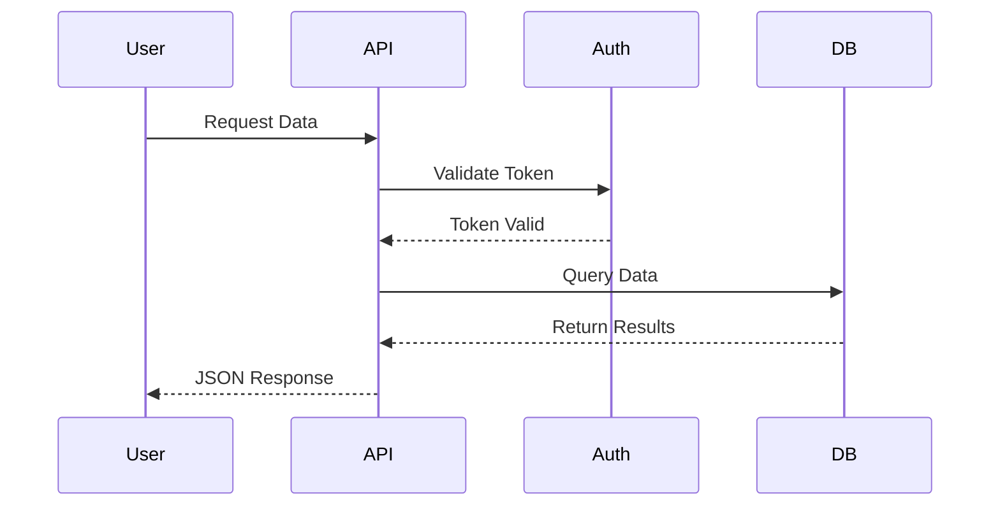

In modern software development, APIs serve as the lifeblood of communication between distributed systems. When we discuss `API-First vs. Code-First: Why Contract-Before-Code Wins`, the importance of a robust API strategy cannot be overstated.

The tech industry is constantly evolving, but the core principles behind `API-First vs. Code-First: Why Contract-Before-Code Wins` remain foundational. Here is what you need to know.

## Trade-offs and Considerations

Every architectural decision involves trade-offs. While adding new tools or patterns might solve one problem, it often introduces complexity elsewhere. Thorough evaluation is necessary.

When implementing these strategies, teams must ensure that their infrastructure can handle the increased complexity. The goal is to build systems that are not just scalable, but also maintainable over the long term. This requires a strong DevOps culture and comprehensive monitoring.

## Contract-First Development

By defining the API contract using OpenAPI specification before writing a single line of code, teams can work in parallel. The frontend developers can mock the backend, and QA can write tests against the schema. This reduces friction and integration hell.

When implementing these strategies, teams must ensure that their infrastructure can handle the increased complexity. The goal is to build systems that are not just scalable, but also maintainable over the long term. This requires a strong DevOps culture and comprehensive monitoring.

```javascript
// Example: Express.js API Gateway Rate Limiter
const rateLimit = require('express-rate-limit');
const apiLimiter = rateLimit({
  windowMs: 15 * 60 * 1000, // 15 minutes
  max: 100 // limit each IP to 100 requests per windowMs
});
app.use('/api/', apiLimiter);
```

## Security at the Gateway

API gateways provide a centralized point to enforce security policies. From rate limiting to JWT validation, the gateway ensures that backend services don't have to duplicate authentication logic. This aligns perfectly with the zero-trust network model.

When implementing these strategies, teams must ensure that their infrastructure can handle the increased complexity. The goal is to build systems that are not just scalable, but also maintainable over the long term. This requires a strong DevOps culture and comprehensive monitoring.

### Request Flow Diagram



## Versioning Strategies

As systems evolve, breaking changes are inevitable. Whether using URI versioning (e.g., `/v1/`), header-based versioning, or content negotiation, the key is consistency. Consumers must be given adequate time to migrate before deprecation.

When implementing these strategies, teams must ensure that their infrastructure can handle the increased complexity. The goal is to build systems that are not just scalable, but also maintainable over the long term. This requires a strong DevOps culture and comprehensive monitoring.

## Designing for Resilience

When building APIs, we must anticipate failure. Network partitions, timeouts, and downstream service degradation are facts of life in distributed systems. Implementing retries with exponential backoff and circuit breakers is essential. Let's look at how this impacts the design phase.

When implementing these strategies, teams must ensure that their infrastructure can handle the increased complexity. The goal is to build systems that are not just scalable, but also maintainable over the long term. This requires a strong DevOps culture and comprehensive monitoring.

## Conclusion

Mastering `API-First vs. Code-First: Why Contract-Before-Code Wins` is a journey, not a destination. By adhering to these principles and continually refining your approach, you can build systems that stand the test of time and scale gracefully.

### Further Reading and Advanced Concepts

Beyond the basics, advanced implementations of `API-First vs. Code-First: Why Contract-Before-Code Wins` require a profound understanding of network topologies, asynchronous communication, and eventual consistency. Whether you are migrating a legacy monolith or building greenfield applications, the architectural choices made early on will compound over time. Always measure, monitor, and iterate.

Furthermore, the organizational impact of adopting these modern paradigms cannot be ignored. Conway's Law states that organizations design systems that mirror their communication structures. Therefore, restructuring teams to be cross-functional and autonomous is often a prerequisite for successfully deploying distributed architectures at scale.
