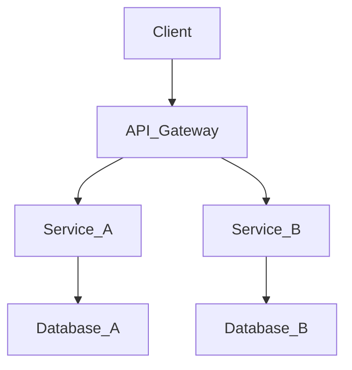

Understanding `>-` requires a deep dive into the foundational principles of modern cloud-native engineering. This guide breaks down the core concepts and real-world applications.

In this comprehensive guide, we will break down `>-`, examining the benefits, the common pitfalls, and the best practices for implementation.

## The Shift to Cloud-Native

Modern infrastructure relies on containerization and orchestration. Leveraging Kubernetes and Docker allows teams to scale dynamically based on demand, but it requires applications to be stateless and resilient.

When implementing these strategies, teams must ensure that their infrastructure can handle the increased complexity. The goal is to build systems that are not just scalable, but also maintainable over the long term. This requires a strong DevOps culture and comprehensive monitoring.

## Trade-offs and Considerations

Every architectural decision involves trade-offs. While adding new tools or patterns might solve one problem, it often introduces complexity elsewhere. Thorough evaluation is necessary.

When implementing these strategies, teams must ensure that their infrastructure can handle the increased complexity. The goal is to build systems that are not just scalable, but also maintainable over the long term. This requires a strong DevOps culture and comprehensive monitoring.

## CI/CD and Automation

Continuous Integration and Continuous Deployment (CI/CD) pipelines ensure that code goes from commit to production swiftly and safely. Automated testing is the safety net that makes this possible.

When implementing these strategies, teams must ensure that their infrastructure can handle the increased complexity. The goal is to build systems that are not just scalable, but also maintainable over the long term. This requires a strong DevOps culture and comprehensive monitoring.

### System Architecture Diagram

## The Shift to Cloud-Native

Modern infrastructure relies on containerization and orchestration. Leveraging Kubernetes and Docker allows teams to scale dynamically based on demand, but it requires applications to be stateless and resilient.

When implementing these strategies, teams must ensure that their infrastructure can handle the increased complexity. The goal is to build systems that are not just scalable, but also maintainable over the long term. This requires a strong DevOps culture and comprehensive monitoring.

## CI/CD and Automation

Continuous Integration and Continuous Deployment (CI/CD) pipelines ensure that code goes from commit to production swiftly and safely. Automated testing is the safety net that makes this possible.

When implementing these strategies, teams must ensure that their infrastructure can handle the increased complexity. The goal is to build systems that are not just scalable, but also maintainable over the long term. This requires a strong DevOps culture and comprehensive monitoring.

## Conclusion

Mastering `>-` is a journey, not a destination. By adhering to these principles and continually refining your approach, you can build systems that stand the test of time and scale gracefully.

### Further Reading and Advanced Concepts

Beyond the basics, advanced implementations of `>-` require a profound understanding of network topologies, asynchronous communication, and eventual consistency. Whether you are migrating a legacy monolith or building greenfield applications, the architectural choices made early on will compound over time. Always measure, monitor, and iterate.

Furthermore, the organizational impact of adopting these modern paradigms cannot be ignored. Conway's Law states that organizations design systems that mirror their communication structures. Therefore, restructuring teams to be cross-functional and autonomous is often a prerequisite for successfully deploying distributed architectures at scale.
