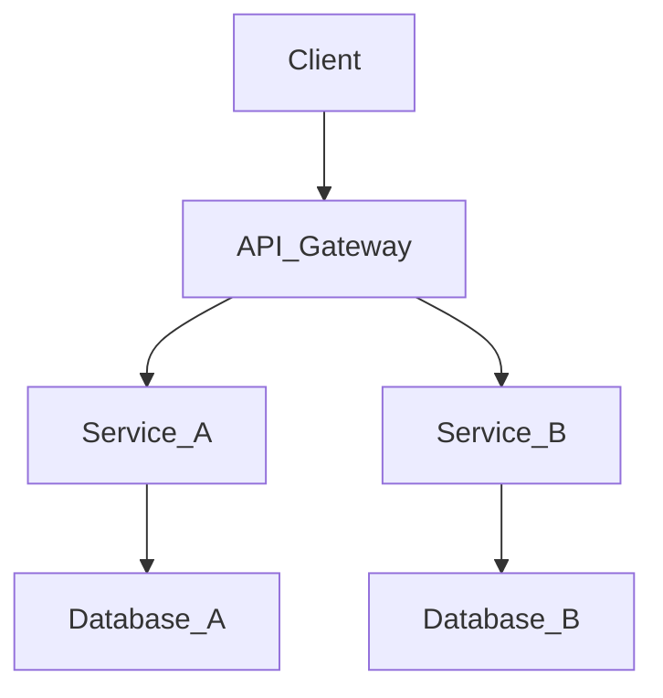

In the era of multiple touchpoints—web, mobile, IoT—headless CMS and commerce platforms are indispensable. `Understanding Headless CMS: Decoupling Content from Presentation` highlights how this architecture enables unparalleled speed and agility.

Understanding the nuances of `Understanding Headless CMS: Decoupling Content from Presentation` is essential for any modern engineering team. Let's delve into the specifics and explore how this applies to enterprise-scale systems.

## The API-First Mindset

Headless forces an API-first mindset. The API is not an afterthought; it is the core product. This leads to cleaner, more documented, and more resilient interfaces.

When implementing these strategies, teams must ensure that their infrastructure can handle the increased complexity. The goal is to build systems that are not just scalable, but also maintainable over the long term. This requires a strong DevOps culture and comprehensive monitoring.

## CI/CD and Automation

Continuous Integration and Continuous Deployment (CI/CD) pipelines ensure that code goes from commit to production swiftly and safely. Automated testing is the safety net that makes this possible.

When implementing these strategies, teams must ensure that their infrastructure can handle the increased complexity. The goal is to build systems that are not just scalable, but also maintainable over the long term. This requires a strong DevOps culture and comprehensive monitoring.

## Frontend Agnostic

Developers are no longer bound to a specific templating engine or legacy technology. A team can build a frontend using React, another using Vue, and yet another using native iOS Swift, all interacting with the same headless backend.

When implementing these strategies, teams must ensure that their infrastructure can handle the increased complexity. The goal is to build systems that are not just scalable, but also maintainable over the long term. This requires a strong DevOps culture and comprehensive monitoring.

### System Architecture Diagram

## Trade-offs and Considerations

Every architectural decision involves trade-offs. While adding new tools or patterns might solve one problem, it often introduces complexity elsewhere. Thorough evaluation is necessary.

When implementing these strategies, teams must ensure that their infrastructure can handle the increased complexity. The goal is to build systems that are not just scalable, but also maintainable over the long term. This requires a strong DevOps culture and comprehensive monitoring.

## Performance and Scalability

Without the overhead of rendering UI on the backend, headless systems can focus on fast API responses. Paired with a CDN and Static Site Generators (like Next.js or Gatsby), the performance gains are massive.

When implementing these strategies, teams must ensure that their infrastructure can handle the increased complexity. The goal is to build systems that are not just scalable, but also maintainable over the long term. This requires a strong DevOps culture and comprehensive monitoring.

## Conclusion

Mastering `Understanding Headless CMS: Decoupling Content from Presentation` is a journey, not a destination. By adhering to these principles and continually refining your approach, you can build systems that stand the test of time and scale gracefully.

### Further Reading and Advanced Concepts

Beyond the basics, advanced implementations of `Understanding Headless CMS: Decoupling Content from Presentation` require a profound understanding of network topologies, asynchronous communication, and eventual consistency. Whether you are migrating a legacy monolith or building greenfield applications, the architectural choices made early on will compound over time. Always measure, monitor, and iterate.

Furthermore, the organizational impact of adopting these modern paradigms cannot be ignored. Conway's Law states that organizations design systems that mirror their communication structures. Therefore, restructuring teams to be cross-functional and autonomous is often a prerequisite for successfully deploying distributed architectures at scale.
