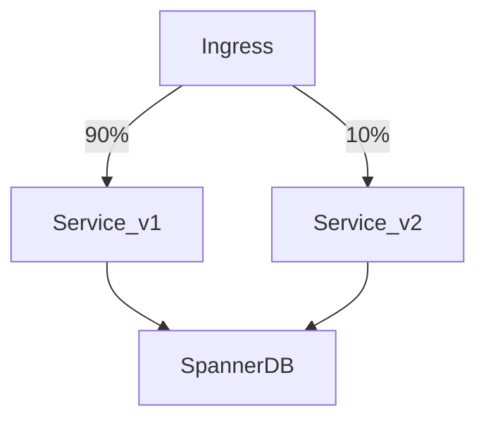

The evolution from monolithic systems to microservices introduces profound flexibility alongside significant operational complexity. As we tackle `Video Review: Martin Fowler on Microservices — Key Takeaways`, it is essential to leverage advanced design patterns to mitigate the inherent risks of distributed computing.

Addressing `Video Review: Martin Fowler on Microservices — Key Takeaways` requires a pragmatic approach to distributed systems engineering. Here is a definitive guide to implementing these patterns at scale.

## CI/CD Pipelines and Automated Safeguards

Continuous Integration and Continuous Deployment (CI/CD) pipelines (e.g., GitHub Actions, GitLab CI) are the safety nets of cloud-native development. A mature pipeline incorporates linting, unit tests, SAST (Static Application Security Testing), and container image scanning before an artifact is ever promoted to a registry like Google Artifact Registry or Amazon ECR.

When operationalizing these strategies, engineering leadership must ensure that the underlying infrastructure can seamlessly handle the induced complexity. Whether deploying across Google Kubernetes Engine (GKE) or AWS Elastic Kubernetes Service (EKS), establishing robust, automated guardrails is paramount. The objective is to construct systems that are not only infinitely scalable but also highly maintainable. This necessitates a deeply ingrained DevOps culture, comprehensive Site Reliability Engineering (SRE) practices, and uncompromising observability.

Furthermore, security postures must shift left. Integrating automated compliance checks and vulnerability scanning into the CI/CD pipeline guarantees that distributed components do not inadvertently expose attack vectors. A zero-trust network topology, strictly enforced via mutually authenticated TLS (mTLS) within a service mesh, represents the gold standard for intra-cluster communication.

## Strategic Vendor Lock-in Mitigation

Designing multi-cloud architectures (e.g., utilizing GCP BigQuery for analytics while running stateless workloads on AWS EKS) mitigates vendor lock-in but introduces operational overhead. Successful organizations abstract cloud-specific primitives behind internal platform interfaces, ensuring that compute layers remain portable.

When operationalizing these strategies, engineering leadership must ensure that the underlying infrastructure can seamlessly handle the induced complexity. Whether deploying across Google Kubernetes Engine (GKE) or AWS Elastic Kubernetes Service (EKS), establishing robust, automated guardrails is paramount. The objective is to construct systems that are not only infinitely scalable but also highly maintainable. This necessitates a deeply ingrained DevOps culture, comprehensive Site Reliability Engineering (SRE) practices, and uncompromising observability.

Furthermore, security postures must shift left. Integrating automated compliance checks and vulnerability scanning into the CI/CD pipeline guarantees that distributed components do not inadvertently expose attack vectors. A zero-trust network topology, strictly enforced via mutually authenticated TLS (mTLS) within a service mesh, represents the gold standard for intra-cluster communication.

## The Strangler Fig Pattern and Decoupling

Migrating legacy monoliths via a 'big bang' rewrite is historically disastrous. The Strangler Fig pattern mitigates this risk by incrementally carving out bounded contexts. By placing an API Gateway (or a service mesh like Istio) in front of the monolith, traffic can be intelligently routed to new microservices as they are deployed, ensuring zero downtime and continuous delivery.

When operationalizing these strategies, engineering leadership must ensure that the underlying infrastructure can seamlessly handle the induced complexity. Whether deploying across Google Kubernetes Engine (GKE) or AWS Elastic Kubernetes Service (EKS), establishing robust, automated guardrails is paramount. The objective is to construct systems that are not only infinitely scalable but also highly maintainable. This necessitates a deeply ingrained DevOps culture, comprehensive Site Reliability Engineering (SRE) practices, and uncompromising observability.

Furthermore, security postures must shift left. Integrating automated compliance checks and vulnerability scanning into the CI/CD pipeline guarantees that distributed components do not inadvertently expose attack vectors. A zero-trust network topology, strictly enforced via mutually authenticated TLS (mTLS) within a service mesh, represents the gold standard for intra-cluster communication.

## Distributed Observability

In a microservices ecosystem, a single user action may traverse dozens of independent services. Centralized logging and distributed tracing using standards like OpenTelemetry are mandatory. Aggregating these traces in Datadog, AWS X-Ray, or Google Cloud Trace allows site reliability engineers (SREs) to pinpoint latency bottlenecks instantaneously.

When operationalizing these strategies, engineering leadership must ensure that the underlying infrastructure can seamlessly handle the induced complexity. Whether deploying across Google Kubernetes Engine (GKE) or AWS Elastic Kubernetes Service (EKS), establishing robust, automated guardrails is paramount. The objective is to construct systems that are not only infinitely scalable but also highly maintainable. This necessitates a deeply ingrained DevOps culture, comprehensive Site Reliability Engineering (SRE) practices, and uncompromising observability.

Furthermore, security postures must shift left. Integrating automated compliance checks and vulnerability scanning into the CI/CD pipeline guarantees that distributed components do not inadvertently expose attack vectors. A zero-trust network topology, strictly enforced via mutually authenticated TLS (mTLS) within a service mesh, represents the gold standard for intra-cluster communication.

## Cloud-Native Workflows and GitOps

Modern infrastructure is defined as code (IaC) using Terraform or OpenTofu. Embracing GitOps—where Git acts as the single source of truth for declarative infrastructure and applications—ensures deterministic, auditable, and automated deployments. Tools like ArgoCD continuously reconcile the cluster state against the repository, preventing configuration drift.

When operationalizing these strategies, engineering leadership must ensure that the underlying infrastructure can seamlessly handle the induced complexity. Whether deploying across Google Kubernetes Engine (GKE) or AWS Elastic Kubernetes Service (EKS), establishing robust, automated guardrails is paramount. The objective is to construct systems that are not only infinitely scalable but also highly maintainable. This necessitates a deeply ingrained DevOps culture, comprehensive Site Reliability Engineering (SRE) practices, and uncompromising observability.

Furthermore, security postures must shift left. Integrating automated compliance checks and vulnerability scanning into the CI/CD pipeline guarantees that distributed components do not inadvertently expose attack vectors. A zero-trust network topology, strictly enforced via mutually authenticated TLS (mTLS) within a service mesh, represents the gold standard for intra-cluster communication.

## Multi-Cloud Resilience and Service Mesh

When operating across GCP (Google Kubernetes Engine) and AWS (Elastic Kubernetes Service), network observability and resilience become paramount. A Service Mesh, such as Istio or Linkerd, abstracts the network logic—retries, timeouts, and mutual TLS (mTLS)—away from application code. This enables seamless traffic shifting and canary deployments across heterogeneous compute environments.

### Traffic Shifting Diagram

When operationalizing these strategies, engineering leadership must ensure that the underlying infrastructure can seamlessly handle the induced complexity. Whether deploying across Google Kubernetes Engine (GKE) or AWS Elastic Kubernetes Service (EKS), establishing robust, automated guardrails is paramount. The objective is to construct systems that are not only infinitely scalable but also highly maintainable. This necessitates a deeply ingrained DevOps culture, comprehensive Site Reliability Engineering (SRE) practices, and uncompromising observability.

Furthermore, security postures must shift left. Integrating automated compliance checks and vulnerability scanning into the CI/CD pipeline guarantees that distributed components do not inadvertently expose attack vectors. A zero-trust network topology, strictly enforced via mutually authenticated TLS (mTLS) within a service mesh, represents the gold standard for intra-cluster communication.

## Executive Conclusion

Mastering the intricacies of `Video Review: Martin Fowler on Microservices — Key Takeaways` is an ongoing architectural journey. By strictly adhering to these decoupled, API-first principles and continually refining your multi-cloud strategies, your organization can engineer systems that withstand extreme scale and evolve gracefully amidst shifting business requirements.

### Further Reading and Advanced Concepts

Beyond these foundational patterns, advanced implementations of `Video Review: Martin Fowler on Microservices — Key Takeaways` mandate a profound comprehension of asynchronous messaging topologies (such as Apache Kafka or Google Cloud Pub/Sub), eventual consistency paradigms, and sophisticated deployment strategies like Canary and Blue-Green rollouts. Whether you are strangling a monolithic legacy application or architecting greenfield cloud-native services, the structural decisions finalized during the design phase will compound significantly over time. It is imperative to continuously measure, monitor, and iterate based on concrete telemetry data.

Ultimately, the organizational impact of adopting MACH and cloud-native paradigms cannot be understated. Conway's Law asserts that organizations inevitably design systems mirroring their internal communication structures. Consequently, restructuring engineering departments into cross-functional, autonomous 'Two-Pizza Teams' is frequently a strict prerequisite for successfully deploying and maintaining these distributed architectures in production environments.
