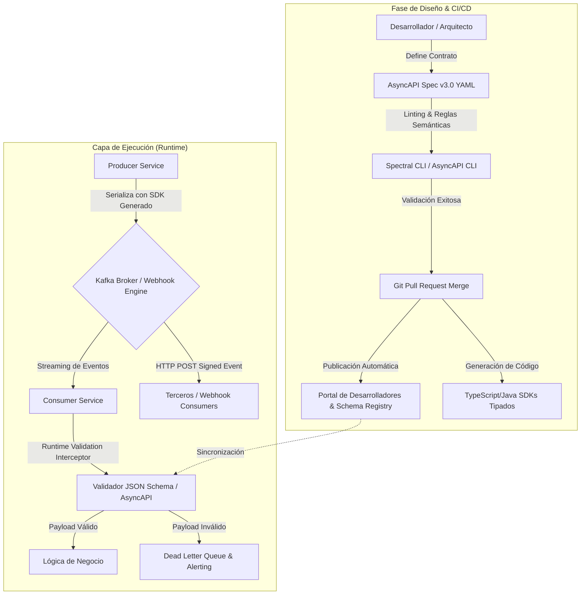

En la transición hacia arquitecturas composables y ecosistemas MACH (*Microservices, API-first, Cloud-native, Headless*), la gobernanza de las comunicaciones síncronas se resolvió de forma estandarizada mediante especificaciones como OpenAPI (OAS). Sin embargo, a medida que las organizaciones migran sus núcleos transaccionales hacia arquitecturas orientadas a eventos (*Event-Driven Architectures* o EDA) y distribución de eventos vía Webhooks en tiempo real, surge un vacío crítico: la ausencia de contratos formales, versionamiento desacoplado y validación automatizada en el plano asíncrono.

Sin un estándar formal, los *brokers* de eventos (Apache Kafka, AWS EventBridge, Google Cloud Pub/Sub) y los despachadores de webhooks se convierten rápidamente en "cajas negras". Los cambios imprevistos en la carga útil (*payload drift*), la falta de documentación sobre los canales y la ausencia de validación semántica en tiempo de compilación provocan fallos en cascada en los consumidores *downstream*.

Este artículo analiza cómo implementar **AsyncAPI 3.0** como el pilar de diseño y gobernanza *Contract-First* para transmisiones de eventos y webhooks en entornos distribuidos de alta concurrencia.

---

## 1. El Vacío de Gobernanza en Ecosistemas Asíncronos

En un ecosistema Composable Commerce, un servicio de pedidos no solo expone endpoints REST/GraphQL; emite eventos como `OrderPlaced`, `PaymentAuthorized` o `InventoryReserved`. Estos eventos alimentan motores de búsqueda, almacenes de datos, sistemas ERP y webhooks hacia plataformas SaaS de terceros.

Los principales retos arquitectónicos sin una gobernanza basada en contratos son:

1. **Ruptura Silenciosa de Esquemas (*Schema Drift*):** Un cambio de tipo de dato o la eliminación de una propiedad en un evento rompe microservicios consumidores sin previo aviso.
2. **Proliferación Descontrolada de Webhooks:** Integraciones punto a punto sin esquemas verificables ni mecanismos estandarizados de autenticación y reintento.
3. **Falta de Trazabilidad y Catálogo Unificado:** Los equipos de ingeniería desconocen qué eventos existen, quién los produce, quién los consume y bajo qué acuerdos de nivel de servicio (SLA) operan.

AsyncAPI resuelve esta brecha al proporcionar un formato neutral e interoperable para describir interfaces asíncronas independientemente del protocolo de transporte subyacente (Kafka, AMQP, MQTT, WebSockets, HTTP/Webhooks).

---

## 2. Topología de Gobernanza: Del Repositorio al Runtime

Para que la gobernanza asíncrona sea efectiva, la especificación AsyncAPI no debe ser documentación estática; debe integrarse en la cadena de suministro de software (*CI/CD*) y en la capa de ejecución (*Runtime Verification*).



---

## 3. Especificación Técnica: AsyncAPI 3.0 para E-Commerce Streams y Webhooks

A diferencia de versiones anteriores, **AsyncAPI 3.0** desacopla completamente los **Canales** (*Channels*) de las **Operaciones** (*Operations*), permitiendo modelar flujos unidireccionales y bidireccionales con precisión, además de soportar múltiples enlaces de protocolo (*bindings*).

A continuación se muestra un contrato de producción para el ciclo de vida de órdenes en una arquitectura MACH:

```yaml
asyncapi: 3.0.0
info:
  title: Order Domain Event & Webhook Gateway
  version: 2.1.0
  description: Gobernanza de eventos Kafka y Webhooks salientes para el dominio de Órdenes.
  contact:
    name: Platform Engineering Architecture Team
    email: platform-arch@mach-enterprise.internal

servers:
  productionKafka:
    host: kafka.production.internal:9092
    protocol: kafka
    description: Broker principal de eventos transaccionales internos.
    bindings:
      kafka:
        schemaRegistryUrl: https://schema-registry.production.internal
  webhookGateway:
    host: api.mach-enterprise.com/webhooks/v1
    protocol: https
    description: Motor de entrega de Webhooks salientes a sistemas de terceros.

channels:
  orderCreatedChannel:
    address: enterprise.orders.v1.order-created
    description: Canal Kafka para eventos emitidos tras la creación exitosa de una orden.
    messages:
      orderCreatedMessage:
        $ref: '#/components/messages/OrderCreated'
    bindings:
      kafka:
        partitions: 12
        replicas: 3
        configs:
          cleanup.policy: delete
          retention.ms: 604800000

  orderStatusWebhookChannel:
    address: /destinations/{subscriberId}/order-updates
    description: Canal virtual para webhooks distribuidos mediante HTTP POST saliente.
    parameters:
      subscriberId:
        description: Identificador único del suscriptor o SaaS destino.
    messages:
      orderStatusMessage:
        $ref: '#/components/messages/OrderStatusUpdated'
    bindings:
      http:
        method: POST

operations:
  emitOrderCreatedEvent:
    action: send
    channel:
      $ref: '#/channels/orderCreatedChannel'
    summary: El servicio Order-Service publica un evento al completar el checkout.
    messages:
      - $ref: '#/components/messages/OrderCreated'

  notifyExternalWebhook:
    action: send
    channel:
      $ref: '#/channels/orderStatusWebhookChannel'
    summary: Notifica a sistemas externos (ERP/CRM) cambios de estado de una orden.
    messages:
      - $ref: '#/components/messages/OrderStatusUpdated'

components:
  messages:
    OrderCreated:
      name: OrderCreatedEvent
      title: Evento de Orden Creada
      summary: Notifica la creación y persistencia inicial de una orden transaccional.
      contentType: application/json
      headers:
        type: object
        properties:
          traceparent:
            type: string
            description: W3C Trace Context para trazabilidad distribuida.
          idempotencyKey:
            type: string
            format: uuid
        required: [traceparent, idempotencyKey]
      payload:
        $ref: '#/components/schemas/OrderCreatedPayload'

    OrderStatusUpdated:
      name: OrderStatusUpdatedWebhook
      title: Webhook de Actualización de Estado
      contentType: application/json
      headers:
        type: object
        properties:
          X-Signature-SHA256:
            type: string
            description: Firma HMAC SHA256 para validación criptográfica en el receptor.
        required: [X-Signature-SHA256]
      payload:
        $ref: '#/components/schemas/OrderStatusPayload'

  schemas:
    OrderCreatedPayload:
      type: object
      additionalProperties: false
      properties:
        orderId:
          type: string
          format: uuid
        customerId:
          type: string
          format: uuid
        currency:
          type: string
          enum: [USD, EUR, MXN, GBP]
        totalAmount:
          type: number
          minimum: 0.01
        lineItems:
          type: array
          minItems: 1
          items:
            type: object
            additionalProperties: false
            properties:
              sku:
                type: string
              quantity:
                type: integer
                minimum: 1
              unitPrice:
                type: number
                minimum: 0.0
            required: [sku, quantity, unitPrice]
        createdAt:
          type: string
          format: date-time
      required: [orderId, customerId, currency, totalAmount, lineItems, createdAt]

    OrderStatusPayload:
      type: object
      additionalProperties: false
      properties:
        orderId:
          type: string
          format: uuid
        previousStatus:
          type: string
          enum: [PENDING, PROCESSING, SHIPPED, DELIVERED, CANCELLED]
        currentStatus:
          type: string
          enum: [PENDING, PROCESSING, SHIPPED, DELIVERED, CANCELLED]
        timestamp:
          type: string
          format: date-time
      required: [orderId, previousStatus, currentStatus, timestamp]
```

---

## 4. Implementación en Producción: Middleware de Validación de Contratos

Para evitar que los consumidores procesen datos no conformes o que los productores emitan estructuras corruptas, se implementa un validador en tiempo de ejecución en Node.js/TypeScript utilizando **Ajv** y la especificación de esquemas extraída de AsyncAPI.

### Validador de Eventos y Manejador de Dead Letter Queue (DLQ)

```typescript
import Ajv, { ValidateFunction } from 'ajv';
import addFormats from 'ajv-formats';
import { Kafka, Consumer, EachMessagePayload, Producer } from 'kafkajs';

// Interfaz TypeScript alineada al esquema AsyncAPI
export interface OrderCreatedPayload {
  orderId: string;
  customerId: string;
  currency: 'USD' | 'EUR' | 'MXN' | 'GBP';
  totalAmount: number;
  lineItems: Array<{
    sku: string;
    quantity: number;
    unitPrice: number;
  }>;
  createdAt: string;
}

export class AsyncEventValidator {
  private ajv: Ajv;
  private schemaValidator: ValidateFunction;

  constructor(jsonSchema: object) {
    this.ajv = new Ajv({ allErrors: true, strict: true, coerceTypes: false });
    addFormats(this.ajv);
    this.schemaValidator = this.ajv.compile(jsonSchema);
  }

  public validate<T>(data: unknown): { isValid: boolean; errors?: string[] } {
    const valid = this.schemaValidator(data);
    if (!valid) {
      const errorMessages = (this.schemaValidator.errors || []).map(
        (err) => `${err.instancePath} ${err.message}`
      );
      return { isValid: false, errors: errorMessages };
    }
    return { isValid: true };
  }
}

// Consumidor resiliente de Kafka con validación estricta de contrato
export class ManagedOrderEventConsumer {
  private consumer: Consumer;
  private dlqProducer: Producer;
  private validator: AsyncEventValidator;
  private readonly dlqTopic = 'enterprise.orders.v1.order-created.dlq';

  constructor(kafka: Kafka, groupId: string, schema: object) {
    this.consumer = kafka.consumer({ groupId });
    this.dlqProducer = kafka.producer();
    this.validator = new AsyncEventValidator(schema);
  }

  public async start(topic: string): Promise<void> {
    await this.consumer.connect();
    await this.dlqProducer.connect();
    await this.consumer.subscribe({ topic, fromBeginning: false });

    await this.consumer.run({
      eachMessage: async (payload: EachMessagePayload) => {
        const { topic, partition, message } = payload;
        const rawValue = message.value?.toString();

        if (!rawValue) {
          await this.routeToDLQ(message, 'Empty message payload', topic, partition);
          return;
        }

        try {
          const parsedData = JSON.parse(rawValue);
          const validationResult = this.validator.validate<OrderCreatedPayload>(parsedData);

          if (!validationResult.isValid) {
            console.error(
              `[Contract Violation] Mensaje en offset ${message.offset} descartado por esquema inválido:`,
              validationResult.errors
            );
            await this.routeToDLQ(
              message,
              `Schema Validation Failed: ${validationResult.errors?.join(', ')}`,
              topic,
              partition
            );
            return;
          }

          // Procesamiento de lógica de negocio una vez garantizado el contrato
          await this.processValidOrder(parsedData as OrderCreatedPayload);

        } catch (parseError) {
          console.error(`[Malformed JSON] Error de deserialización en offset ${message.offset}:`, parseError);
          await this.routeToDLQ(message, 'Malformed JSON format', topic, partition);
        }
      },
    });
  }

  private async processValidOrder(order: OrderCreatedPayload): Promise<void> {
    // Lógica idempotente de procesamiento
    console.log(`[Order Processing] Procesando orden validada: ${order.orderId} - Monto: ${order.totalAmount} ${order.currency}`);
  }

  private async routeToDLQ(
    originalMessage: EachMessagePayload['message'],
    reason: string,
    sourceTopic: string,
    sourcePartition: number
  ): Promise<void> {
    await this.dlqProducer.send({
      topic: this.dlqTopic,
      messages: [
        {
          key: originalMessage.key,
          value: originalMessage.value,
          headers: {
            ...originalMessage.headers,
            'x-dlq-rejection-reason': Buffer.from(reason),
            'x-dlq-source-topic': Buffer.from(sourceTopic),
            'x-dlq-source-partition': Buffer.from(sourcePartition.toString()),
            'x-dlq-timestamp': Buffer.from(new Date().toISOString()),
          },
        },
      ],
    });
  }

  public async shutdown(): Promise<void> {
    await this.consumer.disconnect();
    await this.dlqProducer.disconnect();
  }
}
```

---

## 5. Tabla Comparativa de Enfoques de Gobernanza Asíncrona

| Criterio | AsyncAPI 3.0 (Contract-First) | Schema Registry (Confluent/Apicurio) | CloudEvents Specification | Protocol Buffers (gRPC / Streaming) |
| :--- | :--- | :--- | :--- | :--- |
| **Alcance Primario** | Especificación completa (Canales, Operaciones, Protocolos, Docs) | Validación binaria de esquemas (Avro/JSON Schema/Protobuf) | Estandarización de metadatos/envoltorio de eventos | Serialización binaria y definición de RPC / Streams |
| **Soporte Multi-Protocolo** | **Universal** (Kafka, RabbitMQ, SQS, Webhooks, SSE, MQTT) | Principalmente enfocado en Kafka / Message Brokers | Universal (como estructura de envelope) | Específico para conexiones sobre HTTP/2 / TCP |
| **Gobernanza de Webhooks** | **Excelente** (Bindings HTTP, firmas criptográficas, headers) | Nula (No modela endpoints ni capas de transporte HTTP) | Media (Define solo atributos de contexto, no endpoints) | Inadecuada para consumidores externos Webhook estándar |
| **Integración CI/CD** | **Muy Alta** (Spectral, Linters, AsyncAPI CLI, Doc Generation) | Media (Maven/Gradle plugins, validación en pipeline) | Baja (Requiere tooling propio) | **Muy Alta** (`buf`, `protoc` linter) |
| **Cuándo Utilizarlo** | Arquitecturas MACH, Composable Commerce, Ecosistemas de Webhooks y APIs | Streaming intensivo de datos a nivel de infraestructura Kafka | Normalización de eventos entre nubes (AWS EventBridge a GCP) | Comunicación interna de microservicios de ultra baja latencia |
| **Cuándo Evitarlo** | Microservicios puramente síncronos HTTP/REST | APIs abiertas públicas y webhooks a terceros | Contratos complejos de dominio donde se requiera definir canales | Sistemas donde se requiere interoperabilidad JSON directa sin compilación |

---

## 6. Modos de Fallo Críticos y Mitigación en Producción

### 1. *Breaking Changes* y Ruptura de Compatibilidad Hacia Atrás
* **Modo de Fallo:** Un productor modifica la semántica de un campo existente o vuelve obligatorio un campo opcional, provocando excepciones en tiempo de ejecución en consumidores no actualizados.
* **Estrategia de Mitigación:** Integrar validación semántica en CI/CD con **Spectral** aplicando reglas de evolución de esquemas (compatibilidad *Full* o *Backward*). El pipeline debe rechazar el Pull Request si el nuevo contrato de AsyncAPI rompe la compatibilidad con versiones activas.

### 2. Bloqueo de Cabeza de Línea (*Head-of-Line Blocking*) en Webhooks
* **Modo de Fallo:** Un suscriptor externo no responde o procesa lentamente las solicitudes de webhook, agotando los hilos del despachador y retrasando los eventos de otros suscriptores.
* **Estrategia de Mitigación:** Diseñar el despachador de webhooks utilizando colas desacopladas por partición de cliente (*Tenant-isolated queues*) con limitación de tasa (*rate limiting*) dinámica y políticas de retroceso exponencial (*exponential backoff* con *jitter*). Los fallos definitivos deben publicarse en una DLQ sin interrumpir el flujo del broker.

### 3. *Poison Pills* en Event Streams
* **Modo de Fallo:** Un mensaje corrupto no puede ser deserializado ni validado por el consumidor, generando un ciclo infinito de caídas y reintentos en el consumidor de Kafka (*CrashLoop*).
* **Estrategia de Mitigación:** Implementar el patrón interceptor mostrado en la sección 4. Si el payload falla la validación sintáctica o de esquema de AsyncAPI, el mensaje se redirige de inmediato a la *Dead Letter Queue* con los metadatos de la causa, confirmando el *offset* en el canal principal para no detener el *stream*.

---

## 7. Checklist de Implementación para Equipos de Plataforma

- [ ] **Fase 1: Estandarización de Contratos**
  - [ ] Adoptar la especificación **AsyncAPI 3.0** en un repositorio centralizado (*Contract Repository* o Monorepo).
  - [ ] Definir los esquemas de envoltorio comunes (*Headers*, *Trace Context*, *Idempotency Keys*).
- [ ] **Fase 2: Pipeline de CI/CD**
  - [ ] Implementar reglas de *linting* estrictas con `@asyncapi/cli` y `spectral`.
  - [ ] Configurar verificaciones de compatibilidad hacia atrás en cada PR que modifique esquemas.
  - [ ] Automatizar la generación de documentación estática y publicación en el portal interno de desarrolladores.
- [ ] **Fase 3: Generación de Artefactos**
  - [ ] Integrar `@asyncapi/generator` para compilar SDKs tipados de productores y consumidores en TypeScript, Go o Java.
  - [ ] Distribuir los clientes generados mediante un registro privado de paquetes (npm / Artifact Registry).
- [ ] **Fase 4: Ejecución y Observabilidad**
  - [ ] Desplegar validadores de esquemas en tiempo de ejecución en los microservicios core.
  - [ ] Configurar métricas operativas: eventos validados, eventos rechazados, tasa de desvío a DLQ y latencia de entrega de webhooks.
  - [ ] Implementar mecanismos de firma criptográfica (HMAC-SHA256) obligatorios en todos los canales de webhooks salientes.