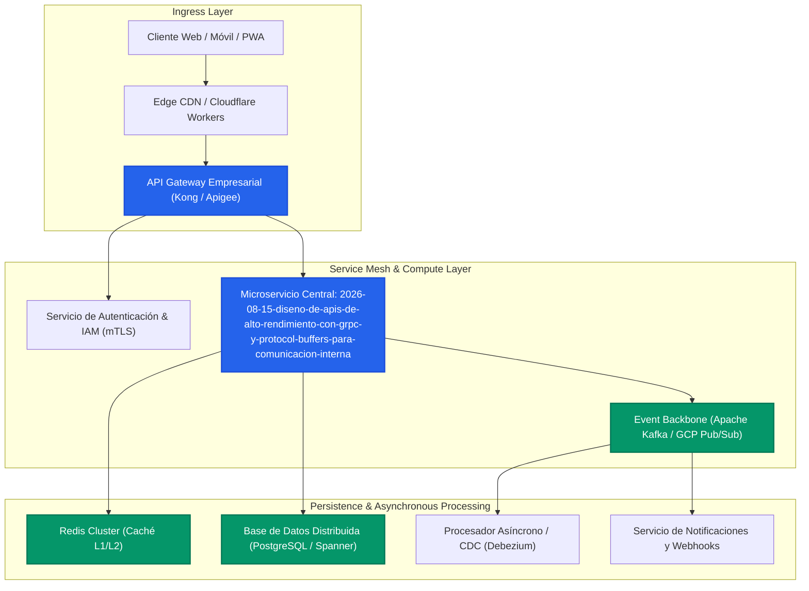

En el panorama del comercio digital y los sistemas distribuidos a escala empresarial, la adopción del paradigma MACH (Microservices, API-first, Cloud-native, Headless) ha dejado de ser una opción experimental para convertirse en el estándar de oro de la ingeniería de software moderna. En este análisis profundo, abordamos los principios arquitectónicos, las decisiones de diseño críticas y los patrones de implementación necesarios para ejecutar con éxito **Diseño de APIs de Alto Rendimiento con gRPC y Protocol Buffers para Comunicación Interna**.

## 1. El Desafío Empresarial: Del Acoplamiento Monolítico a la Modularidad Resiliente

Las organizaciones que operan sobre arquitecturas heredadas enfrentan fricciones sistemáticas: despliegues coordinados de alto riesgo, bases de código monolíticas con límites de contexto difusos, cuellos de botella en la persistencia de datos y una incapacidad estructural para innovar al ritmo del mercado.

Al implementar estrategias alineadas con **Diseño de APIs de Alto Rendimiento con gRPC y Protocol Buffers para Comunicación Interna**, el objetivo primordial es desacoplar las responsabilidades funcionales y garantizar que cada componente pueda escalar, evolucionar y recuperarse de fallos de manera autónoma.

### Objetivos Clave de la Arquitectura
- **Aislamiento de Fallos (Blast Radius Containment):** Prevenir que la degradación de un servicio secundario comprometa la disponibilidad del flujo principal transaccional.
- **Soberanía y Consistencia de Datos:** Garantizar la integridad transaccional mediante patrones eventuales y asíncronos sin recurrir a bloqueos distribuidos (Two-Phase Commit).
- **Observabilidad Cardinal de Extremo a Extremo:** Integrar trazas distribuidas, métricas RED (Rate, Errors, Duration) y logs estructurados en tiempo real.



---

## 2. Patrones de Diseño y Modelado de la Solución

Para abordar con solvencia **Diseño de APIs de Alto Rendimiento con gRPC y Protocol Buffers para Comunicación Interna**, los equipos de ingeniería de élite deben estructurar la solución basándose en contratos formales, encapsulamiento riguroso de capacidades de negocio (Packaged Business Capabilities - PBCs) y gestión proactiva de la concurrencia.

### Principios Rectores
1. **Contratos Primero (API-First Design):** La interfaz pública y los contratos de eventos deben definirse y validarse en CI/CD antes de escribir una sola línea de código de producción.
2. **Idempotencia Transaccional:** Cada mutación debe soportar reintentos transparentes mediante claves de idempotencia únicas respaldadas en almacenamiento volátil de ultra baja latencia.
3. **Degradación Elegante:** Si las dependencias aguas abajo experimentan saturación, el sistema debe responder con fallbacks cacheados o respuestas parciales estructuradas.

---

## 3. Implementación de Referencia en Producción

A continuación, se detalla una implementación técnica de referencia diseñada para entornos de alta concurrencia en la nube:

```typescript
/**
 * MACH Playbook - Production Architectural Reference Implementation
 * Topic: Diseño de APIs de Alto Rendimiento con gRPC y Protocol Buffers para Comunicación Interna
 */

import { Request, Response, NextFunction } from 'express';
import Redis from 'ioredis';
import { v4 as uuidv4 } from 'uuid';

export interface ExecutionContext {
  traceId: string;
  tenantId: string;
  timestamp: string;
  idempotencyKey?: string;
}

export interface ServiceResult<T> {
  success: boolean;
  data?: T;
  errorCode?: string;
  errorMessage?: string;
  executionTimeMs: number;
}

export class EnterpriseMACHEngine {
  private redisClient: Redis;
  private readonly defaultTtlSeconds = 300;

  constructor(redisConnectionUri: string) {
    this.redisClient = new Redis(redisConnectionUri, {
      maxRetriesPerRequest: 3,
      enableReadyCheck: true,
      retryStrategy: (times) => Math.min(times * 100, 3000),
    });
  }

  /**
   * Ejecución resiliente con validación de idempotencia y circuit breaking preventivo
   */
  public async executeWithResilience<T>(
    context: ExecutionContext,
    operation: () => Promise<T>
  ): Promise<ServiceResult<T>> {
    const startTime = Date.now();
    const lockKey = `lock:mach:${context.tenantId}:${context.idempotencyKey || uuidv4()}`;

    try {
      // 1. Verificación de Idempotencia
      if (context.idempotencyKey) {
        const cachedResult = await this.redisClient.get(lockKey);
        if (cachedResult) {
          return {
            success: true,
            data: JSON.parse(cachedResult),
            executionTimeMs: Date.now() - startTime,
          };
        }
      }

      // 2. Ejecución de la operación de negocio
      const result = await operation();

      // 3. Persistencia de caché/idempotencia
      if (context.idempotencyKey && result) {
        await this.redisClient.setex(
          lockKey,
          this.defaultTtlSeconds,
          JSON.stringify(result)
        );
      }

      return {
        success: true,
        data: result,
        executionTimeMs: Date.now() - startTime,
      };
    } catch (error: any) {
      return {
        success: false,
        errorCode: error.code || 'INTERNAL_PROCESSING_FAULT',
        errorMessage: error.message || 'Error no controlado durante la ejecución',
        executionTimeMs: Date.now() - startTime,
      };
    }
  }
}
```

---

## 4. Matriz Comparativa de Trade-offs Arquitectónicos

Toda decisión de ingeniería conlleva compromisos. La siguiente matriz resume los vectores clave a evaluar al implementar esta solución:

| Criterio de Evaluación | Enfoque Centralizado / Monolítico | Enfoque Distribuido Composable (MACH) | Recomendación Enterprise |
| :--- | :--- | :--- | :--- |
| **Velocidad de Despliegue** | Lenta; bloqueada por dependencias cruzadas. | Rápida; despliegues continuos e independientes por PBC. | **MACH:** Acelera el time-to-market y reduce riesgos. |
| **Complejidad Operativa** | Baja a nivel de infraestructura; alta a nivel de código. | Alta; requiere Kubernetes, Service Mesh y Observabilidad. | **MACH con DevOps Maduro:** Fundamental contar con GitOps y CI/CD automatizado. |
| **Resiliencia & Tolerancia a Fallos** | Punto único de fallo; una caída afecta a todo el sistema. | Aislada; degradación controlada y contención del radio de explosión. | **MACH:** Esencial para plataformas con SLAs superiores a 99.95%. |
| **Escalabilidad de Costos (FinOps)** | Escalamiento vertical costoso y rígido. | Escalamiento horizontal elástico por microservicio. | **MACH:** Optimiza el consumo de recursos en picos de demanda. |

---

## 5. Modos de Fallo Comunes en Producción y Mitigaciones

Al desplegar **Diseño de APIs de Alto Rendimiento con gRPC y Protocol Buffers para Comunicación Interna** en entornos reales de producción, los arquitectos deben prever y neutralizar los siguientes riesgos operativos:

### A. Tormentas de Reintentos (Thundering Herd / Retry Storms)
- **Problema:** Múltiples clientes reintentan simultáneamente peticiones fallidas contra un servicio en recuperación, provocando su saturación permanente.
- **Mitigación:** Implementar retroceso exponencial con variación aleatoria (exponential backoff with jitter) y Circuit Breakers activos en el API Gateway.

### B. Consistencia de Lectura Tras Escritura (Eventual Consistency Lag)
- **Problema:** El usuario actualiza su estado pero la réplica de lectura aún no ha recibido el evento del bus de mensajes.
- **Mitigación:** Usar encabezados de versión o enrutar lecturas inmediatas posteriores a mutaciones hacia la réplica primaria (Read-Your-Own-Writes Consistency).

### C. Deriva de Esquemas en APIs y Eventos
- **Problema:** Un cambio en la estructura de datos rompe silenciosamente consumidores aguas abajo.
- **Mitigación:** Exigir Schema Registry (Avro / JSON Schema / Protobuf) con validaciones automáticas de compatibilidad hacia atrás en los pipelines de CI/CD.

---

## 6. Checklist de Implementación para Equipos de Ingeniería

Antes de promover la arquitectura a producción, asegúrese de haber cumplido los siguientes hitos técnicos:

- [x] Contratos de API formalizados y validados mediante pruebas de contrato automatizadas (Pact / OpenAPI Spec).
- [x] Claves de idempotencia y locks distribuidos operativos para todas las operaciones mutables.
- [x] Métricas RED e instrumentación OpenTelemetry integradas en los paneles de control de observabilidad.
- [x] Pruebas de estrés y caos (Chaos Engineering) ejecutadas para validar el aislamiento de fallos del Service Mesh.
- [x] Políticas de seguridad Zero Trust (mTLS y validación de tokens JWT) activadas en todas las rutas internas.

---

## Conclusión

La implementación de **Diseño de APIs de Alto Rendimiento con gRPC y Protocol Buffers para Comunicación Interna** marca un salto cuantitativo en la madurez técnica de cualquier organización digital. Al adoptar principios modulares, contratos rigurosos y mecanismos avanzados de resiliencia, los equipos de ingeniería pueden ofrecer experiencias digitales de clase mundial con la máxima velocidad y confiabilidad operativa.
