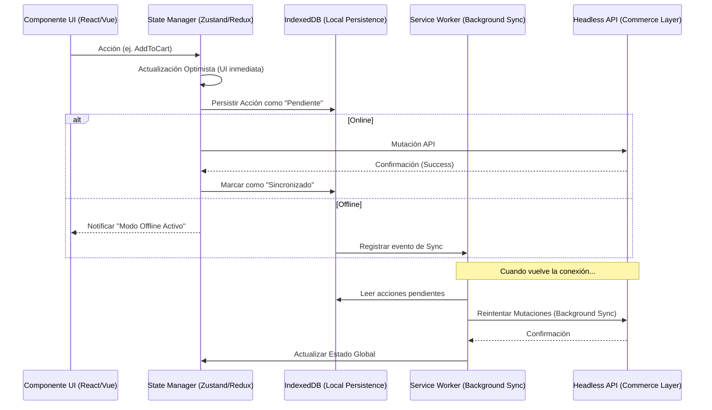

En el ecosistema de **Composable Commerce** y arquitecturas **MACH**, la experiencia del usuario en el "edge" (el navegador) es tan crítica como la escalabilidad de los microservicios en el backend. Sin embargo, las empresas enterprise a menudo cometen el error de tratar a las Progressive Web Apps (PWA) simplemente como sitios web con un manifiesto y un Service Worker básico. 

Para aplicaciones de alto tráfico —donde cada milisegundo de latencia se traduce en pérdida de conversión y donde la conectividad móvil es inherentemente inestable—, el verdadero reto no es el renderizado, sino la **gestión de estado distribuido entre el cliente y el servidor**. Implementar una arquitectura *Offline-First* no es una característica opcional; es una estrategia de resiliencia que garantiza que la lógica de negocio (como la creación de un carrito o la gestión de inventario local) persista a pesar de fallos de red catastróficos o latencias extremas.

## El Problema: El Abismo de la Consistencia en el Cliente

En aplicaciones tradicionales, el estado reside en el servidor y el cliente es una vista efímera. En una PWA de alto rendimiento, el cliente se convierte en un nodo de base de datos distribuida. Los problemas surgen cuando:
1. **Latencia de Red (Jitter):** Las peticiones API tardan demasiado, bloqueando la UI.
2. **Cierres de Sesión Inesperados:** El usuario pierde conectividad en medio de un checkout.
3. **Conflictos de Sincronización:** El estado local diverge del estado del servidor (ej. un producto se agota mientras el usuario lo tiene en su carrito offline).

Para resolver esto, debemos movernos hacia un modelo de **Optimistic UI** respaldado por una capa de persistencia robusta y un motor de sincronización asíncrono.

## Arquitectura de Referencia: El Flujo de Datos Offline-First

La siguiente arquitectura describe cómo una PWA moderna gestiona el estado utilizando un patrón de "Single Source of Truth" local (IndexedDB) que se sincroniza mediante un Service Worker con el backend Headless.



## Gestión de Estado: Más allá de LocalStorage

Para aplicaciones enterprise, `localStorage` es insuficiente debido a su naturaleza síncrona y su límite de ~5MB. La elección correcta es **IndexedDB**, pero manejarlo directamente es complejo. En entornos de alto tráfico, utilizamos abstracciones como **Dexie.js** o **PouchDB** integradas con gestores de estado como **Zustand** o **TanStack Query**.

### Implementación de un Store con Persistencia y Rehidratación

A continuación, se muestra un patrón de diseño en TypeScript para un store de carrito de compras que soporta persistencia asíncrona y manejo de estados "sucios" (dirty states).

```typescript
import { create } from 'zustand';
import { persist, createJSONStorage } from 'zustand/middleware';
import { get, set, del } from 'idb-keyval'; // Utilidad ligera para IndexedDB

// Interfaz para el manejo de sincronización
interface SyncableItem {
  id: string;
  quantity: number;
  _status: 'synced' | 'pending' | 'error';
}

interface CartState {
  items: SyncableItem[];
  addItem: (item: SyncableItem) => void;
  syncPendingItems: () => Promise<void>;
}

// Storage personalizado usando IndexedDB para evitar bloquear el hilo principal
const idbStorage = {
  getItem: async (name: string) => (await get(name)) || null,
  setItem: async (name: string, value: any) => set(name, value),
  removeItem: async (name: string) => del(name),
};

export const useCartStore = create<CartState>()(
  persist(
    (set, get) => ({
      items: [],
      
      addItem: (newItem) => {
        const currentItems = get().items;
        // Actualización Optimista: Asumimos que la API funcionará
        set({ 
          items: [...currentItems, { ...newItem, _status: 'pending' }] 
        });
        
        // Disparar lógica de sincronización en segundo plano
        get().syncPendingItems();
      },

      syncPendingItems: async () => {
        const pending = get().items.filter(i => i._status === 'pending');
        if (pending.length === 0) return;

        try {
          for (const item of pending) {
            // Llamada a la API Headless (ej. Commercetools, Shopify)
            await fetch('/api/cart/add', {
              method: 'POST',
              body: JSON.stringify(item),
            });
            
            // Actualizar estado a sincronizado
            set((state) => ({
              items: state.items.map(i => 
                i.id === item.id ? { ...i, _status: 'synced' } : i
              )
            }));
          }
        } catch (error) {
          console.error("Sync failed, will retry via Service Worker", error);
        }
      }
    }),
    {
      name: 'cart-storage',
      storage: createJSONStorage(() => idbStorage),
    }
  )
);
```

## Estrategias de Sincronización y Resolución de Conflictos

El mayor desafío no es guardar los datos, sino qué hacer cuando el servidor dice "No". En un entorno de alto tráfico, el inventario cambia constantemente.

### Tabla Comparativa de Estrategias de Consistencia

| Estrategia | Escenario de Uso | Pros | Contras |
| :--- | :--- | :--- | :--- |
| **Last Write Wins (LWW)** | Perfiles de usuario, preferencias. | Simple de implementar. | Riesgo de pérdida de datos intermedios. |
| **Optimistic UI + Rollback** | Carritos de compra, Likes, Comentarios. | Experiencia instantánea. | Requiere lógica compleja de "undo" en la UI. |
| **CRDT (Conflict-free Replicated Data Types)** | Edición colaborativa, inventarios compartidos. | Consistencia fuerte sin bloqueos. | Alta carga computacional y complejidad. |
| **Background Sync API** | Procesamiento de órdenes, analítica. | Ejecución incluso con la pestaña cerrada. | Soporte limitado en algunos navegadores (iOS Safari). |

### Mitigación de Conflictos mediante "Versioning"

Para evitar sobrescribir estados válidos del servidor con datos offline obsoletos, implementamos un control de versiones o *timestamps* en cada mutación.

```typescript
// Ejemplo de resolución de conflictos en el cliente
async function resolveConflict(localItem: SyncableItem, serverItem: any) {
  if (serverItem.version > localItem.version) {
    // El servidor tiene una verdad más reciente (ej. el precio cambió)
    return { ...serverItem, _status: 'synced' };
  }
  // El cliente tiene cambios pendientes que el servidor no ha visto
  return localItem;
}
```

## El Rol Crítico del Service Worker: Background Sync

Cuando la red falla por completo, el Service Worker entra en juego utilizando la **Background Sync API**. Esto permite que el navegador posponga las peticiones hasta que la conectividad sea estable, incluso si el usuario cierra la aplicación.

```javascript
// service-worker.js
self.addEventListener('sync', (event) => {
  if (event.tag === 'sync-cart') {
    event.waitUntil(persistPendingOrders());
  }
});

async function persistPendingOrders() {
  const db = await openDB('cart-storage');
  const pendingOrders = await db.getAll('orders', { index: 'status', value: 'pending' });
  
  return Promise.all(pendingOrders.map(async (order) => {
    try {
      await fetch('/api/orders', { method: 'POST', body: JSON.stringify(order) });
      await db.update('orders', { ...order, status: 'synced' });
    } catch (err) {
      // Si falla, el SW reintentará según la política de backoff del navegador
      throw err; 
    }
  }));
}
```

## Modos de Fallo Comunes y Mitigación

1. **Storage Quota Exceeded:**
   - *Problema:* El navegador limpia IndexedDB porque el dispositivo se queda sin espacio.
   - *Mitigación:* Implementar una estrategia de "LRU Cache" (Least Recently Used) para datos no esenciales (como imágenes de productos) y priorizar datos transaccionales. Usar `navigator.storage.persist()` para solicitar persistencia persistente.

2. **Stale Data (Datos Rotos):**
   - *Problema:* El usuario ve un precio offline que ya no es válido.
   - *Mitigación:* Implementar un TTL (Time-To-Live) en los datos cacheados. Al recuperar la conexión, forzar una validación de "Integridad de Precios" antes de permitir el checkout.

3. **Race Conditions en la Sincronización:**
   - *Problema:* Dos pestañas abiertas del mismo sitio intentando sincronizar el mismo recurso.
   - *Mitigación:* Utilizar el **Web Locks API** para asegurar que solo una instancia (o el Service Worker) procese la cola de sincronización a la vez.

## Conclusión: Checklist de Implementación para Equipos de Ingeniería

Para escalar una PWA en un entorno MACH de alto tráfico, la arquitectura debe ser defensiva. No asuma que la red está disponible; asuma que fallará.

- [ ] **Abstracción de Almacenamiento:** ¿Estamos usando IndexedDB de forma asíncrona para no bloquear el Main Thread?
- [ ] **Idempotencia en la API:** ¿Nuestros endpoints de backend soportan reintentos (Retry-After, Idempotency-Keys) para evitar duplicados en la sincronización?
- [ ] **Feedback Visual:** ¿La UI comunica claramente al usuario que está en "Modo Offline" o que hay "Cambios Pendientes de Sincronización"?
- [ ] **Estrategia de Cache:** ¿Diferenciamos entre activos estáticos (Cache-First) y datos dinámicos (Stale-While-Revalidate)?
- [ ] **Pruebas de Carga en Latencia:** ¿Hemos probado la aplicación con herramientas como *Lighthouse* o *Network Throttling* simulando conexiones 2G/3G?
- [ ] **Monitoreo de Sincronización:** ¿Estamos trackeando métricas de éxito/fallo de la sincronización en segundo plano mediante herramientas de observabilidad (ej. Sentry, Datadog)?

La resiliencia en el frontend es lo que separa a las plataformas de comercio mediocres de las experiencias de clase mundial. Al dominar el estado offline, no solo mejoramos la velocidad percibida, sino que construimos una relación de confianza con el usuario: sus datos están seguros, con o sin internet.