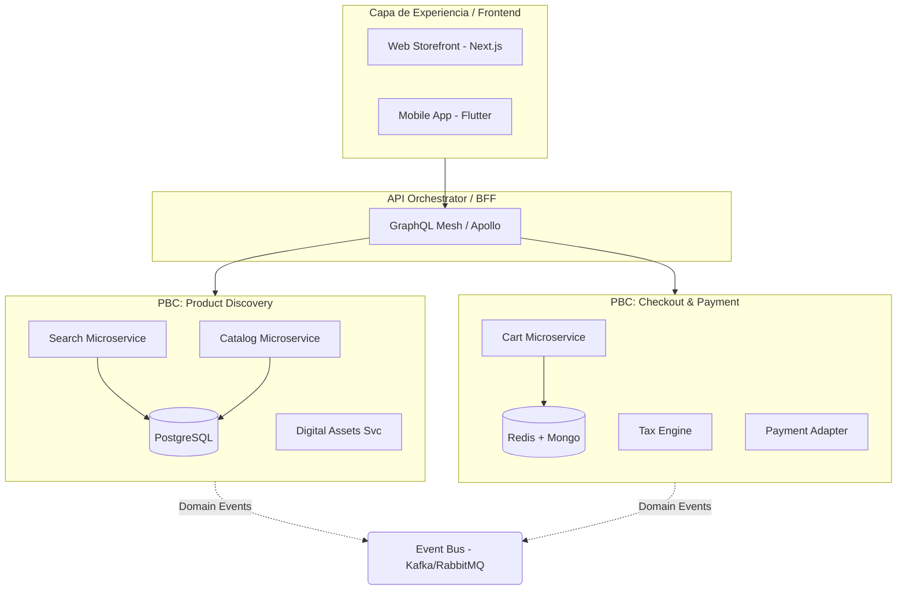

En la última década, la transición de arquitecturas monolíticas a microservicios fue la panacea prometida para la agilidad empresarial. Sin embargo, muchas organizaciones de escala *enterprise* se encuentran hoy atrapadas en una "pesadilla de granularidad": cientos de microservicios huérfanos, latencias disparadas por excesivos saltos de red y una complejidad operativa que consume el 80% del presupuesto de innovación.

Aquí es donde entra el concepto de **Packaged Business Capabilities (PBCs)**. Como pilar fundamental del *Composable Commerce*, las PBCs no son simplemente microservicios con un nombre más elegante; son unidades funcionales autónomas que representan una capacidad de negocio completa y consumible. En este artículo, analizaremos cómo modelar y delimitar estas capacidades para construir ecosistemas MACH que sean realmente escalables y, sobre todo, mantenibles.

## El Problema: La Fatiga de los Microservicios y el "Monolito Distribuido"

El error más común en la adopción de microservicios es la descomposición basada en capas técnicas (ej. servicio de base de datos, servicio de autenticación) en lugar de capacidades de negocio. Esto genera un acoplamiento temporal y de datos donde, para completar una acción tan sencilla como "Añadir al carrito", el sistema debe coordinar diez servicios distintos. Si uno falla o cambia su contrato, el castillo de naipes se derrumba.

Las PBCs resuelven esto agrupando microservicios relacionados bajo un dominio de negocio cohesivo. Una PBC de "Gestión de Inventario" puede estar compuesta internamente por tres microservicios, pero hacia el exterior (el resto de la organización), se presenta como una única entidad con una API unificada, un esquema de eventos claro y una soberanía de datos absoluta.

## Anatomía de una Packaged Business Capability (PBC)

Para que un componente sea considerado una PBC dentro de un ecosistema de comercio digital moderno, debe cumplir con cuatro criterios técnicos:

1.  **Autonomía:** Debe poder ejecutarse de forma independiente, poseyendo su propia persistencia de datos.
2.  **Orquestación Interna:** Los microservicios que la componen se comunican internamente, pero la PBC expone una interfaz simplificada (API Gateway o Facade).
3.  **Orientación a Eventos:** Debe emitir cambios de estado significativos (ej. `OrderPlaced`, `StockDepleted`) hacia un bus de eventos global.
4.  **Descubribilidad:** Debe estar documentada bajo estándares OpenAPI/AsyncAPI para que cualquier equipo pueda consumirla sin intervención manual del equipo propietario.

### Diagrama de Arquitectura: PBC vs. Microservicios Tradicionales

El siguiente diagrama ilustra cómo las PBCs actúan como una capa de abstracción que protege la complejidad interna y facilita la composición en el *Experience Layer*.



## Estrategias de Modelado: DDD y Bounded Contexts

La delimitación de una PBC no es un ejercicio técnico, sino sociotécnico. Utilizamos **Domain-Driven Design (DDD)** para identificar los *Bounded Contexts*.

### 1. Identificación de Contextos mediante Event Storming
Antes de escribir una sola línea de código, es imperativo realizar sesiones de *Event Storming*. El objetivo es identificar los "Hechos de Dominio". Si el equipo de logística y el equipo de ventas tienen definiciones diferentes para la palabra "Pedido", estamos ante dos Bounded Contexts distintos y, por ende, dos PBCs potenciales.

### 2. Definición del Contrato (API-First)
Una PBC se define por su contrato, no por su implementación. A continuación, se muestra un ejemplo de cómo definiríamos la interfaz de una PBC de **Promociones y Lealtad** utilizando OpenAPI 3.1. Este contrato actúa como el "Acuerdo de Nivel de Servicio" (SLA) entre equipos.

```yaml
# promotions-pbc-api.yaml
openapi: 3.1.0
info:
  title: Promotions & Loyalty PBC
  version: 2.4.0
  description: Capacidad autónoma para gestión de cupones, descuentos dinámicos y puntos.
paths:
  /promotions/validate:
    post:
      summary: Valida y aplica promociones a un carrito
      operationId: validateCartPromotions
      requestBody:
        required: true
        content:
          application/json:
            schema:
              $ref: '#/components/schemas/CartValidationRequest'
      responses:
        '200':
          description: Promociones aplicadas exitosamente
          content:
            application/json:
              schema:
                $ref: '#/components/schemas/PromotionResult'
components:
  schemas:
    CartValidationRequest:
      type: object
      properties:
        cartId: { type: string, format: uuid }
        customerId: { type: string }
        items:
          type: array
          items:
            type: object
            properties:
              sku: { type: string }
              price: { type: number }
              quantity: { type: integer }
```

## Implementación Técnica: El Patrón Facade en PBCs

Para evitar que el consumidor de la PBC tenga que conocer la topología interna de los microservicios, implementamos un **Facade** o un **Internal Gateway**. Aquí un ejemplo en TypeScript (NestJS) que actúa como el punto de entrada de la PBC de "Product Discovery", orquestando llamadas internas a servicios de búsqueda y catálogo.

```typescript
// product-discovery.facade.ts
import { Injectable, Logger } from '@nestjs/common';
import { SearchService } from './internal/search.service';
import { CatalogService } from './internal/catalog.service';
import { ProductDTO, SearchQuery } from './dto/discovery.dto';

@Injectable()
export class ProductDiscoveryFacade {
  private readonly logger = new Logger(ProductDiscoveryFacade.name);

  constructor(
    private readonly searchService: SearchService,
    private readonly catalogService: CatalogService,
  ) {}

  /**
   * Método principal expuesto por la PBC. 
   * Combina datos de búsqueda (Elasticsearch) con datos enriquecidos del catálogo (Postgres).
   */
  async searchProducts(query: SearchQuery): Promise<ProductDTO[]> {
    try {
      // 1. Obtener IDs de productos relevantes desde el motor de búsqueda
      const productIds = await this.searchService.findIdsByCriteria(query);

      if (productIds.length === 0) return [];

      // 2. Enriquecer los datos con la información base del catálogo
      // La PBC garantiza que esta operación sea atómica para el consumidor
      const products = await this.catalogService.getHydratedProducts(productIds);

      return products;
    } catch (error) {
      this.logger.error(`Error in PBC ProductDiscovery: ${error.message}`);
      throw new InternalPBCException('Discovery service temporarily unavailable');
    }
  }
}
```

## Trade-offs Arquitectónicos: ¿Cuándo usar PBCs?

No todo debe ser una PBC. La sobre-ingeniería es el enemigo de la entrega continua.

| Característica | Microservicios Atómicos | Packaged Business Capabilities (PBCs) | Monolito Modular |
| :--- | :--- | :--- | :--- |
| **Granularidad** | Muy fina (ej. `TaxCalculator`) | Media (ej. `Checkout`) | Gruesa (ej. `CommerceEngine`) |
| **Despliegue** | Independiente por servicio | Independiente por PBC (o servicios internos) | Todo o nada |
| **Gobernanza** | Difícil de centralizar | Basada en dominios de negocio | Centralizada |
| **Latencia** | Alta (muchos saltos de red) | Optimizada (comunicación interna rápida) | Mínima (llamadas en memoria) |
| **Cuándo usar** | Startups con 1-2 equipos | **Empresas Enterprise con múltiples equipos** | Prototipos o MVPs simples |
| **Cuándo evitar** | Sistemas complejos con >50 servicios | Equipos pequeños (<15 personas) | Sistemas que requieren alta escalabilidad |

## Modos de Fallo Comunes y Mitigación

### 1. El "God PBC" (La PBC Todopoderosa)
**Fallo:** Una PBC que comienza a absorber demasiadas responsabilidades (ej. una PBC de "Clientes" que también maneja "Pedidos", "Soporte" y "Marketing").
**Mitigación:** Aplicar el principio de *Single Responsibility* a nivel de dominio. Si el equipo que mantiene la PBC crece más de 12 personas (2 pizzas rule), es momento de dividirla.

### 2. Inconsistencia de Datos entre PBCs
**Fallo:** La PBC de "Inventario" dice que hay stock, pero la PBC de "Pedidos" falla al crear la orden porque el stock se agotó.
**Mitigación:** Implementar el **Saga Pattern** (Orquestación o Coreografía). No intentes transacciones distribuidas (2PC); utiliza consistencia eventual y eventos de compensación.

### 3. Acoplamiento de Esquemas
**Fallo:** Cambiar un campo en la PBC de "Catálogo" rompe la PBC de "Recomendaciones".
**Mitigación:** Utilizar **Consumer-Driven Contracts (CDC)** con herramientas como Pact. Asegura que los consumidores definan qué necesitan antes de que el proveedor cambie el esquema.

## Estrategia de Transición: Del Monolito a PBCs

Para empresas que operan sobre plataformas *legacy* (SAP Commerce, Oracle ATG, Magento Commerce), la migración debe ser quirúrgica.

1.  **Strangler Fig Pattern:** No intentes apagar el monolito. Identifica una capacidad (ej. Búsqueda) y extráela a una PBC.
2.  **Anti-Corruption Layer (ACL):** Crea una capa intermedia que traduzca el modelo de datos del monolito al nuevo modelo de la PBC.
3.  **Sincronización de Datos en Tiempo Real:** Utiliza Change Data Capture (CDC) con herramientas como Debezium para mantener la base de datos de la PBC sincronizada con el monolito durante la coexistencia.

## Conclusión y Checklist de Implementación

El modelado de PBCs es el puente entre la agilidad técnica y la relevancia de negocio. Una arquitectura composable exitosa no se mide por cuántos servicios tienes en Kubernetes, sino por qué tan rápido puedes intercambiar una PBC de un proveedor tercero (ej. Algolia para búsqueda) por una propia o viceversa, sin afectar el resto del ecosistema.

### Checklist para Arquitectos:
- [ ] **¿Está delimitada por Bounded Contexts?** (¿El nombre de la PBC refleja un proceso de negocio real?).
- [ ] **¿Tiene persistencia propia?** (Si comparte base de datos con otra PBC, no es una PBC, es un microservicio mal acoplado).
- [ ] **¿Expone un contrato OpenAPI/AsyncAPI documentado?**
- [ ] **¿Es agnóstica a la tecnología interna?** (¿Podrías reescribir el interior de Go a Rust sin que el frontend se entere?).
- [ ] **¿Emite eventos de dominio?** (¿Otras partes del sistema pueden reaccionar a sus cambios sin hacer polling?).
- [ ] **¿Tiene un dueño (Product Owner) claro?**

Adoptar PBCs es aceptar que el software de comercio digital ya no es un producto estático, sino un organismo vivo compuesto por capacidades que evolucionan a ritmos distintos. En el mundo del *Composable Commerce*, la modularidad es la única defensa contra la obsolescencia.