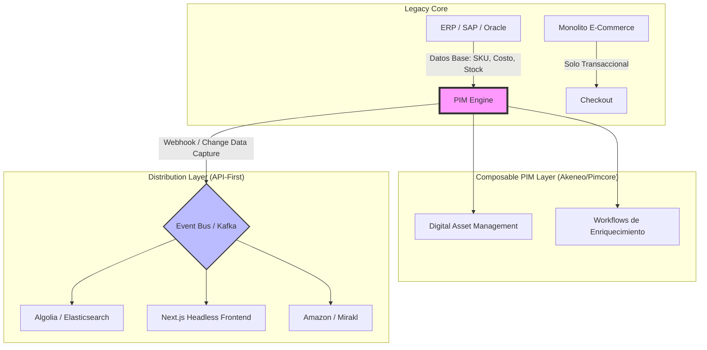

En el ecosistema del comercio electrónico enterprise, el catálogo de productos es el sistema circulatorio de la operación. Sin embargo, para muchas organizaciones que aún operan bajo arquitecturas heredadas (Legacy Monoliths), este catálogo se ha convertido en un cuello de botella crítico. La dependencia de módulos de inventario rígidos dentro de un ERP o de suites de e-commerce "todo en uno" (como SAP Commerce Cloud o Adobe Commerce en sus versiones tradicionales) impide la agilidad necesaria para competir en un mercado omnicanal.

Como Principal Solutions Architect, he observado que el síntoma principal de este fallo no es la falta de datos, sino la **parálisis de enriquecimiento**. Cuando el equipo de marketing tarda semanas en lanzar una nueva colección porque el sistema requiere despliegues de código para añadir un atributo de color, o cuando la traducción para un nuevo mercado requiere procesos manuales de exportación/importación en Excel, la arquitectura ha fallado.

La transición hacia un **Product Information Management (PIM)** bajo un enfoque Composable (MACH) no es solo un cambio de software; es una reingeniería de la soberanía del dato.

## El Problema: El Catálogo como Rehén del Monolito

En una arquitectura monolítica, el "Producto" es una entidad sobrecargada. Comparte espacio en la base de datos con reglas de precios, niveles de stock, lógica de promociones y datos de transacciones. Esta falta de separación de preocupaciones (*Separation of Concerns*) genera tres problemas fundamentales:

1.  **Rigidez del Esquema:** Añadir metadatos (ej. certificaciones de sostenibilidad, dimensiones para logística, compatibilidad técnica) requiere alterar esquemas de base de datos relacionales complejos.
2.  **Latencia de Distribución:** El contenido no está optimizado para ser consumido por múltiples canales (Mobile App, POS, Marketplaces, IoT).
3.  **Gobernanza Inexistente:** No hay flujos de trabajo (workflows) para la validación de calidad de datos antes de la publicación.

## Arquitectura de Transición: El Patrón Strangler Fig para Catálogos

Migrar un catálogo de 500,000 SKUs no se hace en un "Big Bang". La estrategia recomendada es aplicar el **Strangler Fig Pattern**, donde extraemos gradualmente la responsabilidad del enriquecimiento de datos hacia un PIM especializado (Akeneo o Pimcore), manteniendo el monolito solo para funciones transaccionales hasta su eventual retiro.

### Diagrama de Arquitectura Composable PIM



## Implementación Técnica: Sincronización Basada en Eventos

En una arquitectura MACH, el PIM no debe ser consultado directamente por el frontend en cada request (para evitar latencia y acoplamiento). En su lugar, el PIM emite eventos cuando un producto alcanza un estado de "Completo" o "Publicado".

A continuación, presentamos un ejemplo de un **Event Handler** desarrollado en TypeScript (Node.js) que se ejecuta en un entorno Serverless (AWS Lambda o Google Cloud Run). Este servicio escucha un Webhook de Akeneo, transforma el payload al formato requerido por un motor de búsqueda (Algolia) y actualiza el caché de la API.

```typescript
/**
 * PIM Event Transformer - Akeneo to Search Engine
 * Propósito: Sincronizar cambios de atributos en tiempo real.
 */

import { AlgoliaClient } from './clients/algolia';
import { AkeneoMapper } from './mappers/akeneoMapper';
import { Logger } from './utils/logger';

export const handler = async (event: any) => {
    const body = JSON.parse(event.body);
    
    // 1. Validar el evento (Ej: 'product.updated' o 'product.created')
    if (!body.action || !['product.updated', 'product.created'].includes(body.action)) {
        return { statusCode: 200, body: 'Event ignored' };
    }

    try {
        const productData = body.data;
        
        // 2. Enriquecimiento adicional si el webhook es parcial
        // En implementaciones enterprise, a veces necesitamos llamar al API del PIM
        // para obtener el modelo completo de atributos.
        
        // 3. Mapeo de datos: De modelo PIM a modelo de Consumo (Headless)
        const searchProfile = AkeneoMapper.toSearchIndex(productData);

        // 4. Propagación a motores de búsqueda y caché
        await AlgoliaClient.saveObject({
            indexName: 'prod_catalog_es',
            data: searchProfile
        });

        Logger.info(`Product ${productData.identifier} synced successfully.`);
        
        return {
            statusCode: 200,
            body: JSON.stringify({ message: "Sync Complete", id: productData.identifier })
        };
    } catch (error) {
        Logger.error("Sync Failed", error);
        throw new Error("Critical Sync Error"); // Triggering retry logic in Event Bus
    }
};
```

### El Modelo de Datos: Atributos Dinámicos vs. Estáticos

Uno de los mayores retos en la transición es definir qué datos viven en el PIM y cuáles en el ERP. La regla de oro en Composable Commerce es:

*   **ERP:** Datos "fríos" y transaccionales (SKU, EAN, Costo, Stock físico, Dimensiones logísticas).
*   **PIM:** Datos "calientes" y de experiencia (Descripciones SEO, Imágenes, Videos, Atributos técnicos, Traducciones, Relaciones de Cross-sell).

## Comparativa de Soluciones: Akeneo vs. Pimcore

Ambas herramientas son líderes en el cuadrante de PIM, pero sirven a propósitos arquitectónicos distintos.

| Característica | Akeneo (SaaS/PaaS) | Pimcore (Open Source/Enterprise) |
| :--- | :--- | :--- |
| **Filosofía** | PXM (Product Experience Management) puro. | Plataforma de Datos Consolidada (PIM + DAM + MDM + CMS). |
| **Curva de Aprendizaje** | Baja/Media. Muy amigable para usuarios de negocio. | Alta. Requiere un equipo de ingeniería sólido. |
| **Extensibilidad** | Basada en API y Webhooks (MACH friendly). | Basada en PHP/Symfony. Permite modificar el core profundamente. |
| **Modelado de Datos** | Estructura de familias y atributos muy definida. | Extremadamente flexible (Object-oriented data modeling). |
| **Cuándo usarlo** | Equipos de Marketing que necesitan autonomía rápida. | Proyectos complejos con necesidades de MDM y gestión de activos masiva. |
| **Cuándo evitarlo** | Si necesitas un CMS integrado y gestión de portales complejos. | Si buscas una solución "out-of-the-box" con mínima configuración técnica. |

## Modos de Fallo Comunes y Mitigación

### 1. El Problema del "Split-Brain" de Datos
**Fallo:** El ERP y el PIM intentan ser dueños del mismo atributo (ej. el nombre del producto). Esto causa fluctuaciones en el frontend donde el nombre cambia dependiendo de qué sistema sincronizó último.
**Mitigación:** Establecer una **Matriz de Soberanía de Datos**. Documentar explícitamente qué sistema es el "Source of Truth" para cada campo. El PIM debe ganar en todo lo visual; el ERP en todo lo numérico/logístico.

### 2. Explosión de Webhooks
**Fallo:** Un cambio masivo en el PIM (ej. actualizar una categoría con 50,000 productos) dispara 50,000 webhooks simultáneos, saturando los servicios downstream (Lambda, Algolia, Shopify).
**Mitigación:** Implementar un **Message Queue (SQS/RabbitMQ)** con *Throttling*. No procesar los webhooks directamente; encolarlos y procesarlos a una tasa que los sistemas destino puedan soportar.

### 3. Inconsistencia de Traducciones
**Fallo:** Se publica un producto en el sitio de España pero los atributos técnicos aún están en inglés porque el flujo de traducción no terminó.
**Mitigación:** Utilizar **Completeness Levels** en el PIM. El API de distribución no debe recibir el producto hasta que el atributo `completeness` para el locale específico sea 100%.

## Estrategia de Migración de Datos (ETL)

Para mover los datos del monolito al PIM, recomiendo un pipeline de ETL (Extract, Transform, Load) utilizando Python y Pandas para la limpieza, ya que los datos en monolitos suelen estar "sucios" o mal estructurados.

```python
import pandas as pd

def clean_legacy_data(file_path):
    # Cargar export de base de datos legacy
    df = pd.read_csv(file_path)
    
    # Transformación: Normalizar colores (ej. 'Blanco ', 'blanco', 'WHT' -> 'Blanco')
    color_map = {'WHT': 'Blanco', 'blanco': 'Blanco', 'Blanco ': 'Blanco'}
    df['color'] = df['color'].replace(color_map)
    
    # Generar identificadores únicos para Akeneo (Families)
    df['family'] = df['category'].apply(lambda x: x.lower().replace(' ', '_'))
    
    # Exportar a formato compatible con Akeneo API
    df.to_json('akeneo_import.json', orient='records')

clean_legacy_data('legacy_catalog_dump.csv')
```

## Conclusión: El PIM como Motor de Crecimiento

La transición de un catálogo monolítico a un motor Composable PIM como Akeneo o Pimcore no es simplemente un proyecto de IT; es una habilitación estratégica. Permite que el negocio experimente con nuevos canales (como TikTok Shop o marketplaces regionales) en días en lugar de meses.

Al desacoplar la información del producto de la lógica transaccional, estamos construyendo una arquitectura resiliente, preparada para la escala global y, sobre todo, centrada en la experiencia del cliente.

### Checklist de Implementación para Equipos de Ingeniería

- [ ] **Auditoría de Datos:** Identificar todos los atributos actuales y su calidad.
- [ ] **Definición de Soberanía:** Crear la matriz ERP vs. PIM.
- [ ] **Selección de Tooling:** Elegir Akeneo si la prioridad es el Time-to-Market de marketing, o Pimcore si se requiere una gestión de datos compleja y personalizada.
- [ ] **Diseño de Contratos de API:** Definir cómo lucirá el JSON del producto para el frontend (independiente del modelo interno del PIM).
- [ ] **Estrategia de Caché:** Implementar una capa de búsqueda (Search-as-a-Service) que actúe como el buffer de lectura del catálogo.
- [ ] **Workflows de Validación:** Configurar los estados de aprobación para garantizar que ningún producto "roto" llegue a producción.

La arquitectura MACH nos enseña que cada pieza debe ser la mejor en su clase (*Best-of-breed*). En el mundo del contenido de producto, el PIM es, sin duda, el corazón de esa promesa.---