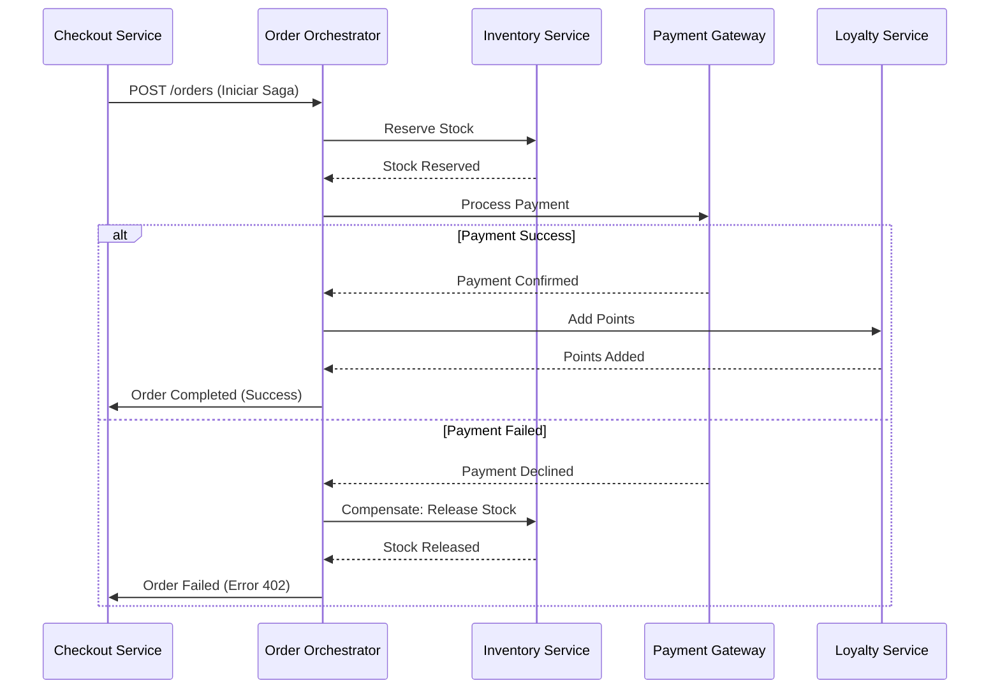

En el panorama actual del *Composable Commerce* y las arquitecturas MACH (Microservices, API-first, Cloud-native, Headless), la agilidad ya no es el único diferenciador competitivo. Para las empresas de nivel *Enterprise*, el verdadero reto ha mutado: ¿cómo mantenemos la integridad de los datos y la disponibilidad del sistema cuando una sola transacción de negocio involucra cinco servicios de terceros, tres nubes distintas y una red inherentemente poco confiable?

El error común en muchas implementaciones MACH es tratar la resiliencia como una capa de infraestructura (delegándola solo a Service Meshes o Kubernetes) y la consistencia como un problema de base de datos local. Sin embargo, en un entorno distribuido, la resiliencia y la consistencia son **propiedades emergentes del diseño de software**.

Este artículo profundiza en los patrones de diseño que separan a las arquitecturas experimentales de los sistemas de misión crítica que operan a escala global en 2026.

## El Problema: El Abismo de la Consistencia Distribuida

Imagine un flujo de "Checkout" en una plataforma de comercio compuesto. El servicio de pedidos (Order Service) debe:
1.  Reservar inventario en un ERP legacy.
2.  Procesar el pago a través de Stripe o Adyen.
3.  Emitir un cupón de fidelidad en un SaaS de Loyalty.
4.  Notificar al servicio de envíos (Logistics).

Si el paso 3 falla debido a un timeout de la API de fidelidad, ¿qué sucede? ¿Revertimos el pago? ¿El inventario queda bloqueado para siempre? Aquí es donde el patrón tradicional de transacciones ACID falla, ya que no podemos extender un bloqueo de base de datos a través de múltiples servicios HTTP.

### El Teorema CAP en la Práctica MACH
En arquitecturas MACH, operamos casi exclusivamente en el espectro **AP (Availability and Partition Tolerance)**. Sacrificamos la consistencia fuerte (Strong Consistency) en favor de la consistencia eventual (Eventual Consistency). El reto arquitectónico es gestionar esa "eventualidad" para que el usuario final y el negocio no perciban el caos subyacente.

## Patrón 1: Saga Pattern (Orquestación vs. Coreografía)

Para gestionar transacciones de larga duración (LLT) sin bloqueos, el patrón Saga es indispensable. Una Saga es una secuencia de transacciones locales donde cada transacción actualiza los datos dentro de un único servicio y publica un evento para activar la siguiente.

### Diagrama de Secuencia: Saga Orquestada para Composable Commerce



**Trade-off Crítico:** La **Orquestación** (un orquestador central dirige los pasos) es preferible en flujos complejos de negocio por su visibilidad, mientras que la **Coreografía** (eventos reactivos entre servicios) es mejor para desacoplamiento extremo pero difícil de trazar.

## Patrón 2: Transactional Outbox (Evitando el "Dual Write")

Uno de los fallos más catastróficos en microservicios es el problema del *Dual Write*: actualizar la base de datos y luego intentar enviar un evento a un broker (como Kafka o RabbitMQ). Si el servicio se cae justo después de la actualización de la DB pero antes de enviar el evento, el sistema queda en un estado inconsistente.

El patrón **Transactional Outbox** garantiza que la actualización de la base de datos y el registro del evento ocurran en la misma transacción atómica local.

### Implementación de Referencia (TypeScript + Prisma)

```typescript
/**
 * Ejemplo de implementación del patrón Transactional Outbox
 * para garantizar consistencia entre DB y Event Broker.
 */

import { PrismaClient } from '@prisma/client';
const prisma = new PrismaClient();

async function createOrder(orderData: any) {
  return await prisma.$transaction(async (tx) => {
    // 1. Crear el pedido en la tabla de negocio
    const order = await tx.order.create({
      data: {
        userId: orderData.userId,
        total: orderData.total,
        status: 'PENDING'
      }
    });

    // 2. Insertar el evento en la tabla 'outbox' dentro de la misma transacción
    await tx.outbox.create({
      data: {
        aggregateId: order.id,
        aggregateType: 'ORDER',
        eventType: 'ORDER_CREATED',
        payload: JSON.stringify(order),
        processed: false
      }
    });

    return order;
  });
}

// Un proceso independiente (Relay) lee la tabla 'outbox' y publica en Kafka
// garantizando entrega "At-least-once".
```

## Patrón 3: Idempotencia Distribuida con Claves de Control

En un mundo de reintentos automáticos (Retries), la idempotencia no es opcional. Si un cliente reintenta una petición de pago debido a un timeout, el sistema debe garantizar que el cargo se realice exactamente una vez.

### Estrategia de Implementación:
1.  **Client-Generated Keys:** El cliente (frontend o servicio upstream) genera un UUID único para la operación.
2.  **Idempotency Layer:** Un middleware intercepta la petición, verifica en una caché distribuida (Redis) si el ID ya fue procesado.
3.  **Atomic Lock:** Si está en proceso, devuelve `409 Conflict`. Si ya terminó, devuelve la respuesta cacheada.

| Característica | Idempotencia en Lectura | Idempotencia en Escritura |
| :--- | :--- | :--- |
| **Dificultad** | Baja (Nativa en GET/PUT) | Alta (Requiere estado) |
| **Almacenamiento** | No requiere | Redis / DB (TTL corto) |
| **Impacto en Latencia** | Mínimo | +5-10ms (Lookup) |
| **Uso Ideal** | Consultas de estado | Pagos, Creación de recursos |

## Patrón 4: Cell-based Architecture (Aislamiento de Radio de Explosión)

A medida que las plataformas MACH crecen, el patrón *Bulkhead* a nivel de hilo o proceso no es suficiente. Las empresas líderes están adoptando la **Arquitectura Basada en Celdas (Cells)**.

En lugar de tener un clúster masivo de microservicios, el sistema se divide en "celdas" independientes y completas. Una celda contiene una instancia de cada microservicio necesario para procesar una transacción.

-   **Beneficio:** Si la celda A falla (por un despliegue defectuoso o saturación), solo afecta al 5% de los usuarios asignados a esa celda.
-   **Implementación:** Requiere un *Cell Router* inteligente en el borde (Edge) que encamine el tráfico basado en el `tenant_id` o `user_id`.

## Comparativa de Estrategias de Consistencia

| Patrón | Consistencia | Complejidad | Cuándo usarlo | Cuándo evitarlo |
| :--- | :--- | :--- | :--- | :--- |
| **2PC (Two-Phase Commit)** | Fuerte | Muy Alta | Sistemas legacy muy específicos | Casi siempre en Cloud-Native |
| **Saga (Orquestada)** | Eventual | Alta | Procesos de negocio multi-paso | Flujos simples de 2 servicios |
| **Transactional Outbox** | Eventual | Media | Comunicación entre microservicios | Aplicaciones monolíticas |
| **Event Sourcing** | Eventual | Muy Alta | Auditoría crítica, sistemas financieros | CRUDs simples |

## Modos de Fallo Comunes y Mitigación en Producción

### 1. El Problema del "Thundering Herd" en Reintentos
Cuando un servicio cae, miles de instancias intentan reintentar al mismo tiempo al recuperarse, volviendo a tumbar el servicio.
*   **Mitigación:** Implementar **Exponential Backoff con Jitter** (ruido aleatorio). No reintentes cada 1s, reintenta cada `1s + random(100ms)`.

### 2. Envenenamiento de Mensajes (Poison Pill Messages)
Un mensaje en la cola de eventos tiene un formato inválido que hace que el consumidor crashee. Al reiniciar, vuelve a leer el mismo mensaje, entrando en un bucle infinito.
*   **Mitigación:** **Dead Letter Queues (DLQ)**. Tras N intentos fallidos, el mensaje se mueve a una cola de inspección manual.

### 3. Drift de Datos en Sagas
Una transacción compensatoria (rollback) falla, dejando el sistema en un estado inconsistente permanentemente.
*   **Mitigación:** **Reconciliation Loops**. Procesos batch que comparan estados entre servicios cada hora y generan alertas o correcciones automáticas.

## Conclusión: Checklist de Implementación para Arquitectos

Para asegurar que su arquitectura MACH sea verdaderamente resiliente en un entorno enterprise, siga este checklist:

1.  [ ] **¿Cada API de escritura es idempotente?** Asegúrese de que los consumidores puedan enviar el mismo `x-idempotency-key` sin efectos secundarios.
2.  [ ] **¿Ha eliminado los Dual Writes?** Implemente *Transactional Outbox* o *Change Data Capture (CDC)* para la propagación de eventos.
3.  [ ] **¿Existen transacciones compensatorias?** Por cada acción en su Saga, debe existir una acción inversa (ej: `ReserveStock` -> `ReleaseStock`).
4.  [ ] **¿El Circuit Breaker tiene Observabilidad?** Un Circuit Breaker abierto es un incidente; debe disparar una alerta inmediata al equipo de SRE.
5.  [ ] **¿Prueba el fallo activamente?** Implemente *Chaos Engineering* (ej: AWS Fault Injection Simulator) para terminar instancias o inyectar latencia en horas de oficina.

La resiliencia en arquitecturas MACH no se compra con una herramienta; se construye aceptando que el fallo es inevitable y diseñando el software para que la recuperación sea elegante, automática y, sobre todo, consistente para el negocio.

---
*Este artículo forma parte de la serie avanzada de 'MACH Playbook'. Para más recursos sobre ingeniería de plataformas y composable commerce, visite nuestra sección de [Arquitectura Cloud](https://mach-playbook.github.io/categories/arquitectura-cloud/).*