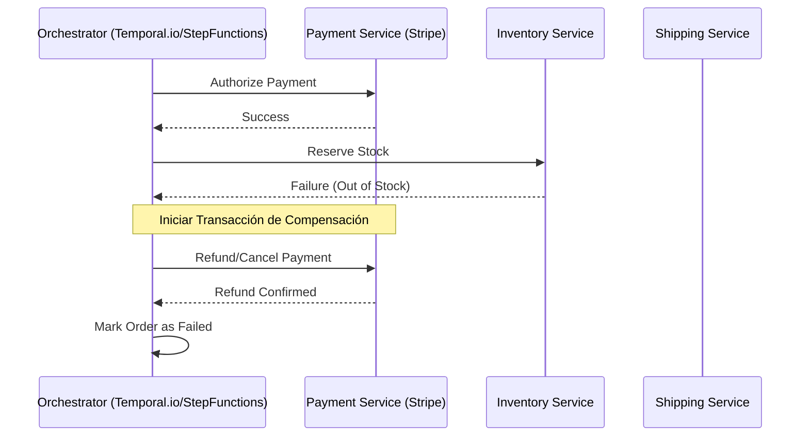

En el panorama tecnológico de 2026, la adopción de arquitecturas **MACH** (Microservices, API-first, Cloud-native, Headless) ha dejado de ser una ventaja competitiva para convertirse en el estándar de facto en el sector Enterprise. Sin embargo, la transición de monolitos hacia ecosistemas *Composable* ha revelado una verdad incómoda que muchos arquitectos subestimaron: **la red es inherentemente poco fiable y la consistencia distribuida es extremadamente costosa.**

Cuando operamos con múltiples proveedores de SaaS (comercio, CMS, búsqueda, pagos) integrados mediante funciones serverless y microservicios en mallas de servicios (Service Meshes), los fallos parciales no son una posibilidad, sino una certeza estadística. El problema real en una arquitectura MACH no es que un servicio falle, sino cómo el sistema completo reacciona ante ese fallo para evitar la corrupción de datos y la degradación en cascada.

Este artículo profundiza en los patrones avanzados que separan a las implementaciones MACH "de juguete" de los sistemas de misión crítica que procesan miles de transacciones por segundo con consistencia garantizada.

## El Dilema de la Escritura Dual y la Falacia de la Red

El error más común en las arquitecturas distribuidas es el patrón de "Escritura Dual" (Dual Write). Imagine un microservicio de pedidos que debe actualizar su base de datos local y, simultáneamente, notificar a un servicio de inventario y a un CRM externo.

```typescript
// Ejemplo de ANTIPATRÓN (Escritura Dual)
async function createOrder(orderData: Order) {
  const order = await db.orders.save(orderData); // Paso 1: DB Local
  await eventBridge.publish("OrderCreated", order); // Paso 2: Evento Externo
  return order;
}
```

Si el Paso 1 tiene éxito pero el Paso 2 falla (por un timeout de red o caída del bus de eventos), el sistema queda en un estado inconsistente: el pedido existe, pero el inventario nunca se enteró. Invertir los pasos no soluciona el problema, solo cambia el síntoma. En sistemas MACH, donde dependemos de APIs de terceros, este riesgo se multiplica exponencialmente.

## Patrón 1: Transactional Outbox con CDC (Change Data Capture)

Para resolver la consistencia sin recurrir a protocolos pesados como Two-Phase Commit (2PC) —que destruyen la escalabilidad—, el patrón **Transactional Outbox** es esencial. En lugar de enviar el mensaje directamente, lo guardamos en una tabla de "Outbox" dentro de la misma transacción atómica de la base de datos local.

### Implementación Técnica (Node.js + PostgreSQL)

```typescript
import { EntityManager } from 'typeorm';

/**
 * Persiste el pedido y el evento en una única transacción atómica.
 */
async function createOrderAtomic(manager: EntityManager, orderData: Order) {
  return await manager.transaction(async (transactionalEntityManager) => {
    // 1. Guardar la entidad de negocio
    const order = await transactionalEntityManager.save(OrderEntity, orderData);

    // 2. Guardar el evento en la tabla Outbox
    const outboxEvent = {
      aggregate_id: order.id,
      aggregate_type: 'ORDER',
      payload: JSON.stringify(order),
      status: 'PENDING',
      created_at: new Date()
    };
    await transactionalEntityManager.save(OutboxEntity, outboxEvent);

    return order;
  });
}
```

Posteriormente, un proceso separado (un Relay de eventos o una herramienta de CDC como **Debezium**) lee la tabla de Outbox y publica los mensajes en el broker (Kafka, RabbitMQ o AWS EventBridge). Esto garantiza que el mensaje se enviará **al menos una vez** (at-least-once delivery).

## Patrón 2: Sagas Orquestadas para Procesos de Larga Duración

En Composable Commerce, un "Checkout" puede involucrar a Stripe (Pagos), Contentful (Contenido), Algolia (Indexación) y un ERP legacy. No podemos bloquear todos estos servicios en una sola transacción. Aquí entra el **Saga Pattern**.

Existen dos tipos: Coreografía (basada en eventos) y Orquestación (basada en un controlador central). Para entornos Enterprise complejos, la **Orquestación** suele ser superior por su facilidad de monitoreo y manejo de errores.

### Diagrama de Secuencia: Saga de Pedido con Compensación



El orquestador es responsable de ejecutar las **acciones de compensación** si un paso intermedio falla. Si el inventario falla, el orquestador debe saber que debe reembolsar el pago en Stripe.

## Patrón 3: Idempotencia Determinista

Dado que el patrón Outbox garantiza la entrega "al menos una vez", el receptor puede recibir el mismo mensaje múltiples veces debido a reintentos de red. Sin **idempotencia**, procesaríamos el mismo pago dos veces.

Un patrón avanzado es el uso de un **Idempotency Key** obligatorio en todas las APIs. El servidor debe implementar una capa de persistencia (usualmente Redis) para rastrear las claves procesadas.

### Lógica de Middleware de Idempotencia (Python/FastAPI)

```python
from fastapi import Request, HTTPException
import redis

r = redis.Redis(host='localhost', port=6379, db=0)

async def idempotency_guard(request: Request):
    idempotency_key = request.headers.get("X-Idempotency-Key")
    if not idempotency_key:
        raise HTTPException(status_code=400, detail="Missing Idempotency Key")

    # Intentar registrar la clave con un TTL de 24 horas
    is_new = r.set(f"idem:{idempotency_key}", "processing", nx=True, ex=86400)
    
    if not is_new:
        status = r.get(f"idem:{idempotency_key}")
        if status == b"processing":
            raise HTTPException(status_code=409, detail="Request in progress")
        return True, status # Retornar respuesta cacheada si existe

    return False, None
```

## Patrón 4: Adaptive Concurrency Limits (Backpressure Dinámico)

Los Circuit Breakers tradicionales (como Resilience4j) se basan en umbrales estáticos. En 2026, las arquitecturas de alto nivel utilizan **Límites de Concurrencia Adaptativos**. En lugar de configurar "abrir el circuito tras 10 errores", el sistema mide latencias en tiempo real y ajusta dinámicamente cuántas solicitudes permite pasar.

Si la latencia del servicio de búsqueda (Algolia) sube de 50ms a 500ms, el sistema reduce automáticamente el número de hilos o conexiones concurrentes permitidas hacia ese servicio, protegiendo los recursos locales (CPU/Memoria) antes de que el sistema colapse por saturación de hilos (Thread Starvation).

---

## Comparativa de Trade-offs Arquitectónicos

| Patrón | Pros | Contras | Cuándo usarlo |
| :--- | :--- | :--- | :--- |
| **Transactional Outbox** | Consistencia garantizada entre DB y Mensajería. | Introduce latencia de entrega (ms). Requiere infraestructura adicional (CDC). | Siempre que una acción en DB deba disparar un evento externo. |
| **Saga (Orquestada)** | Visibilidad centralizada, fácil de debuguear, lógica de compensación clara. | El orquestador es un punto único de fallo (SPOF) potencial. | Procesos de negocio complejos que cruzan múltiples dominios. |
| **Saga (Coreografiada)** | Máximo desacoplamiento, alta escalabilidad. | Muy difícil de rastrear el estado global. Riesgo de dependencias cíclicas. | Procesos simples con 2 o 3 microservicios. |
| **Idempotencia** | Previene duplicidad de datos y cobros erróneos. | Requiere almacenamiento rápido (Redis) y gestión de TTLs. | En todas las APIs de escritura (POST/PUT/PATCH). |

---

## Modos de Fallo Comunes y Estrategias de Mitigación

### 1. El "Fantasma" de la Consistencia Eventual
**Problema:** Un usuario actualiza su perfil, es redirigido a la vista de perfil, pero ve los datos viejos porque la caché o la réplica de lectura aún no se ha actualizado.
**Mitigación:** Implementar "Read-Your-Writes consistency". El cliente envía un token de versión o el backend asegura que la lectura se realice sobre el nodo primario si se detecta una escritura reciente por el mismo usuario.

### 2. Tormentas de Reintentos (Retry Storms)
**Problema:** Cuando un servicio cae, cientos de clientes reintentan simultáneamente con una política de reintento agresiva, impidiendo que el servicio se recupere (efecto DDoS accidental).
**Mitigación:** Implementar **Exponential Backoff con Jitter** (ruido aleatorio). No reintentar en intervalos fijos (1s, 2s, 4s), sino (1.1s, 2.3s, 3.8s) para distribuir la carga.

### 3. Envenenamiento de Mensajes (Poison Pill)
**Problema:** Un mensaje malformado llega a un consumidor, este falla, el mensaje vuelve a la cola, y se repite infinitamente bloqueando el procesamiento.
**Mitigación:** Configurar **Dead Letter Queues (DLQ)** con un límite de reintentos (max_delivery_attempts). Tras 3 o 5 fallos, el mensaje se mueve a una cola de inspección manual.

---

## Implementación en Producción: Checklist para Arquitectos

Para asegurar que su arquitectura MACH sea verdaderamente resiliente en un entorno Enterprise, verifique los siguientes puntos:

1.  **Observabilidad de Eventos:** ¿Puede rastrear un `correlation_id` desde el frontend hasta el último microservicio y el bus de eventos?
2.  **Contratos de API:** ¿Utiliza esquemas (OpenAPI/AsyncAPI) para validar que los eventos en el Outbox cumplen con lo esperado por los consumidores?
3.  **Aislamiento de Fallos (Bulkhead):** ¿Están los pools de conexiones a servicios externos aislados para que la caída de un proveedor de búsqueda no bloquee el proceso de pago?
4.  **Pruebas de Caos (Chaos Engineering):** ¿Se han realizado simulaciones de inyección de latencia y caída de zonas de disponibilidad en el entorno de staging?
5.  **Estrategia de Compensación:** ¿Existe un flujo documentado y probado para revertir transacciones en cada Saga?

## Conclusión

La resiliencia en arquitecturas MACH no se logra añadiendo más infraestructura, sino aceptando la naturaleza distribuida del sistema y diseñando para el fallo. El paso de patrones reactivos (Circuit Breaker) a patrones proactivos y de consistencia (Transactional Outbox, Sagas, Idempotencia) es lo que define una plataforma de comercio composable madura.

Implementar estos patrones requiere una inversión inicial significativa en ingeniería, pero el retorno se mide en la ausencia de incidentes críticos durante picos de tráfico (como Black Friday) y en la integridad absoluta de los datos de sus clientes. En el mundo MACH, la arquitectura es el producto.