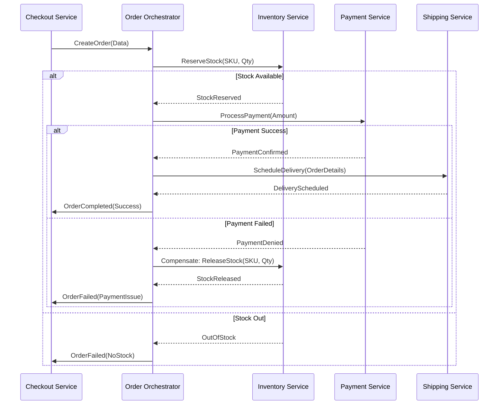

En el ecosistema del **Composable Commerce** y las arquitecturas **MACH** (Microservices, API-first, Cloud-native, Headless), la flexibilidad es nuestra mayor virtud, pero la complejidad distribuida es nuestro mayor desafío. Para el año 2026, ya no es suficiente con implementar un *Circuit Breaker* básico o un *Retry Policy* estándar. Las empresas de escala enterprise se enfrentan a un problema crítico: la **consistencia de datos a través de fronteras de servicios** y la **resiliencia ante fallos parciales en cascada**.

Cuando un cliente presiona el botón de "Pagar" en una plataforma headless, se desencadena una coreografía de microservicios: inventario, pasarela de pagos, motor de promociones, CRM y logística. Si el servicio de pagos confirma la transacción pero el servicio de inventario falla debido a una partición de red, nos enfrentamos a una pesadilla operativa y de experiencia de usuario. 

Este artículo profundiza en los patrones avanzados que los Principal Architects están utilizando hoy para garantizar que la "Consistencia Eventual" no se convierta en "Inconsistencia Permanente".

## El Dilema de la Transacción Distribuida en MACH

En un monolito tradicional, la base de datos relacional gestionaba la atomicidad (ACID). En MACH, cada servicio es dueño de su propio estado y base de datos (Database-per-Service). Esto nos obliga a movernos hacia el modelo **BASE** (Basically Available, Soft state, Eventual consistency). 

El problema real surge cuando los sistemas fallan de manera parcial. ¿Cómo revertimos un pago si el envío no se puede programar? ¿Cómo evitamos que un reintento automático duplique un cargo? Aquí es donde entran en juego los patrones de **Saga** y **Transactional Outbox**.

### Visualización del Flujo: Saga Orchestration

El siguiente diagrama muestra una orquestación de Saga para un proceso de pedido complejo, donde un "Orchestrator" centralizado gestiona los estados y las acciones compensatorias.



## Patrón 1: Transactional Outbox para la Fiabilidad de Eventos

Uno de los errores más comunes en producción es el "Dual Write": intentar actualizar la base de datos y enviar un mensaje a un broker (como Kafka o RabbitMQ) en el mismo bloque de código. Si la base de datos confirma pero el broker falla, el sistema queda inconsistente.

El patrón **Transactional Outbox** resuelve esto insertando el evento en una tabla de "Outbox" dentro de la misma transacción de la base de datos local.

### Implementación Técnica (TypeScript + TypeORM)

```typescript
/**
 * Ejemplo de implementación del patrón Outbox en un servicio de Pedidos.
 * Garantiza que el evento de 'OrderCreated' solo se publique si la orden se guarda.
 */

import { Entity, PrimaryGeneratedColumn, Column, EntityManager } from "typeorm";

@Entity()
export class Order {
    @PrimaryGeneratedColumn("uuid")
    id: string;
    @Column()
    customerId: string;
    @Column("decimal")
    total: number;
    @Column()
    status: string;
}

@Entity()
export class OutboxEvent {
    @PrimaryGeneratedColumn("uuid")
    id: string;
    @Column()
    aggregateType: string; // e.g., 'Order'
    @Column()
    aggregateId: string;
    @Column()
    type: string; // e.g., 'OrderCreated'
    @Column("jsonb")
    payload: any;
    @Column({ default: false })
    processed: boolean;
    @Column({ type: "timestamp", default: () => "CURRENT_TIMESTAMP" })
    createdAt: Date;
}

async function createOrder(orderData: any, manager: EntityManager) {
    return await manager.transaction(async (transactionalEntityManager) => {
        // 1. Guardar la Entidad de Negocio
        const order = new Order();
        order.customerId = orderData.customerId;
        order.total = orderData.total;
        order.status = "PENDING";
        const savedOrder = await transactionalEntityManager.save(order);

        // 2. Guardar el Evento en la misma transacción
        const outboxEntry = new OutboxEvent();
        outboxEntry.aggregateType = "Order";
        outboxEntry.aggregateId = savedOrder.id;
        outboxEntry.type = "ORDER_CREATED";
        outboxEntry.payload = { orderId: savedOrder.id, total: savedOrder.total };
        
        await transactionalEntityManager.save(outboxEntry);

        return savedOrder;
    });
}
```

*Nota: Un proceso separado (Relay) leerá la tabla `OutboxEvent` y publicará los mensajes en el Message Broker, marcándolos como procesados solo tras recibir el ACK del broker.*

## Patrón 2: Idempotencia con Claves de Determinismo

En sistemas distribuidos, los reintentos son inevitables. Si un cliente experimenta un timeout, el frontend reintentará la petición. Sin **idempotencia**, corremos el riesgo de procesar la misma transacción múltiples veces.

La estrategia de producción recomendada es el uso de `Idempotency-Key` en los headers de la API. El servidor debe persistir el resultado de la primera ejecución exitosa asociado a esa clave.

### Lógica de Mitigación de Duplicados (Python/FastAPI)

```python
from fastapi import FastAPI, Header, HTTPException
from redis import Redis
import json

app = FastAPI()
cache = Redis(host='localhost', port=6379, db=0)

@app.post("/v1/payments")
async def process_payment(payload: dict, x_idempotency_key: str = Header(None)):
    if not x_idempotency_key:
        raise HTTPException(status_code=400, detail="Missing Idempotency-Key")

    # Verificar si la clave ya fue procesada
    cached_response = cache.get(f"idempotency:{x_idempotency_key}")
    if cached_response:
        return json.loads(cached_response)

    # Simulación de procesamiento de pago
    try:
        result = {"status": "success", "transaction_id": "tx_998877", "amount": payload['amount']}
        
        # Almacenar resultado por 24 horas para responder a reintentos
        cache.setex(
            f"idempotency:{x_idempotency_key}",
            86400,
            json.dumps(result)
        )
        return result
    except Exception as e:
        # En caso de error técnico, no cacheamos para permitir reintento real
        raise HTTPException(status_code=500, detail="Internal Server Error")
```

## Comparativa de Trade-offs Arquitectónicos

No existe una "bala de plata". Cada patrón introduce complejidad adicional que debe ser justificada por el valor de negocio.

| Patrón | Cuándo Usarlo | Ventajas | Desventajas | Riesgo de No Usarlo |
| :--- | :--- | :--- | :--- | :--- |
| **Saga (Orchestration)** | Procesos de negocio largos que involucran >3 servicios. | Control centralizado, visibilidad del estado global. | Punto único de fallo (el orquestador), acoplamiento lógico. | Datos inconsistentes entre servicios (ej. pago sin stock). |
| **Saga (Choreography)** | Flujos simples y desacoplados. | Alta escalabilidad, sin orquestador central. | Difícil de debuguear y monitorear (spaghetti de eventos). | Pérdida de rastro del proceso de negocio. |
| **Transactional Outbox** | Siempre que un servicio deba emitir eventos tras un cambio de DB. | Garantiza entrega de eventos (At-least-once delivery). | Latencia adicional, requiere un proceso "Relay" extra. | Eventos perdidos; desincronización de microservicios. |
| **Cell-based Architecture** | Plataformas globales con millones de usuarios. | Aislamiento total de fallos (Blast Radius limitado). | Extrema complejidad operativa y de ruteo. | Caída total de la plataforma por un bug en un solo tenant. |

## Modos de Fallo Comunes y Estrategias de Mitigación

Como Principal Architects, debemos diseñar para el fallo. Aquí los escenarios más críticos en 2026:

### 1. El "Thundering Herd" (Manada Tronante)
Ocurre cuando un servicio se recupera tras una caída y es bombardeado inmediatamente por miles de peticiones acumuladas en colas o reintentos de clientes.
*   **Mitigación:** Implementar **Exponential Backoff con Jitter** (ruido aleatorio) en los clientes y **Load Shedding** (descarte de carga) en el servidor para proteger los recursos críticos.

### 2. Poison Pill Events
Un mensaje malformado que llega a una cola, hace que el consumidor falle, se reintente infinitamente y bloquee el procesamiento de los demás mensajes.
*   **Mitigación:** Configurar **Dead Letter Queues (DLQ)** con un límite de reintentos (Max Delivery Attempts). Si el mensaje falla N veces, se mueve a la DLQ para inspección manual.

### 3. Cascading Failures por Timeouts Agresivos
Si el Servicio A espera 30s al Servicio B, y el Servicio B está lento, el Servicio A agotará sus hilos de ejecución esperando.
*   **Mitigación:** **Adaptive Concurrency Limits**. El sistema debe reducir dinámicamente el número de peticiones permitidas si detecta que la latencia del downstream está aumentando.

## Arquitectura de Celdas (Cell-based): El Siguiente Nivel

Para empresas que no pueden permitirse ni un segundo de downtime global, la arquitectura de celdas es el estándar de oro. En lugar de tener un "clúster de producción" gigante, dividimos la infraestructura en "celdas" independientes que contienen una copia completa de todos los microservicios necesarios para procesar una fracción del tráfico (ej. por región o por ID de cliente).

Si la Celda A falla, solo el 5% de los usuarios se ven afectados. El ruteador de entrada (Global Edge Router) simplemente redirige el tráfico nuevo a las celdas sanas.

## Conclusión y Checklist de Implementación

La resiliencia en arquitecturas MACH no es una característica que se añade al final; es una propiedad emergente del diseño correcto. La consistencia eventual es un compromiso necesario, pero debe ser gestionada con rigor técnico.

### Checklist para el Equipo de Ingeniería:

1.  [ ] **Auditoría de Dual-Writes:** Identificar dónde estamos escribiendo en DB y enviando mensajes simultáneamente. Migrar a **Outbox Pattern**.
2.  [ ] **Idempotencia en APIs Críticas:** Asegurar que todos los endpoints de escritura (POST/PUT/PATCH) acepten y validen una clave de idempotencia.
3.  [ ] **Definición de Sagas:** Documentar formalmente las acciones compensatorias para cada paso de los flujos de negocio distribuidos.
4.  [ ] **Observabilidad de Eventos:** Implementar traza distribuida (OpenTelemetry) que incluya el `trace_id` en los metadatos de cada mensaje de la cola.
5.  [ ] **Chaos Engineering:** Ejecutar simulacros de caída de servicios dependientes en entornos de staging para validar que los Circuit Breakers y las Sagas compensatorias funcionan según lo previsto.

Dominar estos patrones separa a las plataformas que simplemente "funcionan" de aquellas que son verdaderamente **Enterprise-Grade**. En un mundo Composable, la confianza del cliente se gana en la forma en que manejamos el error, no solo en la rapidez con la que entregamos el éxito.