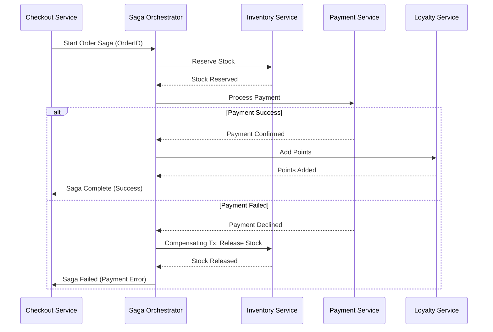

En el ecosistema de Enterprise Commerce de 2026, la adopción de arquitecturas MACH (Microservices, API-first, Cloud-native, Headless) ya no es una ventaja competitiva, sino el estándar mínimo de operación. Sin embargo, a medida que las organizaciones escalan de decenas a cientos de microservicios interconectados, surge una realidad incómoda: la complejidad operativa crece de forma exponencial, no lineal. 

El "Monolito Distribuido" es el fracaso más común en implementaciones MACH mal ejecutadas. En estos escenarios, la caída de un servicio de impuestos de terceros o una latencia inusual en el motor de promociones puede desencadenar fallos en cascada que paralizan el checkout global. Peor aún, la falta de una estrategia de consistencia de datos robusta puede dejar pedidos en estados inconsistentes (pagados pero no reservados, o viceversa), erosionando la confianza del cliente y aumentando los costos operativos de reconciliación manual.

Este artículo profundiza en los patrones avanzados que las organizaciones de alto rendimiento están utilizando para garantizar una resiliencia del 99.99% y una consistencia de datos impecable en entornos altamente distribuidos.

## El Problema: El Abismo de la Consistencia y el Radio de Explosión

En un sistema monolítico tradicional, la consistencia se delega a la base de datos mediante transacciones ACID. En MACH, cada servicio posee su propia base de datos (Database-per-Service). Si un proceso de "Place Order" requiere tocar el servicio de Inventario, Pagos, Lealtad y Notificaciones, no existe un `BEGIN TRANSACTION` global que cubra a todos.

Además, el "Blast Radius" (radio de explosión) en arquitecturas mal aisladas es masivo. Si el servicio de inventario es lento, los hilos de ejecución en el servicio de pedidos se agotan esperando respuestas, lo que eventualmente tumba el API Gateway y deja fuera de servicio incluso a los componentes que no dependen del inventario.

## Patrón 1: Arquitectura Basada en Celdas (Cell-Based Architecture)

Para mitigar el radio de explosión, las empresas líderes están abandonando el despliegue de microservicios como una malla uniforme y adoptando la **Arquitectura Basada en Celdas**. 

Una "Celda" es una unidad de despliegue completa, autónoma y aislada que contiene todos los microservicios necesarios para procesar una fracción del tráfico (por ejemplo, basada en el ID del cliente o la región geográfica).

### Ventajas de las Celdas:
1. **Aislamiento Total de Fallos:** Si la Celda A falla, las Celdas B y C siguen operando.
2. **Escalabilidad Predecible:** Se escalan unidades completas de computación.
3. **Actualizaciones Seguras:** Se pueden realizar despliegues Canary en una sola celda antes de propagarlos.

## Patrón 2: Saga Pattern con Orquestación y State Machines

Cuando la consistencia atómica no es posible, recurrimos a las **Sagas**. Una Saga es una secuencia de transacciones locales. Cada transacción local actualiza la base de datos y publica un mensaje o evento para disparar la siguiente transacción.

En 2026, la **Orquestación de Sagas** mediante máquinas de estado centralizadas (como AWS Step Functions o motores de workflow en Go/Temporal) ha superado a la coreografía simple debido a la facilidad de observabilidad y manejo de errores complejos.

### Flujo de una Saga de Checkout



## Implementación Técnica: Transactional Outbox e Idempotencia

Uno de los mayores riesgos en sistemas distribuidos es que un servicio actualice su base de datos pero falle al enviar el evento de notificación al bus de mensajes (Kafka/RabbitMQ). Para resolver esto, utilizamos el **Transactional Outbox Pattern**.

### Ejemplo de Implementación (TypeScript + Prisma)

Este código asegura que la actualización del pedido y la inserción del evento en la tabla `Outbox` ocurran en la misma transacción atómica local.

```typescript
import { PrismaClient } from '@prisma/client';
import { v4 as uuidv4 } from 'uuid';

const prisma = new PrismaClient();

async function createOrder(orderData: any) {
  return await prisma.$transaction(async (tx) => {
    // 1. Crear el pedido
    const order = await tx.order.create({
      data: {
        id: uuidv4(),
        userId: orderData.userId,
        total: orderData.total,
        status: 'PENDING',
      },
    });

    // 2. Insertar en la tabla Outbox
    // Este evento será leído por un Relay process y enviado a Kafka
    await tx.outbox.create({
      data: {
        id: uuidv4(),
        aggregateType: 'Order',
        aggregateId: order.id,
        eventType: 'OrderCreated',
        payload: JSON.stringify(order),
        processed: false,
      },
    });

    return order;
  });
}

/**
 * Lógica de Consumo Idempotente
 * Previene el procesamiento duplicado de eventos
 */
async function handleOrderCreatedEvent(event: any) {
  const { aggregateId, eventId } = event;

  // Verificamos si ya procesamos este eventId específico
  const alreadyProcessed = await prisma.processedEvents.findUnique({
    where: { id: eventId }
  });

  if (alreadyProcessed) {
    console.log(`Event ${eventId} already handled. Skipping.`);
    return;
  }

  // Procesar lógica de negocio...
  
  // Registrar como procesado
  await prisma.processedEvents.create({
    data: { id: eventId, processedAt: new Date() }
  });
}
```

## Comparativa de Estrategias de Consistencia

| Estrategia | Consistencia | Disponibilidad | Complejidad | Caso de Uso Ideal |
| :--- | :--- | :--- | :--- | :--- |
| **Two-Phase Commit (2PC)** | Muy Alta (Strong) | Baja | Alta | Sistemas financieros legacy (Evitar en MACH). |
| **Saga (Orquestada)** | Eventual | Alta | Media-Alta | Procesos de Checkout, Devoluciones, Onboarding. |
| **Eventual Consistency** | Baja (Temporal) | Muy Alta | Baja | Actualización de perfiles, conteo de vistas, analítica. |
| **Causal Consistency** | Media | Media | Alta | Sistemas de comentarios, chats, feeds sociales. |

## Modos de Fallo Críticos y Mitigación

### 1. El Fenómeno del "Thundering Herd" (Manada Atronadora)
Ocurre cuando un servicio se recupera tras una caída y es bombardeado inmediatamente por todas las peticiones acumuladas en las colas o reintentos de clientes.
*   **Mitigación:** Implementar **Exponential Backoff con Jitter** (variación aleatoria) en los clientes y **Load Shedding** (descarte de carga) en el servidor para proteger los recursos críticos.

### 2. Clock Drift (Deriva de Reloj)
En sistemas distribuidos, los relojes de los servidores nunca están perfectamente sincronizados. Confiar en timestamps para el orden de los eventos puede llevar a estados inconsistentes.
*   **Mitigación:** Utilizar **Logical Clocks** (como Lamport Clocks o Vector Clocks) o identificadores ordenables como **ULIDs** en lugar de UUIDs v4 para mantener el orden causal.

### 3. Split-Brain en Clusters de Datos
Ocurre cuando un fallo de red divide un cluster en dos, y ambas partes creen que son el nodo primario.
*   **Mitigación:** Utilizar protocolos de consenso como **Raft** o **Paxos** (implementados nativamente en herramientas como Etcd o YugabyteDB) que requieren un quórum (n/2 + 1) para confirmar escrituras.

## Estrategia de Resiliencia: Chaos Engineering en Producción

La resiliencia no es una propiedad estática; es un músculo que debe ejercitarse. Las arquitecturas MACH modernas deben integrar experimentos de caos de forma continua.

1. **Inyección de Latencia:** Introducir 500ms de retraso artificial en el servicio de búsqueda para validar que el frontend maneja correctamente los timeouts sin bloquear la UI.
2. **Terminación de Instancias:** Apagar nodos aleatorios en horas pico para asegurar que el auto-scaling y el service discovery funcionan en < 30 segundos.
3. **Blackhole Testing:** Simular la caída total de un proveedor SaaS (ej. un CMS Headless) para verificar que el sitio web puede servir contenido desde una capa de caché persistente (Stale-while-revalidate).

## Checklist de Implementación para Directores de Ingeniería

Para asegurar que su arquitectura MACH sea verdaderamente resiliente y consistente, verifique los siguientes puntos:

- [ ] **Idempotencia en APIs:** ¿Todas las operaciones de escritura (POST/PUT) aceptan un `Idempotency-Key`?
- [ ] **Timeouts y Retries:** ¿Están configurados timeouts agresivos en todas las llamadas entre servicios? ¿Los reintentos usan backoff exponencial?
- [ ] **Observabilidad de Sagas:** ¿Tiene un dashboard que muestre cuántas Sagas están "In-Flight", cuántas fallaron y cuántas requirieron transacciones de compensación?
- [ ] **Aislamiento de Base de Datos:** ¿Cada microservicio tiene su propio esquema/instancia, prohibiendo los "Shared Joins"?
- [ ] **Graceful Degradation:** Si el servicio de recomendaciones falla, ¿el sistema muestra productos genéricos en lugar de un error 500?
- [ ] **Contratos de API:** ¿Se utiliza Consumer-Driven Contract Testing (Pact) para evitar cambios disruptivos en la comunicación entre servicios?

## Conclusión

La transición hacia arquitecturas MACH promete agilidad y escalabilidad, pero impone una carga cognitiva significativa en el manejo de la falla. La resiliencia en 2026 no se trata de evitar que los sistemas fallen —porque fallarán— sino de diseñar sistemas que puedan fallar con elegancia, contener el daño y recuperarse sin intervención humana.

Al implementar patrones como **Sagas Orquestadas**, **Transactional Outbox** y **Arquitecturas Basadas en Celdas**, las empresas enterprise pueden construir plataformas que no solo sobrevivan a los picos de tráfico masivos, sino que mantengan la integridad de los datos, que es, en última instancia, el activo más valioso de cualquier negocio.