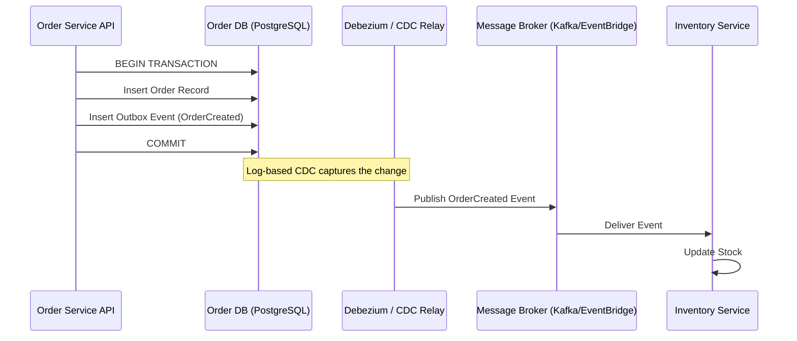

En el ecosistema de **Composable Commerce** y arquitecturas **MACH** (Microservices, API-first, Cloud-native, Headless), la promesa de agilidad y escalabilidad infinita a menudo choca con una realidad brutal: la fragilidad de los sistemas distribuidos. A medida que las organizaciones enterprise descomponen sus monolitos en decenas de servicios especializados (Best-of-Breed), el problema del estado distribuido y la gestión de fallos parciales se convierte en el principal inhibidor del éxito operativo.

Para 2026, ya no basta con implementar un *Circuit Breaker* básico o reintentos con *Exponential Backoff*. Las fallas en cascada, las inconsistencias de datos entre servicios de terceros (SaaS) y la degradación silenciosa del rendimiento exigen un enfoque de ingeniería de resiliencia mucho más sofisticado. Este artículo profundiza en los patrones avanzados que definen la robustez en la era del comercio composable.

## El Dilema de la Consistencia en el Mundo Composable

En una arquitectura MACH, una única transacción de negocio (por ejemplo, "Crear Pedido") puede involucrar un CMS Headless (Contentful), un motor de promociones (Talentlms), una pasarela de pagos (Stripe), un sistema de inventario (Fluent Commerce) y un ERP legacy. 

El problema fundamental es el **Dual Write**: la imposibilidad de actualizar una base de datos local y enviar un evento a un bus de mensajes (o llamar a una API externa) de forma atómica sin protocolos de bloqueo costosos como 2PC (Two-Phase Commit), los cuales son inviables en la nube por su latencia y falta de escalabilidad.

### Patrón 1: Transactional Outbox con Change Data Capture (CDC)

Para garantizar la consistencia eventual sin sacrificar la disponibilidad, el patrón **Transactional Outbox** es imperativo. En lugar de intentar llamar a un servicio externo dentro de la transacción de la base de datos, el servicio escribe el evento en una tabla de "Outbox" dentro de su propia base de datos.



Este enfoque garantiza que el evento se enviará **al menos una vez** (at-least-once delivery) solo si la transacción local fue exitosa.

## Orquestación vs. Coreografía: Sagas en Producción

Cuando una operación de negocio abarca múltiples microservicios, el patrón **Saga** es la solución estándar para gestionar transacciones distribuidas mediante acciones compensatorias.

### Saga por Orquestación (Control Centralizado)
Ideal para procesos de negocio complejos donde se requiere visibilidad clara del estado global. Un "Orquestador" (State Machine) dirige a los participantes.

### Saga por Coreografía (Event-Driven)
Ideal para sistemas altamente desacoplados donde cada servicio sabe qué evento disparar tras completar su tarea. Sin embargo, puede volverse difícil de monitorear (el "espagueti de eventos").

#### Comparativa de Trade-offs: Estrategias de Consistencia

| Característica | Saga Orquestada | Saga Coreografiada | Two-Phase Commit (2PC) |
| :--- | :--- | :--- | :--- |
| **Complejidad** | Media (Requiere motor de estados) | Alta (Lógica distribuida) | Baja (Nativa en DBs) |
| **Acoplamiento** | Bajo/Medio | Muy Bajo | Muy Alto |
| **Escalabilidad** | Alta | Muy Alta | Muy Baja |
| **Consistencia** | Eventual | Eventual | Fuerte (ACID) |
| **Cuándo usar** | Flujos de checkout complejos | Notificaciones, Analytics | Sistemas financieros legacy |
| **Cuándo evitar** | Microservicios simples | Flujos con > 5 pasos críticos | Cualquier entorno Cloud-Native |

## Implementación de Idempotencia Avanzada

En sistemas distribuidos, los reintentos son inevitables. Sin **idempotencia**, un reintento de un pago o una deducción de inventario resultaría en duplicidad de cargos o errores de stock.

A continuación, un ejemplo de un middleware de idempotencia robusto en TypeScript para un entorno Node.js/AWS, utilizando Redis como store de claves de idempotencia.

```typescript
import { Request, Response, NextFunction } from 'express';
import Redis from 'ioredis';
import crypto from 'crypto';

const redis = new Redis(process.env.REDIS_URL);

/**
 * Middleware de Idempotencia para APIs MACH
 * Garantiza que peticiones duplicadas reciban la misma respuesta sin re-procesar.
 */
export const idempotencyMiddleware = async (req: Request, res: Response, next: NextFunction) => {
  const idempotencyKey = req.headers['x-idempotency-key'] as string;

  if (!idempotencyKey) {
    return res.status(400).json({ error: 'Missing X-Idempotency-Key header' });
  }

  const cacheKey = `idempotency:${idempotencyKey}`;
  
  // 1. Verificar si la llave ya existe
  const cachedResponse = await redis.get(cacheKey);
  if (cachedResponse) {
    const { statusCode, body } = JSON.parse(cachedResponse);
    return res.status(statusCode).send(body);
  }

  // 2. Bloqueo optimista para evitar Race Conditions (Thundering Herd)
  const lockAcquired = await redis.set(
    `lock:${cacheKey}`, 
    'processing', 
    'NX', 
    'EX', 
    30 // TTL de 30 segundos para el procesamiento
  );

  if (!lockAcquired) {
    return res.status(409).json({ error: 'Request is being processed' });
  }

  // 3. Capturar la respuesta original para cachearla
  const originalSend = res.send;
  res.send = function (body): Response {
    const responseData = {
      statusCode: res.statusCode,
      body: body
    };
    
    // Almacenar el resultado por 24 horas
    redis.set(cacheKey, JSON.stringify(responseData), 'EX', 86400);
    redis.del(`lock:${cacheKey}`);
    
    return originalSend.call(this, body);
  };

  next();
};
```

## Resiliencia de Próxima Generación: Cell-Based Architecture

Para 2026, las empresas líderes han pasado de arquitecturas de microservicios planas a **Cell-Based Architectures (CBA)**. En este modelo, el sistema se divide en "Células" (unidades de despliegue completas e independientes que contienen todos los microservicios necesarios para procesar un subconjunto de usuarios).

### Beneficios de CBA:
1.  **Aislamiento del Radio de Explosión (Blast Radius):** Si una célula falla debido a un despliegue defectuoso o una sobrecarga, solo afecta al 5% o 10% de los usuarios.
2.  **Escalabilidad Predecible:** Se escalan células completas en lugar de servicios individuales que pueden tener dependencias ocultas.
3.  **Migraciones de Datos Seguras:** Permite mover usuarios entre células para realizar mantenimientos sin downtime.

## Control de Concurrencia Adaptativo (Adaptive Concurrency Control)

Los límites de tasa (Rate Limiting) estáticos son ineficientes. Si configuramos un límite de 1000 RPS basado en pruebas de carga, pero la base de datos se ralentiza, esos 1000 RPS saturarán las colas de conexión y derribarán el servicio.

El **Control de Concurrencia Adaptativo** utiliza algoritmos inspirados en el control de congestión de TCP (como Vegas o BBR) para ajustar dinámicamente el número de peticiones permitidas basándose en la latencia actual.

### Algoritmo de Límite de Gradiente (Concepto):
Si la latencia actual ($L_{curr}$) es mayor que la latencia ideal ($L_{ideal}$), reducimos el límite de concurrencia.
$$Limit_{next} = Limit_{curr} \times (\frac{L_{ideal}}{L_{curr}}) + QueueSize$$

Esto protege al servicio de la "espiral de la muerte" donde el aumento de latencia causa más reintentos, lo que a su vez aumenta más la latencia.

## Modos de Fallo Comunes y Mitigación

| Modo de Fallo | Descripción | Estrategia de Mitigación |
| :--- | :--- | :--- |
| **Cascading Failure** | Un servicio lento agota los pools de hilos de los llamadores. | Circuit Breaker + Adaptive Concurrency Control. |
| **Poison Pill Message** | Un mensaje malformado hace que el consumidor crashee repetidamente. | Dead Letter Queues (DLQ) con alertas de umbral. |
| **Split Brain** | Dos instancias de un servicio creen que son el "líder" o tienen datos divergentes. | Algoritmos de consenso (Raft/Paxos) o Storage con Strong Consistency. |
| **Zombie Writes** | Una escritura retrasada sobrescribe datos más recientes. | Versionado optimista (ETags) y timestamps vectoriales. |

## Conclusión: Checklist de Implementación para 2026

Para los Chief Architects y Directores de Ingeniería que operan plataformas MACH de escala global, la resiliencia no es un "feature", es una propiedad emergente del diseño correcto. 

### Checklist de Ingeniería:
- [ ] **Idempotencia:** ¿Todas nuestras APIs mutables (POST/PATCH/DELETE) soportan llaves de idempotencia en el borde?
- [ ] **Observabilidad de Sagas:** ¿Podemos rastrear visualmente el estado de una transacción distribuida que falló hace 3 horas? (Uso de herramientas como Temporal.io o AWS Step Functions).
- [ ] **Aislamiento:** ¿Hemos definido células de aislamiento para evitar que un pico de tráfico en la región A afecte a la región B?
- [ ] **Pruebas de Caos:** ¿Ejecutamos experimentos de inyección de latencia en producción para validar que nuestros Circuit Breakers realmente abren?
- [ ] **Estrategia de Datos:** ¿Utilizamos el patrón Outbox para evitar la pérdida de eventos críticos de negocio?

La arquitectura MACH ofrece una libertad sin precedentes, pero esa libertad conlleva la responsabilidad de gestionar la complejidad distribuida. Implementar estos patrones avanzados no solo protege la experiencia del cliente, sino que garantiza la viabilidad financiera de la plataforma ante la incertidumbre operativa.