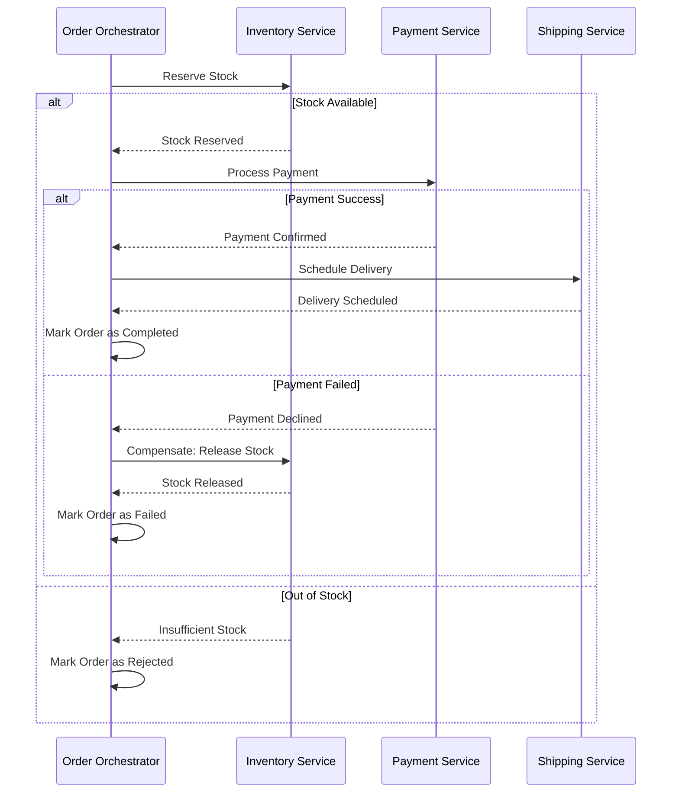

En el ecosistema del **Composable Commerce** y las arquitecturas **MACH** (Microservices, API-first, Cloud-native, Headless), la promesa de agilidad y escalabilidad viene acompañada de un "impuesto" tecnológico inevitable: la complejidad de los sistemas distribuidos. A medida que las organizaciones abandonan las suites monolíticas en favor de soluciones *best-of-breed* (como commercetools para el motor de comercio, Contentful para CMS y Algolia para búsqueda), se enfrentan al desafío crítico de mantener la integridad de los datos y la disponibilidad del sistema frente a fallos parciales.

El problema real en producción no es si un servicio fallará, sino qué tan elegante será esa falla y cómo garantizamos que el estado del sistema no quede en un limbo inconsistente. En este artículo, exploraremos patrones avanzados que van más allá del simple *Circuit Breaker*, enfocándonos en la consistencia transaccional distribuida y la resiliencia de alta disponibilidad para el año 2026.

## El Dilema de la Doble Escritura (Dual Write Problem)

Uno de los errores más comunes en arquitecturas de microservicios es intentar actualizar una base de datos local y, simultáneamente, enviar un evento a un broker (como Kafka o RabbitMQ) dentro del mismo bloque de código. 

Si la base de datos confirma la transacción pero el broker falla (o la red se interrumpe), el resto del sistema nunca se enterará del cambio. Si invertimos el orden, corremos el riesgo de notificar un evento que nunca se persistió. Para resolver esto en entornos enterprise, implementamos el **Transactional Outbox Pattern**.

### Implementación del Patrón Outbox con Change Data Capture (CDC)

En lugar de realizar dos operaciones asincrónicas, escribimos el evento en una tabla de "Outbox" dentro de la misma transacción atómica de la base de datos de negocio.

```typescript
/**
 * Ejemplo de implementación de Outbox Pattern usando Prisma y PostgreSQL
 * Este patrón garantiza que el evento se persista SI Y SOLO SI la orden se crea.
 */

import { PrismaClient } from '@prisma/client';
import { v4 as uuidv4 } from 'uuid';

const prisma = new PrismaClient();

async function createOrder(orderData: any) {
  return await prisma.$transaction(async (tx) => {
    // 1. Crear la orden en la tabla de negocio
    const order = await tx.order.create({
      data: {
        id: uuidv4(),
        customerId: orderData.customerId,
        total: orderData.total,
        status: 'PENDING',
      },
    });

    // 2. Insertar el evento en la tabla Outbox (Atómico)
    await tx.outbox.create({
      data: {
        id: uuidv4(),
        aggregateType: 'ORDER',
        aggregateId: order.id,
        eventType: 'ORDER_CREATED',
        payload: JSON.stringify(order),
        processed: false,
      },
    });

    return order;
  });
}

// Un proceso separado (Relay) lee la tabla Outbox y publica en el Message Broker
```

Este enfoque elimina la inconsistencia. Un servicio de "Relay" o una herramienta de CDC como **Debezium** lee los logs de la base de datos y garantiza la entrega *at-least-once* al bus de eventos.

---

## Orquestación vs. Coreografía: El Patrón Saga en Acción

Cuando una operación de negocio abarca múltiples microservicios (ej. Checkout -> Inventario -> Pago -> Envío), no podemos usar transacciones distribuidas tradicionales (2PC) debido a su baja escalabilidad y bloqueo de recursos. El **Saga Pattern** gestiona esto mediante una secuencia de transacciones locales y transacciones de compensación.

### Diagrama de Secuencia: Saga de Pedido (Enfoque de Orquestación)



### ¿Cuándo usar cada enfoque?

| Característica | Coreografía (Event-Driven) | Orquestación (Centralizada) |
| :--- | :--- | :--- |
| **Complejidad** | Alta (difícil de rastrear el flujo) | Media (flujo definido en un lugar) |
| **Acoplamiento** | Muy bajo | Bajo (el orquestador conoce a los participantes) |
| **Escalabilidad** | Extrema | Alta |
| **Ideal para...** | Procesos simples con pocos servicios | Procesos de negocio complejos y críticos |

---

## Resiliencia Adaptativa: Más allá de los Timeouts Estáticos

En 2026, los sistemas MACH ya no dependen de timeouts fijos. Implementamos **Adaptive Concurrency Limits**. En lugar de permitir que un servicio se sature y degrade todo el ecosistema, el servicio ajusta dinámicamente cuántas solicitudes simultáneas puede manejar basándose en la latencia observada y el uso de CPU, utilizando algoritmos como *TCP Vegas* o *Gradient Descent*.

### Ejemplo de Configuración de Resiliencia en Go (usando librerías de control de flujo)

```go
// Ejemplo conceptual de limitación de concurrencia adaptativa
import (
    "github.com/slok/go-http-metrics/metrics/prometheus"
    "github.com/slok/go-http-metrics/middleware"
)

// Configuración de un limitador que observa la latencia del percentil 95 (P95)
// Si la latencia sube, reduce el número de workers permitidos automáticamente.
func adaptiveMiddleware(next http.Handler) http.Handler {
    limiter := NewAdaptiveLimiter(
        MaxConcurrency(500),
        TargetLatency(200 * time.Millisecond),
    )
    
    return http.HandlerFunc(func(w http.ResponseWriter, r *http.Request) {
        if !limiter.Allow() {
            http.Error(w, "Service Overloaded - Backpressure Applied", http.StatusTooManyRequests)
            return
        }
        defer limiter.Release()
        next.ServeHTTP(w, r)
    })
}
```

---

## Estrategias de Consistencia en el Borde (Edge Consistency)

Con el auge de las **Edge Functions** (Vercel, Cloudflare Workers), la consistencia se vuelve aún más difícil. Si un usuario actualiza su perfil en un nodo de borde en Madrid, un usuario en Tokyo podría leer datos obsoletos debido a la replicación asincrónica.

### Patrón: Read-Your-Writes en el Edge
Para mitigar esto, utilizamos **Version Vectors** o **Session Tokens** que viajan en una cookie. El Edge Worker verifica si la versión local de los datos es al menos tan reciente como la versión indicada en el token de sesión del usuario. Si no lo es, fuerza una lectura al origen o espera a que la réplica se sincronice.

---

## Modos de Fallo Comunes y Mitigación

A pesar de implementar patrones avanzados, la realidad operativa presenta escenarios complejos:

1.  **Poison Pill Messages:** Un mensaje en la cola que causa que el consumidor falle repetidamente.
    *   *Mitigación:* Implementar **Dead Letter Queues (DLQ)** con políticas de reintento exponenciales y alertas de umbral.
2.  **Cascading Failures por Reintentos Agresivos:** Si un servicio cae, miles de clientes reintentando cada 100ms pueden evitar que el servicio se recupere (Tormenta de Reintentos).
    *   *Mitigación:* Usar **Exponential Backoff con Jitter** (variación aleatoria) para distribuir la carga de reintentos.
3.  **Inconsistencia por Idempotencia Fallida:** Reintentar una operación que no es idempotente (ej. cobrar dos veces una tarjeta).
    *   *Mitigación:* Obligar el uso de `Idempotency-Key` en todas las APIs mutables (POST/PATCH).

### Tabla de Trade-offs Arquitectónicos

| Patrón | Ventaja Principal | Desventaja / Costo | Cuándo Evitarlo |
| :--- | :--- | :--- | :--- |
| **Outbox Pattern** | Consistencia garantizada DB-Mensajería. | Latencia adicional de procesamiento. | Sistemas con baja carga donde la pérdida ocasional de eventos es aceptable. |
| **Saga (Orchestration)** | Visibilidad clara del estado del proceso. | El orquestador es un punto único de fallo (requiere alta disponibilidad). | Flujos de trabajo extremadamente simples (2 servicios). |
| **Cell-based Arch** | Aislamiento total de fallos (Blast Radius). | Alta complejidad operativa y de ruteo. | Startups o aplicaciones de escala pequeña/media. |
| **Event Sourcing** | Auditoría completa y reconstrucción de estado. | Curva de aprendizaje empinada; difícil de consultar. | Cuando solo se necesita el estado actual y no el historial. |

---

## Arquitectura de Celdas (Cell-based Architecture) para Resiliencia Extrema

Para empresas de nivel Fortune 500, incluso una región de AWS caída es un riesgo inaceptable. La **Arquitectura de Celdas** divide la infraestructura en unidades autónomas (celdas) que contienen una instancia completa de todos los microservicios necesarios para procesar una fracción del tráfico (ej. por región geográfica o por ID de cliente).

Si la "Celda A" falla, solo el 5% de los usuarios se ven afectados, y el tráfico puede ser desviado a la "Celda B" que es idéntica pero está aislada a nivel de red y base de datos.

---

## Conclusión y Checklist de Implementación

La resiliencia en arquitecturas MACH no es un producto que se compra, sino una disciplina que se diseña. La consistencia eventual es el precio de la disponibilidad global, pero con los patrones adecuados, este precio es manejable.

### Checklist para el Principal Architect:

- [ ] **Idempotencia:** ¿Todas nuestras APIs de escritura aceptan y validan una `Idempotency-Key`?
- [ ] **Observabilidad de Sagas:** ¿Podemos visualizar en tiempo real en qué paso se encuentra una transacción distribuida?
- [ ] **Estrategia de Compensación:** Para cada acción "Do", ¿existe una acción "Undo" automatizada y probada?
- [ ] **Aislamiento de Fallos:** ¿Un fallo en el microservicio de recomendaciones puede impedir que un usuario complete un checkout? (Uso de Bulkheads).
- [ ] **Chaos Engineering:** ¿Hemos ejecutado experimentos de inyección de fallos en producción para validar nuestras políticas de reintento y timeouts?
- [ ] **Outbox Pattern:** ¿Estamos evitando las "dobles escrituras" manuales en favor de mecanismos de persistencia atómica?

Implementar estos patrones requiere una inversión inicial significativa en ingeniería, pero es la única forma de construir sistemas que no solo sobrevivan al fallo, sino que prosperen en la incertidumbre de la nube moderna. En la era MACH, la robustez es la característica más importante de cualquier producto digital.