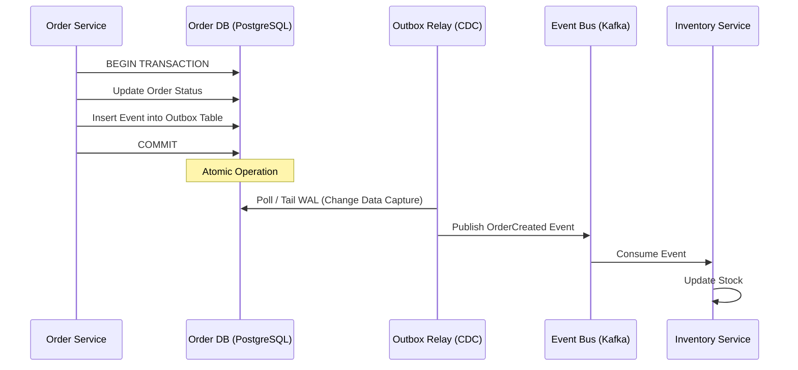

En el panorama tecnológico de 2026, la adopción de arquitecturas MACH (Microservices, API-first, Cloud-native, Headless) ha dejado de ser una ventaja competitiva para convertirse en el estándar de facto en el Enterprise. Sin embargo, esta flexibilidad tiene un costo oculto: la complejidad cognitiva y operativa de gestionar la consistencia de datos y la resiliencia en sistemas masivamente distribuidos.

El problema real que enfrentan las organizaciones hoy no es cómo "conectar" servicios, sino cómo garantizar que una transacción de compra que involucra un CMS headless, un motor de promociones externo, un ERP legacy y un procesador de pagos, termine en un estado consistente cuando la red falla o un servicio experimenta una latencia de 500ms. Las estrategias tradicionales de "reintento simple" o "circuit breakers" básicos ya no son suficientes para los niveles de SLA que exige el comercio moderno.

Este artículo profundiza en los patrones avanzados que separan a las implementaciones MACH robustas de los castillos de naipes distribuidos.

## El Dilema de la Consistencia en el Mundo Composable

En una arquitectura monolítica, la base de datos relacional era nuestra red de seguridad. Las transacciones ACID garantizaban que, o todo se guardaba, o nada lo hacía. En el Composable Commerce, hemos fragmentado esa base de datos en múltiples servicios, cada uno con su propio ciclo de vida y persistencia (Database-per-Service).

Aquí es donde el **Teorema PACELC** (una extensión del CAP) cobra relevancia: en presencia de particiones (P), debemos elegir entre disponibilidad (A) y consistencia (C); pero incluso cuando el sistema funciona normalmente (E - else), debemos elegir entre latencia (L) y consistencia (C). En 2026, la latencia es el nuevo "downtime", lo que nos obliga a diseñar sistemas que favorezcan la **Consistencia Eventual** sin sacrificar la integridad del negocio.

## Patrón 1: Transactional Outbox y la Eliminación de Escrituras Duales

Uno de los fallos más comunes en microservicios es la "escritura dual": intentar actualizar la base de datos local y enviar un evento a un broker (como Kafka o RabbitMQ) en el mismo bloque de código. Si la base de datos confirma pero el broker falla, el resto del ecosistema nunca se enterará del cambio.

El patrón **Transactional Outbox** resuelve esto insertando el evento en una tabla de "mensajes salientes" dentro de la misma transacción de la base de datos local.

### Flujo de Implementación con Outbox y Relay



### Ejemplo de Código: Implementación de Outbox en Node.js (TypeScript)

Este ejemplo utiliza una transacción de TypeORM para asegurar la atomicidad entre la entidad de negocio y el evento de outbox.

```typescript
import { EntityManager, Entity } from 'typeorm';

// Definición de la entidad Outbox
@Entity()
export class OutboxEvent {
  id: string;
  aggregateId: string;
  type: string;
  payload: any;
  createdAt: Date;
  processed: boolean = false;
}

export class OrderService {
  async createOrder(orderData: any, manager: EntityManager) {
    return await manager.transaction(async (transactionalEntityManager) => {
      // 1. Persistir la Orden
      const order = await transactionalEntityManager.save(Order, orderData);

      // 2. Crear el evento de Outbox en la misma transacción
      const event = new OutboxEvent();
      event.aggregateId = order.id;
      event.type = 'ORDER_CREATED';
      event.payload = { orderId: order.id, total: order.total };
      event.createdAt = new Date();

      await transactionalEntityManager.save(OutboxEvent, event);

      // Al hacer commit, ambos registros están garantizados
      return order;
    });
  }
}
```

## Patrón 2: Sagas de Orquestación para Procesos de Larga Duración

Cuando una operación de negocio abarca múltiples microservicios (ej. Reserva de viaje: Vuelo + Hotel + Pago), no podemos usar transacciones distribuidas (2PC) por su baja escalabilidad. El patrón **Saga** gestiona esto como una secuencia de transacciones locales.

En 2026, la **Orquestación** (usando un motor de estados como Temporal o AWS Step Functions) ha ganado terreno sobre la Coreografía debido a la facilidad de observabilidad y manejo de errores complejos.

### Tabla Comparativa: Orquestación vs. Coreografía

| Característica | Orquestación (Centralizada) | Coreografía (Event-Driven) |
| :--- | :--- | :--- |
| **Complejidad** | Baja (Estado centralizado) | Alta (Lógica distribuida) |
| **Acoplamiento** | Sincrónico/Asincrónico controlado | Altamente desacoplado |
| **Visibilidad** | Excelente (Dashboard de estados) | Difícil (Requiere tracing distribuido) |
| **Punto de fallo** | El Orquestador (requiere HA) | No hay punto único de fallo |
| **Ideal para...** | Procesos de negocio complejos | Procesos simples y rápidos |

## Patrón 3: Idempotencia Distribuida con "Idempotency Keys"

En un sistema resiliente, los reintentos son inevitables. Si el servicio de pagos recibe la misma petición dos veces debido a un timeout de red, no queremos cobrar dos veces al cliente.

La implementación de **Idempotency Keys** en el API Gateway o a nivel de servicio es crítica. El cliente envía un `X-Idempotency-Key` único. El servidor guarda el resultado de la primera ejecución exitosa asociado a esa llave.

### Lógica de Mitigación de Colisiones

```python
def process_payment(payment_request):
    key = payment_request.idempotency_key
    
    # 1. Verificar si la llave ya existe en Redis (Cache de Idempotencia)
    cached_response = redis.get(f"idempotency:{key}")
    if cached_response:
        return deserialize(cached_response)

    # 2. Bloqueo optimista para evitar condiciones de carrera
    if not redis.setnx(f"lock:{key}", "processing", expire=30):
        raise ConflictException("Request in progress")

    try:
        # 3. Ejecutar lógica de negocio
        result = gateway.charge(payment_request.amount)
        
        # 4. Persistir resultado y liberar bloqueo
        redis.set(f"idempotency:{key}", serialize(result), expire=86400) # 24h
        return result
    finally:
        redis.delete(f"lock:{key}")
```

## Patrón 4: Adaptive Concurrency Control (Control de Concurrencia Adaptativo)

Los límites de tasa (Rate Limiting) estáticos son ineficientes. Si configuramos un límite de 100 RPS pero el servicio de base de datos está degradado, esos 100 RPS pueden causar una falla en cascada.

El **Control de Concurrencia Adaptativo** utiliza algoritmos inspirados en el control de congestión de TCP (como TCP Vegas) para ajustar dinámicamente el número de peticiones permitidas basándose en la latencia actual y el throughput. Si la latencia sube, el sistema reduce automáticamente el límite de concurrencia (backpressure), protegiendo la salud del servicio.

## Modos de Fallo Comunes y Estrategias de Mitigación

Incluso con los mejores patrones, los sistemas fallan. Aquí detallamos cómo responder ante escenarios críticos:

1.  **Poison Pill Messages (Mensajes Venenosos):** Un evento mal formado que hace que el consumidor falle repetidamente.
    *   *Mitigación:* Implementar **Dead Letter Queues (DLQ)** con alertas automáticas y un proceso de inspección manual/automatizado.
2.  **Split-Brain en Cachés Distribuidos:** Dos nodos de caché creen que son el primario tras una partición de red.
    *   *Mitigación:* Usar protocolos de consenso (Raft/Paxos) para la elección de líderes y configurar políticas de desalojo estrictas.
3.  **Cascading Failures (Fallos en Cascada):** Un servicio lento agota el pool de hilos de sus llamadores.
    *   *Mitigación:* **Bulkheads** (aislamiento de recursos) combinados con **Circuit Breakers** que tengan tiempos de timeout agresivos y dinámicos.

## Implementación en la Vida Real: El Caso de una Venta Flash

Imagina una venta flash de 10,000 unidades de un producto con 1 millón de usuarios concurrentes.

1.  **Ingress:** El API Gateway aplica *Adaptive Concurrency* para no saturar los servicios internos.
2.  **Inventory:** Se usa un patrón de *Reservation* (Saga) donde el stock se reserva temporalmente.
3.  **Consistency:** El servicio de inventario usa *Transactional Outbox* para notificar al servicio de analíticas y marketing.
4.  **Resilience:** Si el procesador de pagos falla, la Saga ejecuta una *Compensating Transaction* para liberar el stock reservado automáticamente tras 15 minutos.

## Checklist de Implementación para Equipos de Ingeniería

Para asegurar que su arquitectura MACH es verdaderamente resiliente en 2026, verifique los siguientes puntos:

- [ ] **¿Evitamos las escrituras duales?** Todos los servicios que emiten eventos deben usar Transactional Outbox o Change Data Capture (CDC).
- [ ] **¿Son nuestras APIs idempotentes?** Todas las operaciones de mutación (POST/PUT/PATCH) deben aceptar y validar llaves de idempotencia.
- [ ] **¿Tenemos transacciones compensatorias?** Por cada paso en un proceso distribuido, existe un flujo definido para revertir los cambios en caso de fallo.
- [ ] **¿Implementamos Backpressure?** Los servicios son capaces de rechazar peticiones (HTTP 429 o 503) antes de colapsar por falta de recursos.
- [ ] **¿Observabilidad Semántica?** No solo medimos CPU/RAM, sino el estado de las Sagas y la latencia entre el Outbox y el Event Bus.
- [ ] **¿Chaos Engineering?** Se realizan pruebas de inyección de fallos (latencia, caída de nodos, particiones de red) en entornos de staging de forma regular.

## Conclusión

La resiliencia en arquitecturas MACH no es un "feature" que se añade al final; es una propiedad emergente del diseño sistémico. Al movernos de la consistencia fuerte a la consistencia eventual y de los sistemas rígidos a los sistemas adaptativos, permitimos que nuestras plataformas escalen globalmente sin miedo a la degradación parcial.

Como arquitectos, nuestra misión en esta era composable es aceptar el fallo como una constante y diseñar la recuperación como una variable automatizada. Los patrones aquí expuestos —Sagas, Outbox, Idempotencia y Control Adaptativo— son los cimientos sobre los cuales se construyen las experiencias digitales más confiables del mundo.