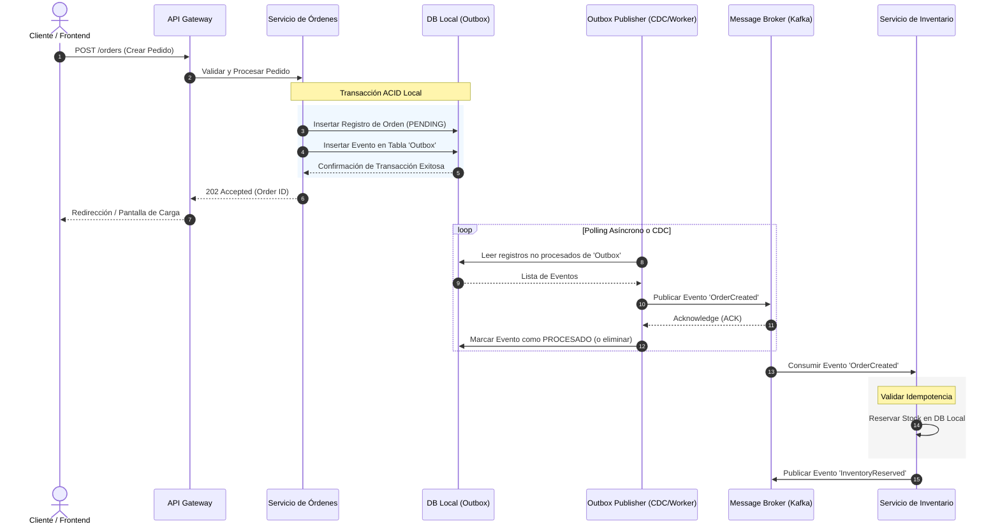

En el ecosistema del comercio moderno, la transición hacia arquitecturas MACH (Microservices, API-first, Cloud-native, Headless) y el Composable Commerce ha permitido a las empresas de escala global liberarse de las limitaciones de las suites monolíticas. Sin embargo, esta flexibilidad introduce un desafío fundamental: **la pérdida de la transacción ACID global**. 

En un entorno composable, una única acción de negocio —como la confirmación de una compra— puede requerir la coordinación de múltiples sistemas distribuidos e independientes: un motor de promociones (SaaS), un sistema de gestión de inventario (WMS), una pasarela de pagos (Stripe/Adyen) y un sistema de gestión de pedidos (OMS). 

Cuando la red falla, un microservicio experimenta latencia extrema o un proveedor SaaS externo devuelve un error `503 Service Unavailable`, la consistencia de los datos se desmorona. ¿Cómo evitamos cobrarle a un cliente por un producto que ya no tiene stock? ¿Cómo garantizamos que el inventario se libere si el pago falla?

Este artículo aborda los patrones de diseño avanzados necesarios para resolver la consistencia eventual y la resiliencia en ecosistemas MACH de nivel empresarial, enfocándose en la implementación práctica del patrón **Transactional Outbox**, la gestión de **Sagas Coreografiadas** y la garantía de **Idempotencia** en entornos de alta concurrencia.

---

## El Problema de la Escritura Dual (Dual-Write)

El error más común en las arquitecturas distribuidas es el patrón de "Escritura Dual". Ocurre cuando un microservicio intenta realizar dos operaciones de escritura en sistemas de almacenamiento distintos dentro del mismo flujo de ejecución.

Por ejemplo, al procesar un pedido, el servicio de órdenes realiza una inserción en su base de datos local (PostgreSQL) y, acto seguido, publica un evento `OrderCreated` en un broker de mensajería (Apache Kafka o AWS EventBridge):

```typescript
// ¡ANTIPATRÓN DE PRODUCCIÓN!
async function createOrder(orderData: Order): Promise<void> {
  // 1. Guardar en la base de datos local
  await db.orders.create(orderData); 
  
  // 2. Publicar evento en el Message Broker
  // Si la red falla aquí, la base de datos tiene la orden, pero el resto del sistema jamás se enterará.
  await eventBroker.publish("OrderCreated", { orderId: orderData.id });
}
```

Si el paso 1 tiene éxito pero el paso 2 falla debido a un problema de red con el broker de mensajería, la base de datos local queda en un estado inconsistente con el resto del ecosistema. Si invertimos el orden, el problema persiste: si la publicación del evento tiene éxito pero la escritura en la base de datos falla, el sistema distribuido reaccionará a un pedido que técnicamente no existe en el sistema de origen.

Para resolver esto de forma atómica sin recurrir a protocolos de bloqueo costosos como Two-Phase Commit (2PC) —los cuales destruyen el rendimiento y la disponibilidad en la nube—, debemos implementar el patrón **Transactional Outbox**.

---

## Arquitectura de Referencia: Saga Coreografiada con Transactional Outbox

El siguiente diagrama de secuencia ilustra cómo interactúan los servicios de una arquitectura Composable Commerce utilizando una **Saga Coreografiada** combinada con el patrón **Transactional Outbox** para garantizar la entrega de mensajes *at-least-once* (al menos una vez) sin comprometer el rendimiento de la base de datos transaccional.



---

## Implementación de Producción: Transactional Outbox e Idempotencia

A continuación, se presenta una implementación de grado de producción utilizando **TypeScript**, **Prisma ORM** (para PostgreSQL) y un patrón de polling optimizado. En entornos de escala masiva, se recomienda sustituir el polling por herramientas de Change Data Capture (CDC) como **Debezium**, pero el principio lógico del Outbox sigue siendo idéntico.

### 1. Definición del Esquema de Base de Datos (Prisma Schema)

Es fundamental que la tabla de `Outbox` resida en la misma base de datos y esquema que las tablas de negocio para poder participar en la misma transacción ACID.

```prisma
// schema.prisma

datasource db {
  provider = "postgresql"
  url      = env("DATABASE_URL")
}

generator client {
  provider = "prisma-client-js"
}

model Order {
  id          String   @id @default(uuid())
  customerId  String
  total       Decimal  @db.Decimal(10, 2)
  status      String   // PENDING, COMPLETED, FAILED
  createdAt   DateTime @default(now())
  updatedAt   DateTime @updatedAt
}

model OutboxEvent {
  id          String   @id @default(uuid())
  aggregateType String // e.g., "Order"
  aggregateId   String // e.g., Order UUID
  eventType     String // e.g., "OrderCreated"
  payload       Json
  processed     Boolean  @default(false)
  createdAt     DateTime @default(now())
  processedAt   DateTime?

  @@index([processed, createdAt])
}

model IdempotencyKey {
  key         String   @id
  response    Json
  createdAt   DateTime @default(now())
}
```

### 2. Escritura Atómica de Negocio y Outbox

El siguiente servicio encapsula la creación de la orden y la inserción del evento correspondiente en la tabla `Outbox` dentro de una transacción de base de datos única.

```typescript
// src/services/order.service.ts
import { PrismaClient, Order } from '@prisma/client';

const prisma = new PrismaClient();

export interface CreateOrderInput {
  customerId: string;
  total: number;
  items: Array<{ productId: string; quantity: number }>;
}

export class OrderService {
  async createOrder(input: CreateOrderInput, idempotencyKey: string): Promise<Order> {
    // Implementación del patrón de Idempotencia para evitar ejecuciones duplicadas
    const existingRequest = await prisma.idempotencyKey.findUnique({
      where: { key: idempotencyKey }
    });

    if (existingRequest) {
      return existingRequest.response as unknown as Order;
    }

    // Ejecución de la transacción ACID local
    const resultOrder = await prisma.$transaction(async (tx) => {
      // 1. Crear el registro de la orden
      const order = await tx.order.create({
        data: {
          customerId: input.customerId,
          total: input.total,
          status: 'PENDING'
        }
      });

      // 2. Crear el evento Outbox correspondiente
      await tx.outboxEvent.create({
        data: {
          aggregateType: 'Order',
          aggregateId: order.id,
          eventType: 'OrderCreated',
          payload: {
            orderId: order.id,
            customerId: order.customerId,
            total: order.total,
            items: input.items
          }
        }
      });

      // 3. Registrar la clave de idempotencia
      await tx.idempotencyKey.create({
        data: {
          key: idempotencyKey,
          response: order as any
        }
      });

      return order;
    });

    return resultOrder;
  }
}
```

### 3. El Publicador de Outbox (Outbox Publisher)

Este proceso en segundo plano (Worker) se encarga de leer los eventos pendientes de la tabla `Outbox`, publicarlos en el broker de mensajería y marcarlos como procesados. Se utiliza un mecanismo de bloqueo optimista o exclusión mutua para evitar que múltiples instancias del worker procesen los mismos eventos simultáneamente.

```typescript
// src/workers/outbox.publisher.ts
import { PrismaClient } from '@prisma/client';
import { KafkaProducer } from '../infrastructure/kafka'; // Abstracción de cliente Kafka

const prisma = new PrismaClient();
const producer = new KafkaProducer();

export async function processOutbox(): Promise<void> {
  // 1. Obtener eventos no procesados con bloqueo de filas (SELECT FOR UPDATE SKIP LOCKED)
  // para permitir escalabilidad horizontal del worker sin colisiones.
  const pendingEvents = await prisma.$transaction(async (tx) => {
    const events = await tx.$queryRaw<any[]>`
      SELECT * FROM "OutboxEvent"
      WHERE "processed" = false
      ORDER BY "createdAt" ASC
      LIMIT 100
      FOR UPDATE SKIP LOCKED
    `;

    return events;
  });

  if (pendingEvents.length === 0) {
    return;
  }

  for (const event of pendingEvents) {
    try {
      // 2. Publicar al broker de mensajería (Kafka)
      await producer.send({
        topic: `domain.${event.aggregateType.toLowerCase()}`,
        messages: [{
          key: event.aggregateId,
          value: JSON.stringify({
            eventId: event.id,
            type: event.eventType,
            data: event.payload
          })
        }]
      });

      // 3. Actualizar estado del evento a procesado
      await prisma.outboxEvent.update({
        where: { id: event.id },
        data: {
          processed: true,
          processedAt: new Date()
        }
      });
    } catch (error) {
      console.error(`Error procesando evento Outbox ${event.id}:`, error);
      // No marcamos como procesado; se reintentará en la siguiente iteración.
      // Aquí se debe implementar una estrategia de Backoff Exponencial o alertas de Dead Letter Queue (DLQ).
    }
  }
}

// Bucle de ejecución del Worker
setInterval(async () => {
  try {
    await processOutbox();
  } catch (err) {
    console.error("Fallo crítico en el loop del Outbox Publisher:", err);
  }
}, 500); // Frecuencia de 500ms
```

---

## Trade-offs Arquitectónicos: Coordinación de Transacciones Distribuidas

No existe una solución única para la consistencia en sistemas distribuidos. La elección entre orquestación, coreografía y consistencia fuerte depende directamente de los requerimientos de negocio y de la tolerancia a la latencia.

| Dimensión Arquitectónica | Saga Coreografiada (Event-Driven) | Saga Orquestada (Centralizada) | Two-Phase Commit (2PC / Consistencia Fuerte) |
| :--- | :--- | :--- | :--- |
| **Complejidad de Implementación** | **Alta**: Requiere un diseño riguroso de eventos y manejo de idempotencia en cada microservicio. | **Media**: Un orquestador central (e.g., AWS Step Functions) controla el flujo de ejecución. | **Baja**: El framework o la base de datos distribuida maneja la complejidad transaccional. |
| **Acoplamiento Temporal** | **Nulo**: Los servicios son completamente independientes y se comunican de forma asíncrona. | **Bajo**: Los servicios individuales no se conocen entre sí, pero dependen del orquestador. | **Extremo**: Todos los nodos participantes deben estar disponibles simultáneamente para completar la transacción. |
| **Rendimiento y Latencia** | **Excelente**: No hay bloqueos distribuidos; el rendimiento está limitado únicamente por el rendimiento del broker. | **Bueno**: El orquestador añade una pequeña latencia de red adicional por cada paso coordinado. | **Pobre**: Los bloqueos prolongados de recursos reducen drásticamente el rendimiento bajo alta concurrencia. |
| **Facilidad de Depuración** | **Muy Difícil**: Rastrear el flujo de una transacción requiere herramientas avanzadas de trazabilidad distribuida (OpenTelemetry). | **Fácil**: El estado de la saga se almacena y visualiza de forma centralizada en el motor del orquestador. | **Fácil**: La transacción tiene éxito o falla de forma atómica en un único bloque lógico. |
| **Cuándo Usarlo** | Sistemas de alta escala (e.g., Checkout de Composable Commerce, procesamiento de clics). | Flujos de negocio complejos con múltiples ramificaciones condicionales y aprobaciones humanas. | Sistemas financieros tradicionales donde la consistencia eventual es inaceptable por diseño de negocio. |
| **Cuándo Evitarlo** | Flujos de negocio lineales muy simples donde el overhead de infraestructura no se justifica. | Sistemas con requisitos de latencia ultra-baja en milisegundos de extremo a extremo. | Arquitecturas de microservicios basadas en la nube y servicios SaaS de terceros (APIs externas). |

---

## Modos de Fallo Comunes en Producción y Estrategias de Mitigación

Al operar patrones de consistencia eventual a escala de producción, las fallas no son una posibilidad, sino una certeza estadística. A continuación, se detallan los modos de fallo más críticos y cómo mitigarlos.

### 1. El Problema de la Entrega Duplicada (*At-Least-Once Delivery*)
Los brokers de mensajería modernos garantizan la entrega de mensajes al menos una vez, lo que significa que, bajo condiciones de inestabilidad de red, un consumidor puede recibir el mismo evento múltiples veces.

*   **Mitigación:** Todo consumidor de eventos debe ser estrictamente **idempotente**. Esto se logra implementando una tabla de control de mensajes procesados en el lado del consumidor. Antes de procesar cualquier evento, el consumidor verifica si el `eventId` ya existe en su tabla de control. Si existe, simplemente confirma el mensaje (*ACK*) al broker sin ejecutar la lógica de negocio nuevamente.

### 2. Transacciones de Compensación Fallidas (Sagas Incompletas)
En una Saga, si el paso 3 (pago) falla, se deben disparar transacciones de compensación para revertir el paso 1 (reserva de inventario) y el paso 2 (aplicación de cupones). Pero, ¿qué pasa si la transacción de compensación también falla?

*   **Mitigación:** Las transacciones de compensación deben diseñarse para ser **idempotentes y reintentables indefinidamente**. Si un servicio de inventario no puede procesar la liberación de stock debido a un error de infraestructura, el sistema debe reintentar con un algoritmo de *backoff* exponencial y *jitter*. Si el error persiste tras múltiples reintentos, el evento debe derivarse a una **Dead Letter Queue (DLQ)** y disparar una alerta crítica para intervención manual o script de conciliación automatizado.

### 3. El Fenómeno del "Outbox Bloqueado" (Head-of-Line Blocking)
Si el Outbox Publisher encuentra un evento con un formato corrupto o un payload inválido (un "Poison Pill") que hace que el broker de mensajería rechace la publicación de forma sistemática, el worker se detendrá o quedará atrapado en un bucle infinito de reintentos, bloqueando el procesamiento de todos los eventos subsiguientes.

*   **Mitigación:** Implementar un contador de reintentos en la lectura del Outbox. Si un evento falla más de $N$ veces (por ejemplo, 5 veces) al intentar ser publicado, el worker debe mover el registro a una tabla de `OutboxFailedEvents` para análisis forense, registrar un error estructurado en el sistema de observabilidad y continuar con el siguiente evento de la cola.

---

## Checklist de Implementación para Equipos de Ingeniería

Para asegurar el éxito en la implementación de estos patrones en su próximo sprint de arquitectura, siga esta lista de verificación técnica:

- [ ] **Aislamiento de Base de Datos:** Asegúrese de que cada microservicio posea su propia base de datos dedicada. Ningún servicio debe escribir directamente en la base de datos de otro.
- [ ] **Transaccionalidad Local:** Verifique que la inserción del registro de negocio y la inserción del evento en la tabla `Outbox` se ejecuten dentro del mismo bloque transaccional (`BEGIN TRANSACTION ... COMMIT`).
- [ ] **Estrategia de CDC o Polling Eficiente:** Si utiliza polling para el Outbox, asegúrese de usar índices adecuados en las columnas `[processed, createdAt]` y de implementar bloqueos no bloqueantes (`FOR UPDATE SKIP LOCKED`) para permitir la ejecución de múltiples réplicas del worker.
- [ ] **Idempotencia en Consumidores:** Diseñe todos los endpoints de APIs mutables y los consumidores de eventos para que acepten y validen una clave de idempotencia única (`X-Idempotency-Key` o `eventId`).
- [ ] **Trazabilidad Distribuida:** Implemente la propagación de contexto de OpenTelemetry (W3C Trace Context) en todos los eventos publicados. Cada evento debe transportar el `traceparent` para permitir la reconstrucción visual de la Saga en herramientas como Jaeger, Datadog o New Relic.
- [ ] **Diseño de Compensaciones:** Defina claramente las acciones inversas para cada paso de la saga. Recuerde que una compensación no es un "rollback" de base de datos, sino una nueva transacción de negocio que equilibra el estado del sistema (e.g., "Liberar Reserva" en lugar de borrar el registro de reserva).

---

## Conclusión

La adopción de arquitecturas MACH y Composable Commerce ofrece una agilidad sin precedentes, pero traslada la responsabilidad de la consistencia de datos del motor de la base de datos al software de aplicación. 

La implementación de patrones como **Transactional Outbox**, **Sagas** e **Idempotencia** no es una optimización prematura; es la base fundamental sobre la cual se construyen sistemas distribuidos resilientes, capaces de soportar picos de tráfico masivos como el Black Friday sin corromper la experiencia del usuario ni los datos financieros de la compañía. Al diseñar pensando en el fallo constante, garantizamos que nuestro sistema sea verdaderamente elástico, escalable y tolerante a fallas.