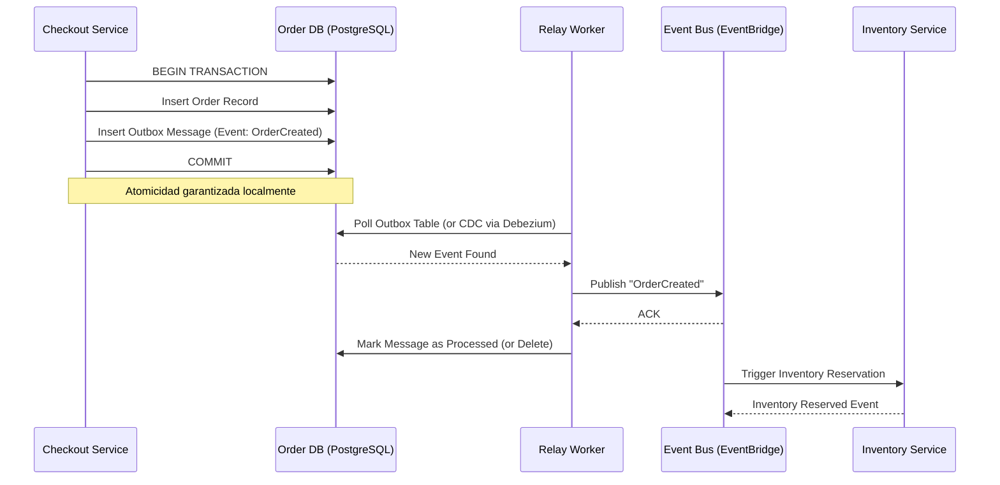

En el panorama del **Composable Commerce** y las arquitecturas **MACH** (Microservices, API-first, Cloud-native, Headless) de 2026, la agilidad ya no es el principal diferenciador; la **resiliencia sistémica** y la **integridad de datos distribuida** lo son. A medida que las organizaciones abandonan las suites "all-in-one" en favor de un ecosistema de *Best-of-Breed*, se enfrentan a un desafío técnico sin precedentes: el "Impuesto de los Sistemas Distribuidos".

Cuando tu motor de promociones es un SaaS, tu inventario reside en un ERP legacy expuesto vía API, y tu checkout es un microservicio propio corriendo en Kubernetes, la probabilidad de que una transacción falle no es una anomalía, es una certeza estadística. Este artículo profundiza en los patrones arquitectónicos avanzados necesarios para garantizar que, ante el fallo inevitable, el sistema degrade con elegancia y mantenga la consistencia sin intervención manual.

## El Problema: La Falacia de la Red Confiable y la Escritura Dual

El error más común en implementaciones MACH de nivel enterprise es ignorar el problema de la **Escritura Dual (Dual Write)**. Imagine un servicio de pedidos que debe:
1. Actualizar el estado del pedido en su base de datos local (PostgreSQL).
2. Notificar al servicio de envíos a través de un Message Broker (Kafka o EventBridge).

Si la base de datos confirma la transacción pero el broker falla (o la red se corta justo antes del ACK), el sistema entra en un estado de inconsistencia: el cliente cree que su pedido está en camino, pero el almacén nunca recibe la instrucción. Los reintentos (retries) simples no solucionan esto; a menudo lo empeoran creando duplicados o agotando recursos por *backpressure*.

## Arquitectura de Referencia: Resiliencia Multicapa

Para mitigar estos riesgos, implementamos una arquitectura que combina el patrón **Transactional Outbox** para la consistencia y **Sagas Orquestadas** para la gestión de transacciones de larga duración.



## Patrón 1: Transactional Outbox con Change Data Capture (CDC)

En lugar de intentar escribir en dos sistemas a la vez, el microservicio escribe su estado y el evento saliente en la misma base de datos local bajo una única transacción ACID. Un proceso separado (el *Relay*) se encarga de publicar esos eventos.

### Implementación Técnica (TypeScript + Prisma)

Este ejemplo muestra cómo encapsular la lógica de negocio y la creación del evento en una transacción atómica.

```typescript
import { PrismaClient } from '@prisma/client';
import { v4 as uuidv4 } from 'uuid';

const prisma = new PrismaClient();

async function createOrder(orderData: any) {
  return await prisma.$transaction(async (tx) => {
    // 1. Crear el registro del pedido
    const order = await tx.order.create({
      data: {
        ...orderData,
        status: 'PENDING',
      },
    });

    // 2. Crear el evento en la tabla 'Outbox'
    // El ID de idempotencia es crucial para el consumidor
    await tx.outbox.create({
      data: {
        id: uuidv4(),
        aggregateType: 'ORDER',
        aggregateId: order.id,
        eventType: 'ORDER_CREATED',
        payload: JSON.stringify(order),
        status: 'PENDING',
      },
    });

    return order;
  });
}

/**
 * Nota de Arquitectura: 
 * En producción, no uses polling manual sobre la tabla Outbox. 
 * Implementa CDC (Change Data Capture) usando herramientas como Debezium 
 * que leen el WAL (Write-Ahead Log) de PostgreSQL para una latencia mínima 
 * y cero carga adicional en la DB.
 */
```

## Patrón 2: Sagas Orquestadas para Flujos Composable

En un entorno MACH, una "transacción" de negocio (ej. un pedido) suele involucrar múltiples servicios externos (Pagos, Impuestos, Inventario, CRM). Dado que no existe el soporte para transacciones distribuidas (2PC) en la web moderna por problemas de escalabilidad, utilizamos el patrón **Saga**.

Prefiero la **Orquestación** sobre la Coreografía en sistemas complejos porque centraliza la lógica de recuperación y facilita la observabilidad.

### Lógica de Compensación (Python / AWS Step Functions)

Si el servicio de pagos falla, la Saga debe ejecutar "acciones de compensación" (ej. liberar el inventario reservado).

```python
# Ejemplo de definición de lógica para un Worker de Compensación
def compensate_inventory(event, context):
    order_id = event['order_id']
    try:
        inventory_service.release_reservation(order_id)
        return {
            "status": "COMPENSATED",
            "message": f"Inventory for order {order_id} released."
        }
    except Exception as e:
        # Aquí entra el patrón 'Dead Letter Queue' si la compensación falla
        log.critical(f"Critical Failure: Could not compensate inventory for {order_id}")
        raise e
```

## Patrón 3: Cell-Based Architecture (Aislamiento de Radio de Explosión)

Para 2026, las empresas líderes han pasado de simples regiones cloud a **Arquitecturas Basadas en Celdas**. Una "celda" es una unidad de despliegue completa y autónoma que contiene una instancia de todos los microservicios necesarios para procesar un subconjunto de clientes (ej. por región geográfica o ID de cliente).

**Beneficios:**
- **Limitación del Blast Radius:** Si la celda A falla, las celdas B y C siguen operando.
- **Escalabilidad Predictiva:** Es más fácil escalar añadiendo celdas que escalando verticalmente un clúster masivo de Kubernetes.

## Comparativa de Estrategias de Consistencia

| Patrón | Consistencia | Complejidad | Latencia | Cuándo usarlo |
| :--- | :--- | :--- | :--- | :--- |
| **2PC (Two-Phase Commit)** | Fuerte | Muy Alta | Alta | **Evitar** en MACH/Cloud. |
| **Saga (Orquestada)** | Eventual | Alta | Media | Procesos de negocio largos (Checkout, Devoluciones). |
| **Transactional Outbox** | Eventual (Garantizada) | Media | Baja | Comunicación entre microservicios internos. |
| **Idempotent Consumer** | N/A | Baja | Mínima | **Obligatorio** en todos los suscriptores de eventos. |

## Modos de Fallo Comunes y Mitigación en Producción

### 1. El Problema del "Mensaje Envenenado" (Poison Pill)
Un mensaje que causa que el consumidor falle sistemáticamente (ej. un JSON mal formado que pasa la validación inicial).
*   **Mitigación:** Implementar un contador de reintentos en el header del mensaje. Si excede N intentos, mover a una **Dead Letter Queue (DLQ)** y alertar al equipo de SRE.

### 2. Deriva de Reloj (Clock Drift)
En sistemas distribuidos, confiar en el timestamp de diferentes servidores para ordenar eventos es peligroso.
*   **Mitigación:** Utilizar **Logical Clocks (Vector Clocks)** o confiar en el ordenamiento garantizado por la partición de tu broker (ej. Kafka Partition Keys).

### 3. Inundación de Reintentos (Retry Storms)
Cuando un servicio cae y todos los clientes reintentan simultáneamente al recuperarse, volviéndolo a tirar.
*   **Mitigación:** Implementar **Exponential Backoff con Jitter** (variación aleatoria). No reintentes todos al mismo tiempo.

```typescript
// Ejemplo de lógica de reintento con Jitter
async function fetchWithJitter(url: string, retries = 3) {
  for (let i = 0; i < retries; i++) {
    try {
      return await fetch(url);
    } catch (err) {
      const delay = Math.pow(2, i) * 100 + Math.random() * 100;
      await new Promise(res => setTimeout(res, delay));
    }
  }
}
```

## Estrategia de Observabilidad: El "Trace ID" Distribuido

En una arquitectura MACH, no puedes debuguear un error mirando los logs de un solo servicio. Es imperativo implementar **OpenTelemetry**. Cada solicitud que entra por el API Gateway debe generar un `trace_id` que se propague en:
- Headers de HTTP (propagación síncrona).
- Metadatos de mensajes en el Broker (propagación asíncrona).
- Atributos de logs.

Esto permite reconstruir la "vida de una transacción" a través de múltiples proveedores SaaS y microservicios propios.

## Conclusión: Checklist de Implementación para 2026

Para los Directores de Ingeniería y Arquitectos que operan plataformas de escala global, la resiliencia no es un "add-on", es la base del diseño. Si estás construyendo o migrando a una arquitectura MACH, asegúrate de cumplir con estos puntos:

- [ ] **Idempotencia por Defecto:** ¿Todos tus endpoints POST/PATCH aceptan una `Idempotency-Key`?
- [ ] **Eliminación de Escrituras Duales:** ¿Utilizas Outbox o CDC para notificar cambios de estado?
- [ ] **Estrategia de Compensación:** Para cada acción que realizas en un servicio externo (ej. Stripe, Contentful), ¿tienes definida la acción inversa en caso de fallo?
- [ ] **Aislamiento de Fallos:** ¿Tienes implementados Circuit Breakers con estados de "Half-Open" configurados correctamente?
- [ ] **Pruebas de Caos:** ¿Ejecutas simulaciones de caída de servicios críticos (Chaos Engineering) en entornos de staging?

La arquitectura MACH ofrece una agilidad sin precedentes, pero solo aquellos que dominen la gestión del estado distribuido y la resiliencia podrán escalar sin que la complejidad operativa devore el ROI de la transformación digital.

---
*Este artículo es parte de la serie avanzada de 'MACH Playbook'. Para más recursos sobre orquestación de microservicios y patrones cloud-native, visita nuestro repositorio de arquitecturas de referencia.*