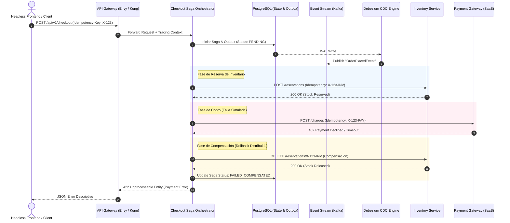

La adopción del paradigma MACH (*Microservices, API-first, Cloud-native, Headless*) ha transformado la agilidad operativa y la capacidad de componer plataformas digitales de nivel enterprise. Sin embargo, desacoplar el monolito en decenas de microservicios autónomos e integrar múltiples proveedores SaaS especializados (comercio, pagos, gestión de inventario, CMS headless) introduce un desafío de primer orden: **la pérdida de la transaccionalidad ACID centralizada y la amplificación de los modos de fallo de red**.

En un entorno distribuido, las fallas no son excepciones; son el estado operativo normal. Cuando una operación comercial crítica —como el checkout de un carrito con múltiples líneas de inventario distribuido, reserva de crédito y cobro pasarela— abarca tres microservicios propios y dos APIs SaaS externas, confiar en peticiones HTTP síncronas con reintentos lineales (*exponential backoff*) es una receta directa para el agotamiento de sockets, inconsistencia de datos (*dual-write problem*) y degradación en cascada.

Este artículo aborda patrones avanzados de arquitectura para garantizar **consistencia eventual estricta**, **idempotencia verificable** y **resiliencia adaptativa** en ecosistemas MACH de alto volumen.

---

## 1. El Dilema del Dual-Write y la Solución con Transactional Outbox + CDC

Uno de los errores más comunes en la implementación de microservicios MACH es intentar actualizar una base de datos local y, acto seguido, publicar un evento en un message broker (como Apache Kafka o AWS EventBridge) dentro del mismo bloque de código de aplicación:

```typescript
// ANTIPATRÓN: Dual-Write Vulnerable a Inconsistencia
async function confirmOrder(orderId: string, paymentDetails: PaymentInfo) {
  await db.orders.update({ where: { id: orderId }, data: { status: 'PAID' } });
  // Si el proceso cae aquí o el broker falla, el evento nunca se emite
  // pero la BD ya se actualizó: Inconsistencia Silenciosa.
  await eventBroker.publish('order.paid', { orderId, paymentDetails });
}
```

Si la red parpadea o la instancia del servicio es desalojada por Kubernetes justo después de la escritura en la base de datos, el evento se pierde para siempre. Los sistemas descendentes (logística, facturación) nunca se enterarán.

### El Patrón Transactional Outbox

Para resolver esto con garantías de entrega *al menos una vez* (*at-least-once delivery*), debemos transformar la publicación de eventos en una operación transaccional local utilizando el patrón **Transactional Outbox**, respaldado por **Change Data Capture (CDC)** mediante herramientas como Debezium.

```sql
-- Estructura de la tabla Outbox en PostgreSQL
CREATE TABLE transactional_outbox (
    id UUID PRIMARY KEY DEFAULT gen_random_uuid(),
    aggregate_type VARCHAR(64) NOT NULL,
    aggregate_id VARCHAR(64) NOT NULL,
    event_type VARCHAR(128) NOT NULL,
    payload JSONB NOT NULL,
    trace_context JSONB NOT NULL,
    created_at TIMESTAMP WITH TIME ZONE DEFAULT CURRENT_TIMESTAMP
);

CREATE INDEX idx_outbox_created_at ON transactional_outbox(created_at);
```

Al persistir el cambio de estado del negocio y el evento en la misma transacción ACID de PostgreSQL, eliminamos la ventana de inconsistencia:

```typescript
// Implementación Robusta con Transacción Atómica Local
import { PrismaClient } from '@prisma/client';

export async function processOrderPayment(
  prisma: PrismaClient,
  orderId: string,
  paymentRef: string,
  traceContext: Record<string, string>
) {
  return await prisma.$transaction(async (tx) => {
    const updatedOrder = await tx.order.update({
      where: { id: orderId },
      data: { status: 'PAID', paymentReference: paymentRef },
    });

    await tx.transactionalOutbox.create({
      data: {
        aggregateType: 'Order',
        aggregateId: orderId,
        eventType: 'OrderPaymentCompleted',
        payload: {
          orderId: updatedOrder.id,
          customerId: updatedOrder.customerId,
          totalAmount: updatedOrder.totalAmount,
          paymentRef,
        },
        traceContext: JSON.stringify(traceContext),
      },
    });

    return updatedOrder;
  });
}
```

El motor de CDC (Debezium) lee el *Write-Ahead Log* (WAL) de PostgreSQL de forma asíncrona y canaliza los eventos hacia Kafka con latencias sub-segundo, garantizando que **ningún cambio de estado persistido quede sin su correspondiente evento emitido**.

---

## 2. Diagrama de Arquitectura: Orquestación de Sagas con Outbox e Idempotencia

En flujos transaccionales que involucran sistemas heterogéneos (ej. ERP legacy, pasarela Stripe, servicio de inventario Cloud-Native), la orquestación mediante una máquina de estados distribuidos (Saga Orquestada) ofrece mayor observabilidad y control de compensaciones que la coreografía pura.



---

## 3. Implementación de una Saga Orquestada con Compensaciones Tipadas

A continuación, se muestra una implementación de grado de producción de un coordinador de Sagas en TypeScript. Este diseño implementa el patrón *Command-Compensation*, garantizando que si cualquier paso falla tras superar su cuota de reintentos, todas las acciones previas sean revertidas en orden inverso.

```typescript
// saga-orchestrator.ts
import { Logger } from './logger';

export interface SagaStep<TContext> {
  name: string;
  execute: (context: TContext) => Promise<TContext>;
  compensate: (context: TContext) => Promise<void>;
  maxRetries?: number;
}

export class SagaCoordinator<TContext extends Record<string, any>> {
  private steps: SagaStep<TContext>[] = [];
  private executedSteps: SagaStep<TContext>[] = [];

  constructor(
    private readonly sagaName: string,
    private readonly logger: Logger
  ) {}

  public addStep(step: SagaStep<TContext>): this {
    this.steps.push(step);
    return this;
  }

  public async execute(initialContext: TContext): Promise<{ success: boolean; context: TContext; error?: Error }> {
    let currentContext = { ...initialContext };

    this.logger.info(`Iniciando Saga [${this.sagaName}]`, { correlationId: currentContext.correlationId });

    for (const step of this.steps) {
      try {
        this.logger.info(`Ejecutando paso: [${step.name}]`);
        currentContext = await this.executeWithRetry(step, currentContext);
        this.executedSteps.push(step);
      } catch (error) {
        this.logger.error(`Fallo en paso [${step.name}]. Iniciando compensación...`, { error });
        await this.compensate(currentContext);
        return {
          success: false,
          context: currentContext,
          error: error instanceof Error ? error : new Error(String(error)),
        };
      }
    }

    this.logger.info(`Saga [${this.sagaName}] completada con éxito.`);
    return { success: true, context: currentContext };
  }

  private async executeWithRetry(step: SagaStep<TContext>, context: TContext): Promise<TContext> {
    const retries = step.maxRetries ?? 2;
    let attempt = 0;

    while (attempt <= retries) {
      try {
        return await step.execute(context);
      } catch (err) {
        attempt++;
        if (attempt > retries) throw err;
        const backoffMs = Math.pow(2, attempt) * 100;
        await new Promise((resolve) => setTimeout(resolve, backoffMs));
      }
    }
    throw new Error(`Paso [${step.name}] excedió reintentos máximos.`);
  }

  private async compensate(context: TContext): Promise<void> {
    // Compensación en orden inverso (LIFO)
    const stepsToCompensate = [...this.executedSteps].reverse();

    for (const step of stepsToCompensate) {
      try {
        this.logger.warn(`Compensando paso: [${step.name}]`);
        await step.compensate(context);
      } catch (compensationError) {
        // Fallo crítico: La compensación falló. Requiere intervención o Dead-Letter-Queue.
        this.logger.crit(`CRITICAL: Fallo en compensación para el paso [${step.name}]`, {
          context,
          compensationError,
        });
      }
    }
  }
}
```

---

## 4. Idempotencia Rigurosa en la Capa API-First

En una red distribuida, el reintento automático de peticiones no es seguro sin garantías estrictas de idempotencia. Si una llamada a la pasarela de pagos o al OMS sufre un corte de red *después* de procesarse pero *antes* de que el cliente reciba el código `200 OK`, un reintento ingenuo provocaría un doble cargo o una doble reserva de inventario.

### Estructura de Control de Idempotencia en Redis

Para neutralizar este riesgo, el API Gateway o los servicios downstream deben registrar las claves de idempotencia (`Idempotency-Key` enviadas por el frontend) de forma atómica mediante Redis y scripts Lua:

```typescript
// idempotency.middleware.ts
import { Request, Response, NextFunction } from 'express';
import Redis from 'ioredis';

const redis = new Redis(process.env.REDIS_CLUSTER_URL!);

export async function enforceIdempotency(req: Request, res: Response, next: NextFunction) {
  const idempotencyKey = req.header('X-Idempotency-Key');
  if (!idempotencyKey) {
    return res.status(400).json({ error: 'X-Idempotency-Key header es obligatorio.' });
  }

  const cacheKey = `idempotency:${req.baseUrl}:${idempotencyKey}`;
  
  // Lua script para adquisición atómica del cerrojo de procesamiento
  const lockAcquired = await redis.set(
    cacheKey,
    JSON.stringify({ status: 'PROCESSING' }),
    'EX', 120, // TTL 120 segundos
    'NX'
  );

  if (!lockAcquired) {
    const rawData = await redis.get(cacheKey);
    if (!rawData) {
      return res.status(409).json({ error: 'Conflicto de concurrencia. Reintente en breve.' });
    }

    const cachedData = JSON.parse(rawData);
    if (cachedData.status === 'PROCESSING') {
      return res.status(409).json({
        error: 'Petición en proceso. Evite peticiones concurrentes idénticas.',
      });
    }

    // Retorna la respuesta serializada original sin volver a procesar el negocio
    return res.status(cachedData.statusCode).json(cachedData.body);
  }

  // Interceptar la respuesta final para persistirla en Redis
  const originalJson = res.json.bind(res);
  res.json = (body: any) => {
    redis.set(
      cacheKey,
      JSON.stringify({ status: 'COMPLETED', statusCode: res.statusCode, body }),
      'EX', 86400 // Conservar resultado durante 24 horas
    );
    return originalJson(body);
  };

  next();
}
```

---

## 5. Resiliencia Dinámica: Del Circuit Breaker a los Concurrency Limits Adaptativos

Los *Circuit Breakers* tradicionales (como Resilience4j o Hystrix) utilizan umbrales estáticos de error (ej. "abrir circuito si el 50% de las peticiones fallan"). En arquitecturas MACH con microservicios elásticos en la nube, los fallos rara vez son binarios; suelen manifestarse como **degradación de latencia latente** (*tail latency*), donde un servicio saturado comienza a responder en 8 segundos en lugar de 80 milisegundos.

Los **Límites de Concurrencia Adaptativos** (*Adaptive Concurrency Limits*), inspirados en los algoritmos de control de congestión TCP (como Vegas o AIMD), calculan dinámicamente cuántas solicitudes simultáneas puede tolerar un servicio midiendo el RTT (*Round Trip Time*):

$$\text{Gradient} = \frac{\text{RTT}_{\text{sin\_carga}}}{\text{RTT}_{\text{actual}}}$$

$$\text{Nuevo Límite} = \text{Límite Actual} \times \text{Gradient} + \text{Headroom}$$

Cuando el downstream se ralentiza, el sistema contrae instantáneamente el límite de concurrencia disponible antes de que los hilos del servidor queden exhaustos, rechazando el exceso de tráfico con `429 Too Many Requests` en la periferia (*load shedding*).

---

## 6. Matriz Comparativa: Patrones de Consistencia y Tolerancia a Fallos

| Estrategia | Consistencia | Complejidad de Implementación | Latencia / Overhead | Tolerancia a Fallos Externos | Cuándo Implementar |
| :--- | :--- | :--- | :--- | :--- | :--- |
| **Two-Phase Commit (2PC / XA)** | Fuerte (ACID) | Crítica | Extremadamente Alta (Bloqueos) | Nula (SaaS no soportan XA) | **Evitar en MACH.** Inviable en microservicios e integraciones SaaS. |
| **Saga Coreografiada** | Eventual (BASE) | Media (Riesgo de lógica espagueti) | Muy Baja (Asíncrona) | Alta | Flujos simples con menos de 3 microservicios independientes. |
| **Saga Orquestada** | Eventual (BASE) | Media-Alta | Baja a Media | Muy Alta (Control centralizado de compensación) | Flujos transaccionales clave (Checkout, Fulfillment, Pagos multi-pasarela). |
| **Transactional Outbox + CDC** | Garantía *At-least-once* | Media | Mínima (Desacople en DB WAL) | Absoluta (Aislado de caídas del broker) | **Estándar obligatorio** en cualquier mutación de estado con eventos derivados. |

---

## 7. Modos de Fallo Críticos y Mitigaciones en Producción

### 1. Mensajes Desordenados en el Event Stream
- **Escenario:** Debezium envía `OrderUpdated` antes de que el consumidor haya procesado `OrderCreated` debido a rebalanceos de particiones en Kafka.
- **Mitigación:** Implementar un **Control de Concurrencia Optimista** (*Optimistic Concurrency Control*) en el consumidor. Cada agregado debe llevar una propiedad `version: number`. El consumidor descarta o pospone en una cola de reintento cualquier evento cuya versión no sea exactamente `currentVersion + 1`.

### 2. Compensaciones Envenenadas (*Poison Compensations*)
- **Escenario:** Durante el rollback de una Saga, el endpoint de compensación del inventario devuelve un error `500 Internal Server Error` no transitorio.
- **Mitigación:** Las compensaciones **deben ser reintentadas indefinidamente**. Si se agota el número crítico de reintentos, el orquestador debe publicar el contexto completo de la falla en una cola de mensajes no entregados (*Dead Letter Queue - DLQ*) y disparar una alerta P1 a PagerDuty para resolución manual por ingeniería de operaciones.

### 3. Fuga de Memoria y Bloqueo de Tablas Outbox
- **Escenario:** La tabla `transactional_outbox` acumula millones de filas procesadas, degradando las consultas y el WAL de PostgreSQL.
- **Mitigación:** Aplicar particionamiento por rangos de tiempo (*Time-based Partitioning*) en PostgreSQL sobre la tabla outbox y programar un *cleanup worker* que elimine particiones de días anteriores, o utilizar el motor *Debezium Outbox Event Router* que puede operar directamente sin necesidad de persistencia infinita en el almacenamiento principal.

---

## 8. Checklist de Implementación Arquitectónica

Para validar la madurez técnica de una arquitectura MACH frente a fallas distribuidas, evalúe su sistema con el siguiente checklist:

- [ ] **Eliminación de Dual-Writes:** Ningún servicio emite eventos a Kafka/RabbitMQ directamente en el código de aplicación tras una mutación de base de datos; se utiliza Transactional Outbox + CDC.
- [ ] **Idempotencia Universal:** Todos los endpoints mutadores (`POST`, `PUT`, `PATCH`) en APIs públicas y privadas aceptan y validan cabeceras `X-Idempotency-Key`.
- [ ] **Sagas con Compensaciones Idempotentes:** Todas las acciones de reversión en orquestadores de sagas son idempotentes y toleran ser ejecutadas múltiples veces sin alterar el estado.
- [ ] **Contexto de Trazabilidad Propagado:** Se utiliza **OpenTelemetry** (W3C `traceparent`) a través de APIs HTTP, tópicos de Kafka y metadatos del outbox para reconstruir el grafo transaccional distribuido de punta a punta.
- [ ] **Manejo de Latencia de Cola (*Tail Latency*):** Se han configurado timeouts defensivos agresivos y límites de concurrencia adaptativos en lugar de depender únicamente de Circuit Breakers pasivos.
- [ ] **Testing de Caos Automatizado:** Las fallas de red, latencias artificiales de proveedores SaaS y caídas abruptas de contenedores se validan periódicamente utilizando herramientas de Chaos Engineering (ej. Chaos Mesh o Gremlin) en entornos de preproducción.