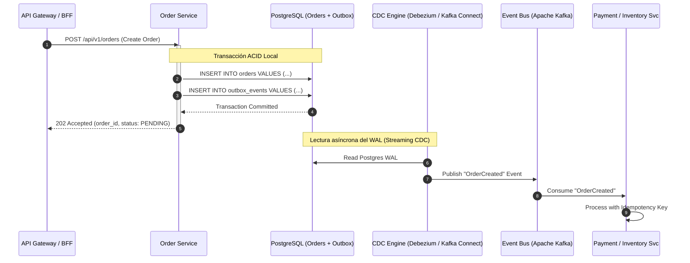
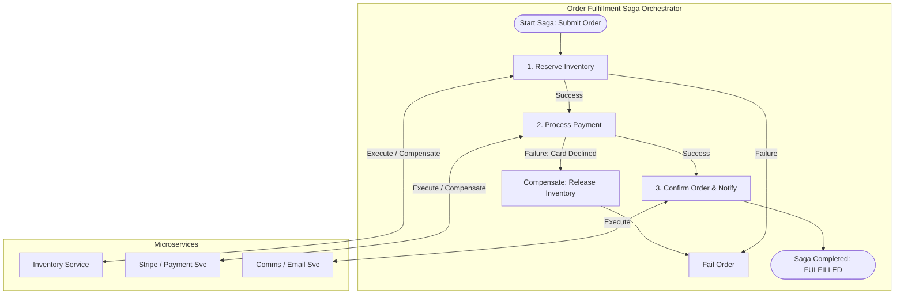

La transición de monolitos tradicionales (como SAP Hybris, Oracle Commerce o Magento) hacia ecosistemas **MACH** (*Microservices, API-first, Cloud-native, Headless*) otorga una agilidad sin precedentes. Sin embargo, fractura la garantía más confiable de la computación empresarial clásica: las transacciones ACID locales sobre una única base de datos relacional.

En una arquitectura *Composable*, una simple operación de "Confirmación de Orden" ya no es una mutación SQL atómica dentro de un bloque `BEGIN ... COMMIT`. En su lugar, es un flujo transaccional distribuido que involucra múltiples sistemas de registros independientes:
- Un motor de catálogo y precios SaaS (ej. commercetools).
- Una pasarela de pagos (ej. Stripe).
- Un sistema de gestión de inventario y fulfillment (WMS/OMS) desplegado en Kubernetes privado.
- Un motor de búsqueda y recomendaciones (ej. Algolia).
- Un CRM y motor de lealtad (ej. Salesforce Data Cloud).

Cuando uno de estos componentes experimenta degradación de latencia, particiones de red o fallos de infraestructura, el sistema no puede simplemente bloquearse o abortar sin dejar inconsistencias residuales (como un cobro exitoso en tarjeta sin reserva de inventario).

Este artículo analiza los patrones avanzados de ingeniería necesarios para mitigar fallos en cascada, garantizar consistencia eventual robusta y asegurar alta disponibilidad sin comprometer la integridad del negocio.

---

## 1. El Dilema de la Doble Escritura (Dual-Write Problem)

El antipatrón más destructivo en microservicios MACH es la **doble escritura directa**: intentar actualizar la base de datos local del microservicio y, en el mismo hilo de ejecución, emitir un evento a un broker (como Apache Kafka, AWS SNS/SQS o RabbitMQ).

```
Aplicación ---> [1. UPDATE DB] ---> DB Local (Éxito)
           ---> [2. PUBLISH]   ---> Kafka (Fallo de red / Timeout)
Resultado: La base de datos cambió, pero el resto del ecosistema nunca se enteró.
```

Si la escritura en base de datos tiene éxito pero el envío al broker falla (o la instancia de la aplicación muere por un reinicio de Kubernetes antes de emitir), el ecosistema entra en un estado divergente silencioso.

### La Solución: Transactional Outbox con CDC

Para garantizar entrega *at-least-once* sin bloqueos distribuidos de dos fases (2PC/XA —inviables en entornos cloud-native de baja latencia), implementamos el patrón **Transactional Outbox** acoplado a **Change Data Capture (CDC)** mediante el Write-Ahead Log (WAL) de la base de datos.



---

## 2. Implementación de Producción: Transactional Outbox + Idempotent Inbox

A continuación se muestra una implementación empresarial en **TypeScript / Node.js** utilizando transacciones atómicas de base de datos y un interceptor de deduplicación con el patrón **Inbox** para consumidores.

### Escritura Atómica en Outbox (Order Service)

```typescript
import { PrismaClient, Prisma } from '@prisma/client';
import { randomUUID } from 'crypto';

interface CreateOrderDTO {
  customerId: string;
  items: Array<{ sku: string; quantity: number; price: number }>;
  currency: string;
  totalAmount: number;
}

export class OrderService {
  constructor(private readonly prisma: PrismaClient) {}

  async createOrder(dto: CreateOrderDTO, idempotencyKey: string): Promise<string> {
    return await this.prisma.$transaction(async (tx: Prisma.TransactionClient) => {
      // 1. Validar idempotencia a nivel de comando entrante
      const existingRequest = await tx.processedCommand.findUnique({
        where: { commandId: idempotencyKey }
      });

      if (existingRequest) {
        return existingRequest.resourceId; // Respuesta determinista previa
      }

      // 2. Persistir entidad de dominio
      const orderId = randomUUID();
      const order = await tx.order.create({
        data: {
          id: orderId,
          customerId: dto.customerId,
          totalAmount: dto.totalAmount,
          currency: dto.currency,
          status: 'PENDING_PAYMENT',
          items: {
            create: dto.items.map(item => ({
              sku: item.sku,
              quantity: item.quantity,
              unitPrice: item.price
            }))
          }
        }
      });

      // 3. Persistir evento en tabla Outbox dentro de la MISMA transacción ACID
      const eventPayload = {
        eventType: 'OrderCreated',
        aggregateId: orderId,
        aggregateType: 'Order',
        payload: {
          orderId: order.id,
          customerId: order.customerId,
          amount: order.totalAmount,
          currency: order.currency,
          items: dto.items
        },
        occurredAt: new Date().toISOString()
      };

      await tx.outboxEvent.create({
        data: {
          id: randomUUID(),
          aggregateType: eventPayload.aggregateType,
          aggregateId: eventPayload.aggregateId,
          type: eventPayload.eventType,
          payload: eventPayload.payload as Prisma.InputJsonValue,
          status: 'PENDING'
        }
      });

      // 4. Marcar comando como procesado
      await tx.processedCommand.create({
        data: {
          commandId: idempotencyKey,
          resourceId: orderId
        }
      });

      return orderId;
    });
  }
}
```

### Consumidor con Patrón Inbox e Idempotencia Estricta

```typescript
import { KafkaMessage } from 'kafkajs';
import { PrismaClient } from '@prisma/client';

export class PaymentInboxConsumer {
  constructor(
    private readonly prisma: PrismaClient,
    private readonly paymentGatewayClient: any
  ) {}

  async handleMessage(message: KafkaMessage): Promise<void> {
    if (!message.value) return;

    const event = JSON.parse(message.value.toString());
    const messageId = `${event.aggregateId}:${event.type}:${event.occurredAt}`;

    // Usar transacción para garantizar que no procesemos duplicados
    await this.prisma.$transaction(async (tx) => {
      // 1. Verificar si el mensaje ya fue procesado
      const alreadyProcessed = await tx.inboxEvent.findUnique({
        where: { messageId }
      });

      if (alreadyProcessed) {
        // Log deduplicación y descartar silenciosamente
        return;
      }

      // 2. Ejecutar lógica de negocio externa / interna
      if (event.type === 'OrderCreated') {
        const paymentResult = await this.paymentGatewayClient.authorize({
          transactionId: event.payload.orderId,
          amount: event.payload.amount,
          currency: event.payload.currency,
          idempotencyKey: messageId // Propagar la clave upstream
        });

        // 3. Registrar estado de procesamiento y guardar en inbox
        await tx.paymentRecord.create({
          data: {
            orderId: event.payload.orderId,
            status: paymentResult.status,
            externalRef: paymentResult.chargeId
          }
        });

        await tx.inboxEvent.create({
          data: {
            messageId,
            processedAt: new Date()
          }
        });
      }
    });
  }
}
```

---

## 3. Orquestación de Sagas vs. Coreografía en MACH

Al manejar flujos de negocio que abarcan múltiples servicios de terceros y microservicios propios, la coordinación transaccional distribuida debe gestionarse mediante el **Patrón Saga**.



### Orquestación vs. Coreografía: Criterios de Selección

| Dimensión | Saga Orquestada (Orchestration) | Saga Coreografiada (Choreography) |
| :--- | :--- | :--- |
| **Punto de Control** | Centralizado (Workflow Engine / State Machine). | Descentralizado (Servicios reaccionan a eventos). |
| **Visibilidad del Flujo** | Muy Alta. Se inspecciona el estado del flujo en un único punto. | Baja. El flujo está distribuido en suscripciones de eventos. |
| **Acoplamiento** | Ligeramente mayor hacia el orquestador; bajo entre microservicios. | Muy bajo acoplamiento directo; alto acoplamiento semántico. |
| **Manejo de Compensaciones** | Determinista y sencillo de coordinar en fallos complejos. | Propenso a carreras y ciclos recursivos de compensación. |
| **Escenarios Ideales** | Checkouts de E-commerce, Onboarding financiero, Devoluciones. | Notificaciones secundarias, sincronización de analytics/Search. |
| **Cuándo Evitarlo** | Flujos muy simples de 1 o 2 pasos (overhead excesivo). | Procesos con más de 4 pasos transaccionales críticos. |

---

## 4. Control de Concurrencia Adaptativa y Degradación Elegante

En las arquitecturas Headless distribuidas, los servicios a menudo caen debido a **efectos de resonancia** causados por timeouts estáticos y reintentos descontrolados (*Retry Storms*). Cuando un servicio SaaS dependiente incrementa su latencia de 100ms a 1500ms, los pools de conexiones de los BFFs se agotan rápidamente, causando un colapso generalizado.

Para evitar esto, aplicamos dos técnicas avanzadas:
1. **Límites de Concurrencia Adaptativa (Adaptive Concurrency Limits)** basados en la ley de Little y control de congestión TCP (ej. algoritmos Vegas / AIMD).
2. **Jitter Exponencial con Circuit Breaking Dinámico**.

### Algoritmo de Límite de Concurrencia Adaptativo (AIMD)

En lugar de definir un pool estático de 100 hilos/conexiones, el sistema ajusta la concurrencia máxima permitida dinámicamente según la latencia observada:

```go
package resiliency

import (
	"sync"
	"time"
)

type AIMDConcurrencyLimiter struct {
	mu             sync.Mutex
	limit          float64
	minLimit       float64
	maxLimit       float64
	inFlight       int
	rttNoLoad      time.Duration
	backoffFactor  float64
	additiveConst  float64
}

func NewAIMDConcurrencyLimiter(initialLimit, minLimit, maxLimit float64, baseRTT time.Duration) *AIMDConcurrencyLimiter {
	return &AIMDConcurrencyLimiter{
		limit:         initialLimit,
		minLimit:      minLimit,
		maxLimit:      maxLimit,
		rttNoLoad:     baseRTT,
		backoffFactor: 0.8, // Decremento multiplicativo (reducir 20%)
		additiveConst: 1.0, // Incremento aditivo (+1 concurrencia)
	}
}

func (l *AIMDConcurrencyLimiter) TryAcquire() bool {
	l.mu.Lock()
	defer l.mu.Unlock()

	if float64(l.inFlight) >= l.limit {
		return false // Shed load inmediatamente (HTTP 429 / 503)
	}
	l.inFlight++
	return true
}

func (l *AIMDConcurrencyLimiter) Release(observedRTT time.Duration, success bool) {
	l.mu.Lock()
	defer l.mu.Unlock()

	l.inFlight--

	if !success || observedRTT > (l.rttNoLoad*2) {
		// Congestión detectada: Decremento Multiplicativo
		l.limit = l.limit * l.backoffFactor
		if l.limit < l.minLimit {
			l.limit = l.minLimit
		}
	} else if observedRTT <= l.rttNoLoad {
		// Buen rendimiento: Incremento Aditivo
		l.limit += l.additiveConst
		if l.limit > l.maxLimit {
			l.limit = l.maxLimit
		}
	}
}
```

---

## 5. Modos de Fallo Críticos en Producción y Mitigación

A continuación se detallan los modos de fallo más comunes al operar patrones distribuidos en arquitecturas MACH y cómo resolverlos:

### 1. Inconsistencia Fantasma por Compensación Fallida (Zombie State)
- **Problema:** En una Saga, el paso 2 falla y el orquestador emite una transacción de compensación al paso 1 (ej. liberar inventario), pero el servicio de inventario retorna HTTP 500 debido a un fallo de red.
- **Mitigación:** La acción de compensación **nunca debe abortar**. Debe encolarse en una cola de reintentos infinitos (DLQ transaccional con backoff exponencial) y marcar el estado del aggregate como `COMPENSATION_PENDING`. Si tras $N$ horas no se resuelve, se activa una alerta operacional P1 para reconciliación manual o automática vía reconciliador background.

### 2. Retraso de Replicación en CDC (WAL Lag)
- **Problema:** Debezium o el conector CDC acumula lag leyendo el WAL de PostgreSQL debido a un volumen masivo de escrituras en ráfaga, retrasando la emisión de eventos downstream.
- **Mitigación:**
  - Particionar la tabla de `outbox_events` mediante hash sharding sobre `aggregate_id`.
  - Configurar Debezium para lectura multi-partición con consumidores paralelos en Kafka.
  - Asegurar que la tabla `outbox_events` tenga truncado periódico (evitar bloat de índices).

### 3. Entregas Fuera de Orden (Out-of-Order Delivery)
- **Problema:** Un evento `OrderCancelled` es procesado antes que el evento `OrderCreated` debido a reintentos de red y balanceo de particiones.
- **Mitigación:** Emplear **Vector Clocks** o **Números de Versión Monótonos** (`version: 1`, `version: 2`) en la raíz del agregado. Si un consumidor recibe la versión $N+1$ sin haber procesado la versión $N$, debe enrutar el mensaje a una cola de retraso transitorio (*Hold Queue*) o rechazarlo para re-entrega con backoff corto.

---

## 6. Comparativa de Estrategias de Consistencia Distribuida

| Patrón | Nivel de Consistencia | Latencia de Escritura | Complejidad de Implementación | Resiliencia ante Partición de Red (CAP) |
| :--- | :--- | :--- | :--- | :--- |
| **Two-Phase Commit (2PC / XA)** | Fuerte (ACID Global) | Muy Alta (Bloqueos sincrónicos) | Extrema en entornos cloud | Muy Baja (Bloquea todo el sistema si un nodo falla) |
| **Saga Orquestada + Outbox** | Eventual (BASE) | Baja (Transacción local única) | Media-Alta | Muy Alta (Disponibilidad garantizada mediante asincronía) |
| **Saga Coreografiada** | Eventual (BASE) | Muy Baja | Alta a escala (Riesgo de espagueti de eventos) | Alta |
| **CRDTs (Conflict-Free Replicated Data Types)** | Fuerte Eventual | Extremadamente Baja | Muy Alta (Requiere estructuras de datos algebraicas) | Máxima (Apto para edge computing y multi-región activo-activo) |

---

## 7. Checklist de Implementación para Equipos de Ingeniería

Para garantizar que su ecosistema MACH sea verdaderamente resiliente en producción, valide los siguientes puntos en su pipeline arquitectónico:

- [ ] **Eliminación Total de Dual Writes:** No existe ninguna línea de código donde se llame a un SDK de mensajería (Kafka/RabbitMQ) y a un ORM en el mismo bloque sin un Outbox transaccional.
- [ ] **Idempotencia Obligatoria:** Todos los endpoints mutationales (POST/PUT/PATCH) en los BFFs y consumidores de eventos admiten y verifican cabeceras `Idempotency-Key` respaldadas por un almacén de clave-valor distribuido o tabla Inbox.
- [ ] **Compensaciones Deterministas e Idempotentes:** Cada acción de compensación en una Saga puede ejecutarse 1 o 100 veces sin alterar el estado del sistema.
- [ ] **Backpressure y Load Shedding:** Los API Gateways implementan descarte de carga adaptativo (Adaptive Concurrency Limits) para evitar agotar recursos cuando los proveedores SaaS externos ralentizan sus tiempos de respuesta.
- [ ] **Estrategia de Dead Letter Queues (DLQ) y Poison Pills:** Los consumidores capturan excepciones irrecuperables de deserialización o validación, enviando los mensajes a una DLQ sin bloquear la partición de procesamiento.
- [ ] **Monitoreo de Lag de Consistencia:** Métricas en Datadog/Prometheus midiendo el tiempo transcurrido entre la inserción en el Outbox y el procesamiento final en el consumidor más lejano (End-to-End Event Latency SLA < 500ms).