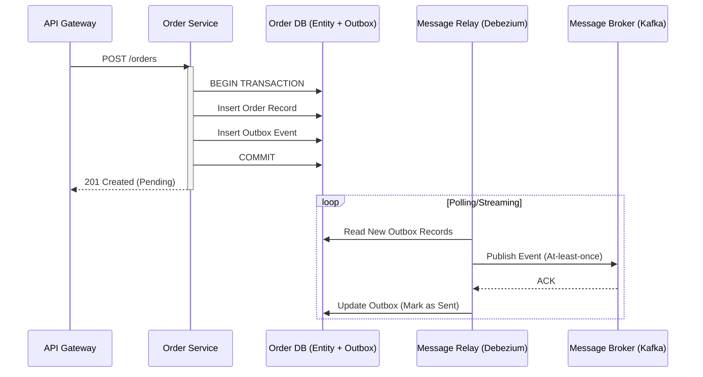

En el ecosistema de comercio moderno, la adopción de arquitecturas **MACH** (Microservices, API-first, Cloud-native, Headless) ha dejado de ser una ventaja competitiva para convertirse en el estándar de facto para la agilidad empresarial. Sin embargo, esta transición introduce una complejidad sistémica que muchos arquitectos subestiman: la pérdida de la atomicidad ACID tradicional.

Cuando abandonamos el monolito y su base de datos centralizada en favor de un enfoque *Best-of-Breed*, nos enfrentamos al desafío de mantener la integridad de los datos a través de múltiples servicios distribuidos y proveedores SaaS independientes (commercetools, Contentful, Stripe, Algolia). En este escenario, un simple "retry" no es suficiente. Si un servicio de inventario descuenta stock pero el servicio de pagos falla, ¿cómo garantizamos que el sistema regrese a un estado consistente sin intervención manual?

Este artículo profundiza en los patrones avanzados de resiliencia y consistencia que separan a las implementaciones MACH experimentales de las plataformas de grado enterprise capaces de procesar miles de transacciones por segundo con una fiabilidad del 99.99%.

## El Dilema de la Consistencia en Sistemas Composable

En una arquitectura composable, cada componente es dueño de su propio estado. El problema surge con el "Dual Write" (escritura dual): la necesidad de actualizar una base de datos local y, simultáneamente, notificar a otros servicios a través de un bus de eventos o una API. Si la base de datos confirma la transacción pero el envío del evento falla, el sistema entra en un estado de inconsistencia zombi.

Para resolver esto, debemos movernos de la consistencia inmediata a la **consistencia eventual robusta**, utilizando patrones que garanticen que, a pesar de los fallos de red o caídas de servicios, el sistema eventualmente alcanzará el estado correcto.

## Patrón 1: Transactional Outbox con Change Data Capture (CDC)

El patrón **Transactional Outbox** es la solución definitiva al problema de la escritura dual. En lugar de intentar enviar un mensaje a un broker (como Kafka o RabbitMQ) dentro de la transacción de la base de datos, el servicio escribe el evento en una tabla de "Outbox" dentro de la misma base de datos local.

### Flujo de Implementación

1.  **Transacción Atómica:** El servicio guarda la entidad de negocio (ej. un Pedido) y el evento correspondiente (PedidoCreado) en la misma transacción SQL/NoSQL.
2.  **Relay de Mensajes:** Un proceso separado (o un conector CDC como Debezium) lee la tabla de Outbox y publica los mensajes en el bus de eventos.
3.  **Eliminación/Marcado:** Una vez confirmado el envío por el broker, el mensaje se marca como procesado.



## Patrón 2: Sagas de Orquestación para Procesos de Larga Duración

Cuando un proceso de negocio involucra múltiples servicios (Checkout -> Inventario -> Pago -> Envío), no podemos usar transacciones distribuidas (2PC) debido a su baja escalabilidad y acoplamiento. El patrón **Saga** gestiona esto mediante una secuencia de transacciones locales coordinadas.

En 2026, la **Orquestación** ha ganado terreno sobre la Coreografía en entornos enterprise debido a su mayor observabilidad. Un "Orquestador de Sagas" centraliza la lógica de decisión y las **transacciones compensatorias**.

### Ejemplo de Implementación (TypeScript / Node.js)

A continuación, un ejemplo simplificado de un orquestador que maneja compensaciones (rollback lógico) cuando falla un paso.

```typescript
/**
 * Saga Orchestrator para el proceso de Checkout
 * Garantiza que si el pago falla, el inventario se reponga.
 */
class CheckoutSaga {
  async execute(orderData: OrderRequest) {
    const sagaLog: string[] = [];

    try {
      // Paso 1: Reservar Inventario
      await inventoryService.reserve(orderData.items);
      sagaLog.push('INVENTORY_RESERVED');

      // Paso 2: Procesar Pago
      const payment = await paymentService.charge(orderData.total, orderData.paymentToken);
      sagaLog.push('PAYMENT_COMPLETED');

      // Paso 3: Confirmar Pedido
      await orderService.finalize(orderData.id);
      
    } catch (error) {
      console.error('Saga failed, initiating compensation...', error);
      await this.compensate(sagaLog, orderData);
      throw new Error('Transaction aborted: System rolled back to consistent state.');
    }
  }

  private async compensate(sagaLog: string[], data: OrderRequest) {
    // Ejecutar en orden inverso a la ejecución original
    for (const step of sagaLog.reverse()) {
      if (step === 'PAYMENT_COMPLETED') {
        await paymentService.refund(data.paymentToken);
      }
      if (step === 'INVENTORY_RESERVED') {
        await inventoryService.release(data.items);
      }
    }
  }
}
```

## Patrón 3: Idempotencia Determinística

En cualquier sistema distribuido, los reintentos son inevitables. El problema es que un reintento de "procesar pago" podría resultar en un doble cargo si no se maneja correctamente. La **idempotencia** garantiza que realizar la misma operación múltiples veces tenga el mismo efecto que realizarla una sola vez.

Para implementar idempotencia de nivel enterprise, utilizamos **Idempotency Keys** generadas por el cliente (o el orquestador) y una capa de persistencia de estado de solicitud.

### Estrategia de Almacenamiento de Idempotencia

| Característica | Redis (In-Memory) | SQL (Transactional) |
| :--- | :--- | :--- |
| **Latencia** | Ultra baja (<1ms) | Media (5-10ms) |
| **Persistencia** | Volátil (configurable) | Duradera |
| **Caso de Uso** | Rate limiting, duplicados rápidos | Transacciones financieras críticas |
| **Trade-off** | Riesgo de pérdida en reinicio | Mayor carga en la DB principal |

## Patrón 4: Control de Concurrencia Adaptativo y Backpressure

Los Circuit Breakers tradicionales (como Hystrix o Resilience4j) son reactivos: esperan a que ocurran fallos para abrir el circuito. En arquitecturas MACH de alta densidad, necesitamos **Control de Concurrencia Adaptativo**.

Este patrón utiliza algoritmos de control de congestión (similares a TCP Vegas) para limitar dinámicamente el número de solicitudes permitidas basándose en la latencia actual del sistema, en lugar de un límite estático. Si el servicio de búsqueda (Algolia) empieza a responder un 20% más lento, el sistema reduce proactivamente el *throughput* para evitar un fallo en cascada.

## Comparativa de Estrategias de Consistencia

| Patrón | Consistencia | Complejidad | Latencia | Cuándo usarlo |
| :--- | :--- | :--- | :--- | :--- |
| **2PC (Two-Phase Commit)** | Fuerte (ACID) | Muy Alta | Alta | Evitar en MACH/Microservicios |
| **Outbox Pattern** | Eventual (Garantizada) | Media | Baja | Sincronización DB -> Message Broker |
| **Saga (Orquestación)** | Eventual (Compensada) | Alta | Media | Procesos de negocio multi-servicio |
| **Idempotency Keys** | Operacional | Baja | Mínima | Siempre en APIs de escritura (POST/PUT) |

## Modos de Fallo Comunes y Mitigación en Producción

### 1. El "Poison Pill" en el Outbox
**Problema:** Un mensaje mal formado en la tabla Outbox hace que el Relay falle continuamente, bloqueando todos los mensajes posteriores.
**Mitigación:** Implementar un contador de reintentos en el Relay. Si un mensaje falla N veces, moverlo a una tabla de `DeadLetterOutbox` y alertar al equipo de SRE.

### 2. Explosión de Compensaciones en Sagas
**Problema:** Durante un pico de tráfico, el servicio de pagos cae. Miles de Sagas intentan ejecutar compensaciones (refunds) simultáneamente, saturando el servicio de inventario.
**Mitigación:** Aplicar **Exponential Backoff** y **Jitter** en las transacciones compensatorias. No todas las compensaciones deben ser inmediatas; pueden encolarse para procesamiento asíncrono.

### 3. Drift de Datos en Consistencia Eventual
**Problema:** Debido a retrasos en el bus de eventos, el frontend muestra stock disponible que ya no existe.
**Mitigación:** Implementar **Optimistic UI** con validación en el "Read Model" y usar técnicas de "Read-Your-Writes" (asegurar que un usuario vea sus propios cambios inmediatamente aunque el resto del sistema no).

## Implementación Técnica: Middleware de Idempotencia en Go

Para servicios de alto rendimiento, la idempotencia debe ser una preocupación transversal (cross-cutting concern). Aquí un ejemplo de un middleware en Go que utiliza Redis para validar claves de idempotencia.

```go
func IdempotencyMiddleware(redisClient *redis.Client) gin.HandlerFunc {
    return func(c *gin.Context) {
        idempotencyKey := c.GetHeader("X-Idempotency-Key")
        if idempotencyKey == "" {
            c.Next() // Opcional: Forzar error si es requerido
            return
        }

        // Intentar setear la llave con NX (Set if Not Exists)
        locked, err := redisClient.SetNX(c, idempotencyKey, "processing", 24*time.Hour).Result()
        
        if err != nil {
            c.AbortWithStatus(http.StatusInternalServerError)
            return
        }

        if !locked {
            // La llave ya existe, verificar si terminó o sigue en proceso
            status, _ := redisClient.Get(c, idempotencyKey).Result()
            if status == "processing" {
                c.AbortWithStatusJSON(http.StatusConflict, gin.H{"error": "Request in progress"})
            } else {
                c.AbortWithStatusJSON(http.StatusOK, "Original Response (Cached)")
            }
            return
        }

        c.Next()
    }
}
```

## Conclusión: Checklist de Implementación para Arquitectos

Para asegurar que su arquitectura MACH sea verdaderamente resiliente en 2026, cada equipo de ingeniería debe validar los siguientes puntos:

- [ ] **¿Dual Write eliminado?** Todos los servicios que modifican estado y emiten eventos deben usar el patrón Outbox o Change Data Capture.
- [ ] **¿Idempotencia por diseño?** Todas las mutaciones de estado (APIs de escritura) deben aceptar una `X-Idempotency-Key`.
- [ ] **¿Estrategia de Sagas definida?** Los procesos que cruzan límites de microservicios deben tener transacciones compensatorias documentadas y probadas (Chaos Engineering).
- [ ] **¿Observabilidad de Consistencia?** Existen dashboards que miden el "lag" entre la transacción inicial y la consistencia final en los modelos de lectura (CQRS).
- [ ] **¿Límites de Concurrencia?** El sistema cuenta con mecanismos de *backpressure* para proteger servicios lentos de una avalancha de peticiones.

La resiliencia en arquitecturas MACH no se logra añadiendo más infraestructura, sino diseñando para el fallo inevitable. Al implementar estos patrones, transformamos un sistema frágil de piezas interconectadas en una plataforma robusta capaz de autorrepararse y mantener la integridad del negocio bajo cualquier circunstancia.