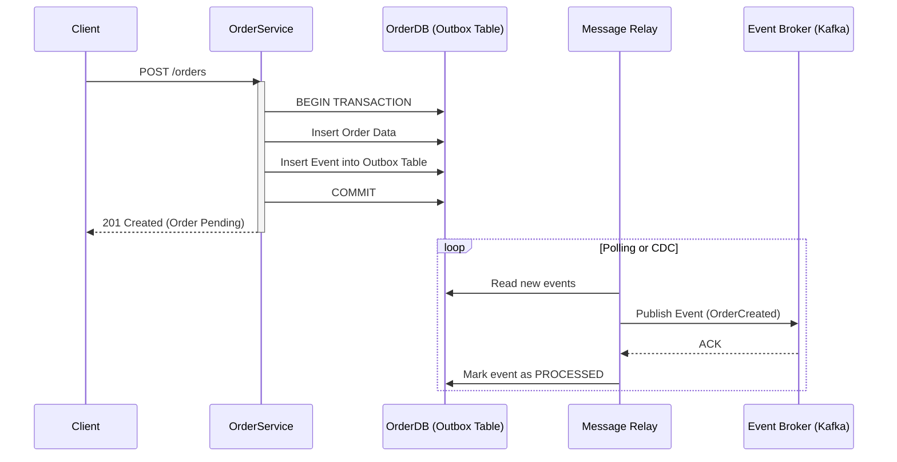

En el ecosistema del **Composable Commerce** y las arquitecturas **MACH** (Microservices, API-first, Cloud-native, Headless), la agilidad es el motor, pero la resiliencia es el chasis que permite que ese motor no se desintegre a alta velocidad. Para 2026, las empresas enterprise han superado la fase de "simplemente movernos a microservicios". El reto actual no es la conectividad, sino la **integridad sistémica** ante fallos parciales y la gestión de la consistencia en entornos donde la latencia de red y las particiones son una certeza estadística.

El problema real que enfrentan los CTOs y Principal Architects hoy no es un servidor caído —la nube resolvió eso hace una década—, sino el **"Monolito Distribuido"**. Este fenómeno ocurre cuando los servicios están tan acoplados temporalmente que el fallo de un proveedor de pagos externo o un microservicio de inventario desencadena una cascada de errores que detiene toda la plataforma de venta. Peor aún es la **corrupción de datos silenciosa** causada por reintentos (retries) no idempotentes o estados de carrera en sistemas de consistencia eventual.

Este artículo profundiza en los patrones de diseño que separan a las arquitecturas robustas de las frágiles, enfocándose en la consistencia transaccional distribuida y el aislamiento de fallos de radio quirúrgico.

## El Dilema de la Escritura Dual y la Consistencia Eventual

En una arquitectura MACH, un solo proceso de negocio (ej. "Finalizar Compra") suele involucrar múltiples servicios: Order Management (OMS), Payment Gateway, Inventory y Loyalty. El error más común es intentar coordinar estos servicios mediante llamadas REST/gRPC síncronas dentro de una transacción de base de datos local.

Si la base de datos confirma la orden, pero la llamada al servicio de inventario falla por un timeout, hemos caído en el problema de la **Escritura Dual (Dual Write)**. El sistema está ahora en un estado inconsistente.

### Patrón Transactional Outbox: Garantizando la Entrega "At-Least-Once"

Para resolver esto sin recurrir a protocolos pesados y poco escalables como Two-Phase Commit (2PC), implementamos el patrón **Transactional Outbox**. En lugar de enviar un mensaje directamente al broker (Kafka, RabbitMQ, EventBridge) durante la transacción, el servicio escribe el evento en una tabla de "Outbox" dentro de su propia base de datos, usando la misma transacción atómica que los datos de negocio.



Este patrón garantiza que el mensaje se enviará *si y solo si* la transacción local fue exitosa. El componente "Message Relay" puede ser un proceso que hace polling o, preferiblemente, una herramienta de **Change Data Capture (CDC)** como Debezium.

## Sagas: Coordinación de Transacciones Distribuidas

Cuando una operación abarca múltiples microservicios, necesitamos una **Saga**. Una Saga es una secuencia de transacciones locales. Cada transacción actualiza la base de datos y publica un mensaje o evento para disparar la siguiente transacción. Si una falla, la Saga ejecuta **transacciones compensatorias** para deshacer los cambios anteriores.

### Orquestación vs. Coreografía

| Característica | Coreografía (Event-Driven) | Orquestación (Centralizada) |
| :--- | :--- | :--- |
| **Acoplamiento** | Muy bajo. Los servicios no se conocen entre sí. | Moderado. El orquestador conoce a los participantes. |
| **Complejidad** | Difícil de rastrear en flujos complejos (efecto espagueti). | Centralizada y fácil de visualizar/monitorear. |
| **Punto de fallo** | Distribuido. | El Orquestador (requiere alta disponibilidad). |
| **Ideal para...** | Flujos simples con 2-3 servicios. | Procesos de negocio complejos (Checkout, Devoluciones). |

### Implementación de Idempotencia: El Escudo Indispensable

En cualquier sistema distribuido que use reintentos, la **idempotencia** no es opcional. Un consumidor debe ser capaz de procesar el mismo mensaje múltiples veces sin efectos secundarios no deseados.

A continuación, un ejemplo de un middleware de idempotencia en **TypeScript** para un servicio de procesamiento de pagos:

```typescript
import { Request, Response, NextFunction } from 'express';
import { redisClient } from './redis-config';

/**
 * Middleware para asegurar que las peticiones con el mismo 'Idempotency-Key'
 * solo se procesen una vez dentro de una ventana de tiempo.
 */
export const idempotencyGuard = async (req: Request, res: Response, next: NextFunction) => {
  const key = req.headers['idempotency-key'];

  if (!key || typeof key !== 'string') {
    return res.status(400).json({ error: 'Missing Idempotency-Key header' });
  }

  const cacheKey = `idempotency:${key}`;
  
  // 1. Verificar si la llave ya existe
  const cachedResponse = await redisClient.get(cacheKey);
  if (cachedResponse) {
    const { status, body } = JSON.parse(cachedResponse);
    return res.status(status).json(body);
  }

  // 2. Bloqueo optimista para evitar condiciones de carrera (Race Conditions)
  const locked = await redisClient.set(cacheKey, 'PROCESSING', { NX: true, EX: 300 });
  if (!locked) {
    return res.status(409).json({ error: 'Request is already being processed' });
  }

  // Sobrescribir res.send para capturar y cachear la respuesta final
  const originalSend = res.send;
  res.send = function (body): Response {
    redisClient.set(cacheKey, JSON.stringify({ status: res.statusCode, body: JSON.parse(body) }), { EX: 86400 });
    return originalSend.call(this, body);
  };

  next();
};
```

## Cell-Based Architecture: Aislamiento de Radio de Explosión (Blast Radius)

Incluso con Circuit Breakers y Bulkheads, un fallo masivo en una región de la nube o un error de configuración global puede tumbar toda la plataforma. La **Arquitectura Basada en Celdas (Cell-Based Architecture)** es el patrón avanzado que utilizan gigantes como AWS y Netflix para limitar el radio de explosión.

En lugar de tener un pool gigante de microservicios para todos los clientes, dividimos la infraestructura en "Celdas" independientes. Cada celda es una instancia completa de la arquitectura (Gateway, Microservicios, DB) que sirve a un subconjunto de la carga (ej. por ID de cliente o región geográfica).

### Beneficios de las Celdas:
1.  **Aislamiento Total:** Un fallo en la Celda A no afecta a la Celda B.
2.  **Actualizaciones Seguras:** Podemos desplegar una nueva versión (Canary) en una sola celda, afectando solo al 5% de los usuarios.
3.  **Escalabilidad Predecible:** En lugar de escalar un sistema masivo y complejo, simplemente añadimos más celdas.

## Comparativa de Trade-offs Arquitectónicos

| Patrón | Cuándo Usarlo | Cuándo Evitarlo | Costo de Implementación |
| :--- | :--- | :--- | :--- |
| **Transactional Outbox** | Cuando la consistencia entre DB y Mensajería es crítica. | En sistemas de solo lectura o baja criticidad de datos. | Medio (Requiere CDC o Relay). |
| **Saga (Orquestada)** | Procesos de negocio largos con múltiples pasos compensatorios. | Flujos simples de un solo paso. | Alto (Requiere motor de estados). |
| **Cell-Based Arch** | Plataformas Globales con requisitos de disponibilidad >99.99%. | Startups o aplicaciones con pocos usuarios/tráfico. | Muy Alto (Complejidad de ruteo). |
| **Adaptive Concurrency** | Servicios que sufren picos de tráfico impredecibles. | Servicios con carga constante y predecible. | Medio (Requiere observabilidad). |

## Modos de Fallo Comunes y Mitigación

### 1. El "Poison Pill" (Mensaje Envenenado)
Un mensaje malformado llega a la cola, el consumidor falla, el mensaje vuelve a la cola y se repite infinitamente, bloqueando el procesamiento.
*   **Mitigación:** Implementar **Dead Letter Queues (DLQ)** con un límite de reintentos (maxRetries). Monitorear el tamaño de la DLQ para alertas inmediatas.

### 2. El "Thundering Herd" (Manada Atronadora)
Tras una caída del sistema, todos los clientes y servicios intentan reconectarse y reintentar peticiones simultáneamente, tumbando el sistema nuevamente.
*   **Mitigación:** Usar **Exponential Backoff con Jitter** (ruido aleatorio) en todos los clientes. Implementar **Load Shedding** en el API Gateway para rechazar peticiones excedentes con un error 503 rápido.

### 3. Split Brain en Sagas
Dos orquestadores creen que son los responsables de una misma transacción debido a una partición de red.
*   **Mitigación:** Utilizar un sistema de bloqueo distribuido (como etcd o Redis con Redlock) o bases de datos con consistencia fuerte (Linearizability) para el estado de la saga.

## Conclusión: Checklist de Implementación para Equipos de Ingeniería

Para alcanzar la madurez en resiliencia MACH hacia 2026, su equipo debe validar los siguientes puntos:

- [ ] **Idempotencia por Defecto:** ¿Todas nuestras APIs de escritura aceptan y validan un `Idempotency-Key`?
- [ ] **Eliminación de Escrituras Duales:** ¿Estamos usando el patrón Outbox para enviar eventos tras cambios en la DB?
- [ ] **Estrategia de Compensación:** Para cada flujo "Happy Path", ¿existe un diseño documentado de cómo revertir los cambios si un paso intermedio falla?
- [ ] **Observabilidad de Sagas:** ¿Podemos visualizar en tiempo real en qué paso se encuentra una transacción distribuida?
- [ ] **Aislamiento de Recursos:** ¿Están nuestros servicios críticos protegidos por Bulkheads y límites de concurrencia adaptativos?
- [ ] **Pruebas de Caos (Chaos Engineering):** ¿Inyectamos fallos en producción (latencia, caídas de nodos) para verificar que las Sagas compensan correctamente?

La resiliencia no es un "feature" que se añade al final; es una propiedad emergente del diseño arquitectónico. En un mundo de servicios desacoplados, la capacidad de manejar el fallo con elegancia es lo que define el éxito de una estrategia de Composable Commerce a escala global.