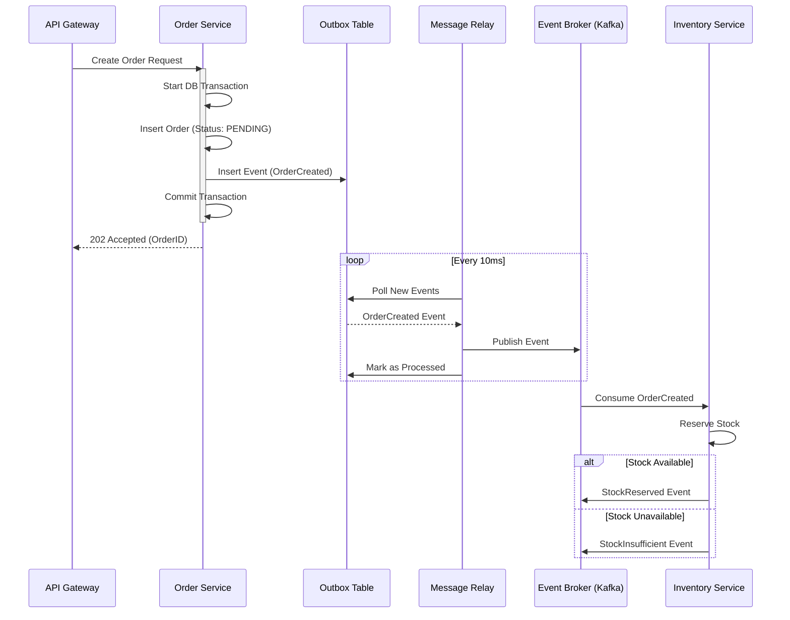

En el panorama tecnológico de 2026, la adopción de arquitecturas MACH (Microservices, API-first, Cloud-native, Headless) ha dejado de ser una ventaja competitiva para convertirse en el estándar de facto de la agilidad empresarial. Sin embargo, esta flexibilidad tiene un costo implícito que muchos arquitectos subestiman hasta que es demasiado tarde: el **Impuesto de los Sistemas Distribuidos**.

A medida que descomponemos monolitos en ecosistemas de *Best-of-Breed*, la red se convierte en nuestro mayor enemigo. Las transacciones ACID locales desaparecen, dando paso a la complejidad de la consistencia eventual y los fallos parciales. Este artículo profundiza en los patrones avanzados que separan a las plataformas que simplemente "funcionan" de aquellas que poseen una resiliencia de grado enterprise, capaces de soportar picos de tráfico masivos y fallos sistémicos de proveedores externos sin degradar la experiencia del usuario.

## El Dilema de la Consistencia en el Composable Commerce

En un entorno de comercio compuesto, una sola acción del usuario (como "Finalizar Compra") puede involucrar a un motor de promociones, un sistema de inventario, un procesador de pagos, un CRM y un ERP de logística, todos operados por diferentes proveedores SaaS o microservicios internos.

El problema real surge cuando el servicio de inventario confirma la reserva, pero el procesador de pagos falla por un timeout. ¿Cómo revertimos la reserva de inventario de forma fiable? Aquí es donde los patrones tradicionales de "reintento simple" fallan, generando estados inconsistentes que requieren costosas reconciliaciones manuales.

### El Problema del "Dual-Write"
Uno de los errores más comunes en arquitecturas MACH es intentar actualizar una base de datos local y enviar un evento a un bus (como Kafka o RabbitMQ) de forma secuencial. Si el servicio se bloquea entre estas dos operaciones, el sistema queda en un estado inconsistente. Para resolver esto, debemos implementar patrones que garanticen la atomicidad en sistemas distribuidos.

## Arquitectura de Referencia: Saga Pattern y Transactional Outbox

Para gestionar procesos de larga duración y transacciones distribuidas, el patrón **Saga** es fundamental. En su variante de orquestación, un componente central dirige el flujo de trabajo y gestiona las transacciones compensatorias.



## Implementación Técnica: Transactional Outbox con TypeScript y Prisma

A continuación, presentamos una implementación robusta del patrón **Transactional Outbox**. Este patrón asegura que un mensaje solo se envíe si la transacción de la base de datos local tiene éxito.

```typescript
/**
 * @file outbox-service.ts
 * @description Implementación de persistencia atómica para sistemas distribuidos.
 */

import { PrismaClient } from '@prisma/client';
import { v4 as uuidv4 } from 'uuid';

const prisma = new PrismaClient();

interface OrderData {
  customerId: string;
  items: Array<{ sku: string; quantity: number }>;
  total: number;
}

export async function createOrderSecurely(orderData: OrderData) {
  return await prisma.$transaction(async (tx) => {
    // 1. Crear la orden en el dominio
    const order = await tx.order.create({
      data: {
        id: uuidv4(),
        customerId: orderData.customerId,
        total: orderData.total,
        status: 'PENDING',
      },
    });

    // 2. Insertar el evento en la tabla Outbox dentro de la misma transacción
    // Esto garantiza que si la orden falla, el evento no se guarda.
    await tx.outbox.create({
      data: {
        id: uuidv4(),
        aggregateType: 'ORDER',
        aggregateId: order.id,
        eventType: 'ORDER_CREATED',
        payload: JSON.stringify({
          orderId: order.id,
          items: orderData.items,
        }),
        status: 'PENDING',
        createdAt: new Date(),
      },
    });

    return order;
  });
}

/**
 * Worker que procesa el Outbox (Message Relay)
 * En producción, esto suele ser un proceso independiente o un Change Data Capture (CDC)
 */
export async function relayOutboxEvents() {
  const pendingEvents = await prisma.outbox.findMany({
    where: { status: 'PENDING' },
    take: 100,
  });

  for (const event of pendingEvents) {
    try {
      // Publicar al Broker (ej. Kafka, EventBridge)
      await messageBroker.publish(event.eventType, JSON.parse(event.payload));

      // Marcar como procesado
      await prisma.outbox.update({
        where: { id: event.id },
        data: { status: 'PROCESSED', processedAt: new Date() },
      });
    } catch (error) {
      console.error(`Error publicando evento ${event.id}:`, error);
      // Implementar lógica de reintento exponencial aquí
    }
  }
}
```

## Patrones de Resiliencia: Más allá del Circuit Breaker

Si bien el *Circuit Breaker* es vital, en 2026 la industria ha evolucionado hacia patrones de **Resiliencia Adaptativa**.

### 1. Adaptive Throttling (Estrangulamiento Adaptativo)
En lugar de rechazar peticiones basándose en un número estático (Rate Limiting), el sistema monitorea la latencia de los servicios *downstream*. Si la latencia del PIM (Product Information Management) sube de 200ms a 2s, el API Gateway reduce automáticamente el tráfico permitido hacia ese servicio específico para evitar un fallo en cascada.

### 2. Cell-based Architecture (Arquitectura por Celdas)
Para empresas de escala global, el fallo de una región o un microservicio no debería afectar a toda la base de usuarios. La arquitectura por celdas divide la infraestructura en unidades aisladas (celdas) que contienen todos los servicios necesarios para procesar un subconjunto de clientes.

| Característica | Saga (Orquestada) | Saga (Coreografiada) | Outbox Pattern |
| :--- | :--- | :--- | :--- |
| **Complejidad** | Alta (Requiere orquestador) | Media (Eventos distribuidos) | Baja/Media |
| **Acoplamiento** | Centralizado | Descentralizado | Local al servicio |
| **Visibilidad** | Excelente (Estado central) | Difícil de trazar | N/A |
| **Ideal para...** | Procesos de negocio complejos | Microservicios desacoplados | Garantizar entrega de eventos |
| **Riesgo** | Punto único de fallo (Orquestador) | "Spaghetti" de eventos | Latencia en el Relay |

## Estrategias de Mitigación ante Modos de Fallo Comunes

### El Problema de la Idempotencia
En sistemas distribuidos, la red garantiza "al menos una entrega" (at-least-once delivery). Esto significa que un servicio puede recibir el mismo evento de "Pago Completado" dos veces.

**Mitigación:** Todo consumidor de eventos debe implementar una verificación de idempotencia. Utilice una tabla de `processed_messages` donde se almacene el `message_id` único. Si el ID ya existe, se ignora el mensaje pero se devuelve un ACK exitoso para evitar reintentos infinitos.

### Clock Skew (Desviación de Reloj)
En sistemas que dependen de marcas de tiempo para la consistencia (como Cassandra o YugabyteDB), una diferencia de milisegundos entre servidores puede causar que una actualización antigua sobrescriba una nueva.

**Mitigación:** Utilice *Hybrid Logical Clocks* (HLC) o delegue la generación de timestamps a la base de datos distribuida en lugar de la capa de aplicación.

### Poison Pill Messages
Un mensaje malformado que hace que el consumidor falle sistemáticamente, bloqueando la cola de procesamiento.

**Mitigación:** Implementar **Dead Letter Queues (DLQ)** con alertas automáticas. Si un mensaje falla 3 veces, se mueve a la DLQ para inspección manual sin detener el flujo de otros pedidos.

## Conclusión: El Checklist de Implementación para 2026

Para los líderes de ingeniería que operan bajo el paradigma MACH, la resiliencia no es una característica, es el producto. No se trata de evitar fallos, sino de diseñar sistemas que fallen con elegancia.

### Checklist para el Principal Architect:
- [ ] **¿Tenemos Idempotencia en todos los endpoints de escritura?** Cada API que modifique estado debe aceptar un `X-Idempotency-Key`.
- [ ] **¿Estamos usando el patrón Outbox?** Evite el "dual-write" a toda costa para mantener la integridad entre DB y Bus de eventos.
- [ ] **¿Existen transacciones compensatorias definidas?** Por cada acción de "Reserva", debe existir una lógica de "Cancelación" automatizada en la Saga.
- [ ] **¿Hemos implementado Load Shedding?** El sistema debe ser capaz de rechazar tráfico no crítico (ej. recomendaciones) para salvar el flujo crítico (ej. checkout) durante un pico.
- [ ] **¿Observabilidad de Negocio?** No solo métricas técnicas (CPU/RAM), sino monitoreo de "Tasa de éxito de pedidos por minuto". Una caída en esta métrica es el indicador de fallo más real en MACH.

La arquitectura MACH ofrece una agilidad sin precedentes, pero solo aquellos que dominen la ingeniería de la consistencia y la resiliencia podrán escalar sus plataformas hacia el futuro del comercio global.