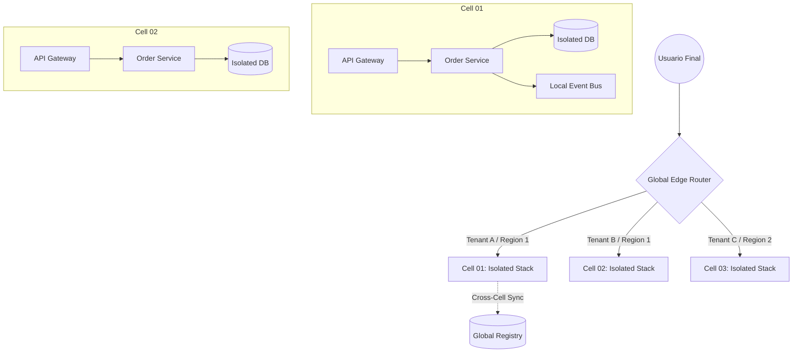

En el ecosistema del **Composable Commerce** y las arquitecturas **MACH** (Microservices, API-first, Cloud-native, Headless), la flexibilidad es nuestra mayor virtud, pero la complejidad distribuida es nuestro mayor riesgo. Para 2026, las empresas enterprise han dejado de preguntarse *si* un sistema fallará, para centrarse en *cómo* sobrevivirá el sistema cuando múltiples servicios de terceros y microservicios internos degraden su rendimiento simultáneamente.

El problema real en entornos de alta transaccionalidad no es la caída total de un servicio (fácil de detectar), sino la **degradación parcial y la inconsistencia de datos** que se propaga silenciosamente a través de la malla de servicios. Este artículo profundiza en los patrones de ingeniería de resiliencia y estrategias de consistencia que separan a las plataformas líderes de aquellas que colapsan bajo la presión de eventos de alto tráfico o fallos en cascada.

## El Dilema de la Fragmentación en MACH

Cuando adoptamos un enfoque *Best-of-Breed*, terminamos con un grafo de dependencias masivo: un CMS headless, un motor de promociones, un sistema de búsqueda (Algolia/Elastic), un Checkout y múltiples pasarelas de pago. Si cada uno de estos servicios tiene un SLA del 99.9%, la disponibilidad compuesta de una ruta crítica que dependa de 10 de ellos cae drásticamente a un ~99.0%. En términos de negocio, esto representa más de 3 días de inactividad al año.

Para mitigar esto, debemos evolucionar más allá del simple *Circuit Breaker* y adoptar patrones de **Aislamiento por Celdas (Cell-based Architecture)** y **Consistencia Dual-Phase** basada en eventos.

## Arquitectura Basada en Celdas (Cell-based Architecture)

La arquitectura de celdas es el patrón definitivo para limitar el **Blast Radius** (radio de explosión) de un fallo. En lugar de tener un clúster masivo de microservicios que comparten recursos, dividimos la infraestructura en "celdas" autónomas que contienen una instancia de cada servicio necesario para procesar una transacción de extremo a extremo.

### Diagrama de Flujo: Aislamiento y Enrutamiento por Celdas



Este enfoque permite que un fallo catastrófico en la base de datos de la `Cell 01` no afecte en absoluto a los usuarios en la `Cell 02`. En 2026, la automatización de infraestructura (IaC) permite desplegar estas celdas dinámicamente según la carga geográfica.

## Consistencia de Datos: El Patrón Transactional Outbox

Uno de los mayores dolores en microservicios es la "escritura dual" (dual-write). Intentar guardar en la base de datos y enviar un evento a Kafka/RabbitMQ en el mismo bloque de código es una receta para la inconsistencia si el bus de mensajes falla justo después de que la DB confirme la transacción.

El patrón **Transactional Outbox** garantiza la consistencia atómica entre el estado del servicio y los eventos emitidos.

### Implementación de Referencia (TypeScript & Prisma)

En este ejemplo, aseguramos que la creación de una orden y el evento de "Orden Creada" ocurran dentro de la misma transacción de base de datos.

```typescript
import { PrismaClient } from '@prisma/client';
const prisma = new PrismaClient();

async function createOrder(orderData: any) {
  return await prisma.$transaction(async (tx) => {
    // 1. Persistir la entidad de negocio
    const order = await tx.order.create({
      data: {
        userId: orderData.userId,
        total: orderData.total,
        status: 'PENDING',
      },
    });

    // 2. Persistir el evento en la tabla 'Outbox' dentro de la misma TX
    await tx.outbox.create({
      data: {
        aggregateId: order.id,
        aggregateType: 'ORDER',
        eventType: 'ORDER_CREATED',
        payload: JSON.stringify(order),
        processed: false,
      },
    });

    return order;
  });
}

/**
 * Un proceso independiente (Relay) lee la tabla Outbox, 
 * publica en el Message Broker y marca como procesado.
 */
async function outboxRelay() {
  const pendingEvents = await prisma.outbox.findMany({
    where: { processed: false },
    take: 100,
  });

  for (const event of pendingEvents) {
    try {
      await messageBroker.publish(event.eventType, event.payload);
      await prisma.outbox.update({
        where: { id: event.id },
        data: { processed: true, processedAt: new Date() },
      });
    } catch (err) {
      console.error(`Failed to publish event ${event.id}`, err);
      // Implementar backoff exponencial aquí
    }
  }
}
```

## Orquestación vs. Coreografía en Sagas Distribuidas

Cuando una transacción involucra múltiples servicios (ej: Inventario -> Pago -> Envío), la consistencia eventual es obligatoria. Aquí es donde los patrones de **Saga** entran en juego.

| Característica | Saga por Coreografía | Saga por Orquestación |
| :--- | :--- | :--- |
| **Complejidad** | Baja inicialmente, alta al escalar. | Alta inicialmente (requiere un orquestador). |
| **Acoplamiento** | Bajo (basado en eventos). | Centralizado en el orquestador. |
| **Visibilidad** | Difícil de rastrear el flujo completo. | Excelente (el orquestador es la fuente de verdad). |
| **Punto de Fallo** | Distribuido. | El orquestador (debe ser altamente disponible). |
| **Cuándo usar** | Flujos simples (2-3 servicios). | Flujos complejos de negocio enterprise. |

### Recomendación de Arquitecto:
Para 2026, la recomendación es usar **Orquestación** mediante herramientas como *Temporal.io* o *AWS Step Functions* para procesos críticos de negocio, dejando la **Coreografía** solo para notificaciones secundarias o actualizaciones de caché (Read Models).

## Resiliencia ante Fallos de Terceros: Adaptive Throttling y Load Shedding

En una arquitectura MACH, dependemos de APIs externas. Si un proveedor de búsqueda empieza a responder con latencia de 5 segundos en lugar de 100ms, sus hilos de ejecución en el API Gateway se agotarán, causando un fallo en cascada.

### Patrón: Load Shedding (Descarte de Carga)
El sistema debe ser capaz de identificar las peticiones "críticas" de las "no críticas". Si la CPU supera el 80%, el sistema debe rechazar automáticamente peticiones de "recomendaciones de productos" para salvar el "proceso de checkout".

```python
# Ejemplo conceptual de Middleware de Load Shedding en Python (FastAPI)
from fastapi import Request, HTTPException
import psutil

async def load_shedding_middleware(request: Request, call_next):
    cpu_usage = psutil.cpu_percent(interval=None)
    
    # Definir rutas críticas
    critical_paths = ["/api/v1/checkout", "/api/v1/payments"]
    
    if cpu_usage > 90 and request.url.path not in critical_paths:
        # Rechazar tráfico no esencial para proteger el core
        raise HTTPException(status_code=503, detail="System under heavy load, please try again later")
    
    return await call_next(request)
```

## Modos de Fallo Comunes y Mitigación

1.  **Poison Pill (Mensaje Venenoso):** Un mensaje en la cola que hace que el consumidor crashee repetidamente.
    *   *Mitigación:* Implementar **Dead Letter Queues (DLQ)** con un límite de reintentos (max_retries = 3) y alertas inmediatas.
2.  **Split-Brain en Bases de Datos Distribuidas:** Dos nodos creen que son el "Leader".
    *   *Mitigación:* Utilizar protocolos de consenso como **Raft** o **Paxos** (nativos en herramientas como CockroachDB o YugabyteDB).
3.  **Thundering Herd (Manada Tronante):** Cuando un caché expira y miles de peticiones golpean la base de datos simultáneamente.
    *   *Mitigación:* Implementar **Cache Stampede Protection** mediante bloqueos probabilísticos o "Promise Coalescing".

## Estrategia de Implementación: Checklist para 2026

Para asegurar que tu arquitectura MACH sea verdaderamente resiliente, el equipo de ingeniería debe validar los siguientes puntos:

- [ ] **Idempotencia Garantizada:** ¿Todas las APIs de mutación (POST/PUT) aceptan un `Idempotency-Key`? Esto es vital para reintentos seguros.
- [ ] **Observabilidad Semántica:** No basta con logs. ¿Tenemos trazas distribuidas (OpenTelemetry) que vinculen un fallo en el Checkout con un evento específico en el bus de mensajes?
- [ ] **Chaos Engineering:** ¿Ejecutamos experimentos semanales (ej: inyectar latencia en el CMS) en entornos de staging o producción controlada?
- [ ] **Graceful Degradation:** Si el servicio de recomendaciones falla, ¿el frontend muestra productos estáticos por defecto en lugar de un error 500?
- [ ] **Backpressure:** ¿Nuestros consumidores de eventos tienen mecanismos para ralentizar el consumo si la base de datos está saturada?

## Conclusión

La resiliencia en arquitecturas MACH no es un "feature" que se añade al final; es una propiedad emergente del diseño sistémico. Al adoptar **Celdas de Aislamiento**, garantizar la consistencia mediante el **Transactional Outbox** y proteger nuestros servicios con **Load Shedding**, transformamos una red frágil de microservicios en una plataforma robusta capaz de escalar infinitamente.

En la era del Composable Commerce, la ventaja competitiva no es solo quién tiene las mejores funcionalidades, sino quién ofrece la experiencia más estable y confiable ante la incertidumbre inherente de la nube.