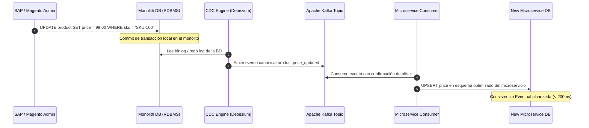

La modernización de plataformas de comercio digital enterprise representa uno de los mayores desafíos de ingeniería de software en la actualidad. Organizaciones con infraestructuras basadas en monolitos consolidados como **SAP Commerce Cloud (anteriormente Hybris)** o **Adobe Commerce (Magento 2)** se enfrentan a un punto de fricción crítico: ciclos de despliegue lentos, acoplamiento extremo en la base de datos (con esquemas relacionales masivos o el temido modelo EAV), costos astronómicos de mantenimiento y dificultad para innovar a la velocidad que exige el mercado.

Intentar sustituir estas plataformas mediante una reescritura completa desde cero (*Big Bang Rewrite*) es una de las principales causas de fracaso de proyectos tecnológicos en empresas Fortune 500. El riesgo operativo, el impacto financiero derivado del tiempo de salida al mercado (*time-to-market*) y la imposibilidad de congelar los requerimientos de negocio durante los dos o tres años que dura la transición hacen inviable este enfoque.

La alternativa probada por la industria es el **Patrón Strangler Fig** (Higuera Estranguladora), acuñado originalmente por Martin Fowler. En este artículo técnico analizamos cómo ejecutar una descomposición quirúrgica, incremental y sin tiempo de inactividad de un monolito de comercio, transformándolo en un ecosistema Composable y MACH resiliente.

---

## 1. Anatomía del Monolito: SAP Commerce vs. Magento 2

Para desmantelar un monolito de comercio electrónico, primero debemos entender dónde reside su acoplamiento interno:

```
+-------------------------------------------------------------------------+
|                         MONOLITO TRADICIONAL                            |
|                                                                         |
|  +-------------------+  +-------------------+  +---------------------+  |
|  | Presentation Tier |  |  Business Logic   |  |   Data Tier (ACID)  |  |
|  | (JSP, Hybris      |  | (Cart, Promotion, |  | (Single RDBMS,      |  |
|  | Accelerator, PWA, |  |  Checkout, OMS,   |  |  SAP TypeSystem /   |  |
|  | Magento Luma/Hyva)|  |  Pricing, PIM)    |  |  Magento EAV Model) |  |
|  +-------------------+  +-------------------+  +---------------------+  |
+-------------------------------------------------------------------------+
```

* **SAP Commerce Cloud (Hybris):** Posee un modelo de datos fuertemente tipado gestionado a través de su *TypeSystem*. La lógica de negocio está empaquetada en extensiones Java que interactúan directamente con un ServiceLayer acoplado a un motor ORM propietario. La persistencia unificada sobre Oracle o Microsoft SQL Server provoca que una modificación en el modelo de precios o promociones impacte el rendimiento de la búsqueda y el catálogo.
* **Adobe Commerce (Magento):** Implementa el modelo *Entity-Attribute-Value (EAV)* para soportar la extensibilidad de catálogo, lo que genera consultas SQL extremadamente complejas con múltiples `JOIN` reflexivos. Su dependencia histórica del renderizado de servidor (PHP/FPM con Varnish) y plugins acoplados mediante *interceptors* (`di.xml`) hace que extraer un módulo sin romper dependencias implícitas sea una tarea de alto riesgo.

La estrategia Strangler Fig no busca migrar módulos de código fuente; busca **interceptar capacidades de negocio en el perímetro y redirigirlas a nuevos microservicios autónomos**.

---

## 2. Topología de la Arquitectura de Transición

El núcleo del patrón es la creación de una capa de intercepción (*Strangler Facade*) en el borde (*Edge*) que expone contratos de API canónicos unificados para el frontend (Headless) y arbitra el tráfico entre el monolito residual y los nuevos servicios Composable.

```mermaid
flowchart TD
    subgraph Clients["Canales / Clientes"]
        Web["Headless Storefront (Next.js / SSR)"]
        Mobile["Mobile App / POS"]
    end

    subgraph Edge["Perímetro & Strangler Facade"]
        CF["Edge Router / API Gateway\n(Cloudflare Workers / Envoy)"]
        AuthBridge["Identity & Auth Consolidation Engine"]
    end

    subgraph ComposableServices["Nuevos Microservicios MACH"]
        CatalogSvc["Catalog & Search API\n(Algolia / Meilisearch)"]
        CartSvc["Cart & Inventory Service\n(Go / PostgreSQL)"]
        OrderSvc["Checkout & Order Engine\n(Event-Driven)"]
    end

    subgraph LegacyMonolith["Monolito Legacy"]
        SAP_MAGENTO["SAP Commerce (Hybris) / Adobe Commerce"]
        LegacyDB[("Monolithic RDBMS\n(Oracle / MySQL)")]
        SAP_MAGENTO --> LegacyDB
    end

    subgraph EventMesh["Event Streaming Backbone"]
        Kafka["Apache Kafka / AWS EventBridge"]
    end

    Clients --> CF
    CF --> AuthBridge
    
    CF -->|Ruta: /api/v2/products*| CatalogSvc
    CF -->|Ruta: /api/v2/cart*| CartSvc
    CF -->|Ruta: /api/v2/orders*| OrderSvc
    CF -->|Fallback / Legacy routes| SAP_MAGENTO

    LegacyDB -.->|Change Data Capture (Debezium)| Kafka
    Kafka -.->|Sync Events| ComposableServices
```

---

## 3. Hoja de Ruta de Estrangulación Paso a Paso

### Fase 0: La Fachada de Enrutamiento y Desacoplamiento del Frontend

Antes de extraer cualquier servicio de backend, se debe romper la dependencia del renderizado monolítico (Hybris Accelerator o Magento Luma). 
1. Se despliega una interfaz de usuario totalmente desacoplada (Next.js, Remix o Nuxt).
2. Se implementa un **Edge Router** (utilizando tecnologías como Cloudflare Workers, Envoy Proxy o Kong Gateway).
3. Todo el tráfico del cliente apunta exclusivamente a la fachada. En este punto inicial, el 100% de las peticiones a la API son dirigidas al monolito a través de sus endpoints legacy (SAP OCC o Magento REST/GraphQL).

### Fase 1: Extracción del Dominio de Lectura (Catálogo y Búsqueda)

El catálogo de productos (PDP, PLP, facetado) es el mejor candidato para iniciar la estrangulación. Es un dominio intensivo en lectura (*read-heavy*), con baja necesidad de transacciones ACID y alto impacto en la velocidad percibida por el usuario.

* **Estrategia de Sincronización:** Se implementa un patrón **Change Data Capture (CDC)** con Debezium monitoreando las tablas de catálogo del monolito (`products`, `catalogversion`, o las tablas EAV de Magento `catalog_product_entity_*`), publicando mutaciones en Apache Kafka.
* **Proyección de Datos:** Un consumidor toma los eventos de cambio y actualiza un motor de búsqueda headless distribuido (como Algolia, Typesense o un cluster Elasticsearch).
* **Conmutación en el Edge Router:** Se reasignan las rutas del gateway (`/api/v2/products/*`, `/api/v2/catalog/*`) hacia la nueva API de Catálogo.

### Fase 2: Unificación de Identidad y Sesión (Identity Bridge)

El mayor obstáculo técnico en la estrangulación es la **coexistencia de sesiones**. Un usuario autenticado en el frontend debe poder interactuar transparentemente con un microservicio nuevo (basado en Bearer JWT) y con el monolito (basado en cookies de sesión como `JSESSIONID` en Hybris o `PHPSESSID` en Magento).

Para solventar esto, la fachada intercepta los flujos de autenticación e implementa una pasarela de traducción de tokens:

```
[Cliente] ---> (Envía Bearer JWT) ---> [Strangler Edge Facade]
                                              |
     +----------------------------------------+----------------------------------------+
     |                                                                                 |
(Petición a Microservicio)                                                    (Petición al Monolito)
     |                                                                                 |
[Microservicio MACH]                                                     [Auth Bridge Session Injector]
(Valida JWT canónico)                                                    (Mapea JWT -> JSESSIONID/PHPSESSID)
                                                                                       |
                                                                         [Monolito SAP / Magento]
```

### Fase 3: Dominio Transaccional (Carritos y Checkout)

El carrito de compras es un dominio híbrido: requiere alta velocidad de lectura, pero demanda integridad transaccional al momento de aplicar promociones y reservar inventario.

* **Patrón Strangler para el Carrito:**
  1. Se implementa un microservicio de carrito nativo de la nube respaldado por Redis para estado efímero y DynamoDB/PostgreSQL para persistencia.
  2. Cuando el usuario pasa a la pantalla de Checkout, el Edge Router ejecuta un patrón **Branch by Abstraction**.
  3. Si el checkout completo aún no ha sido extraído, se dispara un proceso de hidratación sintética: el estado del carrito del microservicio se sincroniza al vuelo mediante API privada hacia el monolito para permitir que su módulo de pago tradicional procese la transacción.
  4. Una vez que el microservicio de pagos y órdenes entra en producción, el monolito deja de procesar el checkout y se relega a funciones de back-office/ERP secundario.

---

## 4. Implementación Práctica: Edge Router de Estrangulación

A continuación, se muestra una implementación real de nivel empresarial de una fachada de estrangulación utilizando **Cloudflare Workers** (TypeScript). Este router intercepta solicitudes entrantes, evalúa banderas de características (*canary deployments*), orquesta autenticación y redirige dinámicamente entre el monolito SAP/Magento y los nuevos microservicios.

```typescript
/**
 * Strangler Fig Routing Facade - Edge Gateway
 * Implementación en TypeScript para Cloudflare Workers / V8 Isolates
 */

export interface Env {
  MONOLITH_ORIGIN: string;        // ej: "https://hybris-prod.internal.corp"
  CATALOG_SERVICE_URL: string;    // ej: "https://catalog-api.mach.prod"
  CART_SERVICE_URL: string;       // ej: "https://cart-api.mach.prod"
  STRANGLER_CONFIG: KVNamespace;  // Configuración dinámica de porcentaje de rollout
}

export default {
  async fetch(request: Request, env: Env, ctx: ExecutionContext): Promise<Response> {
    const url = new URL(request.url);
    const pathname = url.pathname;
    const clientTraceId = request.headers.get("x-trace-id") || crypto.randomUUID();

    // Inyección de observabilidad distribuida (W3C Trace Context)
    const forwardHeaders = new Headers(request.headers);
    forwardHeaders.set("x-forwarded-host", url.hostname);
    forwardHeaders.set("x-strangler-trace-id", clientTraceId);

    try {
      // 1. Enrutamiento del Dominio de Catálogo / Búsqueda
      if (pathname.startsWith("/api/v2/products") || pathname.startsWith("/api/v2/categories")) {
        return await proxyToService(env.CATALOG_SERVICE_URL, request, forwardHeaders);
      }

      // 2. Enrutamiento del Dominio de Carrito con Canary Deployment
      if (pathname.startsWith("/api/v2/cart")) {
        const rolloutPercentage = parseInt(await env.STRANGLER_CONFIG.get("CART_ROLLOUT_PERCENT") || "0", 10);
        const userId = request.headers.get("x-user-id") || getCookie(request, "device_id") || "";
        
        if (isEligibleForCanary(userId, rolloutPercentage)) {
          forwardHeaders.set("x-routed-by", "strangler-canary-cart");
          return await proxyToService(env.CART_SERVICE_URL, request, forwardHeaders);
        }
        
        // Fallback al monolito para usuarios fuera del canary
        forwardHeaders.set("x-routed-by", "monolith-cart-legacy");
        return await proxyToService(env.MONOLITH_ORIGIN, request, forwardHeaders);
      }

      // 3. Dominio residual (Checkout, Customer, Admin, etc.) permanece en el monolito
      forwardHeaders.set("x-routed-by", "monolith-fallback");
      return await proxyToService(env.MONOLITH_ORIGIN, request, forwardHeaders);

    } catch (error) {
      // Estrategia de resiliencia: Si un microservicio falla catastróficamente, 
      // degradamos controladamente hacia el monolito si la operación es idempotente
      if (request.method === "GET") {
        console.error(`Fallo en microservicio para ${pathname}. Degradando a monolito. Motivo:`, error);
        return await proxyToService(env.MONOLITH_ORIGIN, request, forwardHeaders);
      }
      
      return new Response(JSON.stringify({
        error: "Bad Gateway",
        message: "Error crítico en orquestación de la fachada de modernización",
        traceId: clientTraceId
      }), {
        status: 502,
        headers: { "Content-Type": "application/json" }
      });
    }
  }
};

/**
 * Reenvía la petición al destino correspondiente con streaming de buffers
 */
async function proxyToService(targetOrigin: string, originalRequest: Request, headers: Headers): Promise<Response> {
  const targetUrl = new URL(originalRequest.url);
  const targetHost = new URL(targetOrigin);

  targetUrl.protocol = targetHost.protocol;
  targetUrl.host = targetHost.host;
  targetUrl.port = targetHost.port;

  const proxyRequest = new Request(targetUrl.toString(), {
    method: originalRequest.method,
    headers: headers,
    body: originalRequest.body,
    redirect: "manual"
  });

  return await fetch(proxyRequest);
}

/**
 * Algoritmo determinístico para asignación de tráfico Canary basado en hashing simple
 */
function isEligibleForCanary(identifier: string, targetPercentage: number): boolean {
  if (targetPercentage <= 0) return false;
  if (targetPercentage >= 100) return true;
  if (!identifier) return false;

  let hash = 0;
  for (let i = 0; i < identifier.length; i++) {
    hash = ((hash << 5) - hash) + identifier.charCodeAt(i);
    hash |= 0;
  }
  const normalized = Math.abs(hash) % 100;
  return normalized < targetPercentage;
}

function getCookie(request: Request, name: string): string | null {
  const cookieHeader = request.headers.get("Cookie");
  if (!cookieHeader) return null;
  const match = cookieHeader.match(new RegExp(`(^|;\\s*)(${name})=([^;]*)`));
  return match ? decodeURIComponent(match[3]) : null;
}
```

---

## 5. Sincronización de Datos Inversa y Patrón Outbox

Durante la coexistencia, el nuevo microservicio requerirá datos maestros actualizados del monolito, y viceversa. Un error recurrente en el que caen los equipos es realizar doble escritura síncrona en el código de aplicación (*Dual-Writing*), lo que genera estados corruptos o bloqueos por inconsistencia eventual no controlada.

En lugar de escrituras duales, se debe emplear el **Patrón Transactional Outbox** acoplado con **Change Data Capture (CDC)**:



---

## 6. Comparativa de Trade-Offs Arquitectónicos

La decisión de aplicar el Patrón Strangler Fig sobre arquitecturas monolíticas enterprise frente a otros paradigmas debe ser ponderada con claridad:

| Criterio | Big Bang Rewrite | Strangler Fig (Edge-Routed) | Enfoque Híbrido (Dual Run) |
| :--- | :--- | :--- | :--- |
| **Riesgo Operativo** | **Crítico:** La probabilidad de fallas catastróficas el día del lanzamiento es extremadamente alta. | **Mínimo:** Las capacidades se despliegan y validan dominio por dominio en producción. | **Medio-Alto:** Requiere reconciliar y comparar transacciones idénticas en tiempo real. |
| **Tiempo hasta generar valor (Time-to-Value)** | **Muy Lento:** Ningún beneficio tangible hasta completar la reescritura total (12-36 meses). | **Rápido:** Se entregan mejoras arquitectónicas a producción cada pocas semanas. | **Lento:** Se invierte demasiado tiempo en sincronizadores bidireccionales complejos. |
| **Sobrecarga de Infraestructura** | Baja durante el desarrollo; colosalmente alta en el evento de corte (*Cutover*). | Media: Requiere operar una fachada de enrutamiento resiliente y tuberías CDC. | **Extrema:** Se duplican todos los costos de infraestructura, computación y almacenamiento. |
| **Complejidad de Integración** | Nula hasta el día del despliegue masivo. | Alta: Exige unificar capas de autenticación, observabilidad y manejo de cookies. | Complejidad algorítmica extrema por resolución de conflictos entre sistemas paralelos. |
| **Cuándo usarlo** | Startups tempranas o plataformas con bases de código irremediablemente pequeñas (< 1 año). | **Monolitos Enterprise masivos (SAP Hybris, Magento, Oracle ATG) con operación activa.** | Sistemas bancarios o médicos donde se requiere validación matemática idéntica de algoritmos. |
| **Cuándo evitarlo** | En plataformas enterprise que procesan millones de dólares en ingresos continuos. | Si el sistema no cuenta con interfaces de API ni la posibilidad de intervenir el DNS/Edge. | Cuando los costos operativos son el factor limitante principal. |

---

## 7. Modos de Fallo Comunes y Estrategias de Mitigación

Al ejecutar una migración Strangler Fig en plataformas como Magento y SAP Commerce, los arquitectos deben anticipar modos de falla específicos derivados de la distribución del sistema:

### 1. Desincronización de Carrito y Precios (*Split-Brain State*)
* **Escenario:** El usuario agrega un producto al carrito en el nuevo microservicio, pero una promoción compleja o cupón fiscal solo existe dentro del motor de promociones de SAP Hybris.
* **Mitigación:** Durante la fase de transición, el microservicio de carrito debe consultar síncronamente al monolito mediante una API de pricing ligera o simulación de orden (*Cart Calculation Rule*), asegurando que el precio calculado en el nuevo servicio coincida al céntimo antes de persistir la línea de compra.

### 2. Contención y Crecimiento Descontrolado del Log de Transacciones (CDC Lag)
* **Escenario:** Procesos de actualización masiva de precios o sincronización de inventario nocturno (*CronJobs* en SAP o indexadores pesados en Magento) saturan las tablas maestras, provocando retrasos en Debezium que superan los 30 minutos.
* **Mitigación:** Aislar las tablas transaccionales de las tablas de datos maestros. Configurar Debezium para ignorar columnas que no influyen en los microservicios y establecer mecanismos de escalado dinámico en los conectores de Kafka basados en el retraso del consumidor (*Consumer Lag Metrics*).

### 3. Fuga de Sesiones y CSRF en Magento
* **Escenario:** Al redirigir tráfico de checkout de vuelta al monolito de Magento, la verificación de cookies de seguridad (`formkey` o CSRF tokens) falla porque el frontend moderno omitió la generación del token nativo del monolito.
* **Mitigación:** La fachada de borde debe interceptar las respuestas del monolito para enriquecer las cookies con atributos `SameSite=None; Secure`, o bien inyectar programáticamente el `form_key` mediante un endpoint sintético interno antes de delegar la navegación del usuario.

---

## 8. Checklist de Implementación para el Arquitecto Enterprise

Antes de declarar la obsolescencia definitiva del monolito, el equipo de ingeniería debe verificar los siguientes hitos operativos:

- [ ] **Edge Facade en Producción:** La totalidad del tráfico DNS de la tienda web y apps móviles fluye a través del API Gateway / Edge Router.
- [ ] **Observabilidad Unificada:** Las trazas distribuidas comparten el encabezado canónico `traceparent` (OpenTelemetry) tanto en el nuevo stack Composable como en el monolito.
- [ ] **Aislamiento de Catálogo:** Las vistas de listado de productos (PLP) y detalle de producto (PDP) leen exclusivamente de la nueva arquitectura de lectura; cero consultas directas a la base de datos relacional del monolito para navegación.
- [ ] **CDC y Sincronización Event-Driven:** El motor de captura de datos opera con una latencia p99 inferior a 2 segundos entre mutaciones del ERP/Monolito y los microservicios.
- [ ] **Canary Deployments Activos:** El Edge Router cuenta con la capacidad de redirigir porcentajes del tráfico transaccional (1%, 5%, 50%, 100%) sin necesidad de realizar despliegues de infraestructura.
- [ ] **Desmantelamiento de Extensiones del Monolito:** Las extensiones de catálogo (`catalogservices`, `solrfacetsearch` en SAP; `Magento_Catalog`, `Magento_Elasticsearch` en Magento) han sido deshabilitadas para liberar memoria y CPU en el servidor legacy.
- [ ] **Corte de Facturación e Identidad:** Las mutaciones de perfil de usuario y tarjetas de crédito tokenizadas se administran 100% en proveedores externos desacoplados (e.g., Stripe, Auth0/Okta).
- [ ] **Apagado Seguro del Monolito:** El monolito ha dejado de procesar tráfico HTTP externo y sus instancias han sido degradadas a procesos batch internos o retiradas completamente.

El Patrón Strangler Fig no es un atajo, sino una estrategia metódica de reducción de riesgo. Al desmantelar monolitos como SAP Commerce o Adobe Commerce mediante un estrangulamiento quirúrgico por dominios de negocio, los equipos de tecnología logran mantener la continuidad operativa mientras evolucionan hacia la agilidad y escalabilidad inherentes de la arquitectura MACH.