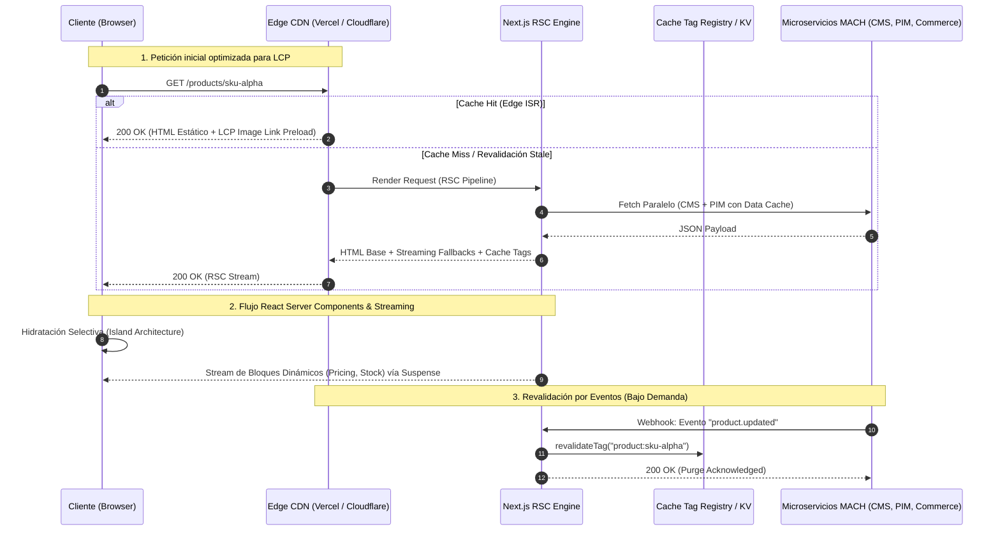

En las arquitecturas *Composable Commerce* y ecosistemas MACH, la separación radical del frontend respecto al backend promete agilidad y flexibilidad ilimitadas. Sin embargo, en implementaciones enterprise, este desacoplamiento suele introducir una trampa de rendimiento crítica: la **fragmentación de APIs y el fenómeno de API Fan-out**. Cuando una página de detalle de producto (PDP) requiere orquestar llamadas concurrentes a un headless CMS (Contentful/Sanity), un motor de comercio (commercetools/Elastic Path), un motor de búsqueda/facetado (Algolia/Typesense) y un sistema de inventario en tiempo real, el rendimiento percibido y las métricas de Core Web Vitals se degradan drásticamente.

Con la adopción definitiva de **Interaction to Next Paint (INP)** como reemplazo de First Input Delay (FID), junto con las exigencias cada vez más estrictas sobre **Largest Contentful Paint (LCP)**, los equipos de arquitectura frontend deben abandonar los patrones tradicionales de renderizado puramente del lado del cliente (CSR) o renderizado estático rígido (SSG). 

Este artículo técnico desglosa cómo diseñar e implementar una arquitectura de frontend de alto rendimiento en Next.js (App Router) utilizando **Incremental Static Regeneration (ISR) bajo demanda**, **React Server Components (RSC)**, **Streaming con Suspense** y **estrategias de partición del Main Thread** para sostener percentiles p75/p95 óptimos en los datasets de Chrome User Experience Report (CrUX).

---

## 1. Diagnóstico Arquitectónico: Los Cuellos de Botella de LCP e INP

Para resolver los problemas de rendimiento en un frontend composable, es imperativo aislar la anatomía de las fallas en las métricas clave.

```
LCP = TTFB (Time to First Byte) + Resource Load Delay + Resource Load Duration + Element Render Delay
```

```
INP = Input Delay + Processing Time (Long Tasks) + Presentation Delay
```

### Origen de la degradación de LCP
1. **Latencia acumulada de red (Edge to Origin):** En arquitecturas SSR puras, el servidor de renderizado espera las respuestas más lentas de la federación de APIs antes de emitir el primer byte HTML, elevando el TTFB por encima de los 800 ms.
2. **Descubrimiento tardío de la imagen Hero:** Componentes de imagen hidratados tardíamente por JavaScript o bloqueados detrás de capas de lógica condicional del cliente.
3. **Cascadas de red (Waterfalls):** Consultas secundarias ejecutadas después de montar el DOM en el navegador del cliente.

### Origen de la degradación de INP
1. **Monolithic Hydration Cost:** La reconciliación de árboles DOM masivos en el hilo principal (*Main Thread*) congela la interactividad durante el *TBT (Total Blocking Time)*.
2. **Event Listeners saturados:** Ejecución síncrona de lógica pesada (cálculo de variantes, llamadas a APIs analíticas, validación de inventario) dentro de callbacks de eventos sin diferir el renderizado de la interfaz.

---

## 2. Arquitectura de Renderizado Híbrido y Flujo de Datos en el Edge

La solución arquitectónica óptima desacopla la generación del cascarón estructural y el contenido estático respecto a los microservicios transaccionales volátiles.



---

## 3. Implementación en Producción: Next.js App Router e ISR On-Demand

Para garantizar que el LCP permanezca por debajo de 1.2 segundos y el INP por debajo de 100 ms, estructuramos la página de producto utilizando Server Components para la carga estática/crítica y Client Components aislados para la interactividad.

### 3.1. Revalidación Atómica Basada en Tags (On-Demand ISR)

En lugar de revalidaciones basadas en tiempo (`revalidate = 60`), utilizamos un Route Handler que procesa Webhooks firmados criptográficamente desde el headless CMS o PIM para purgar exclusivamente las rutas afectadas.

```typescript
// app/api/revalidate/route.ts
import { NextRequest, NextResponse } from 'next/server';
import { revalidateTag } from 'next/cache';
import crypto from 'crypto';

const WEBHOOK_SECRET = process.env.CMS_WEBHOOK_SECRET!;

export async function POST(request: NextRequest): Promise<NextResponse> {
  try {
    const rawBody = await request.text();
    const signature = request.headers.get('x-webhook-signature');

    // Validación de firma HMAC SHA-256 para mitigar ataques DoS de purga de caché
    const hmac = crypto.createHmac('sha256', WEBHOOK_SECRET);
    const computedSignature = `sha256=${hmac.update(rawBody).digest('hex')}`;

    if (!signature || !crypto.timingSafeEqual(Buffer.from(signature), Buffer.from(computedSignature))) {
      return NextResponse.json({ message: 'Firma inválida' }, { status: 401 });
    }

    const payload = JSON.parse(rawBody);
    const { entity, slug, id } = payload;

    if (!entity || (!slug && !id)) {
      return NextResponse.json({ message: 'Payload incompleto' }, { status: 400 });
    }

    // Invalida selectivamente por tags de dominio
    if (entity === 'product') {
      revalidateTag(`product:${slug}`);
      revalidateTag(`inventory:${id}`);
      revalidateTag('catalog-listing');
    }

    return NextResponse.json({ 
      revalidated: true, 
      tags: [`product:${slug}`, `inventory:${id}`],
      now: Date.now() 
    });
  } catch (error) {
    return NextResponse.json(
      { message: 'Error interno en la revalidación', error: (error as Error).message }, 
      { status: 500 }
    );
  }
}
```

### 3.2. Estructura de PDP con React Server Components y Preload de LCP

El archivo `page.tsx` aprovecha la caché de datos de Next.js (`fetch` con tags) y suspende las partes altamente volátiles (precios personalizados, promociones en tiempo real) para no penalizar el TTFB.

```tsx
// app/products/[slug]/page.tsx
import { Suspense } from 'react';
import Image from 'next/image';
import { notFound } from 'next/navigation';
import { DynamicInventory } from '@/components/DynamicInventory';
import { InteractiveVariantSelector } from '@/components/InteractiveVariantSelector';
import { SkeletonPrice } from '@/components/Skeletons';

interface ProductPageProps {
  params: { slug: string };
}

async function getProductData(slug: string) {
  const res = await fetch(`https://api.commerce.enterprise.internal/v1/products/${slug}`, {
    headers: { 'Authorization': `Bearer ${process.env.INTERNAL_API_TOKEN}` },
    next: { tags: [`product:${slug}`, 'catalog'] },
  });

  if (!res.ok) {
    if (res.status === 404) return null;
    throw new Error('Fallo crítico al resolver el catálogo');
  }

  return res.json();
}

export default async function ProductPage({ params }: ProductPageProps) {
  const product = await getProductData(params.slug);

  if (!product) {
    notFound();
  }

  return (
    <main className="mx-auto max-w-7xl px-4 py-8 grid grid-cols-1 md:grid-cols-2 gap-8">
      {/* Contenedor LCP: Renderizado estático inmediato */}
      <section className="relative aspect-square w-full overflow-hidden rounded-lg bg-gray-100">
        <Image
          src={product.heroImage.url}
          alt={product.heroImage.altText || product.title}
          fill
          priority // Fuerza priority preload en el HTML inicial para LCP
          sizes="(max-width: 768px) 100vw, 50vw"
          className="object-cover object-center"
          fetchPriority="high"
        />
      </section>

      {/* Información del Producto */}
      <section className="flex flex-col gap-4">
        <h1 className="text-3xl font-bold tracking-tight text-gray-900">{product.title}</h1>
        <p className="text-lg text-gray-700">{product.description}</p>

        {/* Suspense Boundary: Evita que datos volátiles bloqueen el LCP */}
        <Suspense fallback={<SkeletonPrice />}>
          <DynamicInventory productId={product.id} basePrice={product.basePrice} />
        </Suspense>

        {/* Island Component: Aislado para mitigar INP */}
        <InteractiveVariantSelector variants={product.variants} productId={product.id} />
      </section>
    </main>
  );
}
```

### 3.3. Optimización de INP: Yielding al Main Thread en Componentes Interactivos

Para evitar que una interacción compleja (como seleccionar una variante entre cientos de SKUs con matrices de compatibilidad) bloquee el renderizado del frame, utilizamos `useTransition` y la API de `scheduler.yield()` (o su fallback).

```tsx
// components/InteractiveVariantSelector.tsx
'use client';

import React, { useState, useTransition } from 'react';

interface Variant {
  id: string;
  sku: string;
  attributes: Record<string, string>;
  available: boolean;
}

interface Props {
  variants: Variant[];
  productId: string;
}

export function InteractiveVariantSelector({ variants, productId }: Props) {
  const [selectedSku, setSelectedSku] = useState<string>(variants[0]?.sku || '');
  const [isPending, startTransition] = useTransition();

  // Función utilitaria para ceder el control al Main Thread (Scheduling API)
  const yieldToMain = async () => {
    if ('scheduler' in window && 'yield' in (window as any).scheduler) {
      await (window as any).scheduler.yield();
    } else {
      await new Promise((resolve) => setTimeout(resolve, 0));
    }
  };

  const handleVariantChange = async (sku: string) => {
    // 1. Feedback visual inmediato en el UI (Cero Input Delay)
    setSelectedSku(sku);

    // 2. Cedemos el hilo para permitir que el browser pinte el nuevo frame de INP
    await yieldToMain();

    // 3. Transición no urgente: Cálculos pesados o analíticas diferidas
    startTransition(() => {
      // Computación pesada de compatibilidad de accesorios
      const matchedVariant = variants.find((v) => v.sku === sku);
      if (matchedVariant) {
        // Despachar eventos analíticos y actualizar el estado secundario sin congelar el hilo principal
        window.dispatchEvent(
          new CustomEvent('variant:changed', { detail: { productId, variant: matchedVariant } })
        );
      }
    });
  };

  return (
    <div className="flex flex-col gap-2">
      <span className="text-sm font-medium text-gray-700">Seleccionar Variante:</span>
      <div className="flex flex-wrap gap-2">
        {variants.map((v) => {
          const isSelected = v.sku === selectedSku;
          return (
            <button
              key={v.sku}
              type="button"
              disabled={!v.available}
              onClick={() => handleVariantChange(v.sku)}
              aria-pressed={isSelected}
              className={`px-4 py-2 text-sm font-semibold rounded-md border transition-colors ${
                isSelected 
                  ? 'bg-blue-600 text-white border-blue-600' 
                  : 'bg-white text-gray-900 border-gray-300 hover:bg-gray-50'
              } ${!v.available ? 'opacity-40 cursor-not-allowed' : ''}`}
            >
              {v.sku}
            </button>
          );
        })}
      </div>
      {isPending && <span className="text-xs text-gray-400">Sincronizando estado...</span>}
    </div>
  );
}
```

---

## 4. Comparativa de Estrategias de Renderizado en Composable Frontends

La elección de la técnica de renderizado impacta de manera directa en el presupuesto de latencia y la infraestructura subyacente:

| Estrategia | LCP (p75 Típico) | Riesgo de INP | Costo Computacional (Edge/Origin) | Frescura de Datos | Cuándo Usar | Cuándo Evitar |
| :--- | :--- | :--- | :--- | :--- | :--- | :--- |
| **SSG Puro** | < 800 ms | Medio (según tamaño del bundle JS) | Mínimo (Estático en CDN) | Baja (Requiere Build completo) | Blogs, landings corporativas, páginas legales. | Catálogos > 100k SKUs con inventario dinámico. |
| **SSR Tradicional** | 1,800 - 3,500 ms | Alto (espera por hidratación completa) | Alto (cálculo por cada request) | Tiempo Real (Consistente) | Dashboards B2B autenticados, carritos de compra. | Páginas públicas indexables con alto tráfico de marketing. |
| **On-Demand ISR (App Router)** | < 900 ms | Bajo (con React Server Components) | Bajo-Medio (Caché por tag con purgas atómicas) | Event-Driven (Casi en tiempo real) | PDPs, PLPs, páginas de categoría en eCommerce Enterprise. | Vistas con contenido 100% dependiente de la sesión de usuario. |
| **Partial Prerendering (PPR)** | < 600 ms | Mínimo (Suspense + Islands) | Optimizado (Shell estático + micro-streams) | Híbrido (Shell estático + stream dinámico) | Frontends modernos con Next.js 14/15 en infraestructuras Edge compatibles. | Sistemas legacy sin soporte para Streaming HTTP (HTTP/2+ requerido). |

---

## 5. Modos de Fallo en Producción y Mitigación

### 5.1. Cache Stampede (Efecto Thundering Herd)
* **Escenario de falla:** En un evento comercial de alto tráfico (Black Friday), un webhook invalida el tag de un producto insignia con 50,000 peticiones por segundo concurrentes. Si el servidor intenta regenerar la página en cada petición entrante no cacheada, la infraestructura de backend se saturará y colapsará.
* **Mitigación:** Configurar el *Stale-While-Revalidate* a nivel de CDN/Next.js. La primera petición lanza la regeneración en segundo plano mientras sirve el HTML *stale* (obsoleto) a las 49,999 peticiones restantes hasta que el nuevo artefacto se compile exitosamente.

### 5.2. Ghost Hydration & Layout Shifts (CLS inducido por Suspense)
* **Escenario de falla:** El fallback de Suspense asigna un tamaño menor al del componente cargado dinámicamente, provocando un salto en el layout cuando el componente de inventario se monta en el DOM.
* **Mitigación:** Diseñar skeletons con dimensiones idénticas en píxeles (`min-height` y `aspect-ratio` reservados mediante CSS) para que la resolución del stream dinámico no desplace el bloque LCP ni afecte el Cumulative Layout Shift.

### 5.3. Saturación del Event Loop por Hydration Cascades
* **Escenario de falla:** Incluir bibliotecas pesadas de visualización 3D, mapas o reproductores de video sin `next/dynamic` dentro del árbol principal del cliente.
* **Mitigación:** Aplicar *lazy loading* agresivo utilizando importaciones dinámicas con SSR deshabilitado para componentes por debajo del pliegue (*below-the-fold*):

```tsx
import dynamic from 'next/dynamic';

const Dynamic3DViewer = dynamic(() => import('@/components/Viewer3D'), {
  ssr: false,
  loading: () => <div className="h-96 w-full bg-gray-100 animate-pulse rounded-lg" />,
});
```

---

## 6. Checklist de Implementación para Equipos de Ingeniería

Antes de liberar a producción una arquitectura frontend composable con Next.js e ISR, verifique los siguientes puntos de control:

- [ ] **Optimización de Assets Críticos (LCP):**
  - [ ] Las imágenes Hero utilizan la directiva `priority` y `fetchPriority="high"` en `next/image`.
  - [ ] Las fuentes corporativas se cargan usando `next/font` con la opción `display: 'swap'` y pre-conexión de orígenes.
- [ ] **Arquitectura de Caché y Revalidación (Edge & ISR):**
  - [ ] Todas las llamadas a microservicios externos (`fetch`) implementan etiquetas de caché (`tags`) granulares.
  - [ ] El webhook de revalidación valida firmas HMAC para prevenir ataques de purga masiva.
  - [ ] Se verificó que las cabeceras HTTP de respuesta emitan directivas `s-maxage` y `stale-while-revalidate` adecuadas hacia el CDN.
- [ ] **Presupuesto de Interactividad y Main Thread (INP):**
  - [ ] La estructura de componentes utiliza Server Components por defecto; `"use client"` está restringido a las hojas del árbol DOM interactivo.
  - [ ] Los controladores de eventos complejos implementan `useTransition` o `scheduler.yield()` para no retrasar los frames de respuesta visual.
  - [ ] Se eliminaron paquetes de npm redundantes mediante análisis de bundle (`@next/bundle-analyzer`).
- [ ] **Observabilidad y Telemetría:**
  - [ ] Reporte de Core Web Vitals en tiempo real habilitado a través de `useReportWebVitals` hacia herramientas de monitoreo (Datadog, New Relic o Vercel Analytics).
  - [ ] Alertas automatizadas en Slack/PagerDuty ante degradaciones del percentil p75 de INP (> 200 ms) o LCP (> 2.5 s) en el entorno productivo.