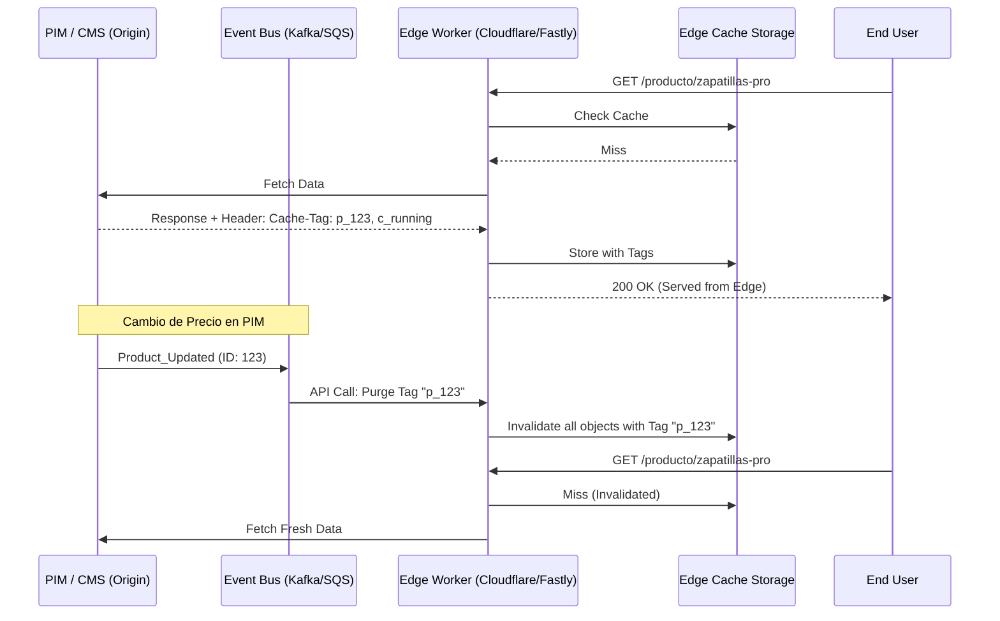

En el ecosistema de **Composable Commerce** y arquitecturas **MACH**, la velocidad no es un lujo, es un requisito operativo. Sin embargo, nos enfrentamos a una paradoja arquitectónica: para obtener un *Time to First Byte* (TTFB) sub-100ms a nivel global, necesitamos cachear agresivamente en el Edge; pero para mantener la integridad del negocio (precios actualizados, stock en tiempo real, cambios editoriales), necesitamos que ese caché sea extremadamente efímero o altamente inteligente.

El problema real en empresas *enterprise* no es "cachear", sino **invalidar**. Las estrategias basadas puramente en TTL (Time to Live) son insuficientes. Si estableces un TTL de 24 horas, tus datos estarán obsoletos. Si estableces un TTL de 60 segundos, saturarás tu origen durante picos de tráfico (el temido *Thundering Herd*).

Este artículo profundiza en cómo utilizar **Edge Computing** (Cloudflare Workers y Fastly Compute) para implementar estrategias de **Purgado Granular basado en Tags (Surrogate Keys)**, permitiendo un caché de "larga vida" que se invalida instantáneamente ante eventos de datos.

## El Problema: La Inconsistencia de Datos en Sistemas Distribuidos

Imagina un entorno Headless donde un cambio en el PIM (Product Information Management) debe reflejarse en:
1. La página de listado de productos (PLP).
2. La página de detalle de producto (PDP).
3. El componente de búsqueda.
4. El carrito de compras.

Si dependemos de purgar el caché por URL, la complejidad crece exponencialmente. Si el producto "Zapatillas Pro" aparece en 50 URLs diferentes (categorías, búsquedas, recomendaciones), purgar cada URL manualmente es propenso a errores y lento. Aquí es donde entran los **Surrogate Keys** (en Fastly) o **Cache Tags** (en Cloudflare).

## Arquitectura de Invalidación Basada en Eventos

La arquitectura moderna dicta que el Edge no debe ser solo una capa pasiva de paso, sino un componente activo que entiende las relaciones de los datos.



## Implementación en Cloudflare Workers

Cloudflare permite el uso de `Cache-Tag` en sus planes Enterprise. Sin embargo, mediante **Workers**, podemos emular comportamientos avanzados o manipular las cabeceras para orquestar el purgado.

### Patrón: Inyección de Tags y Control de Caché

El siguiente código muestra un Worker que intercepta la respuesta del origen, analiza el contenido (o las cabeceras del origen) y aplica una estrategia de tags para purgado granular.

```typescript
// Cloudflare Worker: Edge Cache Orchestrator
interface Env {
  API_PURGE_TOKEN: string;
}

export default {
  async fetch(request: Request, env: Env, ctx: ExecutionContext): Promise<Response> {
    const url = new URL(request.url);
    const cache = caches.default;

    // Intentar recuperar del caché primero
    let response = await cache.match(request);

    if (!response) {
      console.log(`Cache Miss for: ${url.pathname}`);
      response = await fetch(request);

      // Solo cacheamos respuestas exitosas
      if (response.status === 200) {
        // Clonamos la respuesta para poder modificar cabeceras
        const newResponse = new Response(response.body, response);
        
        // Supongamos que el origen nos envía IDs de productos en una cabecera X-Internal-Ids
        const internalIds = response.headers.get("X-Internal-Ids") || "global";
        
        // Cache-Tag es la cabecera mágica para Cloudflare Enterprise
        // Permite purgar miles de URLs con una sola llamada a la API
        newResponse.headers.set("Cache-Tag", internalIds);
        
        // Configuramos un TTL largo en el Edge, pero corto en el navegador
        newResponse.headers.set("Cache-Control", "public, s-maxage=31536000, max-age=60");

        // Guardar en caché de forma asíncrona para no bloquear la respuesta
        ctx.waitUntil(cache.put(request, newResponse.clone()));
        return newResponse;
      }
    }

    return response;
  },
};
```

### Purgado Programático (Control Plane)

Para invalidar, el backend (o un microservicio de eventos) debe invocar la API de Cloudflare:

```python
import requests

def purge_by_tag(zone_id, api_token, tags):
    url = f"https://api.cloudflare.com/client/v4/zones/{zone_id}/purge_cache"
    headers = {
        "Authorization": f"Bearer {api_token}",
        "Content-Type": "application/json"
    }
    payload = {"tags": tags} # Ejemplo: ["p_123", "category_running"]
    
    response = requests.post(url, json=payload, headers=headers)
    return response.json()
```

## Implementación en Fastly Compute

Fastly es pionero en el concepto de **Surrogate Keys**. Su plataforma **Compute** (anteriormente Compute@Edge) permite ejecutar lógica en Rust, JavaScript o Go con un overhead mínimo.

### Patrón: Surrogate Keys en Fastly (JavaScript)

En Fastly, el purgado es casi instantáneo (globalmente en ~150ms).

```javascript
/// <reference types="@fastly/js-compute" />
import { Backend } from "fastly:backend";

const origin = new Backend("origin_server");

addEventListener("fetch", (event) => {
  event.respondWith(handleRequest(event));
});

async function handleRequest(event) {
  const req = event.request;
  
  // Lógica de routing o manipulación de request
  const response = await fetch(req, { backend: origin });

  // Si el origen no envía Surrogate-Keys, podemos inferirlas en el Edge
  const newHeaders = new Headers(response.headers);
  
  if (req.url.includes("/products/")) {
    const productId = req.url.split("/").pop();
    // Añadimos la llave para purgado granular
    newHeaders.append("Surrogate-Key", `product_${productId} catalog_update`);
  }

  // TTL de 1 año en el Edge, invalidación por purgado
  newHeaders.set("Surrogate-Control", "max-age=31536000");

  return new Response(response.body, {
    status: response.status,
    headers: newHeaders,
  });
}
```

## Comparativa Técnica: Cloudflare Workers vs. Fastly Compute

| Característica | Cloudflare Workers | Fastly Compute |
| :--- | :--- | :--- |
| **Modelo de Aislamiento** | V8 Isolates | WebAssembly (Wasm) |
| **Mecanismo de Purgado** | Cache-Tags (Enterprise) | Surrogate Keys (Todos los planes) |
| **Tiempo de Propagación** | Segundos | < 200ms (Instant Purge) |
| **Cold Starts** | 0ms (Isolates) | < 1ms (Wasm) |
| **Límite de Memoria** | 128MB - 512MB | 128MB (configurable) |
| **Ideal para...** | Aplicaciones Full-stack en el Edge | APIs de alto rendimiento y lógica de red compleja |

## Estrategias Avanzadas de Mitigación de Fallos

### 1. Stale-While-Revalidate (SWR) en el Edge
Para evitar que un usuario espere mientras el Edge refresca un contenido expirado o purgado, utilizamos SWR. El Edge sirve contenido "viejo" mientras actualiza el caché en segundo plano.

**Configuración de cabecera:**
`Cache-Control: public, s-maxage=60, stale-while-revalidate=3600`

### 2. Origin Shielding
Cuando ocurre un purgado masivo (ej. cambio de cabecera global), miles de nodos de la CDN podrían intentar atacar al origen simultáneamente. **Origin Shielding** designa un nodo de caché central que actúa como intermediario único entre los nodos del Edge y el origen, colapsando múltiples peticiones idénticas en una sola (*Request Collapsing*).

### 3. Soft Purge
En lugar de eliminar el objeto físicamente, se marca como "stale". Si el origen falla al intentar refrescar el dato, el Edge puede seguir sirviendo la versión anterior como fallback de emergencia, garantizando alta disponibilidad incluso en caídas del backend.

## Modos de Fallo Comunes y Mitigación

1.  **Explosión de Tags:** Generar demasiados tags únicos por objeto puede degradar el rendimiento del índice de caché.
    *   *Mitigación:* Limitar a un máximo de 10-20 tags por objeto. Usar jerarquías (ej. `brand_nike` en lugar de tags para cada atributo de la marca).
2.  **Race Conditions en Purgado:** Un evento de purgado llega al Edge *antes* de que el origen haya terminado de persistir el cambio en la base de datos. El Edge refresca el caché con el dato viejo.
    *   *Mitigación:* Implementar un ligero delay en el webhook o usar un esquema de "doble purgado" (uno inmediato, otro a los 5 segundos).
3.  **Falla del Webhook:** Si el sistema de eventos falla, el caché queda "sucio" indefinidamente.
    *   *Mitigación:* Siempre tener un TTL de seguridad (ej. 24h) incluso si usamos purgado granular, para garantizar la convergencia eventual.

## Conclusión: El Edge como el Nuevo "Cerebro" de la Infraestructura

Mover la lógica de caché de una simple política de tiempo a una estrategia basada en eventos transforma la experiencia del usuario. Cloudflare y Fastly ofrecen las herramientas para que el frontend sea tan dinámico como una aplicación renderizada en el servidor, pero con la latencia de un archivo estático.

### Checklist de Implementación para Equipos de Ingeniería

- [ ] **Identificar Entidades:** Listar qué objetos (productos, categorías, menús) requieren actualización instantánea.
- [ ] **Definir Taxonomía de Tags:** Establecer un estándar de nombrado (ej. `type:id`).
- [ ] **Implementar Origin Headers:** Configurar el backend para emitir `Surrogate-Key` o `Cache-Tag`.
- [ ] **Configurar el Edge Worker:** Implementar la lógica de interceptación y normalización de cabeceras.
- [ ] **Automatizar el Purgado:** Integrar las llamadas a la API de la CDN en el pipeline de eventos (PIM/CMS).
- [ ] **Monitorear Cache Hit Ratio (CHR):** Establecer alertas si el CHR cae por debajo del 80% tras un despliegue.
- [ ] **Pruebas de Carga:** Simular un purgado masivo para validar la resiliencia del origen y la efectividad del *Request Collapsing*.

Dominar el purgado granular es la diferencia entre una plataforma MACH que escala sin esfuerzo y una que colapsa bajo su propia complejidad distribuida. En 2026, el caché ya no es una capa de optimización; es una parte integral de la lógica de negocio.