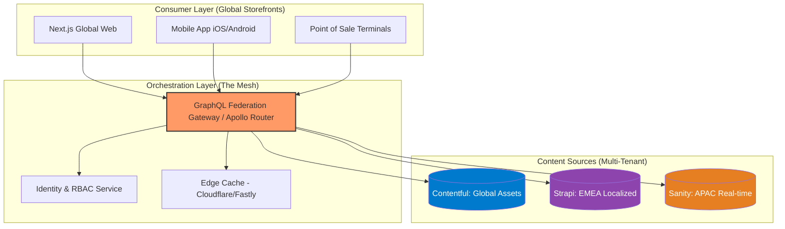

En el ecosistema del comercio electrónico moderno, la expansión global ya no se trata simplemente de traducir etiquetas de productos. Las empresas enterprise se enfrentan a la "Paradoja de la Globalización": la necesidad de mantener una identidad de marca coherente a nivel mundial mientras se ofrece una relevancia hiper-localizada en mercados específicos. 

El enfoque tradicional de "una instancia de CMS para todo" colapsa bajo el peso de cientos de mercados, miles de activos digitales y flujos de trabajo de aprobación complejos. Aquí es donde la arquitectura **Headless Multi-Tenant** se convierte en el pilar fundamental. Sin embargo, integrar plataformas como Contentful, Strapi o Sanity en un entorno global no es una tarea de "conectar y usar". Requiere una estrategia de orquestación que resuelva la fragmentación de datos, la latencia de entrega y el gobierno de contenido distribuido.

## El Problema: El Silo de Contenido y la Pesadilla Operativa

Las organizaciones globales suelen heredar una arquitectura fragmentada: el equipo de EMEA usa una instancia de Contentful, LATAM prefiere Strapi por costos de hosting local, y el equipo de Innovación en EE. UU. experimenta con Sanity por su capacidad de edición en tiempo real. 

Esta fragmentación genera tres dolores críticos:
1. **Inconsistencia de Marca:** El "Hero Banner" de la campaña global de verano tiene dimensiones y mensajes distintos en cada región porque no hay una fuente de verdad única.
2. **Duplicación de Esfuerzos:** Los desarrolladores deben mantener múltiples esquemas de contenido (Content Models) y pipelines de CI/CD para diferentes CMS.
3. **Latencia y Cumplimiento:** Los datos de contenido deben residir o servirse cerca del usuario final (Edge) y cumplir con regulaciones locales (GDPR, LGPD).

## Arquitectura de Referencia: El Content Hub Federado

Para resolver esto, proponemos un patrón de **Content Hub Federado**. En lugar de forzar a todas las regiones a usar la misma herramienta o instancia, creamos una capa de abstracción (API Gateway o GraphQL Mesh) que unifica el acceso al contenido.



### Estrategias de Multi-Tenancy por Plataforma

Cada CMS maneja la multi-tenencia de forma distinta, y la elección depende del modelo de gobierno de la empresa:

1. **Contentful (Spaces & Environments):** Ideal para un gobierno centralizado fuerte. Se utilizan "Spaces" para separar unidades de negocio o regiones geográficas, compartiendo un "Content Model" base a través de scripts de migración automatizados.
2. **Strapi (Role-Based Access Control & Internationalization):** Al ser self-hosted (o Strapi Cloud), permite un control total sobre la soberanía de datos. La multi-tenencia se logra a nivel de base de datos o mediante el plugin de i18n avanzado para separar contextos por locales.
3. **Sanity (Datasets & Projects):** Su arquitectura de "Content Lake" permite tener múltiples datasets bajo un mismo proyecto. Es excepcional para casos donde el contenido global y local deben mezclarse en tiempo real mediante consultas GROQ complejas.

## Comparativa Técnica de Trade-offs

| Característica | Contentful (SaaS) | Strapi (Open Source/Cloud) | Sanity (Composable) |
| :--- | :--- | :--- | :--- |
| **Aislamiento de Datos** | Alto (Spaces independientes) | Total (Instancias separadas) | Medio (Datasets compartidos) |
| **Escalabilidad de Esquema** | Compleja (Requiere scripts de migración) | Manual / Programática | Fluida (Esquema como código) |
| **Coste por Tenant** | Elevado (Licenciamiento por Space) | Bajo (Infraestructura propia) | Moderado (Basado en uso/API) |
| **Gobierno Global** | Excelente (RBAC nativo robusto) | Personalizable (Requiere dev) | Muy Alto (Custom Studio) |
| **Cuándo usarlo** | Marcas Enterprise con presupuesto centralizado. | Necesidad de soberanía de datos y personalización extrema. | Proyectos con alta densidad de datos y edición colaborativa. |

## Implementación Técnica: El Orquestador de Contenido

Para unificar estos CMS, el enfoque más robusto es utilizar **GraphQL Federation**. A continuación, se muestra un ejemplo de cómo definir un "Resolver" en un Gateway de Apollo que unifica un producto global (desde Contentful) con reseñas locales (desde una instancia regional de Strapi).

### Ejemplo de Código: Unified Content Resolver (TypeScript)

```typescript
import { ApolloServer } from '@apollo/server';
import { buildSubgraphSchema } from '@apollo/subgraph';
import { gql } from 'graphql-tag';

// Definición de tipos federados
const typeDefs = gql`
  extend schema @link(url: "https://specs.apollo.dev/federation/v2.0", import: ["@key"])

  type Product @key(fields: "sku") {
    sku: String!
    globalDescription: String
    localMarketingCopy: String
    price: Float
  }

  type Query {
    productByRegion(sku: String!, region: String!): Product
  }
`;

const resolvers = {
  Query: {
    productByRegion: async (_: any, { sku, region }: { sku: string, region: string }, context: any) => {
      // 1. Obtener datos base de Contentful (Global)
      const globalData = await context.dataSources.contentful.getGlobalProduct(sku);
      
      // 2. Resolver dinámicamente el tenant local (Strapi o Sanity)
      const localSource = region === 'EMEA' ? context.dataSources.strapiEMEA : context.dataSources.sanityAPAC;
      const localData = await localSource.getLocalContent(sku);

      return {
        sku,
        globalDescription: globalData.description,
        localMarketingCopy: localData.marketingCopy,
        price: localData.price
      };
    }
  }
};

// Configuración del servidor de subgrafo
const server = new ApolloServer({
  schema: buildSubgraphSchema([{ typeDefs, resolvers }]),
});
```

Este patrón permite que el frontend consuma una única API, ignorando la complejidad de dónde reside cada fragmento de información.

## Modelado de Contenido para Escala Global

Un error común es replicar el mismo modelo de contenido en todos los tenants. La arquitectura MACH dicta que debemos separar la **Estructura** de la **Presentación**.

### El Patrón "Base + Extension"
1. **Base Schema:** Definido centralmente (ej. Título, SKU, Atributos Técnicos). Se despliega en todos los CMS mediante herramientas de "Content-as-Code" (como Contentful Migrations o Sanity Schema).
2. **Local Extensions:** Cada región puede añadir campos específicos (ej. "Aviso de Privacidad Local", "Promoción Regional") sin afectar el esquema global.

## Modos de Fallo y Estrategias de Mitigación

### 1. Agotamiento de Rate Limits en CMS SaaS
Al centralizar el tráfico a través de un Gateway, es fácil exceder los límites de API de Contentful o Sanity durante picos de tráfico (Black Friday).
*   **Mitigación:** Implementar una capa de **Stale-While-Revalidate (SWR)** en el Edge (Cloudflare Workers). Nunca llamar al CMS directamente desde el cliente; siempre a través de una caché que soporte purgado granular mediante Webhooks.

### 2. Desincronización de Esquemas (Schema Drift)
Cuando un desarrollador cambia un campo en la instancia de EMEA pero olvida hacerlo en APAC, el Gateway de GraphQL fallará.
*   **Mitigación:** Implementar **Contract Testing** con herramientas como Pact. El pipeline de CI/CD del CMS debe validar el esquema contra el Gateway antes de permitir el despliegue de cambios en el modelo de contenido.

### 3. Latencia de Propagación de Webhooks
En arquitecturas multi-tenant, un cambio en el contenido global debe invalidar cachés en múltiples regiones.
*   **Mitigación:** Usar un **Event Bus** (AWS EventBridge o RabbitMQ). El CMS dispara un webhook al bus, y este distribuye la señal de invalidación a todos los nodos de caché regionales de forma asíncrona.

## Conclusión: El Camino hacia la Madurez Composable

La integración de CMS Headless en un entorno multi-tenant no es un problema de software, sino de **arquitectura de sistemas y gobierno**. Las empresas que triunfan son aquellas que dejan de ver al CMS como una base de datos de texto y empiezan a verlo como un microservicio de suministro de activos dentro de un ecosistema federado.

### Checklist de Implementación para Directores de Ingeniería

- [ ] **Auditoría de Tenants:** Identificar cuántas instancias de CMS existen y qué regiones/marcas sirven.
- [ ] **Definición del "Global Schema":** Establecer los 10 campos obligatorios que todo producto/página debe tener globalmente.
- [ ] **Capa de Abstracción:** Implementar un GraphQL Gateway (Apollo o Yoga) para unificar las fuentes.
- [ ] **Estrategia de Caché Edge:** Configurar Cloudflare o Fastly para cachear respuestas de API con TTLs agresivos y purgado por tags.
- [ ] **Automatización de Esquemas:** Mover todas las definiciones de tipos de contenido a código (Git-ops para CMS).
- [ ] **RBAC Unificado:** Configurar Single Sign-On (SSO) para que los editores de contenido accedan a sus respectivos tenants con una única identidad corporativa.

Al adoptar estos patrones, la organización no solo reduce su deuda técnica, sino que empodera a los equipos locales para innovar a la velocidad del mercado, sin comprometer la integridad de la plataforma global. La arquitectura MACH no es el objetivo final; es el habilitador de esta agilidad empresarial.