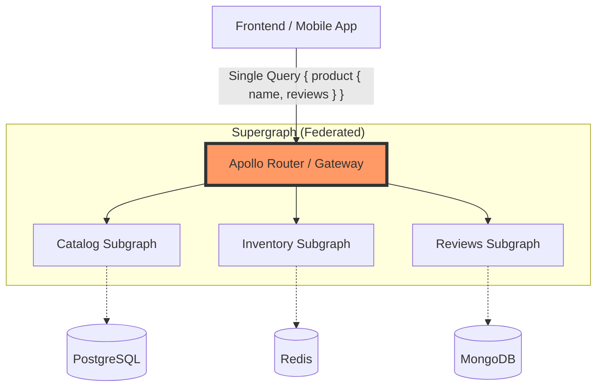

En el ecosistema del **Composable Commerce**, la promesa es la agilidad: seleccionar los mejores componentes de su clase (*Best-of-Breed*) para construir una plataforma única. Sin embargo, esta fragmentación introduce un desafío crítico de ingeniería: la **orquestación de datos**. Cuando un frontend necesita mostrar una página de detalles de producto (PDP), los datos ya no residen en una única base de datos relacional. Provienen de un motor de comercio (commercetools), un CMS (Contentful), un motor de búsqueda (Algolia) y un sistema de reseñas propietario.

Históricamente, las empresas han resuelto esto mediante **REST Gateways** o patrones **Backend-for-Frontend (BFF)**. Pero a medida que la escala aumenta, estos se convierten en cuellos de botella de desarrollo y mantenimiento. Aquí es donde **Apollo Federation v2** emerge como el estándar de facto para unificar microservicios en un *Supergraph* coherente.

Este artículo analiza profundamente la arquitectura, los trade-offs y las realidades de implementación de ambas estrategias en entornos empresariales de alto rendimiento.

## El Problema: La Explosión de Integraciones en MACH

En una arquitectura monolítica, la integridad referencial es gratuita. En una arquitectura MACH, la integridad es responsabilidad de la capa de orquestación. Un REST Gateway tradicional suele actuar como un agregador imperativo: el desarrollador escribe código para llamar al Servicio A, luego al Servicio B, combina los resultados y los devuelve.

Este enfoque presenta tres problemas fundamentales:
1.  **Over-fetching y Under-fetching:** El frontend recibe más datos de los que necesita o debe realizar múltiples llamadas (Waterfall) para completar la vista.
2.  **Acoplamiento en el Gateway:** El Gateway se convierte en un "monolito de orquestación" donde cada cambio en un microservicio requiere un despliegue en el Gateway.
3.  **Latencia Acumulada:** La falta de una ejecución optimizada de consultas paralelas aumenta el Time to First Byte (TTFB).

## Arquitectura de Referencia: Supergraph vs. Aggregator

La diferencia fundamental radica en **quién posee el esquema y cómo se resuelve la consulta**.

### REST Gateway (Imperativo)
El Gateway expone endpoints específicos (`/api/product-details/{id}`). Internamente, hay lógica de negocio que mapea y transforma datos. Si el frontend necesita un campo nuevo, el equipo de backend debe modificar el Gateway.

### Apollo Federation v2 (Declarativo)
Cada microservicio (Subgraph) expone su propio esquema GraphQL y define qué entidades "posee". El **Apollo Router** (escrito en Rust) analiza la consulta entrante, genera un plan de ejecución y orquesta las llamadas a los subgraphs de forma concurrente, uniendo las piezas mediante claves compartidas.



## Implementación Técnica: Apollo Federation v2

En Federation v2, la potencia reside en las directivas. Veamos cómo un servicio de productos y un servicio de reseñas se "fusionan" sin que el servicio de productos sepa nada de las reseñas.

### Subgraph de Productos (TypeScript)

Este servicio define la entidad `Product` y la marca con una `@key`.

```typescript
// products-subgraph.ts
import { ApolloServer } from '@apollo/server';
import { buildSubgraphSchema } from '@apollo/subgraph';
import { gql } from 'graphql-tag';

const typeDefs = gql`
  extend schema @link(url: "https://specs.apollo.dev/federation/v2.0", import: ["@key"])

  type Product @key(fields: "id") {
    id: ID!
    sku: String
    name: String
    price: Float
  }

  type Query {
    product(id: ID!): Product
  }
`;

const resolvers = {
  Product: {
    __resolveReference(product: any) {
      // Lógica para recuperar el producto de la DB
      return fetchProductById(product.id);
    }
  },
  Query: {
    product: (_: any, { id }: any) => ({ id })
  }
};

const server = new ApolloServer({
  schema: buildSubgraphSchema({ typeDefs, resolvers })
});
```

### Subgraph de Reseñas (Python/FastAPI)

Este servicio "extiende" el tipo `Product` añadiendo el campo `reviews`. No necesita duplicar los datos del producto, solo necesita saber cómo identificarlo.

```python
# reviews_subgraph.py
from strawberry.federation import Schema
import strawberry

@strawberry.federation.type(keys=["id"])
class Product:
    id: strawberry.ID
    
    @strawberry.field
    async def reviews(self) -> list["Review"]:
        return await get_reviews_for_product(self.id)

@strawberry.type
class Review:
    score: int
    content: str

schema = Schema(query=Query, types=[Product])
```

### El Router: Configuración de Producción (YAML)

El Router de Apollo es el componente de alto rendimiento que sustituye al Gateway tradicional. Se configura de forma declarativa:

```yaml
# router.yaml
traffic_shaping:
  all:
    control:
      max_concurrency: 1000
    timeout: 5s

supergraph:
  listen: 0.0.0.0:4000

telemetry:
  metrics:
    prometheus:
      enabled: True
  tracing:
    propagation:
      jaeger: True
```

## Tabla Comparativa: Trade-offs Arquitectónicos

| Característica | REST Gateway (BFF) | Apollo Federation v2 |
| :--- | :--- | :--- |
| **Flexibilidad del Frontend** | Baja. Requiere nuevos endpoints para nuevos requisitos. | Alta. El frontend pide exactamente lo que necesita. |
| **Gobernanza del Esquema** | Manual y a menudo inconsistente. | Centralizada mediante el Supergraph, pero distribuida en Subgraphs. |
| **Performance (Latencia)** | Depende de la implementación manual (Promise.all, etc.). | Optimizada por el Query Planner del Router (Rust). |
| **Curva de Aprendizaje** | Baja. Todos conocen REST. | Media-Alta. Requiere entender SDL y directivas de federación. |
| **Mantenibilidad** | Difícil a escala (Monolito de Gateway). | Alta. Los equipos son dueños de su parte del grafo. |
| **Caching** | Basado en URL (fácil con CDNs). | Complejo. Requiere Persisted Queries y caché a nivel de campo. |

## Modos de Fallo Comunes y Mitigación

### 1. El Problema del "N+1" en el Grafo
Si el Subgraph de reseñas no está optimizado, una consulta por 10 productos podría disparar 10 llamadas individuales al servicio de reseñas.
*   **Mitigación:** Utilizar **DataLoader** en los subgraphs para agrupar (batching) y cachear las peticiones de resolución de entidades durante el ciclo de vida de una sola consulta.

### 2. Hotspots de Rendimiento
Un solo subgraph lento puede degradar toda la experiencia del Supergraph.
*   **Mitigación:** Implementar **Timeouts agresivos** y **Circuit Breakers** en el Router. Usar la directiva `@defer` para enviar primero los datos críticos (precio, nombre) y después los datos lentos (reseñas, recomendaciones).

### 3. Breaking Changes en el Esquema
Cambiar un campo en un Subgraph puede romper el Supergraph global.
*   **Mitigación:** Implementar **Schema Checks** en el pipeline de CI/CD (usando Apollo Rover). Nunca se debe publicar un subgraph que invalide la composición del Supergraph.

## Estrategia de Migración: Del Gateway REST a Federation

No es necesario un "Big Bang". La migración puede ser incremental:

1.  **Proxy Pass:** Configurar el Apollo Router para que actúe como proxy hacia el Gateway REST existente.
2.  **Encapsulación:** Crear un "Subgraph Adaptador" que consuma los endpoints REST actuales y los exponga como GraphQL.
3.  **Migración Nativa:** A medida que se refactorizan los microservicios, mover la lógica de resolución directamente al microservicio, eliminando el adaptador.

## Conclusión: ¿Cuándo elegir cada uno?

**Elija REST Gateway / BFF si:**
*   Su ecosistema tiene menos de 5 microservicios.
*   El equipo tiene nula experiencia con GraphQL y el tiempo de entrega es crítico e inmediato.
*   Las aplicaciones cliente son extremadamente simples y no varían sus necesidades de datos.

**Elija Apollo Federation v2 si:**
*   Está construyendo una plataforma de **Composable Commerce** a escala enterprise.
*   Tiene múltiples equipos de producto trabajando de forma independiente.
*   Necesita reducir drásticamente el acoplamiento entre el frontend y los múltiples backends de terceros (SaaS).
*   La eficiencia en el desarrollo (Developer Experience) es una prioridad estratégica.

### Checklist de Implementación para Líderes de Ingeniería

- [ ] **Definir Entidades Core:** Identificar qué campos actúan como claves primarias entre sistemas (ej. `SKU`, `CustomerEmail`).
- [ ] **Establecer Gobernanza:** Crear un comité de diseño de esquemas para evitar la duplicación de nombres de tipos.
- [ ] **Automatizar el Registro:** Configurar un Schema Registry (como Apollo GraphOS o Hive) para gestionar la composición automática.
- [ ] **Observabilidad:** Implementar trazas distribuidas (OpenTelemetry) desde el Router hasta el último microservicio para identificar cuellos de botella.
- [ ] **Seguridad:** Mover la autenticación al Router (JWT validation) y la autorización granular a los Subgraphs.

La federación de APIs no es solo una elección tecnológica; es una decisión organizacional que permite a las empresas MACH escalar sin que la complejidad técnica detenga la innovación del negocio.