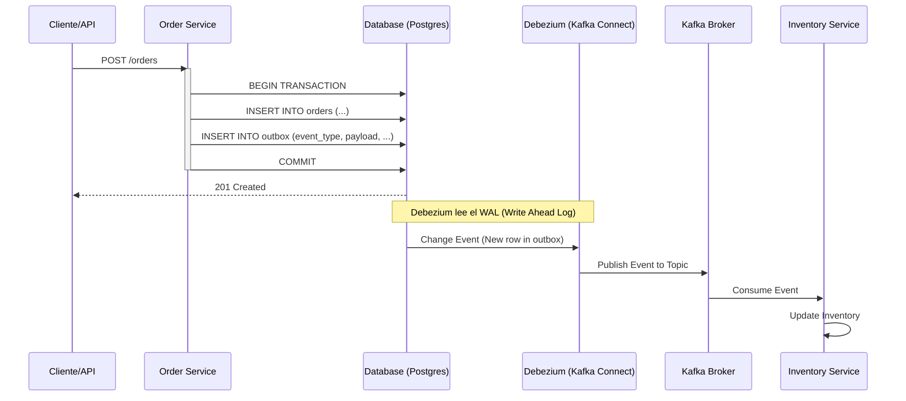

En el ecosistema de **Arquitectura MACH** (Microservices, API-first, Cloud-native, Headless), la integridad de los datos a través de servicios distribuidos es uno de los desafíos más críticos y, a menudo, peor resueltos. Cuando un microservicio de "Pedidos" procesa una transacción, no solo debe actualizar su propia base de datos; debe notificar a los servicios de Inventario, Facturación y Envíos. 

El error más común en la industria es el **"Dual Write"** (Escritura Dual): intentar actualizar la base de datos y enviar un mensaje a un broker (como Kafka o RabbitMQ) en el mismo bloque de código. Si la base de datos confirma la transacción pero el broker falla, o si el servicio se reinicia entre ambas operaciones, el sistema queda en un estado inconsistente. En el comercio composable de alta escala, esto se traduce en pérdidas financieras, sobreventa de stock y una experiencia de cliente degradada.

Para resolver esto de manera elegante y resiliente, los arquitectos senior recurrimos al **Patrón Outbox Transaccional** potenciado por **Change Data Capture (CDC)** con **Debezium**.

## El Problema de la Escritura Dual (Dual Write)

Imaginemos el siguiente flujo pseudo-código en un servicio de Node.js:

```typescript
async function createOrder(orderData: Order) {
  // 1. Persistir en la base de datos
  const order = await db.orders.create(orderData); 
  
  // 2. Publicar evento en Kafka
  // ¿Qué pasa si aquí hay un timeout o el pod de Kubernetes muere?
  await kafka.send("order-created", { orderId: order.id }); 
  
  return order;
}
```

Si el paso 2 falla tras el éxito del paso 1, el pedido existe pero el resto de la empresa no lo sabe. Invertir el orden no soluciona el problema; solo cambia el síntoma. No existe una transacción distribuida (2PC - Two-Phase Commit) que sea eficiente y escalable en entornos cloud-native modernos. Aquí es donde el patrón Outbox entra en juego.

## Arquitectura del Patrón Outbox con Debezium

El patrón Outbox propone que, en lugar de enviar el mensaje directamente al broker, el servicio escriba el evento en una tabla especial llamada `outbox` dentro de la **misma transacción de base de datos** que la entidad de negocio.

Dado que ambas escrituras ocurren en la misma transacción atómica, garantizamos que:
1. O ambas se guardan.
2. O ninguna se guarda.

Posteriormente, un proceso separado (Relay) lee la tabla `outbox` y publica los mensajes en el broker. Utilizar **Debezium** como ese Relay es la estrategia de vanguardia, ya que utiliza **CDC (Change Data Capture)** para leer los logs de transacciones de la base de datos (como el WAL en PostgreSQL o el Binlog en MySQL) sin impactar el rendimiento de las consultas.

### Diagrama de Flujo de Datos



## Implementación Técnica: El Lado del Microservicio

Para implementar esto en un entorno de producción, necesitamos una estructura de tabla `outbox` robusta y una lógica de persistencia que asegure la atomicidad.

### 1. Esquema de la Tabla Outbox (SQL)

```sql
CREATE TABLE outbox (
    id UUID PRIMARY KEY,
    aggregate_type VARCHAR(255) NOT NULL,
    aggregate_id VARCHAR(255) NOT NULL,
    type VARCHAR(255) NOT NULL,
    payload JSONB NOT NULL,
    created_at TIMESTAMP WITH TIME ZONE DEFAULT CURRENT_TIMESTAMP
);

-- Índice para ayudar a Debezium si fuera necesario (aunque CDC lee logs)
CREATE INDEX idx_outbox_created_at ON outbox(created_at);
```

### 2. Lógica de Aplicación (TypeScript + Prisma)

Utilizando un ORM moderno, debemos envolver la creación de la entidad y el evento en una transacción.

```typescript
import { PrismaClient } from '@prisma/client';
import { v4 as uuidv4 } from 'uuid';

const prisma = new PrismaClient();

async function placeOrder(orderInput: any) {
  return await prisma.$transaction(async (tx) => {
    // 1. Crear el Pedido
    const order = await tx.order.create({
      data: {
        customerId: orderInput.customerId,
        total: orderInput.total,
        status: 'PENDING'
      }
    });

    // 2. Crear el evento en la tabla Outbox
    await tx.outbox.create({
      data: {
        id: uuidv4(),
        aggregate_type: 'Order',
        aggregate_id: order.id.toString(),
        type: 'OrderCreated',
        payload: {
          orderId: order.id,
          customerId: order.customerId,
          items: orderInput.items
        }
      }
    });

    return order;
  });
}
```

## Configuración de Debezium y Kafka Connect

Debezium se despliega usualmente como un conector dentro de un cluster de **Kafka Connect**. Su trabajo es vigilar la tabla `outbox` y transformar cada inserción en un mensaje de Kafka.

### Configuración del Conector (JSON)

Es vital usar el **Outbox Event Router**, un SMT (Single Message Transform) de Debezium diseñado específicamente para este patrón. Este transforma el formato interno de Debezium (que incluye metadatos de "antes" y "después") en un mensaje limpio para el consumidor.

```json
{
  "name": "order-outbox-connector",
  "config": {
    "connector.class": "io.debezium.connector.postgresql.PostgresConnector",
    "database.hostname": "postgres-db",
    "database.port": "5432",
    "database.user": "debezium",
    "database.password": "password",
    "database.dbname": "orders_db",
    "database.server.name": "dbserver1",
    "table.include.list": "public.outbox",
    
    // Configuración del Outbox SMT
    "transforms": "outbox",
    "transforms.outbox.type": "io.debezium.transforms.outbox.EventRouter",
    "transforms.outbox.route.topic.replacement": "orders.events",
    "transforms.outbox.table.field.event.id": "id",
    "transforms.outbox.table.field.event.key": "aggregate_id",
    "transforms.outbox.table.field.event.payload": "payload",
    "transforms.outbox.table.field.event.type": "type",
    "transforms.outbox.route.by.field": "aggregate_type"
  }
}
```

## Trade-offs Arquitectónicos: ¿Por qué elegir esta ruta?

No existe la "bala de plata". El patrón Outbox con Debezium introduce complejidad operativa a cambio de una fiabilidad extrema.

| Característica | Dual Write (Anti-patrón) | Outbox (Polling) | Outbox (CDC + Debezium) |
| :--- | :--- | :--- | :--- |
| **Consistencia** | Débil (Eventual con fallos) | Fuerte (Atómica) | Fuerte (Atómica) |
| **Latencia** | Baja | Media (Depende del polling) | Muy Baja (Streaming real-time) |
| **Carga en DB** | Baja | Alta (Queries constantes) | Mínima (Lectura de logs) |
| **Complejidad** | Muy Baja | Media | Alta (Requiere Kafka Connect) |
| **Uso Recomendado** | Prototipos / No críticos | Sistemas pequeños | Enterprise / MACH / Escala |

## Modos de Fallo y Estrategias de Mitigación

Incluso con Debezium, los sistemas distribuidos pueden fallar. Aquí detallamos cómo manejar escenarios críticos:

### 1. El Consumidor recibe mensajes duplicados
**Problema:** Kafka garantiza la entrega "al menos una vez" (at-least-once). Si el consumidor procesa el mensaje pero falla antes de hacer el commit del offset, recibirá el mensaje de nuevo.
**Mitigación:** Implementar **Idempotencia** en los consumidores. Cada mensaje debe tener un ID único (el `id` de la tabla outbox). El consumidor debe verificar si ya procesó ese ID antes de ejecutar la lógica de negocio.

### 2. Lag en la replicación de Debezium
**Problema:** Si el volumen de transacciones es masivo, Debezium puede tardar segundos en procesar el WAL.
**Mitigación:** Monitorizar la métrica `debezium_metrics_replication_lag`. Si el lag aumenta, es necesario escalar el cluster de Kafka Connect o particionar la base de datos.

### 3. Evolución del Esquema (Schema Poisoning)
**Problema:** El servicio A cambia el formato del JSON en el `payload` del outbox, rompiendo el servicio B.
**Mitigación:** Utilizar un **Schema Registry** (como el de Confluent o Apicurio). Aunque el outbox usa JSONB, los eventos publicados en Kafka deben seguir un esquema Avro o Protobuf validado.

## Implementación de Limpieza (Cleanup)

La tabla `outbox` crecerá indefinidamente si no se gestiona. Dado que Debezium ya leyó los registros, estos son técnicamente "basura" después de unos minutos.

**Estrategia recomendada:** No borrar inmediatamente después de que Debezium lea (esto causaría más escrituras en el WAL). En su lugar, ejecutar un job de mantenimiento (CronJob en Kubernetes) que elimine registros antiguos:

```sql
-- Borrar registros con más de 24 horas de antigüedad
DELETE FROM outbox WHERE created_at < NOW() - INTERVAL '1 day';
```

## Conclusión: El Estándar de Oro para MACH

El patrón Outbox Transaccional con Debezium no es solo una elección técnica; es una decisión estratégica para cualquier organización que aspire a la resiliencia en **Composable Commerce**. Al desacoplar la persistencia de la notificación, permitimos que nuestros servicios escalen de forma independiente sin sacrificar la verdad de los datos.

### Checklist de Implementación para Líderes de Ingeniería

1.  **Auditoría de Transacciones:** Identificar todos los puntos donde se realiza una "escritura dual".
2.  **Infraestructura de Datos:** Asegurar que la base de datos (Postgres/MySQL) tenga habilitado el logging lógico (`wal_level = logical` en Postgres).
3.  **Estandarización de Eventos:** Definir un contrato de eventos claro (CloudEvents es un buen estándar).
4.  **Idempotencia Obligatoria:** No permitir el despliegue de consumidores que no manejen duplicados.
5.  **Observabilidad:** Configurar alertas de lag en Kafka Connect y errores de transformación SMT.

Implementar este patrón eleva la madurez de la plataforma de "funcional" a "enterprise-grade", permitiendo que el negocio crezca sobre una base de datos íntegra y un flujo de eventos inquebrantable.