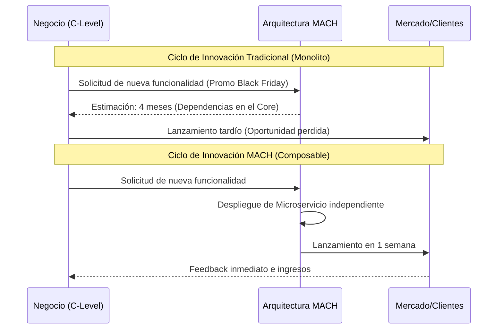

En el ecosistema de la tecnología empresarial, la transición hacia arquitecturas **MACH (Microservices, API-first, Cloud-native, Headless)** a menudo se percibe erróneamente como un "capricho de ingeniería" o una tendencia técnica costosa. Sin embargo, para un Principal Solutions Architect, el verdadero reto no es la implementación técnica, sino la traducción de la agilidad técnica en valor financiero tangible.

El problema real que enfrentan las empresas *enterprise* no es la falta de herramientas, sino el **Costo de la Inercia**. Los monolitos heredados (Legacy) actúan como un ancla que incrementa el *Time-to-Market* y drena el presupuesto en mantenimiento reactivo. Este artículo desglosa el marco de trabajo para justificar el Retorno de Inversión (ROI) de MACH, moviendo la conversación del CAPEX al valor estratégico a largo plazo.

## El Dilema del Monolito: Por qué el "Status Quo" es el Riesgo más Caro

Para el CFO, un sistema que "funciona" no debería cambiarse. El error del arquitecto es no cuantificar el **Costo de Oportunidad**. En un modelo monolítico tradicional, el 80% del presupuesto de IT se destina a "mantener las luces encendidas" (Run), dejando solo un 20% para la innovación (Change).

### La Anatomía del ROI en MACH
El ROI de MACH no se mide solo en ahorro de infraestructura; se mide en tres dimensiones críticas:
1. **Eficiencia Operativa (Reducción de Costos):** Automatización de despliegues, escalabilidad elástica y reducción de deuda técnica.
2. **Agilidad de Negocio (Incremento de Ingresos):** Capacidad de lanzar experimentos en días, no meses.
3. **Mitigación de Riesgos:** Eliminación del *vendor lock-in* y resiliencia ante picos de tráfico.



## Cuantificando el Valor: Métricas que el C-Level Entiende

Para convencer al Comité de Dirección, debemos hablar en términos de **Unit Economics** y **TCO (Total Cost of Ownership)**.

### 1. Reducción del Time-to-Market (TTM)
En una arquitectura composable, el desacoplamiento permite que múltiples equipos trabajen en paralelo. Si el TTM promedio de una funcionalidad crítica se reduce de 12 semanas a 2 semanas, el valor generado es la suma de los ingresos adicionales capturados en esas 10 semanas de ventaja competitiva.

### 2. Eficiencia de Desarrollo (Developer Experience - DevEx)
Un desarrollador senior en un monolito pasa el 40% de su tiempo resolviendo conflictos de fusión (merge conflicts) y esperando compilaciones. En MACH, el aislamiento de contextos (Bounded Contexts) reduce este desperdicio.

### 3. Escalabilidad y FinOps
A diferencia de los servidores *on-premise* o VMs infrautilizadas, el modelo *Cloud-native* permite un escalado granular. Solo pagas por lo que consumes durante el pico de tráfico.

## Ejemplo Práctico: Calculadora de Costo de Retraso (Cost of Delay)

Un concepto fundamental para el ROI es el **Cost of Delay (CoD)**. Si una nueva funcionalidad de personalización en el checkout se estima que aumentará la conversión en un 0.5%, cada semana de retraso tiene un costo financiero directo.

A continuación, un script en Python que un Arquitecto puede usar para modelar este escenario ante el comité de finanzas:

```python
def calculate_roi_mach(current_revenue, conversion_lift, weeks_saved, implementation_cost):
    """
    Calcula el ROI basado en la aceleración del Time-to-Market.
    """
    # Ingreso semanal promedio
    weekly_revenue = current_revenue / 52
    
    # Ingreso adicional por semana gracias a la mejora
    additional_weekly_revenue = weekly_revenue * conversion_lift
    
    # Valor total capturado por lanzar antes (Agilidad MACH)
    total_value_captured = additional_weekly_revenue * weeks_saved
    
    # ROI Simplificado
    roi = ((total_value_captured - implementation_cost) / implementation_cost) * 100
    
    return {
        "Value Captured (Opportunity)": round(total_value_captured, 2),
        "ROI (%)": round(roi, 2)
    }

# Escenario: Empresa Retail con 100M USD de facturación anual
# Mejora en checkout (0.8% lift), lanzada 12 semanas antes gracias a MACH
# Costo de implementación del microservicio: 150,000 USD
results = calculate_roi_mach(100_000_000, 0.008, 12, 150_000)

print(f"Resultado del Análisis de ROI:")
for key, value in results.items():
    print(f"{key}: {value}")
```

## Trade-offs Arquitectónicos: La Realidad sin Filtros

No todo es color de rosa. MACH introduce una **"Taxa de Complejidad"** inicial que debe ser comunicada con transparencia para mantener la credibilidad ante el CTO.

| Dimensión | Monolito Tradicional | Arquitectura MACH | Decisión Estratégica |
| :--- | :--- | :--- | :--- |
| **Costo Inicial (CAPEX)** | Bajo/Medio (Licencia única) | Alto (Integración y Talento) | MACH requiere inversión inicial en plataforma. |
| **Costo Operativo (OPEX)** | Alto (Mantenimiento rígido) | Optimizado (Pay-per-use) | MACH favorece el modelo FinOps. |
| **Velocidad de Cambio** | Lenta (Release Trains) | Muy Rápida (CI/CD continuo) | Crítico para mercados volátiles. |
| **Complejidad Técnica** | Baja (Stack único) | Alta (Sistemas distribuidos) | Requiere madurez en Observabilidad y DevOps. |
| **Riesgo de Vendor Lock-in** | Total (Dependencia del roadmap del vendor) | Mínimo (Best-of-breed) | Permite cambiar componentes sin reescribir todo. |

## Estrategias de Mitigación de Riesgos en Producción

El C-Level teme a la fragmentación. "Si tenemos 20 microservicios, ¿tenemos 20 puntos de falla?". La respuesta debe ser arquitectónica:

1. **Observabilidad Avanzada:** Implementar OpenTelemetry desde el día 1 para evitar el "agujero negro" de las peticiones distribuidas.
2. **Contract Testing:** Usar herramientas como Pact para asegurar que un cambio en el API de "Inventario" no rompa el "Frontend".
3. **Patrón Strangler Fig:** No proponer un *Big Bang Rewrite*. El ROI se justifica mejor si se migra módulo a módulo (ej. primero el CMS, luego el Checkout), permitiendo que el negocio vea beneficios en meses, no años.

### Implementación de un Circuit Breaker (TypeScript)
Para garantizar la resiliencia (un pilar de MACH), mostramos cómo proteger el sistema ante fallos de servicios de terceros (ej. una pasarela de pagos Headless):

```typescript
import CircuitBreaker from 'opossum';

async function callThirdPartyAPI(data: any) {
  // Simulación de llamada a un servicio externo (API-first)
  return await fetch('https://api.payments-provider.com/v1/charge', {
    method: 'POST',
    body: JSON.stringify(data)
  });
}

const options = {
  timeout: 3000, // Si el servicio tarda más de 3s, falla
  errorThresholdPercentage: 50, // Abre el circuito si el 50% de las llamadas fallan
  resetTimeout: 30000 // Intenta reconectar después de 30s
};

const breaker = new CircuitBreaker(callThirdPartyAPI, options);

breaker.fallback(() => ({ status: 'fallback', message: 'Servicio temporalmente no disponible. Reintentando en modo degradado.' }));

breaker.on('open', () => console.warn('ALERTA: Circuito ABIERTO. El servicio de pagos está fallando.'));
```

## El Argumento Final: Opcionalidad Estratégica

El concepto más potente para un CEO es la **Opcionalidad**. En un mundo donde la IA generativa o nuevas redes sociales cambian el comportamiento del consumidor cada seis meses, un monolito es una sentencia de muerte por obsolescencia.

MACH no es solo una arquitectura de software; es una **arquitectura de negocios**. Permite que la empresa sea "composable", es decir, que pueda reconfigurarse rápidamente para aprovechar nuevas oportunidades de mercado sin el lastre de sistemas rígidos.

## Checklist para la Presentación ante el Comité de Dirección

Si tienes una reunión la próxima semana para justificar la inversión en MACH, asegúrate de marcar estos puntos:

- [ ] **No hables de Kubernetes ni GraphQL:** Habla de "Escalabilidad Elástica" y "Unificación de la Experiencia del Cliente".
- [ ] **Presenta el TCO a 3 años:** Compara el costo proyectado de mantener el monolito (incluyendo parches de seguridad y consultoría externa) vs. la plataforma MACH.
- [ ] **Muestra un "Quick Win":** Identifica un cuello de botella actual (ej. "tardamos 3 días en cambiar un banner") y explica cómo MACH lo reduce a minutos.
- [ ] **Define el Modelo de Gobierno:** Explica quién será el dueño de cada "pieza" del puzzle composable para evitar el caos.
- [ ] **Vincula MACH con los OKRs de Negocio:** Si el objetivo de la empresa es la expansión internacional, explica cómo la arquitectura Headless facilita la localización y multi-moneda de forma nativa.

## Conclusión

Justificar el ROI de MACH requiere que el arquitecto actúe como un puente entre la ingeniería y las finanzas. Al centrar el discurso en la **reducción del riesgo**, la **agilidad operativa** y la **captura de valor por oportunidad**, la transición deja de ser un gasto técnico para convertirse en una inversión estratégica indispensable para la supervivencia en la era digital.

La pregunta para el C-Level no debería ser "¿Cuánto cuesta migrar a MACH?", sino "**¿Cuánto nos está costando no hacerlo?**".