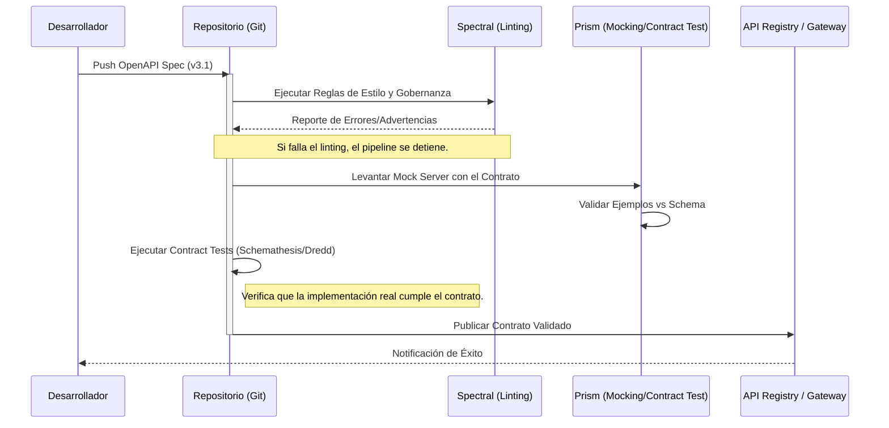

En el ecosistema de **Composable Commerce** y arquitecturas **MACH**, la agilidad no proviene únicamente de la descomposición de servicios, sino de la robustez de las interfaces que los conectan. Uno de los mayores "dolores" en empresas de nivel enterprise es el *Integration Hell*: el momento en que un equipo de backend despliega un cambio "menor" en un microservicio y, súbitamente, el checkout del frontend o el servicio de lealtad colapsan debido a una discrepancia en el payload.

El enfoque **API-First** no es simplemente escribir documentación después de programar; es tratar el contrato de la API como la "única fuente de verdad" (Single Source of Truth) antes de escribir una sola línea de código de implementación. Con la llegada de **OpenAPI Specification (OAS) v3.1**, la industria finalmente ha cerrado la brecha técnica entre la descripción de APIs y el estándar **JSON Schema (2020-12)**, permitiendo una validación de contratos mucho más potente y nativa.

Este artículo desglosa cómo diseñar contratos bajo OAS 3.1 y, lo más importante, cómo automatizar su cumplimiento mediante pipelines de CI/CD para garantizar que ningún cambio que rompa la compatibilidad (breaking change) llegue jamás a producción.

## El Problema: El Abismo entre el Diseño y la Realidad

En organizaciones con decenas de microservicios, el diseño de APIs suele sufrir de tres patologías comunes:

1.  **Contract Drift (Deriva del Contrato):** La implementación de código diverge de la documentación Swagger/OpenAPI porque esta última se actualiza manualmente.
2.  **Validaciones Laxas:** El uso de tipos genéricos o la falta de restricciones en los esquemas permite que datos corruptos fluyan entre sistemas.
3.  **Falta de Gobernanza en CI/CD:** No existen mecanismos automáticos que impidan que un desarrollador elimine un campo obligatorio o cambie un formato de fecha sin notificar a los consumidores.

OpenAPI 3.1 aborda esto al alinearse totalmente con JSON Schema, lo que permite usar herramientas de validación estándar de la industria para verificar tanto la estructura del contrato como los datos que fluyen por él.

## Arquitectura de Validación de Contratos en el Pipeline

Para implementar una estrategia de "Contratos Inquebrantables", debemos insertar la validación en múltiples etapas del ciclo de vida de desarrollo de software (SDLC).



## Diseño Avanzado con OpenAPI 3.1

La versión 3.1 introduce cambios críticos. El más importante es que los objetos de esquema son ahora subconjuntos completos de JSON Schema Draft 2020-12. Esto significa que podemos usar palabras clave como `unevaluatedProperties`, `dependentRequired` y, crucialmente, un manejo de `null` mucho más limpio.

### Ejemplo de Contrato de Producción: Servicio de Inventario Composable

A continuación, un ejemplo de una definición de esquema para un servicio de inventario que utiliza las capacidades de OAS 3.1.

```yaml
openapi: 3.1.0
info:
  title: Inventory Mesh Service
  version: 2.1.0
  description: Servicio core para la gestión de stock en tiempo real.

components:
  schemas:
    StockLevel:
      type: object
      # OAS 3.1 permite múltiples tipos, eliminando la necesidad de 'nullable: true'
      properties:
        sku:
          type: string
          pattern: '^[A-Z0-9-]{8,12}$'
        quantity:
          type: integer
          minimum: 0
        location_id:
          type: [string, "null"] # Soporte nativo multi-tipo
        last_updated:
          type: string
          format: date-time
      required:
        - sku
        - quantity
      # Evita que se envíen campos no definidos (Strict Schema)
      additionalProperties: false 
      examples:
        - sku: "PROD-12345"
          quantity: 150
          location_id: "WH-NORTH-01"
          last_updated: "2026-09-09T09:00:00Z"

paths:
  /stock/{sku}:
    get:
      summary: Obtiene el nivel de stock por SKU
      parameters:
        - name: sku
          in: path
          required: true
          schema:
            type: string
      responses:
        '200':
          description: Nivel de stock encontrado
          content:
            application/json:
              schema:
                $ref: '#/components/schemas/StockLevel'
```

## Automatización de la Validación en CI/CD

No basta con tener un archivo YAML bien diseñado; necesitamos "dientes" en nuestro pipeline. Utilizaremos dos herramientas fundamentales: **Spectral** (para linting de diseño) y **Prism** (para validación de tráfico).

### 1. Linting de Gobernanza con Spectral

Spectral asegura que todas las APIs de la empresa sigan los mismos estándares (ej. nombres en camelCase, presencia de descripciones, versionado semántico).

**Archivo de reglas `.spectral.yaml`:**
```yaml
extends: ["spectral:oas", "spectral:asyncapi"]
rules:
  # Regla personalizada: Todas las respuestas 200 deben tener descripción
  description-for-200:
    description: "Toda respuesta exitosa debe estar documentada."
    given: $.paths.*.responses[200]
    then:
      field: description
      presence: true
  # Forzar versionado en la URL o Header
  api-versioning:
    description: "El contrato debe especificar una versión mayor en el info block."
    given: $.info.version
    then:
      function: pattern
      functionOptions:
        match: '^[0-9]+\.[0-9]+\.[0-9]+$'
```

### 2. Validación de Contratos en GitHub Actions

El siguiente workflow de GitHub Actions automatiza la validación cada vez que un desarrollador propone un cambio en el contrato.

```yaml
name: API Contract Governance

on:
  pull_request:
    paths:
      - 'openapi/**'

jobs:
  lint-and-validate:
    runs-on: ubuntu-latest
    steps:
      - uses: actions/checkout@v3

      - name: Install Spectral
        run: npm install -g @stoplight/spectral-cli

      - name: Lint OpenAPI Document
        run: spectral lint openapi/inventory-api.yaml --fail-severity=error

      - name: Validate Examples with Prism
        run: |
          npm install -g @stoplight/prism-cli
          # Prism levanta un servidor mock y valida los ejemplos internos contra el schema
          prism mock openapi/inventory-api.yaml &
          sleep 5
          curl -s http://127.0.0.1:4010/stock/PROD-12345 | grep "sku"
```

## Trade-offs Arquitectónicos: Design-First vs. Code-First

Como arquitectos, debemos entender cuándo aplicar cada enfoque. En entornos MACH, el **Design-First** es casi siempre la opción ganadora, pero tiene sus costos.

| Característica | API Design-First (OAS 3.1) | Code-First (Annotations/Decorators) |
| :--- | :--- | :--- |
| **Gobernanza** | Centralizada y estricta. | Descentralizada, difícil de controlar. |
| **Paralelismo** | Frontend y Backend pueden trabajar en paralelo usando Mocks. | Frontend debe esperar a que el Backend termine el primer deploy. |
| **Veracidad** | El contrato es la ley. | El código es la ley, la doc suele estar desactualizada. |
| **Velocidad Inicial** | Más lenta (requiere diseño previo). | Muy rápida para prototipos. |
| **Mantenibilidad** | Alta en sistemas complejos. | Baja; riesgo de breaking changes accidentales. |
| **Recomendación** | **Sistemas Enterprise / MACH.** | **MVPs / Microservicios internos simples.** |

## Modos de Fallo Comunes y Mitigación

### 1. El "Breaking Change" Silencioso
**Escenario:** Un desarrollador cambia un campo de `integer` a `number` (float). El linter pasa, pero los consumidores que esperan enteros fallan al procesar decimales.
**Mitigación:** Implementar herramientas de *diffing* como `oasdiff` en el pipeline para detectar cambios en la compatibilidad hacia atrás (backward compatibility) y bloquear el merge si se detecta una ruptura sin un incremento de versión mayor (Major version).

### 2. Payload Bloating
**Escenario:** El contrato permite `additionalProperties: true`, lo que causa que el tráfico de red crezca con datos innecesarios "colados" por el backend.
**Mitigación:** Forzar `additionalProperties: false` en los esquemas base de la organización mediante una regla de Spectral.

### 3. Latencia de Validación en Runtime
**Escenario:** Validar cada request/response contra un schema complejo de OpenAPI en el API Gateway añade 50ms de latencia.
**Mitigación:** Realizar la validación estricta en el CI/CD y en entornos de Staging. En Producción, delegar la validación al esquema de la base de datos o usar validadores de alto rendimiento (como Ajv en Node.js) solo para campos críticos.

## Implementación de Contract Testing con Schemathesis

Para cerrar el círculo, debemos asegurar que la *implementación real* (el código) cumple con el contrato. **Schemathesis** es una herramienta de pruebas basada en propiedades que lee tu archivo OpenAPI y genera cientos de casos de prueba automáticamente.

```bash
# Ejecutar en el pipeline contra el servicio desplegado en un entorno efímero
pip install schemathesis
schemathesis run http://api-staging.internal/openapi.yaml \
  --base-url http://api-staging.internal/v1 \
  --checks all
```
Este comando intentará "romper" tu API enviando datos que violan el contrato, verificando que el servidor responda con los códigos de error correctos (ej. 400 Bad Request) y no con un 500 Internal Server Error.

## Conclusión: Checklist de Implementación para Líderes de Ingeniería

Para transicionar hacia una arquitectura de contratos robusta, siga este checklist:

1.  **[ ] Estandarización:** Adoptar OpenAPI 3.1 como el estándar oficial para todos los nuevos servicios.
2.  **[ ] Repositorio de Contratos:** Crear un repositorio central (o un esquema de monorepo) donde residan los archivos YAML, permitiendo que los consumidores abran Pull Requests con sus necesidades.
3.  **[ ] Linting Obligatorio:** Bloquear cualquier despliegue que no pase las reglas de Spectral.
4.  **[ ] Mocking por Defecto:** Proveer servidores Mock (vía Prism) para que los equipos de Frontend/Mobile puedan consumir la API antes de que el Backend esté programado.
5.  **[ ] Versionado Semántico:** Aplicar estrictamente SemVer. Cualquier cambio que rompa el contrato *debe* incrementar la versión mayor y coexistir (v1 y v2) durante un periodo de deprecación.

El diseño de contratos no es una tarea burocrática; es la base de la confianza en un sistema distribuido. Al automatizar la validación de esquemas en el CI/CD, eliminamos la incertidumbre y permitimos que los equipos de ingeniería se enfoquen en entregar valor de negocio, con la seguridad de que las integraciones son, por diseño, inquebrantables.