La adopción de arquitecturas MACH (Microservices, API-first, Cloud-native, Headless) y el Composable Commerce ha transformado la agilidad empresarial, permitiendo a las organizaciones de nivel enterprise liberarse de las limitaciones de los monolitos heredados. Sin embargo, esta descentralización tecnológica introduce un desafío operativo y financiero crítico: **la fragmentación de la facturación (Multi-Vendor Billing Sprawl)**.

En un entorno monolítico tradicional (como SAP Commerce o Oracle ATG), el costo de propiedad (TCO) era predecible: una licencia anual recurrente, un contrato de soporte y una infraestructura de hosting dedicada (on-premises o cloud privada). En el paradigma MACH, una sola transacción de negocio (por ejemplo, la renderización de una página de detalles de producto y su posterior checkout) puede involucrar llamadas simultáneas a múltiples proveedores de software como servicio (SaaS) e infraestructura como servicio (IaaS):

1. **Vercel / Netlify** (Frontend Hosting & Edge Functions)
2. **Cloudflare / Fastly** (CDN, WAF y Edge Caching)
3. **Contentful / Storyblok** (Headless CMS)
4. **commercetools / Elastic Path** (Core Commerce Engine)
5. **Algolia / Constructor.io** (Search & Discovery)
6. **AWS / GCP / Azure** (Microservicios propios, colas de mensajería, bases de datos)
7. **Adyen / Stripe** (Pasarela de pagos)

Sin una estrategia rigurosa de **FinOps (Financial Operations)** adaptada a entornos composables, las empresas se enfrentan a la "muerte por mil cortes": un incremento descontrolado de costos variables debido a ineficiencias en las llamadas de API, duplicación de transferencia de datos (data egress), aprovisionamiento excesivo de microservicios y falta de visibilidad consolidada del costo real por transacción.

Este artículo técnico detalla cómo diseñar e implementar un marco de trabajo FinOps específico para arquitecturas MACH, permitiendo correlacionar el costo de infraestructura y SaaS directamente con las métricas de negocio (*Unit Economics*).

---

## El Desafío de la Economía Unitaria en MACH

El objetivo principal de FinOps en MACH no es simplemente "gastar menos", sino **maximizar el valor de cada dólar invertido**. Para lograrlo, debemos pasar de analizar costos agregados a calcular la **Economía Unitaria (Unit Economics)**, como el *Costo de Infraestructura y SaaS por Orden Procesada (Cost per Order - CPO)* o el *Costo por Sesión de Usuario Activo*.

Para calcular estas métricas, necesitamos un pipeline de telemetría y agregación de datos que unifique la información de facturación de múltiples proveedores con las métricas de negocio de nuestra plataforma.

### Arquitectura de Telemetría y Consolidación de Costos Multi-Vendor

El siguiente diagrama de arquitectura muestra cómo se capturan, normalizan y consolidan las métricas de uso y costos de los diferentes proveedores MACH en un Data Lakehouse centralizado para su análisis en tiempo real.

```mermaid
graph TD
    %% Clientes y Edge
    Client[Client Browser / App] -->|1. Request| Edge[Edge Gateway: Cloudflare / Fastly]
    
    %% Capa de Aplicación y SaaS
    Edge -->|2. GraphQL / REST| AppSaaS[SaaS Providers: commercetools, Contentful, Algolia]
    Edge -->|3. Microservices| CloudInfra[Cloud Infra: AWS EKS / Lambda]
    
    %% Captura de Telemetría de Uso
    Edge -->|Log Streaming| Vector[Vector / FluentBit Log Collector]
    AppSaaS -->|Webhook / Usage API| UsageIngest[SaaS Usage Ingestion Engine]
    CloudInfra -->|CloudWatch / Prometheus| MetricCollector[OpenTelemetry Collector]
    
    %% Procesamiento y Normalización
    Vector -->|JSON Logs| Kafka[Apache Kafka / Redpanda]
    UsageIngest -->|Usage Metrics| Kafka
    MetricCollector -->|OTLP Metrics| Kafka
    
    %% Almacenamiento y Visualización
    Kafka -->|Flink / Spark ETL| Lakehouse[(Data Lakehouse: Snowflake / BigQuery)]
    CloudInfra -->|AWS CUR / Billing Export| Lakehouse
    
    Lakehouse -->|SQL Queries| FinOpsDash[FinOps Dashboard: Grafana / Looker]
    Lakehouse -->|Anomaly Detection| AlertEngine[Alerting Engine: Slack / PagerDuty]
    
    style Lakehouse fill:#111,stroke:#007acc,stroke-width:2px
    style FinOpsDash fill:#111,stroke:#28a745,stroke-width:2px
```



---

## Implementación Técnica: Pipeline de Ingestión y Normalización de Costos

Para calcular el costo unitario por transacción, debemos ingerir periódicamente las métricas de consumo de los SaaS (vía API) y los reportes de costos detallados de la nube (como el *AWS Cost and Usage Report - CUR*), normalizándolos en un esquema común.

A continuación, se presenta una implementación en **Python** de un pipeline ETL serverless (diseñado para ejecutarse en AWS Lambda o Google Cloud Functions) que extrae métricas de uso de un motor de comercio headless (commercetools) y de un CMS headless (Contentful), calcula el costo prorrateado basado en sus respectivos modelos de precios de contrato, y los unifica con los costos de infraestructura de AWS.

```python
import os
import json
import boto3
import requests
from datetime import datetime, timedelta
from typing import Dict, Any

# Configuración de Clientes AWS
athena_client = boto3.client('athena')
s3_client = boto3.client('s3')

# Variables de Entorno y Configuración de Precios SaaS (Ejemplo de Contrato Enterprise)
COMMERCETOOLS_CLIENT_ID = os.environ['COMMERCETOOLS_CLIENT_ID']
COMMERCETOOLS_CLIENT_SECRET = os.environ['COMMERCETOOLS_CLIENT_SECRET']
COMMERCETOOLS_AUTH_URL = os.environ['COMMERCETOOLS_AUTH_URL']
COMMERCETOOLS_API_URL = os.environ['COMMERCETOOLS_API_URL']

CONTENTFUL_ACCESS_TOKEN = os.environ['CONTENTFUL_ACCESS_TOKEN']
CONTENTFUL_SPACE_ID = os.environ['CONTENTFUL_SPACE_ID']

# Modelos de Costo Unitario (Valores negociados en contrato)
COST_PER_1000_COMMERCETOOLS_CALLS = 0.015  # USD
COST_PER_GB_CONTENTFUL_BANDWIDTH = 0.08      # USD
ATHENA_DATABASE = "finops_db"
ATHENA_OUTPUT_S3 = "s3://my-enterprise-finops-bucket/athena-results/"

def get_commercetools_token() -> str:
    """Obtiene el token de acceso OAuth2 para commercetools."""
    response = requests.post(
        f"{COMMERCETOOLS_AUTH_URL}/oauth/token",
        auth=(COMMERCETOOLS_CLIENT_ID, COMMERCETOOLS_CLIENT_SECRET),
        data={'grant_type': 'client_credentials'}
    )
    response.raise_for_status()
    return response.json()['access_token']

def fetch_commercetools_usage(token: str, start_date: str, end_date: str) -> int:
    """
    Simula la extracción de métricas de uso de la API de auditoría/métricas de commercetools.
    En producción, esto consume el endpoint de API Client Metrics o reportes de uso.
    """
    headers = {'Authorization': f'Bearer {token}'}
    # Endpoint ficticio representativo del volumen de llamadas a la API
    url = f"{COMMERCETOOLS_API_URL}/metrics/api-calls?from={start_date}&to={end_date}"
    
    # Simulación de respuesta para fines ilustrativos
    # En producción: response = requests.get(url, headers=headers).json()
    total_calls = 45250000  # 45.25M de llamadas a la API en el período
    return total_calls

def fetch_contentful_usage(start_date: str, end_date: str) -> float:
    """
    Extrae el consumo de ancho de banda (Egress) de la API de Contentful.
    """
    url = f"https://api.contentful.com/spaces/{CONTENTFUL_SPACE_ID}/usage_summaries"
    headers = {
        'Authorization': f'Bearer {CONTENTFUL_ACCESS_TOKEN}',
        'Content-Type': 'application/vnd.contentful.management.v1+json'
    }
    params = {
        'startDate': start_date,
        'endDate': end_date
    }
    response = requests.get(url, headers=headers, params=params)
    response.raise_for_status()
    
    # Extraer ancho de banda consumido en Gigabytes
    data = response.json()
    bandwidth_gb = 0.0
    for item in data.get('items', []):
        if item.get('metric') == 'cdaBandwidth':
            bandwidth_gb = item.get('usage', 0) / (1024 * 1024 * 1024)  # Convertir Bytes a GB
    return bandwidth_gb

def query_aws_infrastructure_cost(start_date: str, end_date: str) -> float:
    """
    Ejecuta una consulta Athena sobre el AWS Cost and Usage Report (CUR)
    para obtener el costo de infraestructura filtrado por tags de asignación de costos.
    """
    query = f"""
        SELECT SUM(line_item_unblended_cost) as total_cost
        FROM {ATHENA_DATABASE}.aws_cur_table
        WHERE line_item_usage_start_date >= CAST('{start_date}' AS TIMESTAMP)
          AND line_item_usage_end_date <= CAST('{end_date}' AS TIMESTAMP)
          AND resource_tags_user_environment = 'production'
          AND resource_tags_user_architecture_domain = 'composable-commerce';
    """
    
    response = athena_client.start_query_execution(
        QueryString=query,
        QueryExecutionContext={'Database': ATHENA_DATABASE},
        ResultConfiguration={'OutputLocation': ATHENA_OUTPUT_S3}
    )
    
    query_execution_id = response['QueryExecutionId']
    
    # Espera síncrona simple (en producción usar polling asíncrono con backoff)
    import time
    time.sleep(5)
    
    result = athena_client.get_query_results(QueryExecutionId=query_execution_id)
    try:
        # Extraer el valor numérico de la fila de resultados de Athena
        cost_str = result['ResultSet']['Rows'][1]['Data'][0]['VarCharValue']
        return float(cost_str)
    except (IndexError, KeyError, ValueError):
        return 0.0

def lambda_handler(event: Dict[str, Any], context: Any) -> Dict[str, Any]:
    """
    Punto de entrada de AWS Lambda. Procesa el costo del día anterior.
    """
    yesterday = datetime.utcnow() - timedelta(days=1)
    start_date = yesterday.replace(hour=0, minute=0, second=0, microsecond=0).isoformat()
    end_date = yesterday.replace(hour=23, minute=59, second=59, microsecond=0).isoformat()
    
    try:
        # 1. Obtener métricas de uso de SaaS
        ct_token = get_commercetools_token()
        ct_calls = fetch_commercetools_usage(ct_token, start_date, end_date)
        cf_bandwidth_gb = fetch_contentful_usage(start_date, end_date)
        
        # 2. Calcular costos prorrateados de SaaS
        ct_cost = (ct_calls / 1000) * COST_PER_1000_COMMERCETOOLS_CALLS
        cf_cost = cf_bandwidth_gb * COST_PER_GB_CONTENTFUL_BANDWIDTH
        
        # 3. Obtener costos de infraestructura Cloud (IaaS)
        aws_cost = query_aws_infrastructure_cost(start_date, end_date)
        
        # 4. Consolidar métricas
        total_composable_cost = ct_cost + cf_cost + aws_cost
        
        # Supongamos que obtenemos el número de órdenes del sistema de BI o base de datos
        # En producción, esto se consulta de la base de datos de órdenes o de commercetools
        total_orders = 12500  # Ejemplo de volumen diario de órdenes
        cost_per_order = total_composable_cost / total_orders if total_orders > 0 else 0.0
        
        finops_record = {
            "date": yesterday.strftime('%Y-%m-%d'),
            "aws_infrastructure_cost_usd": round(aws_cost, 4),
            "commercetools_cost_usd": round(ct_cost, 4),
            "contentful_cost_usd": round(cf_cost, 4),
            "total_cost_usd": round(total_composable_cost, 4),
            "total_orders": total_orders,
            "cost_per_order_usd": round(cost_per_order, 4)
        }
        
        # Guardar registro consolidado en S3 para consumo de BI (Snowflake/BigQuery)
        s3_client.put_object(
            Bucket="my-enterprise-finops-bucket",
            Key=f"normalized-costs/year={yesterday.year}/month={yesterday.month:02d}/day={yesterday.day:02d}.json",
            Body=json.dumps(finops_record)
        )
        
        return {
            "statusCode": 200,
            "body": json.dumps({"message": "FinOps data consolidated successfully", "record": finops_record})
        }
        
    except Exception as e:
        print(f"Error processing FinOps pipeline: {str(e)}")
        raise e
```

---

## Trade-offs Arquitectónicos en la Optimización de Costos MACH

La optimización de costos en arquitecturas composables requiere equilibrar constantemente el rendimiento, la latencia, el acoplamiento y el costo financiero. No existe una solución única; cada decisión arquitectónica tiene un impacto directo en la factura mensual de múltiples proveedores.

| Patrón Arquitectónico | Pros (Beneficios de Costo/Rendimiento) | Contras (Riesgos y Costos Ocultos) | Cuándo Usarlo | Cuándo Evitarlo |
| :--- | :--- | :--- | :--- | :--- |
| **Edge Caching Agresivo (Stale-While-Revalidate)** | Reduce drásticamente las llamadas a las APIs de SaaS (commercetools, Contentful) y disminuye el costo de cómputo en el origen. | Puede mostrar datos de inventario o precios ligeramente desactualizados si no se implementa un purgado de caché granular basado en webhooks. | Catálogos de productos grandes, contenido editorial, páginas de listado de productos (PLP). | Páginas de checkout, carritos de compra activos, inventario en tiempo real de alta rotación. |
| **GraphQL Federation (Supergraph)** | Unifica múltiples fuentes en un solo endpoint. Permite a los clientes solicitar solo los campos necesarios, reduciendo el tamaño del payload y el ancho de banda. | El servidor de federación (Gateway) puede convertirse en un cuello de botella de CPU y generar costos de cómputo elevados si las consultas no están optimizadas. | Arquitecturas complejas con más de 5 microservicios y múltiples SaaS headless que alimentan un solo frontend. | Aplicaciones simples donde la sobrecarga de latencia y costo del Gateway de GraphQL no justifica la flexibilidad. |
| **SaaS Multi-Tenant Compartido** | Costo de entrada bajo, sin gastos de mantenimiento de infraestructura, escalabilidad automática gestionada por el proveedor. | Falta de control sobre los límites de tasa (rate limits), costos variables difíciles de predecir bajo picos de tráfico masivos. | Startups, MVPs y plataformas de comercio electrónico de volumen medio (hasta 50k órdenes/mes). | Empresas globales con requisitos estrictos de soberanía de datos, latencia ultra-baja y volumen transaccional masivo. |
| **SaaS Single-Tenant / Instancia Dedicada** | Rendimiento predecible, aislamiento de recursos, acuerdos de nivel de servicio (SLA) personalizados y costos fijos negociados. | Costo inicial extremadamente alto (mínimos anuales elevados), menor flexibilidad para reducir costos en temporadas bajas. | Grandes corporaciones con tráfico masivo y predecible que requieren cumplimiento regulatorio estricto (PCI-DSS Nivel 1 dedicado). | Proyectos experimentales o canales de venta secundarios con tráfico altamente variable e impredecible. |

---

## Modos de Fallo Comunes en Producción y Mitigación

### 1. El Bucle Infinito de Llamadas de API (The Infinite Loop Cost Spike)
* **El Escenario:** Un desarrollador despliega un trigger en un microservicio serverless (por ejemplo, una función AWS Lambda que escucha eventos de cambio de producto en commercetools). Debido a un error de lógica, la función modifica el producto de una manera que vuelve a disparar el mismo evento, creando un bucle recursivo infinito.
* **El Impacto Financiero:** Millones de llamadas de API procesadas en pocas horas. El proveedor de SaaS factura por volumen de llamadas, resultando en una factura inesperada de decenas de miles de dólares en un solo fin de semana.
* **Estrategia de Mitigación:**
  1. **Circuit Breakers a Nivel de Red:** Implementar un middleware en el cliente HTTP de los microservicios que rastree la tasa de llamadas salientes hacia un host específico. Si supera un umbral anómalo (por ejemplo, más de 500 llamadas por minuto desde una sola instancia), el circuito se abre y bloquea temporalmente las peticiones.
  2. **Límites de Concurrencia Serverless:** Configurar límites estrictos de concurrencia reservada (*Reserved Concurrency*) en funciones Lambda que interactúan con APIs externas de pago por consumo.
  3. **Alertas de Anomalías en Tiempo Real:** Configurar alertas de facturación basadas en anomalías de comportamiento (no solo en presupuestos fijos) utilizando herramientas como AWS Cost Anomaly Detection o integraciones personalizadas con Prometheus.

### 2. El Impuesto de Transferencia de Datos (Data Egress Trap)
* **El Escenario:** Un frontend headless alojado en una plataforma de Edge Computing (como Vercel) realiza consultas GraphQL no optimizadas a un CMS headless para renderizar páginas estáticas dinámicamente en cada petición (SSR). Los payloads devueltos contienen imágenes de alta resolución sin comprimir y metadatos innecesarios.
* **El Impacto Financiero:** Costos exorbitantes por transferencia de datos salientes (Data Egress) tanto en el CMS como en la plataforma de hosting del frontend.
* **Estrategia de Mitigación:**
  1. **Optimización de Imágenes en el Edge:** Utilizar servicios de transformación de imágenes sobre la marcha (como Cloudflare Images o Fastly Image Optimizer) para asegurar que las imágenes se entreguen en formatos modernos (WebP/AVIF) y tamaños optimizados.
  2. **GraphQL Query Whitelisting & Persisted Queries:** Limitar las consultas que el frontend puede realizar al backend mediante consultas persistentes. Esto evita que clientes maliciosos o desarrolladores inexpertos soliciten grafos de datos masivos innecesariamente.

```graphql
# Ejemplo de Persisted Query optimizada para reducir el tamaño del payload de respuesta
query GetProductMinimal($id: ID!) {
  product(id: $id) {
    id
    sku
    price {
      centAmount
      currencyCode
    }
  }
}
```

### 3. El "Efecto Acantilado" en los Tiers de Licenciamiento SaaS
* **El Escenario:** Muchos proveedores de SaaS MACH utilizan contratos basados en niveles (*tiers*) de volumen de transacciones o llamadas de API. Al superar el límite de un tier por un margen mínimo (por ejemplo, procesar 1,001,000 llamadas cuando el límite del tier era 1,000,000), la tarifa de sobrecosto (*overage*) se aplica de manera retroactiva o se fuerza una actualización automática al siguiente tier, que es significativamente más costoso.
* **El Impacto Financiero:** Un aumento del 50% al 100% en el costo del software por haber superado el límite de uso por una fracción mínima.
* **Estrategia de Mitigación:**
  1. **Rate Limiting Activo en el Edge:** Implementar políticas de limitación de tasa en el API Gateway (Cloudflare WAF / Kong) para degradar elegantemente la experiencia del usuario o servir respuestas cacheadas antes de cruzar el umbral crítico del tier de licenciamiento, protegiendo el presupuesto.
  2. **Negociación de Contratos con Cláusulas de Amortiguación (Buffer Clauses):** Al negociar contratos enterprise de MACH, exigir cláusulas que permitan promediar el uso trimestral o semestralmente en lugar de aplicar penalizaciones mensuales estrictas por picos de tráfico puntuales (como Black Friday).

---

## Checklist de Implementación FinOps para Arquitectos MACH

Para asegurar que tu arquitectura composable se mantenga financieramente sostenible a escala, el equipo de arquitectura y operaciones debe ejecutar el siguiente plan de acción:

### Fase 1: Visibilidad y Etiquetado (Días 1-30)
- [ ] **Definir un Esquema Global de Tags de Asignación de Costos:** Asegurar que todos los recursos en la nube (AWS, GCP, Azure) estén etiquetados obligatoriamente con metadatos clave: `Environment` (dev, staging, prod), `BusinessUnit`, `ArchitectureDomain` (search, checkout, catalog) y `Owner`.
- [ ] **Configurar la Propagación de Trace IDs:** Implementar cabeceras HTTP personalizadas (como `x-correlation-id` y `x-tenant-id`) en todas las llamadas salientes hacia proveedores SaaS para permitir la auditoría de uso por flujo de negocio.
- [ ] **Habilitar el AWS Cost and Usage Report (CUR):** Configurar la entrega diaria de reportes de costos detallados a un bucket S3 para su posterior análisis con Athena.

### Fase 2: Optimización de Arquitectura (Días 31-60)
- [ ] **Implementar Estrategia de Caché de Dos Niveles (L1/L2):**
    *   **L1 (Edge):** Caché de respuestas de API de SaaS en la CDN con TTLs cortos y purgado activo vía webhooks.
    *   **L2 (In-Memory):** Caché local en los microservicios (Redis/ElastiCache) para reducir consultas repetitivas a bases de datos y APIs externas durante la misma sesión de usuario.
- [ ] **Auditar el Tamaño de los Payloads:** Analizar el tamaño de las respuestas de las APIs de catálogo y CMS. Eliminar campos redundantes y habilitar compresión Gzip/Brotli en todos los endpoints.
- [ ] **Establecer Políticas de Auto-scaling Basadas en Métricas de Negocio:** Configurar el escalado de Kubernetes (HPA) o funciones serverless no solo por uso de CPU/Memoria, sino por la tasa de solicitudes entrantes y el tamaño de las colas de mensajería (SQS/Kafka).

### Fase 3: Gobernanza y Automatización (Días 61+)
- [ ] **Automatizar la Detección de Anomalías de Costo:** Configurar scripts de Machine