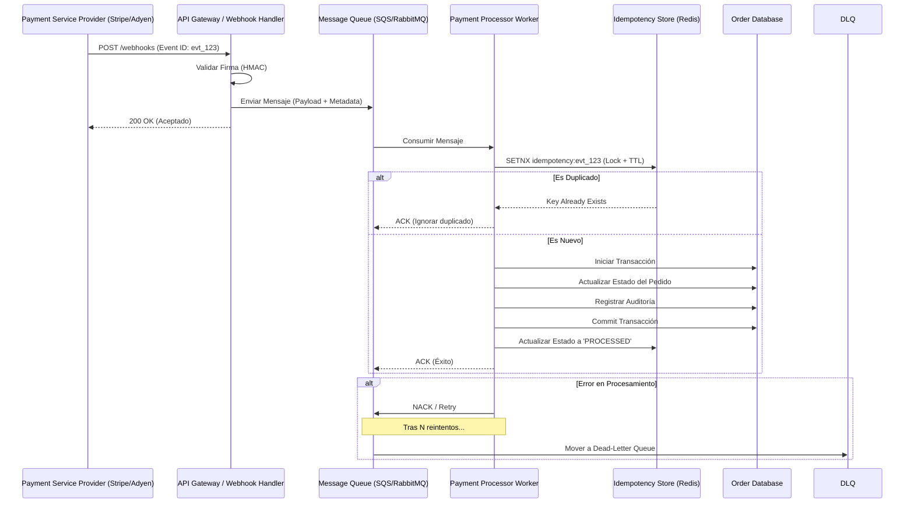

En el ecosistema del **Composable Commerce**, la fiabilidad de las transacciones financieras es el pilar que sostiene la confianza del consumidor y la integridad operativa de la empresa. Sin embargo, nos enfrentamos a un entorno inherentemente hostil: redes poco fiables, latencias impredecibles y proveedores de servicios de pago (PSP) que operan bajo el modelo de "entrega al menos una vez" (at-least-once delivery).

El problema real en arquitecturas enterprise no es procesar un pago, sino qué sucede cuando ese proceso se interrumpe. ¿Qué ocurre si el webhook de Stripe llega dos veces? ¿Qué pasa si nuestra base de datos falla justo después de que el dinero ha sido debitado pero antes de confirmar el pedido? Sin una estrategia de **idempotencia** robusta y una gestión avanzada de fallos mediante **Dead-Letter Queues (DLQ)**, el resultado es catastrófico: cobros duplicados, inventarios inconsistentes y una pesadilla de conciliación manual para el equipo de finanzas.

Este artículo desglosa los patrones de diseño necesarios para implementar un sistema de pagos distribuido que sea verdaderamente resiliente y a prueba de fallos.

## El Mito del "Exactly-Once Delivery"

En sistemas distribuidos, el procesamiento "exactamente una vez" es un objetivo teóricamente imposible de garantizar en todas las capas sin penalizaciones masivas de rendimiento. La realidad es que los webhooks y las colas de mensajes garantizan la entrega, pero a menudo a costa de la duplicidad.

La **idempotencia** es la propiedad de realizar una operación varias veces y obtener el mismo resultado que si se hubiera realizado una sola vez, sin efectos secundarios adicionales. En el contexto de pagos, esto significa que si recibimos el mismo `payment_intent_id` cinco veces, solo debemos procesar la lógica de negocio (actualizar pedido, enviar email, liberar stock) una sola vez.

## Arquitectura de Referencia: El Pipeline de Pagos Resiliente

Para lograr una arquitectura MACH de alto nivel, debemos desacoplar la recepción del webhook de su procesamiento. El receptor debe ser un componente ultraligero que valide la firma y persista el evento en un bus de mensajes.



## Implementación Técnica: El Patrón de Idempotencia con Redis

Para implementar esto en producción, no basta con un simple `if`. Necesitamos un mecanismo de bloqueo distribuido con tiempos de expiración (TTL) para manejar condiciones de carrera (race conditions) donde dos webhooks idénticos llegan casi simultáneamente.

A continuación, un ejemplo en **TypeScript** utilizando un enfoque de "Idempotency Key" persistido en Redis.

```typescript
import Redis from 'ioredis';
import { PrismaClient } from '@prisma/client';

const redis = new Redis(process.env.REDIS_URL);
const prisma = new PrismaClient();

interface WebhookPayload {
  id: string; // ID único del evento del PSP
  orderId: string;
  amount: number;
}

async function processPaymentWebhook(payload: WebhookPayload): Promise<void> {
  const idempotencyKey = `payment:evt:${payload.id}`;
  
  // 1. Intento de adquirir un bloqueo/registro de idempotencia
  // 'NX' asegura que solo se cree si no existe. 'EX' define un TTL de 24h.
  const lock = await redis.set(idempotencyKey, 'PROCESSING', 'NX', 'EX', 86400);

  if (!lock) {
    const currentStatus = await redis.get(idempotencyKey);
    if (currentStatus === 'PROCESSING') {
      throw new Error('Conflict: Event is already being processed');
    }
    console.log(`Event ${payload.id} already processed. Skipping.`);
    return;
  }

  try {
    // 2. Lógica de negocio dentro de una transacción de base de datos
    await prisma.$transaction(async (tx) => {
      const order = await tx.order.findUnique({ where: { id: payload.orderId } });

      if (!order || order.status === 'PAID') {
        return; // Ya procesado o no existe
      }

      await tx.order.update({
        where: { id: payload.orderId },
        data: { status: 'PAID', updatedAt: new Date() }
      });

      await tx.paymentAudit.create({
        data: {
          eventId: payload.id,
          orderId: payload.orderId,
          status: 'SUCCESS'
        }
      });
    });

    // 3. Marcar como completado con éxito
    await redis.set(idempotencyKey, 'COMPLETED', 'EX', 86400);

  } catch (error) {
    // 4. En caso de error, liberamos el bloqueo para permitir reintentos
    await redis.del(idempotencyKey);
    throw error; // Re-lanzamos para que la cola maneje el reintento
  }
}
```

### Por qué este patrón es superior:
1.  **Atomicidad en Redis:** `SET NX` es una operación atómica que previene que dos workers procesen el mismo evento simultáneamente.
2.  **TTL (Time To Live):** Evitamos llenar la memoria de Redis indefinidamente. 24 horas suelen ser suficientes para cubrir la ventana de reintentos de cualquier PSP.
3.  **Transaccionalidad SQL:** La lógica de negocio está protegida por una transacción ACID, asegurando que no haya estados parciales.

---

## Gestión de Fallos: El Rol Crítico de la Dead-Letter Queue (DLQ)

Incluso con idempotencia, las cosas fallan. Un servicio externo de validación de fraude puede estar caído, o la base de datos puede alcanzar su límite de conexiones. Aquí es donde entra la **Dead-Letter Queue**.

Una DLQ es una cola secundaria donde se mueven los mensajes que no pudieron ser procesados después de un número determinado de reintentos (ej. 5 intentos con *Exponential Backoff*).

### Estrategia de Reintentos y Mitigación

| Escenario de Fallo | Estrategia de Mitigación | Acción en DLQ |
| :--- | :--- | :--- |
| **Error de Red Temporal** | Reintento automático con Backoff Exponencial. | Ninguna (se resuelve solo). |
| **Error de Lógica (Bug)** | El mensaje fallará N veces y llegará a la DLQ. | Intervención manual: Corregir código y re-inyectar. |
| **Payload Malformado** | Validación de esquema inmediata. | Mover a DLQ para inspección de seguridad/QA. |
| **Base de Datos Down** | Circuit Breaker para detener el consumo. | Re-inyectar mensajes masivamente tras recuperación. |

### Infraestructura como Código (Terraform) para DLQ en AWS SQS

```hcl
resource "aws_sqs_queue" "payment_processing_dlq" {
  name                      = "payment-processing-dlq"
  message_retention_seconds = 1209600 # 14 días para análisis manual
}

resource "aws_sqs_queue" "payment_processing_queue" {
  name                      = "payment-processing-main"
  delay_seconds             = 0
  max_message_size          = 262144
  message_retention_seconds = 86400
  receive_wait_time_seconds = 10
  
  redrive_policy = jsonencode({
    deadLetterTargetArn = aws_sqs_queue.payment_processing_dlq.arn
    maxReceiveCount     = 5 # Reintentos antes de ir a DLQ
  })
}
```

---

## Trade-offs Arquitectónicos

No existe la "bala de plata". Cada decisión tiene un costo.

| Enfoque | Pros | Contras | Cuándo usarlo |
| :--- | :--- | :--- | :--- |
| **Idempotencia en DB (Unique Constraints)** | Simple, no requiere Redis. | Menos flexible, puede causar bloqueos de tabla pesados en alta concurrencia. | Apps de bajo/medio tráfico. |
| **Capa de Idempotencia en Redis** | Extremadamente rápido, desacoplado de la DB principal. | Añade una pieza móvil más a la infraestructura. | Sistemas MACH de alta escala. |
| **Procesamiento Síncrono** | Respuesta inmediata al PSP. | Riesgo de timeouts, difícil de escalar, sin reintentos nativos. | Prototipos o MVPs. |
| **Event-Driven (Asíncrono)** | Altamente escalable, resiliente, absorbe picos de tráfico. | Complejidad en la trazabilidad (requiere Observabilidad avanzada). | **Estándar Enterprise / MACH.** |

---

## Modos de Fallo Comunes y Cómo Evitarlos

### 1. El Problema del "Poison Pill"
Un mensaje malformado que hace que el worker crashee. Si no hay DLQ, este mensaje volverá a la cola infinitamente, bloqueando el procesamiento de otros mensajes válidos.
*   **Mitigación:** Implementar validación estricta de esquemas (JSON Schema o Zod) al inicio del worker. Si falla la validación, mover a DLQ inmediatamente sin reintentar.

### 2. Expiración Prematura del Lock
Si el procesamiento tarda más que el TTL del lock en Redis, un segundo worker podría empezar a procesar el mismo evento.
*   **Mitigación:** El TTL debe ser significativamente mayor que el timeout del worker. Si el worker tiene un timeout de 30s, el lock de Redis debería ser de al menos 5-10 minutos (o incluso 24h para evitar reintentos tardíos del PSP).

### 3. Inconsistencia entre Redis y DB
El worker actualiza la DB pero falla antes de actualizar Redis a `COMPLETED`.
*   **Mitigación:** Diseñar la lógica de la DB para que sea intrínsecamente segura (usar `UPDATE ... WHERE status != 'PAID'`). Al reintentar, la DB simplemente no hará nada y el worker podrá marcar el éxito en Redis.

---

## Conclusión: Checklist de Implementación para Ingenieros

Para asegurar que tu integración de pagos cumple con los estándares de una arquitectura MACH de clase mundial, sigue este checklist:

- [ ] **Validación de Firma:** ¿Estás verificando el HMAC del webhook para prevenir ataques de inyección?
- [ ] **Persistencia Inmediata:** ¿El webhook se guarda en una cola antes de cualquier procesamiento de negocio?
- [ ] **Clave de Idempotencia:** ¿Utilizas un ID único (ej. `evt_id` de Stripe) para bloquear ejecuciones duplicadas?
- [ ] **Transaccionalidad:** ¿Toda la lógica de actualización de pedidos ocurre dentro de una transacción de base de datos?
- [ ] **Estrategia de Reintentos:** ¿Tienes configurado un *Exponential Backoff* para no saturar tus servicios en caso de error?
- [ ] **Observabilidad de DLQ:** ¿Tienes alertas configuradas para cuando un mensaje llega a la Dead-Letter Queue?
- [ ] **Plan de Recuperación:** ¿Existe un script o proceso para re-inyectar mensajes de la DLQ una vez resuelto un incidente?

La idempotencia no es solo un "feature" técnico; es una póliza de seguro contra el caos operativo. En el mundo del comercio composable, donde múltiples sistemas deben bailar en sincronía, la capacidad de manejar fallos con elegancia es lo que separa a las plataformas mediocres de las arquitecturas resilientes de alto rendimiento.