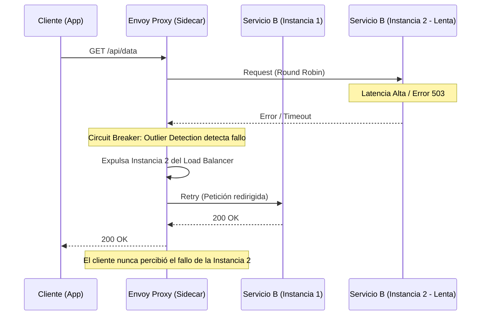

En el ecosistema de microservicios moderno, y particularmente en arquitecturas **MACH (Microservices, API-first, Cloud-native, Headless)**, la red no es confiable. Cuando escalamos a cientos de servicios interconectados, la probabilidad de que un componente falle o presente latencia es del 100%. El verdadero desafío para un *Enterprise Architect* no es evitar el fallo, sino evitar que un fallo localizado se convierta en una catástrofe sistémica: el temido **fallo en cascada**.

Tradicionalmente, los desarrolladores intentaban resolver esto mediante librerías a nivel de aplicación (como Hystrix o Resilience4j). Sin embargo, en un entorno políglota y de escala masiva, acoplar la lógica de resiliencia al código de negocio es un antipatrón que genera deuda técnica y heterogeneidad en las políticas de red. Aquí es donde **Envoy Proxy** e **Istio Service Mesh** se vuelven indispensables, moviendo la responsabilidad de la resiliencia a la infraestructura (Data Plane).

## El Problema: La Tormenta de Retries y el Agotamiento de Recursos

Imagine un servicio de *Checkout* que depende de un microservicio de *Impuestos* (Tax Service). Si el servicio de Impuestos comienza a responder en 5 segundos en lugar de 100ms debido a una saturación en su base de datos, el servicio de Checkout mantendrá las conexiones abiertas, agotando su propio pool de hilos (worker threads). 

Si el Checkout tiene configurados reintentos (retries) agresivos sin un mecanismo de control, cada petición fallida generará tres peticiones adicionales, creando una "Tormenta de Retries" que terminará por fulminar al ya agonizante servicio de Impuestos. Sin un **Circuit Breaker**, el sistema completo colapsa.

### Anatomía de la Resiliencia en Istio

Istio implementa la resiliencia principalmente a través de dos recursos:
1.  **VirtualServices:** Controlan los reintentos (retries) y tiempos de espera (timeouts).
2.  **DestinationRules:** Controlan el *Circuit Breaking* (límites de conexión) y el *Outlier Detection* (expulsión de instancias anómalas).



## Configuración de Producción: Circuit Breaking y Connection Pooling

Para implementar una resiliencia de grado enterprise, debemos configurar el `DestinationRule`. A diferencia de los reintentos, el Circuit Breaker en Istio actúa en dos niveles: limitando el volumen de peticiones para evitar el agotamiento de recursos y detectando instancias "enfermas".

### Ejemplo de DestinationRule para Alta Carga

El siguiente manifiesto configura un límite estricto de conexiones y un mecanismo de detección de valores atípicos (*Outlier Detection*) para un servicio crítico de inventario.

```yaml
apiVersion: networking.istio.io/v1alpha3
kind: DestinationRule
metadata:
  name: inventory-service-resilience
  namespace: production
spec:
  host: inventory-service.production.svc.cluster.local
  trafficPolicy:
    connectionPool:
      tcp:
        maxConnections: 100 # Máximo de conexiones TCP simultáneas
        connectTimeout: 30ms # Tiempo máximo para establecer la conexión
      http:
        http1MaxPendingRequests: 1000 # Peticiones en espera si el pool está lleno
        http2MaxRequests: 1000 # Máximo de peticiones activas para HTTP2
        maxRequestsPerConnection: 10 # Evita conexiones persistentes infinitas
        maxRetries: 3 # Límite de reintentos a nivel de red
    outlierDetection:
      consecutive5xxErrors: 5 # Expulsa si hay 5 errores 5xx seguidos
      interval: 10s # Ventana de tiempo para el análisis
      baseEjectionTime: 30s # Tiempo inicial de expulsión
      maxEjectionPercent: 50 # No expulsar más del 50% de los pods
      minHealthPercent: 50 # Si más del 50% fallan, entra en pánico y deja de expulsar
```

### Análisis de Parámetros Críticos

*   **`maxConnections` & `http1MaxPendingRequests`:** Estos son tus fusibles. Si el servicio de inventario se ralentiza, Envoy empezará a rechazar peticiones inmediatamente con un `503 Service Unavailable` (o `UO` en los logs de Envoy) una vez superados estos límites. Esto protege al servicio que llama de quedarse sin recursos esperando.
*   **`outlierDetection`:** Es el "Circuit Breaker" real en términos de salud de instancia. Si una instancia de un pod empieza a fallar, Envoy la saca del balanceo de carga. El `baseEjectionTime` aumenta exponencialmente si la instancia sigue fallando tras ser reincorporada.

## Estrategias de Reintento y Timeouts con VirtualService

Los reintentos son un arma de doble filo. Deben configurarse con **Exponential Backoff** y **Jitter** para evitar picos de tráfico sincronizados.

```yaml
apiVersion: networking.istio.io/v1alpha3
kind: VirtualService
metadata:
  name: checkout-route
spec:
  hosts:
  - checkout.example.com
  http:
  - route:
    - destination:
        host: checkout-service
    timeout: 2s # Timeout total de la petición
    retries:
      attempts: 3
      perTryTimeout: 500ms # Timeout individual por cada intento
      retryOn: "gateway-error,connect-failure,refused-stream,5xx"
      retryRemoteLocalities: true # Intentar en otras zonas de disponibilidad si es posible
```

**Regla de Oro:** El `timeout` total debe ser mayor que `attempts * perTryTimeout` más el overhead de red, de lo contrario, el cliente cortará la conexión antes de que los reintentos terminen.

## Comparativa de Estrategias de Resiliencia

| Estrategia | Cuándo Usar | Ventajas | Desventajas |
| :--- | :--- | :--- | :--- |
| **Timeouts** | Siempre, en cada llamada externa. | Evita hilos bloqueados indefinidamente. | Un timeout muy corto genera falsos positivos bajo carga. |
| **Retries** | Operaciones idempotentes (GET, PUT seguro). | Mitiga fallos de red transitorios. | Puede causar "Retry Storms" y sobrecargar servicios lentos. |
| **Circuit Breaking** | Servicios con dependencias críticas o legacy. | Previene fallos en cascada y protege al upstream. | Requiere tuning fino; un valor erróneo corta tráfico legítimo. |
| **Outlier Detection** | Despliegues con múltiples réplicas. | Aísla pods defectuosos automáticamente. | No ayuda si el fallo es lógico (bug en el código) y afecta a todos los pods. |

## Modos de Fallo Comunes y Mitigación

### 1. El Problema del "Thundering Herd" (Manada Atronadora)
Cuando un circuito se cierra (vuelve a permitir tráfico) después de un periodo de expulsión, todas las peticiones acumuladas pueden golpear al servicio simultáneamente, derribándolo de nuevo.
*   **Mitigación:** Usar `maxEjectionPercent` bajo (ej. 10%) y asegurar que el balanceador de carga use algoritmos de `LEAST_REQUEST` en lugar de `ROUND_ROBIN`.

### 2. Reintentos en Operaciones No-Idempotentes
Reintentar un `POST /payments` puede resultar en cargos duplicados si el error ocurrió después de que el servidor procesó la petición pero antes de enviar la respuesta.
*   **Mitigación:** Configurar `retryOn` para que solo actúe ante fallos de conexión (`connect-failure`) y no ante errores de aplicación, o implementar *Idempotency Keys* en la API.

### 3. El "Silent Failure" por Circuit Breaker
Un Circuit Breaker mal configurado puede estar rechazando tráfico y el equipo de desarrollo no darse cuenta porque el servicio "parece" estar arriba.
*   **Mitigación:** Monitorizar las métricas de Envoy. Específicamente `upstream_rq_pending_overflow` y `upstream_rq_retry`. Configurar alertas en Prometheus para cuando el contador de expulsiones (`outlier_detection.ejections_active`) sea mayor a cero.

## Implementación Avanzada: Envoy Filters para Casos Específicos

A veces, las abstracciones de Istio no son suficientes. Si necesitamos un Circuit Breaker basado en la latencia del percentil 95 (P95) y no solo en errores 5xx, podemos recurrir a un `EnvoyFilter` para inyectar configuración nativa de Envoy.

```yaml
apiVersion: networking.istio.io/v1alpha3
kind: EnvoyFilter
metadata:
  name: custom-latency-breaker
spec:
  configPatches:
  - applyTo: CLUSTER
    match:
      context: SIDECAR_OUTBOUND
      cluster:
        service: catalog-service.prod.svc.cluster.local
    patch:
      operation: MERGE
      value:
        common_lb_config:
          healthy_panic_threshold:
            value: 60.0 # Entra en modo pánico si menos del 60% están sanos
```

## Checklist de Implementación para Ingeniería

Para asegurar que su arquitectura MACH sea verdaderamente resiliente, siga este checklist en su pipeline de despliegue:

1.  **Auditoría de Idempotencia:** Identificar qué endpoints son seguros para reintentar.
2.  **Definición de Budgets de Error:** Establecer qué latencia es inaceptable para disparar el Circuit Breaker.
3.  **Configuración de Timeouts:** Nunca usar los valores por defecto de los clientes HTTP; definir `perTryTimeout` en el `VirtualService`.
4.  **Pruebas de Caos (Chaos Engineering):** Utilizar herramientas como *Istio Fault Injection* para simular retrasos y abortos en el tráfico y verificar que los Circuit Breakers actúan como se espera.
5.  **Observabilidad:** Crear dashboards en Grafana que visualicen específicamente el tráfico rechazado por el proxy (`503` con flags `UO` o `UH`).

## Conclusión

La resiliencia en sistemas distribuidos no es una característica que se añade al final; es una propiedad emergente del diseño de red. Al delegar el Circuit Breaking y la detección de anomalías a **Envoy** e **Istio**, liberamos a los desarrolladores de la carga de gestionar la infraestructura de red en el código, permitiéndoles enfocarse en la lógica de negocio del Composable Commerce.

Sin embargo, el poder de Envoy conlleva una gran responsabilidad: una configuración de Circuit Breaker demasiado agresiva puede ser tan dañina como no tener ninguna. La clave está en el ajuste fino basado en datos reales de tráfico y en una observabilidad profunda que nos permita entender por qué el "fusible" saltó en primer lugar.