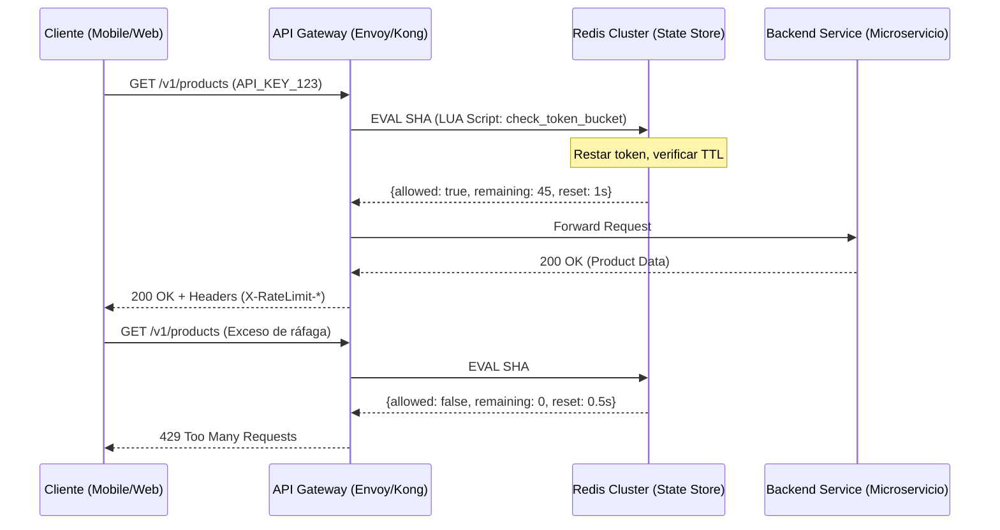

En el ecosistema del **Composable Commerce** y las arquitecturas **MACH**, la disponibilidad no es negociable. Sin embargo, nos enfrentamos a un dilema constante: ¿Cómo protegemos nuestros microservicios de una saturación catastrófica sin degradar la experiencia de los usuarios legítimos durante picos de tráfico inesperados?

El enfoque tradicional de *Rate Limiting* estático —definir, por ejemplo, 100 peticiones por segundo (RPS) por API Key— es insuficiente para las demandas de 2026. Un límite estático es, por definición, arbitrario. Si el backend está infrautilizado, el límite es demasiado restrictivo; si el backend está bajo estrés debido a una degradación en la base de datos, el límite es demasiado permisivo.

Este artículo profundiza en la implementación de estrategias de **Rate Limiting Adaptativo** y el uso avanzado del algoritmo **Token Bucket** para construir sistemas que no solo sobrevivan a las tormentas de tráfico, sino que se ajusten dinámicamente a la salud real de la infraestructura.

## El Problema: La Rigidez del Límite Estático

En una arquitectura de microservicios distribuida, el "ruido de vecinos" (*noisy neighbor*) y las "manadas atronadoras" (*thundering herds*) son riesgos latentes. Cuando implementamos un API Gateway (como Kong, Tyk o Envoy) con límites fijos, ignoramos la elasticidad del cloud.

Imagine un escenario de *Black Friday*. Su servicio de inventario puede manejar 5,000 RPS bajo condiciones normales, pero si un servicio de terceros (como un procesador de pagos o un ERP legacy) comienza a ralentizarse, los hilos de ejecución en su microservicio se agotan esperando respuestas. En este punto, seguir permitiendo 5,000 RPS es una receta para el fallo en cascada. El Rate Limiting debe dejar de ser una configuración de red para convertirse en un mecanismo de **backpressure** inteligente.

## Algoritmo Token Bucket: La Base de la Flexibilidad

A diferencia del algoritmo de *Fixed Window* (ventana fija), que puede permitir el doble de tráfico en el borde de la ventana de tiempo, el **Token Bucket** permite ráfagas (*bursts*) controladas, lo cual es vital para aplicaciones web modernas donde la carga de una página puede disparar múltiples llamadas asíncronas.

### Funcionamiento Lógico
1. Un "cubo" se llena de tokens a una tasa constante ($R$).
2. El cubo tiene una capacidad máxima ($B$).
3. Cada petición consume un token.
4. Si no hay tokens, la petición se rechaza (HTTP 429).

Este algoritmo es ideal para MACH porque permite que un cliente que ha estado inactivo "acumule" crédito para una ráfaga rápida de peticiones al navegar por un catálogo de productos, sin comprometer la estabilidad a largo plazo.

### Arquitectura de Implementación Distribuida

En un entorno cloud-native, el estado del "cubo" no puede residir en la memoria de un solo nodo del Gateway. Debe ser externo y atómico.



## Implementación de Producción: Token Bucket con Redis y LUA

Para garantizar la atomicidad y evitar condiciones de carrera (*race conditions*) sin penalizar la latencia, utilizamos scripts de LUA ejecutados directamente en Redis. Esto reduce los *round-trips* de red de dos a uno.

```lua
-- keys[1]: El identificador del bucket (ej: rate_limit:user_123)
-- args[1]: Tasa de recarga (tokens por segundo)
-- args[2]: Capacidad máxima del bucket (burst)
-- args[3]: Tiempo actual en segundos (microtime)
-- args[4]: Costo de la petición (usualmente 1)

local bucket_key = KEYS[1]
local refill_rate = tonumber(ARGV[1])
local capacity = tonumber(ARGV[2])
local now = tonumber(ARGV[3])
local requested = tonumber(ARGV[4])

local bucket = redis.call('hgetall', bucket_key)
local last_tokens = capacity
local last_refilled = now

if #bucket > 0 then
    -- El bucket ya existe, recuperamos estado
    last_tokens = tonumber(bucket[2])
    last_refilled = tonumber(bucket[4])
end

-- Calcular cuántos tokens se han generado desde la última petición
local delta = math.max(0, now - last_refilled)
local tokens = math.min(capacity, last_tokens + (delta * refill_rate))

local allowed = tokens >= requested
local remaining = tokens

if allowed then
    remaining = tokens - requested
    redis.call('hmset', bucket_key, 'tokens', remaining, 'last_refilled', now)
    -- TTL de seguridad para no llenar Redis de buckets inactivos
    redis.call('expire', bucket_key, math.ceil(capacity / refill_rate) + 1)
end

return { allowed and 1 or 0, remaining }
```

## Hacia el Rate Limiting Adaptativo (Dynamic Throttling)

El verdadero nivel "Principal Architect" se alcanza cuando el `refill_rate` y la `capacity` no son constantes. El **Rate Limiting Adaptativo** ajusta estos valores basándose en señales de salud del sistema (*Gold Signals*): latencia, tasa de errores y utilización de CPU.

### El Algoritmo de Control de Congestión (AIMD)

Inspirado en TCP, podemos implementar un control de **Additive Increase / Multiplicative Decrease**:

1.  **Estado Saludable:** Si la latencia del P99 es < 200ms, incrementamos el límite global en un 5% cada minuto.
2.  **Estado de Alerta:** Si los errores 5xx suben del 1%, reducimos el límite global inmediatamente en un 20%.
3.  **Estado Crítico:** Si la latencia excede un umbral de pánico, reducimos el tráfico al mínimo indispensable para mantener servicios críticos (ej: Checkout > Search).

### Ejemplo de Controlador Adaptativo en Go

Este componente actuaría como un "Sidecar" o un proceso dentro del Gateway que monitorea métricas de Prometheus y actualiza Redis.

```go
type AdaptiveLimiter struct {
    CurrentLimit float64
    MaxLimit     float64
    MinLimit     float64
    LatencyP99   chan float64
}

func (al *AdaptiveLimiter) RunControlLoop() {
    ticker := time.NewTicker(10 * time.Second)
    for range ticker.C {
        p99 := <-al.LatencyP99
        
        if p99 > 500.0 { // Latencia alta: Reducción Multiplicativa
            al.CurrentLimit = math.Max(al.MinLimit, al.CurrentLimit * 0.8)
            log.Printf("Backpressure activado: Nuevo límite %f", al.CurrentLimit)
        } else if p99 < 200.0 { // Sistema sano: Incremento Aditivo
            al.CurrentLimit = math.Min(al.MaxLimit, al.CurrentLimit + 50)
        }
        
        // Actualizar configuración en el Store Distribuido (Redis/ConfigMap)
        al.updateGlobalLimits(al.CurrentLimit)
    }
}
```

## Comparativa de Algoritmos de Rate Limiting

| Algoritmo | Ventajas | Desventajas | Caso de Uso Ideal |
| :--- | :--- | :--- | :--- |
| **Fixed Window** | Muy simple de implementar. Bajo overhead. | Permite picos de tráfico en los bordes de la ventana. | APIs internas con tráfico predecible. |
| **Sliding Window** | Suaviza los picos de tráfico. Más preciso. | Mayor consumo de memoria en Redis (Sorted Sets). | APIs públicas con facturación por uso. |
| **Token Bucket** | Permite ráfagas controladas. Muy eficiente. | Complejidad media (requiere scripts LUA). | **Sistemas MACH / E-commerce.** |
| **Adaptive** | Máxima resiliencia. Protege contra fallos en cascada. | Requiere observabilidad avanzada y tuning. | **Gateways Enterprise de misión crítica.** |

## Modos de Fallo y Mitigación en Producción

Incluso el mejor sistema de Rate Limiting puede fallar. Aquí los escenarios reales:

1.  **Latencia de Redis:** Si Redis se vuelve lento, el API Gateway no debe bloquearse.
    *   *Mitigación:* Implementar un **Fail-Open strategy**. Si el chequeo de límite excede los 10ms, permitir la petición por defecto y disparar una alerta. Es mejor servir una petición de más que bloquear todo el tráfico por un fallo en el sistema de control.
2.  **Clock Skew (Desviación de Reloj):** En sistemas distribuidos, el `now` de cada nodo puede variar.
    *   *Mitigación:* Usar el tiempo del servidor de Redis (`TIME` command) como fuente única de verdad dentro del script LUA.
3.  **Thundering Herd tras 429:** Cuando el límite se libera, todos los clientes reintentan a la vez.
    *   *Mitigación:* Obligar a los clientes a implementar **Exponential Backoff con Jitter** (variación aleatoria). El Gateway puede enviar el header `Retry-After` con valores ligeramente aleatorios.

## Conclusión: Checklist de Implementación para Ingeniería

Para mover su arquitectura MACH hacia un modelo de resiliencia adaptativa, siga estos pasos:

- [ ] **Auditoría de Identidad:** Asegúrese de que todas las peticiones tengan un identificador claro (API Key, User ID o IP) para aplicar límites granulares.
- [ ] **Centralización de Estado:** Implemente un cluster de Redis dedicado exclusivamente a Rate Limiting y Cuotas para evitar interferencias con el caché de aplicación.
- [ ] **Implementación de Token Bucket:** Sustituya los algoritmos de ventana fija por Token Bucket para soportar ráfagas naturales de aplicaciones Headless.
- [ ] **Headers Estándar:** Implemente los headers `X-RateLimit-Limit`, `X-RateLimit-Remaining` y `X-RateLimit-Reset` para que los frontends puedan autogestionarse.
- [ ] **Capa de Observabilidad:** Conecte las métricas de latencia de sus backends con el configurador de límites del Gateway.
- [ ] **Pruebas de Caos:** Ejecute simulaciones de inyección de latencia (usando herramientas como Gremlin o AWS Fault Injection Simulator) para validar que el Rate Limiting adaptativo reacciona reduciendo el throughput antes de que el servicio colapse.

El Rate Limiting no es solo una medida de seguridad; es una herramienta de gestión de producto que garantiza que, incluso en los momentos de mayor estrés, su plataforma siga siendo funcional para sus clientes más valiosos. En el mundo MACH, la elegancia técnica y la estabilidad operativa deben caminar de la mano.