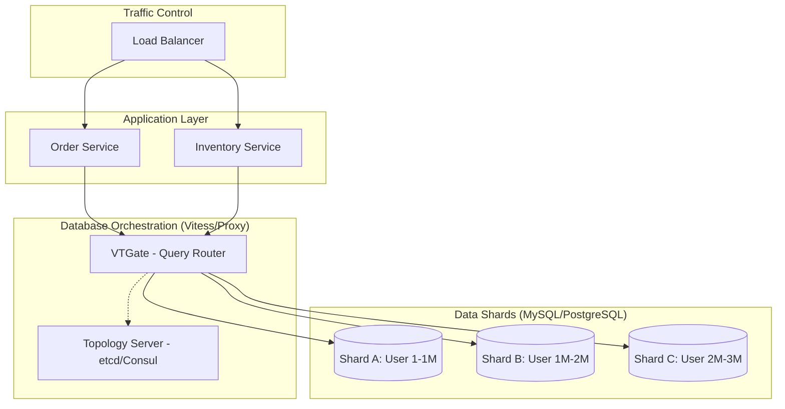

En el ecosistema de arquitecturas MACH (Microservices, API-first, Cloud-native, Headless), la escalabilidad de la capa de aplicación suele resolverse con relativa facilidad mediante orquestadores como Kubernetes y patrones de diseño *stateless*. Sin embargo, la capa de persistencia sigue siendo el "talón de Aquiles" de las plataformas enterprise. Cuando una instancia de Amazon RDS o Google Cloud SQL alcanza su límite físico (incluso en los tipos de instancia más grandes con 128 vCPUs y terabytes de RAM), las organizaciones se enfrentan al temido "muro de escalabilidad vertical".

El problema no es solo el volumen de datos, sino el *throughput* de escritura y la contención de bloqueos en transacciones complejas. En este artículo, analizaremos profundamente las estrategias de **Sharding** y la adopción de **Bases de Datos SQL Distribuidas** (NewSQL), evaluando cómo estas técnicas permiten que una arquitectura de comercio composable soporte picos de tráfico masivos, como un Black Friday global, sin comprometer la integridad referencial ni la consistencia ACID.

## El Dilema de la Escalabilidad SQL: ¿Por qué no basta con Read Replicas?

Muchos equipos de ingeniería intentan posponer el sharding implementando réplicas de lectura. Si bien esto alivia la carga de consultas `SELECT`, no resuelve el problema de las escrituras (`INSERT`, `UPDATE`, `DELETE`). En un modelo de base de datos relacional tradicional, todas las escrituras deben converger en un único nodo primario para garantizar la consistencia.

Cuando el volumen de transacciones por segundo (TPS) supera la capacidad de IOPS y CPU del nodo primario, la latencia aumenta exponencialmente y el sistema colapsa. Aquí es donde entra el **Sharding**: la partición horizontal de los datos en múltiples instancias independientes.

## Taxonomía de Estrategias de Sharding

El sharding no es una solución única; su implementación varía drásticamente según la lógica de negocio y los requisitos de latencia.

### 1. Sharding a Nivel de Aplicación (Application-Level Sharding)
En este modelo, el microservicio es responsable de saber en qué shard reside cada dato. Es la estrategia más "artesanal" y compleja de mantener.
*   **Ventaja:** Control total sobre la lógica de particionamiento.
*   **Desventaja:** "Pollution" del código de negocio con lógica de infraestructura y dificultad extrema para realizar *re-sharding*.

### 2. Sharding mediante Middleware (Proxy-Based)
Se utiliza una capa intermedia (como **Vitess** o **Citus**) que intercepta las consultas SQL y las enruta al shard correspondiente de forma transparente para la aplicación.
*   **Ventaja:** La aplicación sigue viendo una única base de datos lógica.
*   **Desventaja:** Introduce un salto de red adicional (latencia) y complejidad operativa en el clúster de proxies.

### 3. SQL Distribuido Nativo (NewSQL)
Bases de datos diseñadas desde cero para ser distribuidas, como **CockroachDB**, **YugabyteDB** o **TiDB**. Utilizan protocolos de consenso (Raft o Paxos) para gestionar la replicación y el particionamiento automático.
*   **Ventaja:** Escalabilidad horizontal nativa, alta disponibilidad real y gestión automática de hotspots.
*   **Desventaja:** Mayor latencia de escritura comparada con una base de datos local debido al consenso distribuido.

## Arquitectura de un Sistema SQL Sharded

El siguiente diagrama ilustra cómo un clúster de microservicios interactúa con una arquitectura de base de datos distribuida utilizando un orquestador de shards (como Vitess).



## El Arte de Elegir la Sharding Key (Partition Key)

La decisión más crítica en cualquier estrategia de sharding es la elección de la **Sharding Key**. Una mala elección provocará "Hotspots" (nodos sobrecargados mientras otros están ociosos) y consultas "Scatter-Gather" (consultas que deben preguntar a todos los shards, destruyendo el rendimiento).

### Criterios para una Sharding Key de alto rendimiento:
1.  **Alta Cardinalidad:** El campo debe tener muchos valores únicos (ej. `customer_id` vs `country_code`).
2.  **Distribución Uniforme:** Los datos deben repartirse equitativamente entre los shards.
3.  **Afinidad de Consultas:** La mayoría de las consultas críticas deben incluir la sharding key en el filtro `WHERE` para permitir el enrutamiento directo.

#### Ejemplo de Anti-patrón: Sharding por Fecha
Si particionas por `created_at`, todas las escrituras de hoy irán al mismo shard (el más reciente), creando un cuello de botella masivo mientras los shards antiguos permanecen inactivos.

## Implementación Práctica: Configuración de VSchema en Vitess

Vitess es el estándar de facto para escalar MySQL en Kubernetes (usado por Slack y GitHub). A continuación, se muestra cómo definir un `VSchema` para distribuir una tabla de pedidos (`orders`) basada en un hash del `customer_id`.

```json
{
  "sharded": true,
  "vindexes": {
    "hash": {
      "type": "hash"
    }
  },
  "tables": {
    "orders": {
      "column_vindexes": [
        {
          "column": "customer_id",
          "name": "hash"
        }
      ]
    }
  }
}
```

Este esquema le indica al router que utilice un algoritmo de hash sobre `customer_id` para determinar el shard de destino, garantizando una distribución uniforme independientemente del crecimiento de los datos.

## Manejo de Transacciones Distribuidas y Consistencia

Uno de los mayores desafíos es mantener la consistencia ACID cuando una transacción afecta a múltiples shards.

### Two-Phase Commit (2PC)
Es el método tradicional. El "Transaction Manager" pregunta a todos los shards si pueden comprometer la transacción (Phase 1: Prepare) y, si todos responden positivamente, les ordena ejecutarla (Phase 2: Commit).
*   **Problema:** Si un nodo es lento o falla durante la fase 2, el sistema puede quedar bloqueado, afectando la disponibilidad.

### El enfoque NewSQL: Raft/Paxos
Bases de datos como CockroachDB no usan 2PC tradicional para todo, sino que dividen los datos en "Ranges" y cada range es un grupo de replicación que utiliza el algoritmo Raft. Una escritura se considera exitosa si la mayoría de los nodos del grupo de replicación la confirman.

```go
// Ejemplo de lógica de reintento para transacciones en CockroachDB (Go)
// El driver maneja errores de contención de transacciones distribuidas.

err := crdb.ExecuteTx(context.Background(), db, nil, func(tx *sql.Tx) error {
    _, err := tx.Exec(
        "UPDATE accounts SET balance = balance - $1 WHERE id = $2",
        amount, fromID,
    )
    if err != nil {
        return err
    }
    _, err = tx.Exec(
        "UPDATE accounts SET balance = balance + $1 WHERE id = $2",
        amount, toID,
    )
    return err
})
```

## Tabla Comparativa: Trade-offs de Arquitectura

| Característica | Sharding Manual (App) | Middleware (Vitess/Citus) | SQL Distribuido (CockroachDB) |
| :--- | :--- | :--- | :--- |
| **Complejidad de Código** | Muy Alta | Baja | Nula (SQL Estándar) |
| **Transparencia** | No | Alta | Total |
| **Cross-shard Joins** | Manual / Muy difícil | Soportado (con latencia) | Nativo |
| **Re-sharding** | Doloroso / Manual | Automatizado | Automático y Online |
| **Latencia de Escritura** | Mínima | Media | Media/Alta (Consenso) |
| **Costo Operativo** | Alto | Medio (Requiere expertos) | Bajo (Managed Services) |

## Modos de Fallo Comunes y Mitigación

### 1. El "Fan-out" Explosivo
Ocurre cuando una consulta no incluye la sharding key. El proxy debe enviar la consulta a **todos** los shards y agregar los resultados en memoria.
*   **Mitigación:** Implementar "Query Linters" en el pipeline de CI/CD que bloqueen consultas a tablas sharded que no filtren por la partition key.

### 2. Shard Skew (Desbalanceo)
Un shard crece mucho más que otros debido a un cliente "pesado" (ej. una cuenta corporativa masiva en un sistema SaaS).
*   **Mitigación:** Implementar particionamiento secundario o usar "Filtered Replication" para mover datos calientes a shards dedicados.

### 3. Split-Brain en el Cluster de Consenso
En sistemas NewSQL, si la red se particiona, los nodos pueden quedar aislados.
*   **Mitigación:** Desplegar siempre un número impar de nodos (mínimo 3) repartidos en diferentes Zonas de Disponibilidad (AZs) para garantizar que siempre haya un quórum mayoritario.

## Conclusión: ¿Cuándo dar el salto?

El sharding no es una "bala de plata"; introduce una complejidad operativa significativa. Antes de implementarlo, asegúrese de haber agotado las optimizaciones de índices, el caching agresivo con Redis y el escalado vertical.

Sin embargo, si su plataforma MACH está procesando miles de escrituras por segundo y el crecimiento proyectado es exponencial, el SQL Distribuido es la única forma de garantizar que la base de datos no se convierta en el techo de su negocio.

### Checklist de Implementación para Equipos de Ingeniería

- [ ] **Análisis de Carga:** Identificar si el cuello de botella es CPU (consultas complejas) o I/O (escrituras masivas).
- [ ] **Auditoría de Queries:** Listar las 10 consultas más frecuentes y verificar si comparten una clave común.
- [ ] **Selección de Tecnología:** ¿Necesita compatibilidad total con PostgreSQL (Citus/Yugabyte) o MySQL (Vitess)?
- [ ] **Estrategia de Migración:** Planificar el uso de herramientas de CDC (Change Data Capture) como Debezium para migrar datos del monolito al clúster sharded sin downtime.
- [ ] **Pruebas de Caos:** Simular la caída de un shard completo y validar el tiempo de recuperación y la integridad de los datos.

La escalabilidad horizontal en SQL ya no es un mito reservado para los gigantes tecnológicos. Con las herramientas adecuadas y un diseño de sharding consciente, cualquier arquitectura enterprise puede alcanzar niveles de escala global manteniendo la robustez del modelo relacional.