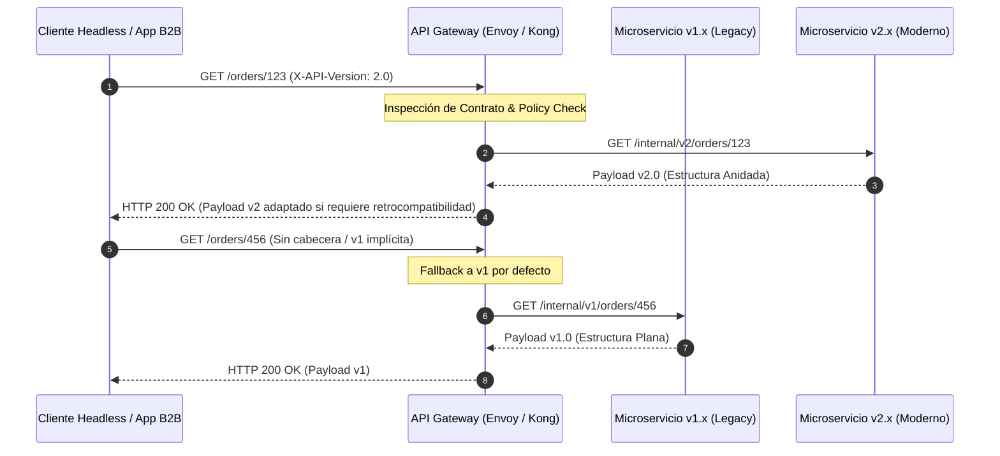

## Introducción: El Dolor Oculto de la Obsolescencia de Contratos API en Entornos Enterprise

En el ecosistema de arquitecturas desacopladas y Composable Commerce, las APIs RESTful son el sistema nervioso central. Conectan aplicaciones Headless, portales corporativos, microservicios internos y pasarelas de pago de terceros. Sin embargo, a medida que las organizaciones escalan, el ciclo de vida del software introduce una fricción crítica: **la evolución de los contratos API sin romper a los consumidores existentes**.

El problema clásico en empresas con alta madurez tecnológica ocurre cuando un equipo de microservicios necesita refactorizar un dominio de negocio (por ejemplo, cambiar la estructura de la entidad `Order` de un formato plano a un modelo jerárquico basado en agregados DDD). La tentación inicial es crear un endpoint `/api/v2/orders`. Sin una estrategia rigurosa, esto desencadena un efecto dominó:
1. Fragmentación de la lógica de negocio en el backend.
2. Mantenimiento simultáneo de bases de código obsoletas (código *legacy*).
3. Ruptura de clientes móviles e integraciones B2B que no pueden actualizarse al mismo ritmo que el ciclo de despliegue continuo (CD) del backend.
4. Degradación de la confianza en los contratos de integración (Service Level Agreements o SLAs informales entre equipos).

Como arquitectos enterprise, nuestro objetivo no es evitar el cambio, sino diseñar mecanismos de versionado y migración **no destructivos**. Esto implica que los cambios evolutivos deben ser transparentes para los clientes vigentes, permitiendo un desmantelamiento gradual y métricas de adopción precisas antes de depreciar contratos antiguos.

---

## Patrones Arquitectónicos para la Evolución de APIs

Para lograr una evolución no destructiva, debemos combinar políticas estrictas de diseño de contratos en el API Gateway, la aplicación de patrones de diseño orientados a la extensibilidad y una estrategia de enrutamiento inteligente.

### El Enfoque de Enrutamiento Dinámico y Traducción en el Gateway

En lugar de propagar versiones rígidas a través de rutas de URL (ej. `/v1/`, `/v2/`), las arquitecturas MACH modernas prefieren el versionado basado en cabeceras HTTP personalizadas (`Accept` o `X-API-Version`) combinadas con un API Gateway (como Kong, Apigee o Envoy) capaz de realizar transformaciones de payloads al vuelo (*Payload Transformation*).



---

## Implementación Práctica: Patrón Tolerant Reader y Transformaciones en el Gateway

Para ilustrar una migración real, consideremos un microservicio de gestión de clientes (`Customer Service`) donde el campo `fullName` debe dividirse en `firstName` y `lastName` sin impactar a las aplicaciones consumidoras que aún esperan el campo unificado.

### 1. Definición del Esquema OpenAPI v3.1 (Contrato Unificado)

Utilizamos un contrato estricto donde los campos nuevos son opcionales y los obsoletos se marcan explícitamente con `deprecated: true`.

```yaml
openapi: 3.1.0
info:
  title: Customer Management API
  version: 2.1.0
paths:
  /customers/{id}:
    get:
      summary: Obtener detalles del cliente
      parameters:
        - name: id
          in: path
          required: true
          schema:
            type: string
            format: uuid
      responses:
        '200':
          description: Cliente recuperado exitosamente
          content:
            application/json:
              schema:
                $ref: '#/components/schemas/CustomerResponse'
components:
  schemas:
    CustomerResponse:
      type: object
      required:
        - id
        - email
      properties:
        id:
          type: string
          format: uuid
        fullName:
          type: string
          deprecated: true
          description: "Obsoleto desde v2.0.0. Usar firstName y lastName."
        firstName:
          type: string
        lastName:
          type: string
        email:
          type: string
          format: email
```

### 2. Middleware de Traducción y Retrocompatibilidad (TypeScript / Fastify)

En el microservicio backend, implementamos el patrón *Tolerant Reader* junto con un interceptor de salida que garantiza que, si un cliente solicita la versión antigua (`X-API-Version: 1.0`), el servicio reconstruye dinámicamente el campo plano.

```typescript
import { FastifyInstance, FastifyRequest, FastifyReply } from 'type-provider-fastify';

interface CustomerV2 {
  id: string;
  firstName: string;
  lastName: string;
  email: string;
  fullName?: string;
}

export async function customerRoutes(server: FastifyInstance) {
  server.get('/customers/:id', async (request: FastifyRequest<{ Params: { id: string } }>, reply: FastifyReply) => {
    const apiVersion = request.headers['x-api-version'] || '1.0';
    
    // Simulación de llamada a la capa de persistencia (Dominio v2)
    const customerV2: CustomerV2 = await fetchCustomerFromDB(request.params.id);

    if (apiVersion === '1.0') {
      // Aplicar transformación no destructiva para clientes legacy
      const legacyPayload = {
        id: customerV2.id,
        fullName: `${customerV2.firstName} ${customerV2.lastName}`.trim(),
        email: customerV2.email
      };
      
      reply.header('Deprecation', 'true');
      reply.header('Sunset', 'Sat, 31 Dec 2026 23:59:59 GMT');
      return reply.send(legacyPayload);
    }

    // Retorno nativo para contratos modernos v2.x
    return reply.send(customerV2);
  });
}

async function fetchCustomerFromDB(id: string): Promise<CustomerV2> {
  // Mock de base de datos
  return {
    id,
    firstName: 'Jane',
    lastName: 'Doe',
    email: 'jane.doe@enterprise.com'
  };
}
```

---

## Análisis de Trade-offs: Estrategias de Versionado

La siguiente tabla compara las estrategias de versionado de APIs más comunes en arquitecturas empresariales, evaluando sus ventajas operativas y costos de mantenimiento.

| Estrategia de Versionado | Pros | Contras | Cuándo Usar | Cuándo Evitar |
| :--- | :--- | :--- | :--- | :--- |
| **URL Pathing (`/v1/resource`)** | • Extremadamente simple de entender.<br>• Fácil inspección visual en logs y proxies. | • Viola los principios puristas REST.<br>• Acopla la ruta física del backend al ciclo de vida. | Aplicaciones públicas B2C con bajo riesgo de refactorización constante. | Microservicios internos interconectados con alta frecuencia de cambio. |
| **Cabeceras HTTP (`X-API-Version`)** | • Mantiene las URLs limpias y estables.<br>• Permite enrutamiento avanzado en Gateway. | • Menos intuitivo para pruebas manuales en navegador.<br>• Requiere configuración robusta del Gateway. | Ecosistemas enterprise complejos con múltiples clientes desacoplados (Mobile, SPA, B2B). | APIs públicas abiertas donde los desarrolladores externos prefieren claridad visual en la URL. |
| **Content Negotiation (`Accept: application/vnd.company.v2+json`)** | • Alineado estrictamente con RFC de HTTP.<br>• Granularidad a nivel de representación de recursos. | • Complejidad alta de depuración.<br>• Soporte limitado en clientes HTTP básicos o librerías legacy. | APIs con contratos altamente dinámicos y evolución iterativa de esquemas de datos. | Equipos de desarrollo junior o integraciones con sistemas ERP/Legacy rígidos. |
| **Evolución Aditiva (Sin Versionado Explícito)** | • Elimina la duplicación de código.<br>• Ciclo de vida continuo sin fricción de versiones. | • Exige disciplina extrema de diseño.<br>• Imposible realizar cambios estructurales profundos de golpe. | Microservicios maduros con contratos basados en adición de propiedades opcionales. | Cambios radicales en la arquitectura de datos (ej. normalización a desnormalización). |

---

## Modos de Fallo Comunes y Estrategias de Mitigación en Producción

Durante una migración de API a gran escala, los equipos de ingeniería suelen enfrentarse a fallos sistémicos recurrentes. A continuación se detallan los escenarios críticos y cómo mitigarlos:

### 1. El Impacto del "Cache Poisoning" por Respuestas Versionadas
* **El Problema:** Si se utiliza versionado por cabeceras (`X-API-Version`) y se implementa una capa de CDN o caché distribuida (como Redis o Cloudflare) sin incluir la cabecera en la clave de caché (*Cache Key*), los clientes de la versión 1.0 podrían recibir respuestas cacheadas de la versión 2.0 y viceversa.
* **Mitigación:** Configurar explícitamente la directiva `Vary: X-API-Version, Accept` en las respuestas HTTP y asegurar que el API Gateway o CDN considere todas las cabeceras de versionado como parte del hash de la clave de caché.

### 2. Degradación Silenciosa por Falta de Métricas de Adopción
* **El Problema:** Los arquitectos deprecan versiones antiguas basándose en fechas estimadas, rompiendo integraciones críticas de socios de negocio que no leyeron las notificaciones.
* **Mitigación:** Implementar un middleware de telemetría en el API Gateway que emita métricas Prometheus/Datadog etiquetadas por versión de API y consumidor (`client_id`). 

```promql
# Ejemplo de consulta Prometheus para monitorear el uso de contratos obsoletos
sum(rate(http_requests_total{api_version="1.0"}[1h])) by (client_id)
```

Al detectar que un `client_id` específico sigue utilizando la versión obsoleta 30 días antes del *Sunset*, el sistema automatiza el envío de alertas mediante webhooks o correos directos al equipo responsable.

### 3. Explosión de Complejidad en el Código del Backend (El Anti-Patrón "Switch-Case")
* **El Problema:** Los desarrolladores terminan escribiendo código lleno de condicionales `if (version === 'v1')` dentro de la lógica de negocio, creando un monolito distribuido inmanejable.
* **Mitigación:** Aislar la lógica de transformación en adaptadores de borde (en el Gateway o en capas de presentación dedicadas). El dominio central del microservicio debe procesar exclusivamente la última versión de los modelos de datos (v2.x en adelante).

---

## Conclusión y Checklist de Implementación

La migración y el versionado no destructivo de APIs no son un problema técnico aislado, sino una disciplina fundamental de gobernanza dentro de las arquitecturas MACH. Al desplazar la complejidad del versionado hacia el API Gateway y adoptar contratos extensibles basados en el patrón *Tolerant Reader*, las organizaciones empresariales pueden desacoplar los ciclos de entrega de sus equipos de desarrollo de la disponibilidad de los clientes finales.

### Checklist para Equipos de Ingeniería

Antes de aprobar un PR que introduzca cambios en una API de producción, verifique los siguientes puntos:

- [ ] **Contrato OpenAPI Actualizado:** El cambio ha sido documentado en la especificación OpenAPI v3.1, marcando los campos obsoletos con `deprecated: true`.
- [ ] **Aditividad Validada:** Se priorizó la adición de nuevos campos opcionales por encima de la modificación o eliminación de campos existentes.
- [ ] **Cabeceras de Depreciación:** Se incluyeron las cabeceras HTTP estándar `Deprecation` y `Sunset` en las respuestas de contratos obsoletos.
- [ ] **Configuración de Caché:** El CDN y el API Gateway incluyen las cabeceras de versionado (`Vary`) en la generación de claves de caché para evitar colisiones.
- [ ] **Telemetría y Alertas:** Existe un dashboard activo en Prometheus/Grafana que monitorea el volumen de peticiones por versión y por `client_id`.
- [ ] **Pruebas de Contrato (Pact):** Se ejecutaron pruebas basadas en contratos (*Consumer-Driven Contracts*) en el pipeline de CI/CD para garantizar que los cambios no rompen a los clientes registrados.