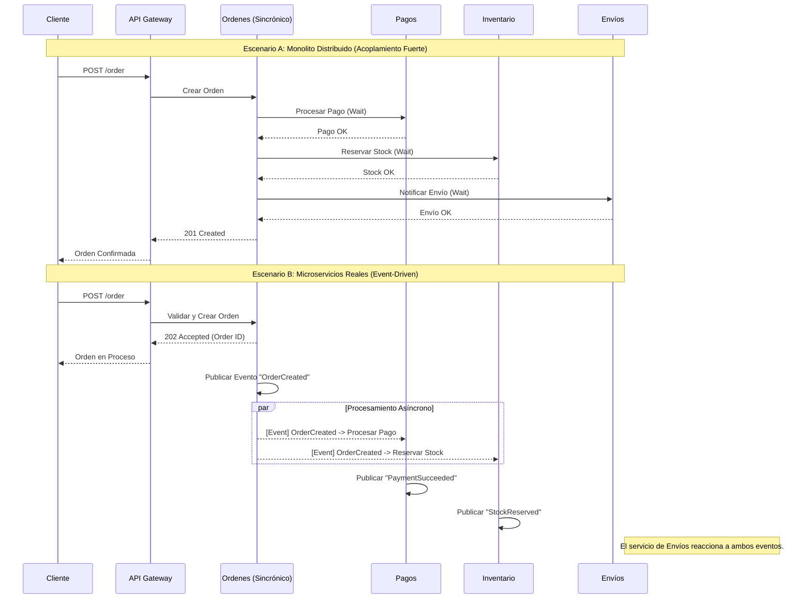

En la última década, la promesa de los microservicios ha seducido a las organizaciones Enterprise: escalabilidad infinita, despliegues independientes y agilidad organizacional. Sin embargo, muchas empresas que iniciaron su transformación hacia arquitecturas MACH (Microservices, API-first, Cloud-native, Headless) se encuentran hoy atrapadas en una pesadilla arquitectónica: el **Monolito Distribuido**.

Un monolito distribuido posee todas las desventajas de un sistema monolítico (acoplamiento fuerte, despliegues coordinados, fragilidad) y todas las complejidades de un sistema distribuido (latencia de red, fallos parciales, consistencia eventual). Desde la perspectiva de un *Principal Architect*, este es el escenario de mayor riesgo para el ROI y la salud operativa de una plataforma de Composable Commerce.

Este artículo analiza las señales de alerta críticas, el impacto financiero de esta "trampa" y las estrategias de remediación técnica para recuperar la agilidad perdida.

## La Anatomía del Problema: ¿Por qué sucede?

El error fundamental no suele ser tecnológico, sino conceptual. La mayoría de los equipos migran "código" en lugar de "capacidades de negocio". Cuando se dividen servicios basándose en capas técnicas (ej. un servicio de "Base de Datos", un servicio de "Lógica de Negocio") en lugar de **Bounded Contexts** de Domain-Driven Design (DDD), el resultado es una red de servicios que no pueden vivir el uno sin el otro.

### Señales de Alerta (Red Flags)

1.  **Despliegues en "Lock-step":** Si para subir una característica al servicio de *Checkout* necesitas desplegar simultáneamente el servicio de *Inventario* y el de *Promociones*, no tienes microservicios. Tienes un monolito fragmentado.
2.  **Chatty APIs y Latencia en Cascada:** Un solo request del cliente dispara 15 llamadas síncronas entre servicios internos. Si un servicio falla, el sistema entero colapsa (efecto dominó).
3.  **Base de Datos Compartida:** Múltiples servicios leyendo y escribiendo en el mismo esquema de base de datos. Esto rompe el principio de encapsulamiento y autonomía.
4.  **Conocimiento Excesivo del Dominio Ajeno:** El Servicio A conoce la estructura interna de los datos del Servicio B, obligando a cambios coordinados cada vez que el esquema de B evoluciona.

## Visualizando el Caos vs. La Orquestación Saludable

A continuación, comparamos el flujo de una arquitectura acoplada (Monolito Distribuido) frente a una arquitectura desacoplada basada en eventos (MACH ideal).



En el **Escenario A**, si el servicio de *Envíos* tarda 2 segundos o falla, la transacción del usuario falla o se bloquea. En el **Escenario B**, el sistema es resiliente y escala horizontalmente sin bloquear el hilo principal del usuario.

## Impacto en FinOps y ROI

Desde una perspectiva de estrategia Enterprise, el monolito distribuido es una "fuga de capital".

*   **Costo de Infraestructura:** El tráfico "East-West" (entre servicios) en la nube no es gratuito. Las llamadas excesivas aumentan los costos de transferencia de datos y latencia de red.
*   **Developer Velocity:** El tiempo promedio de entrega (Lead Time for Changes) aumenta exponencialmente debido a las dependencias entre equipos.
*   **MTTR (Mean Time To Recovery):** Identificar qué servicio causó un fallo en una cadena de 10 llamadas síncronas sin trazabilidad avanzada es una labor de horas, impactando directamente en el SLA del negocio.

| Característica | Monolito Tradicional | Monolito Distribuido | Microservicios (MACH) |
| :--- | :--- | :--- | :--- |
| **Complejidad** | Baja/Media | **Extrema** | Alta (pero gestionable) |
| **Velocidad de Despliegue** | Lenta | **Muy Lenta (Coordinada)** | Rápida (Independiente) |
| **Resiliencia** | Todo o nada | **Frágil (Cascading failures)** | Alta (Aislamiento de fallos) |
| **Costo Cloud** | Bajo | **Alto (Overhead de red)** | Optimizado (Escalado granular) |
| **Uso Recomendado** | MVPs, Apps simples | **NUNCA** | Sistemas Enterprise complejos |

## Estrategias de Remediación Técnica

Si has diagnosticado que tu organización está en la trampa, la solución no es volver al monolito, sino evolucionar hacia un desacoplamiento real.

### 1. Implementación de Contratos de API y Consumer-Driven Contracts (CDC)

Para evitar que los cambios en un servicio rompan a otros, debemos tratar las APIs internas como productos públicos. El uso de herramientas como **Pact** o **Postman API Governance** es vital.

### 2. Transición de Sincrónico a Asincrónico (Event-Driven)

El uso de un Message Broker (RabbitMQ, Kafka, AWS EventBridge) permite que los servicios se comuniquen sin conocer la disponibilidad del otro.

#### Ejemplo de Implementación: Patrón Outbox en TypeScript
Para garantizar que no perdamos eventos si la base de datos y el broker de mensajería no están en la misma transacción atómica, usamos el patrón **Transactional Outbox**.

```typescript
// service/order-service.ts
import { EntityManager } from 'typeorm';
import { Order } from './entities/Order';
import { OutboxEvent } from './entities/OutboxEvent';

async function createOrder(orderData: any, manager: EntityManager) {
  return await manager.transaction(async (transactionalEntityManager) => {
    // 1. Guardar la orden en la base de datos
    const order = new Order(orderData);
    const savedOrder = await transactionalEntityManager.save(order);

    // 2. En lugar de enviar a Kafka directamente, guardamos en una tabla 'Outbox'
    // Esto garantiza que si la transacción falla, el evento no se envía.
    const event = new OutboxEvent({
      aggregateId: savedOrder.id,
      type: 'ORDER_CREATED',
      payload: JSON.stringify(savedOrder),
      status: 'PENDING'
    });
    
    await transactionalEntityManager.save(event);
    
    return savedOrder;
  });
}

/**
 * Un proceso independiente (Relay) lee la tabla Outbox 
 * y publica en el Message Broker (Kafka/RabbitMQ).
 */
```

### 3. Service Mesh y Resiliencia Dinámica

Si las llamadas síncronas son inevitables, debemos implementar *Circuit Breakers* y *Retries* inteligentes. No reinventes la rueda; utiliza un **Service Mesh** como Istio o Linkerd.

#### Configuración de Resiliencia con Istio (YAML)
Este recurso de Istio evita que un servicio lento degrade todo el sistema mediante un *Circuit Breaker*.

```yaml
apiVersion: networking.istio.io/v1alpha3
kind: DestinationRule
metadata:
  name: inventory-service-cb
spec:
  host: inventory-service.prod.svc.cluster.local
  trafficPolicy:
    connectionPool:
      tcp:
        maxConnections: 100
      http:
        http1MaxPendingRequests: 10
        maxRequestsPerConnection: 5
    outlierDetection:
      consecutive5xxErrors: 3
      interval: 10s
      baseEjectionTime: 30s
      maxEjectionPercent: 50
```

## Modos de Fallo Comunes y Mitigación

### El "Distributed Transaction" Anti-pattern
**Problema:** Intentar mantener la consistencia ACID a través de múltiples servicios mediante Two-Phase Commit (2PC). Esto bloquea recursos y destruye la escalabilidad.
**Remediación:** Adoptar el **Patrón Saga**. Gestionar transacciones largas mediante una secuencia de transacciones locales coordinadas por eventos, con acciones compensatorias en caso de error.

### La "Base de Datos Vampiro"
**Problema:** Un servicio que consulta directamente la base de datos de otro servicio para obtener información "rápidamente".
**Remediación:** **Data Replication** o **API Composition**. El servicio interesado debe tener su propia proyección de los datos necesarios, actualizada mediante eventos, o consultar vía API con una estrategia de caché agresiva.

## Conclusión: Checklist para el Principal Architect

Para escapar de la trampa del monolito distribuido, los equipos de ingeniería deben auditar su arquitectura actual bajo estos criterios:

- [ ] **Autonomía de Datos:** ¿Cada microservicio es dueño de su propio esquema y base de datos?
- [ ] **Despliegue Independiente:** ¿Puedo desplegar el Servicio A un viernes a las 5 PM sin avisar al equipo del Servicio B?
- [ ] **Comunicación Asíncrona:** ¿Más del 70% de la comunicación entre servicios ocurre vía eventos/mensajería?
- [ ] **Observabilidad:** ¿Tengo trazabilidad distribuida (Jaeger/Zipkin) para visualizar el flujo de un request a través de la red?
- [ ] **DDD Bounded Contexts:** ¿Los límites de mis servicios reflejan procesos de negocio reales o simplemente capas de software?

La arquitectura MACH no se trata de cuántos servicios tienes en Kubernetes, sino de cuán libres son esos servicios para evolucionar sin fricción. Si la complejidad está aumentando y la velocidad disminuyendo, es momento de detener la fábrica, reevaluar los contextos de dominio y romper las cadenas del acoplamiento. El ROI de tu transformación digital depende de ello.