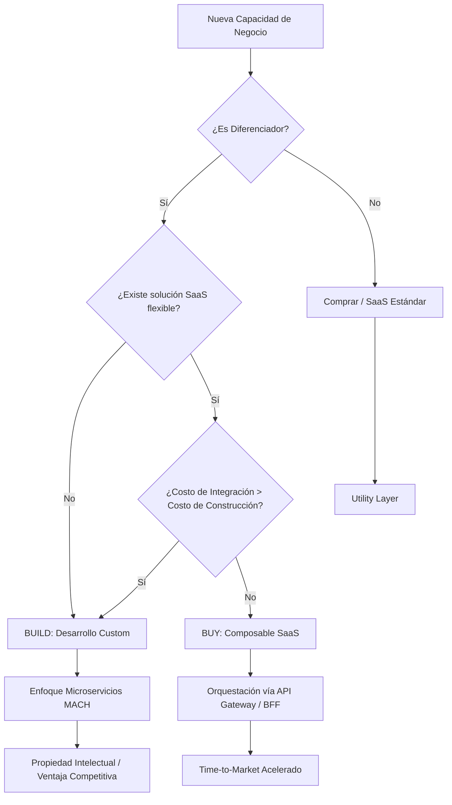

En la era de la arquitectura **MACH** (Microservices, API-first, Cloud-native, Headless), la pregunta fundamental para un CTO o un Principal Architect ya no es "¿Podemos construir esto?", sino "¿Debemos construir esto?". La transición de monolitos legados a ecosistemas *composable* ha eliminado las barreras de entrada para adquirir soluciones de nicho (Best-of-Breed), pero ha introducido una complejidad sin precedentes en la orquestación y la gobernanza de datos.

El "Buy" ya no significa comprar una suite cerrada; significa suscribirse a una API SaaS. El "Build" ya no significa picar código desde cero; significa ensamblar funciones serverless y microservicios sobre infraestructura gestionada. En este artículo, desglosamos la matriz de decisión definitiva para navegar el dilema de **Build vs. Buy** bajo una óptica de FinOps, ROI y agilidad técnica.

## El Dilema del "Undifferentiated Heavy Lifting"

El error más común en las organizaciones enterprise es dedicar talento de ingeniería de alto costo a resolver problemas que ya han sido resueltos y comoditizados por el mercado. Jeff Bezos popularizó el término *Undifferentiated Heavy Lifting* para referirse a todas aquellas tareas que son difíciles de ejecutar pero que no agregan valor real al cliente final (como gestionar centros de datos o, en nuestro contexto, construir un motor de promociones estándar).

En un ecosistema composable, cada componente debe justificarse bajo una premisa: **¿Es este componente un diferenciador competitivo o es una utilidad?**

### La Matriz de Diferenciación vs. Complejidad

Para tomar una decisión informada, debemos mapear cada capacidad de negocio en una matriz de dos ejes:

1.  **Valor Estratégico (Diferenciación):** ¿Qué tan única es esta funcionalidad para nuestro modelo de negocio?
2.  **Complejidad de Ejecución / Mantenimiento:** ¿Qué tan difícil es construirlo y, más importante, mantenerlo actualizado frente a los estándares del mercado?

## Flujo de Decisión Arquitectónica

Antes de escribir una sola línea de código o firmar un contrato con un vendor de Commerce o CMS, el equipo de arquitectura debe pasar por el siguiente flujo de validación:



## Dimensiones de Evaluación: El Iceberg del TCO

El costo de una solución "Buy" es transparente (licenciamiento/suscripción), pero el costo de "Build" suele estar subestimado. Como arquitectos, debemos aplicar principios de **FinOps** para calcular el Total Cost of Ownership (TCO) real.

### 1. Costos de Oportunidad
Construir un sistema de gestión de inventario (IMS) propio puede tomar 6 meses. Si una solución SaaS permite salir al mercado en 4 semanas, el costo de oportunidad son 5 meses de ingresos perdidos o de falta de feedback del mercado.

### 2. Deuda de Mantenimiento (Day 2 Operations)
El código que escribes hoy es el legado de mañana. Construir implica:
*   Parches de seguridad y cumplimiento (PCI-DSS, GDPR).
*   Escalabilidad elástica y monitoreo 24/7.
*   Documentación y rotación de personal (el riesgo de que el "dueño" del código se vaya).

### 3. El Impuesto de Integración
Incluso si compras (Buy), existe un costo de "pegamento". En arquitecturas composable, este es el **Integration Tax**. Debes considerar el desarrollo de conectores, transformación de esquemas de datos y latencia de red.

## Ejemplo Práctico: Evaluación de un Motor de Búsqueda

Supongamos que una empresa de Retail necesita mejorar su búsqueda interna.

| Criterio | Opción A: Build (Elasticsearch/OpenSearch + Custom Ranking) | Opción B: Buy (Algolia / Constructor.io) |
| :--- | :--- | :--- |
| **Control** | Total sobre algoritmos y datos. | Limitado a las APIs del vendor. |
| **Time-to-Market** | 3-5 meses (infra, tuning, UI). | 2-4 semanas (integración de catálogo). |
| **Mantenimiento** | Alto (SRE, Data Engineers). | Bajo (Gestionado por el vendor). |
| **Costo Inicial** | Bajo (Open Source). | Alto (SaaS Fees). |
| **Costo a Largo Plazo** | Muy alto (Salarios + Infra). | Predecible (Escalado por volumen). |
| **Decisión Típica** | Si el ranking es el core del negocio (ej. Amazon). | Si la búsqueda es una utilidad (ej. Moda Retail). |

## Implementación Técnica: El Patrón "Anti-Corruption Layer" (ACL)

Cuando decidimos "Comprar" un componente en un ecosistema composable, no debemos permitir que la API del vendor dicte nuestro modelo de dominio. Aquí es donde entra el código de producción.

A continuación, un ejemplo en **TypeScript** de cómo implementar un *Wrapper* o *Adapter* para un servicio de impuestos (Tax Service) comprado, asegurando que si decidimos cambiar de vendor (o construir uno propio) en el futuro, el impacto sea mínimo.

```typescript
/**
 * Domain Model: Definimos nuestra propia interfaz de negocio
 * independientemente del vendor seleccionado.
 */
interface TaxCalculationRequest {
  orderId: string;
  amount: number;
  zipCode: string;
  countryCode: string;
}

interface TaxResponse {
  totalTax: number;
  taxRate: number;
  providerReference: string;
}

/**
 * Port: Interfaz que deben implementar los adaptadores
 */
interface ITaxProvider {
  calculateTax(request: TaxCalculationRequest): Promise<TaxResponse>;
}

/**
 * Adapter: Implementación específica para un vendor (ej. Avalara o TaxJar)
 */
class AvalaraAdapter implements ITaxProvider {
  private readonly apiKey: string;

  constructor(config: { apiKey: string }) {
    this.apiKey = config.apiKey;
  }

  async calculateTax(request: TaxCalculationRequest): Promise<TaxResponse> {
    // Lógica de transformación: De nuestro dominio al esquema del Vendor
    const vendorPayload = {
      lines: [{ amount: request.amount }],
      address: { zip: request.zipCode, country: request.countryCode }
    };

    // Llamada simulada a la API externa
    const response = await fetch('https://api.avalara.com/v2/tax', {
      method: 'POST',
      body: JSON.stringify(vendorPayload),
      headers: { 'Authorization': `Bearer ${this.apiKey}` }
    });

    const data = await response.json();

    // Normalización: Del esquema del Vendor a nuestro dominio
    return {
      totalTax: data.totalAmount,
      taxRate: data.summaryRate,
      providerReference: data.transactionId
    };
  }
}

/**
 * Factory: Orquestación de la decisión Build vs Buy en tiempo de ejecución/config
 */
class TaxServiceFactory {
  static getProvider(): ITaxProvider {
    if (process.env.TAX_PROVIDER === 'CUSTOM_BUILD') {
      return new InternalTaxEngine(); // Nuestra lógica propia
    }
    return new AvalaraAdapter({ apiKey: process.env.AVALARA_KEY! });
  }
}
```

## Trade-offs Arquitectónicos: Resumen Ejecutivo

| Estrategia | Pros | Contras | Cuándo usarlo |
| :--- | :--- | :--- | :--- |
| **Build (Custom)** | Propiedad intelectual, cero costos de licencia, ajuste perfecto al proceso. | Alto TCO, riesgo de obsolescencia, dificultad para atraer talento especializado. | Funcionalidades que generan una ventaja competitiva directa y única. |
| **Buy (SaaS/MACH)** | Velocidad, innovación delegada al vendor, escalabilidad garantizada. | Vendor lock-in (mitigable), costos recurrentes, dependencia de su roadmap. | Capacidades estándar: Checkout, Pagos, Búsqueda, CMS, Auth. |
| **Buy & Extend** | Balance entre velocidad y personalización. | Complejidad en la capa de orquestación, riesgo de "Distributed Monolith". | Cuando un SaaS cubre el 80% y el 20% restante es crítico y único. |

## Modos de Fallo y Mitigación en Producción

### 1. El "SaaS Sprawl" (Explosión de Vendors)
**Fallo:** Tener 20 suscripciones diferentes con modelos de datos incompatibles, creando silos de información.
**Mitigación:** Implementar una capa de **GraphQL Federation** o un **Unified Data Layer** que actúe como fuente de verdad para el frontend, abstrayendo el origen de los datos.

### 2. El Síndrome "Not Invented Here" (NIH)
**Fallo:** Ingenieros que rechazan soluciones de terceros porque "podemos hacerlo mejor", resultando en sistemas mediocres que consumen todo el presupuesto de innovación.
**Mitigación:** Establecer un comité de arquitectura que exija un análisis de ROI y TCO a 3 años para cualquier iniciativa de "Build".

### 3. Vendor Lock-in Agudo
**Fallo:** Acoplar la lógica de negocio directamente a los SDKs del vendor.
**Mitigación:** Utilizar el patrón **Hexagonal Architecture** (Ports & Adapters) como se mostró en el ejemplo de código. La lógica de negocio nunca debe conocer la existencia de Stripe, Contentful o Algolia.

## Conclusión: Checklist para la Toma de Decisiones

Para su próxima iniciativa en un ecosistema Composable, someta el requerimiento a este checklist:

1.  **Análisis de Diferenciación:** ¿Si construimos esto mejor que nadie, venderemos más o reduciremos costos drásticamente? (Si la respuesta es No, **BUY**).
2.  **Evaluación de Talento:** ¿Tenemos el equipo para mantener este sistema en producción un viernes a las 3:00 AM? (Si la respuesta es No, **BUY**).
3.  **Escrutinio de API:** ¿El vendor seleccionado ofrece Webhooks, SDKs modernos y una documentación de primer nivel? (Si la respuesta es No, busque otro vendor o considere **BUILD**).
4.  **Cálculo de TCO:** ¿El costo de licencias por 3 años es menor que el salario de 2 ingenieros senior dedicados a esto? (Si la respuesta es Sí, **BUY**).
5.  **Estrategia de Salida:** ¿Qué tan difícil sería migrar los datos fuera de este sistema en 24 meses?

La arquitectura Composable no se trata de no volver a programar; se trata de programar únicamente aquello que hace que su empresa sea extraordinaria. El resto es simplemente infraestructura que debería ser consumida como un servicio. En el 'MACH Playbook', nuestra máxima es clara: **Construye para diferenciar, compra para acelerar.**