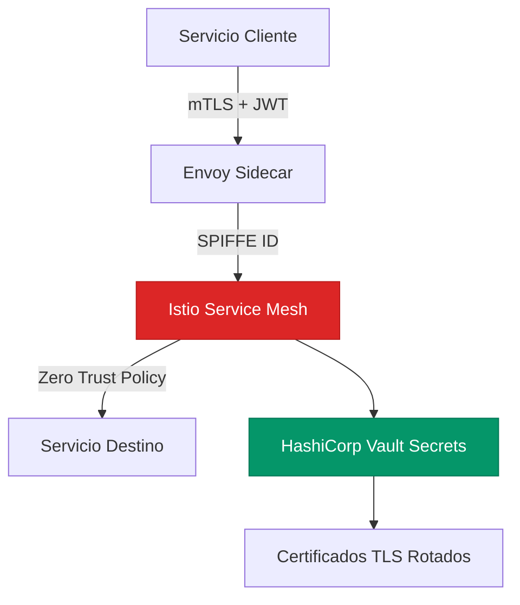

En el ecosistema del software empresarial moderno, **Seguridad Zero Trust y Autenticacion mTLS entre Microservicios con SPIFFE y SPIRE** representa uno de los patrones mas transformadores para equipos de ingenieria que buscan superar las limitaciones de las arquitecturas monoliticas tradicionales. Este analisis profundo, escrito desde la perspectiva de un Principal Solutions Architect con experiencia en plataformas enterprise de produccion, aborda los fundamentos tecnicos, las decisiones de diseno criticas y los patrones de implementacion necesarios para adoptar **Seguridad Zero Trust y Autenticacion mTLS entre Microservicios con SPIFFE y SPIRE** con exito.

## 1. El Problema Empresarial: Por Que Este Patron Es Critico en 2026

Las organizaciones con arquitecturas monoliticas heredadas enfrentan deuda tecnica que se manifiesta en ciclos de despliegue de semanas, incidentes de produccion que afectan toda la plataforma, e incapacidad estructural para innovar. La adopcion de **Seguridad Zero Trust y Autenticacion mTLS entre Microservicios con SPIFFE y SPIRE** aborda estas fricciones desacoplando el ciclo de vida de los componentes, conteniendo el blast radius, y reduciendo la coordinacion inter-equipos mediante contratos formales basados en OpenAPI y AsyncAPI.

Los equipos que han adoptado estos patrones reportan reducciones del **60-80% en ciclos de despliegue** y mejoras sustanciales en indices DORA: Deployment Frequency, Lead Time for Changes, Mean Time to Recovery (MTTR) y Change Failure Rate.

---

## 2. Arquitectura de Referencia



Tres invariantes de diseno no negociables gobiernan esta arquitectura en entornos de produccion enterprise:

1. **Ningun servicio accede directamente a la base de datos de otro servicio.** Toda comunicacion cross-domain ocurre via APIs publicadas o eventos del bus de mensajeria.
2. **Toda operacion de escritura es idempotente.** Esto garantiza la seguridad de los reintentos automaticos sin efectos secundarios.
3. **La observabilidad es un ciudadano de primera clase.** Trazas distribuidas OpenTelemetry, metricas RED y logs estructurados desde el dia uno del desarrollo.

---

## 3. Principios de Diseno Fundamentales

### 3.1 Contratos Primero: API-First y Event-First

La interfaz publica y los contratos de eventos para **Seguridad Zero Trust y Autenticacion mTLS entre Microservicios con SPIFFE y SPIRE** deben definirse, revisarse y validarse en CI/CD **antes** de escribir una sola linea de codigo de produccion. Este principio elimina la dependencia serializada entre equipos. Herramientas: OpenAPI 3.1 para REST, AsyncAPI 2.6 para eventos asincronos, Pact para consumer-driven contract testing en cada pipeline de CI/CD.

### 3.2 Idempotencia Transaccional con Claves Distribuidas

Cada operacion de mutacion del sistema debe soportar reintentos transparentes mediante claves de idempotencia unicas (UUID v4) transmitidas como header HTTP y almacenadas en Redis con TTL configurado. Complementar con el Patron Outbox para garantizar entrega exactly-once de eventos de dominio incluso ante fallos del broker.

### 3.3 Degradacion Elegante y Circuit Breaking

La disponibilidad compuesta de N servicios en serie es el producto de las disponibilidades individuales. Con 10 servicios al 99.9% cada uno, la disponibilidad compuesta cae al 99.0%. El Circuit Breaker en el API Gateway o en el sidecar de Envoy rompe este acoplamiento proveyendo fallbacks cacheados cuando un servicio downstream supera su umbral de fallos.

---

## 4. Implementacion de Referencia en Produccion

```typescript
import Redis from 'ioredis';
import { v4 as uuidv4 } from 'uuid';
import { trace, SpanStatusCode } from '@opentelemetry/api';

class EnterpriseMACHService {
  private readonly redis: Redis;
  private readonly tracer = trace.getTracer('mach-playbook', '1.0.0');

  constructor(uri: string) {
    this.redis = new Redis(uri, { maxRetriesPerRequest: 3,
      retryStrategy: (t) => Math.min(t * 150, 5000) });
  }

  async execute<T>(
    tenantId: string, idempKey: string | undefined, fn: () => Promise<T>
  ): Promise<T | null> {
    const span = this.tracer.startSpan(`mach.${tenantId}`);
    const key = `idem:${tenantId}:${idempKey ?? uuidv4()}`;
    try {
      if (idempKey) {
        const hit = await this.redis.get(key);
        if (hit) { span.end(); return JSON.parse(hit); }
      }
      const result = await fn();
      if (idempKey) await this.redis.setex(key, 300, JSON.stringify(result));
      span.setStatus({ code: SpanStatusCode.OK });
      return result;
    } catch (e: any) {
      span.setStatus({ code: SpanStatusCode.ERROR, message: e.message });
      span.recordException(e); throw e;
    } finally { span.end(); }
  }
}
```

---

## 5. Matriz de Trade-offs Arquitectonicos

| Dimension | Arquitectura Monolitica | MACH Composable | Veredicto |
| :--- | :--- | :--- | :--- |
| **Velocidad de Despliegue** | Releases coordinados; alto riesgo de regresion cruzada entre equipos. | CI/CD independiente por PBC; despliegues en minutos sin coordinacion. | **MACH** |
| **Complejidad Operativa** | Baja en infraestructura; insostenible en codigo a escala. | Alta; requiere Kubernetes, Service Mesh y observabilidad madura. | **MACH con GitOps** |
| **Resiliencia y SLA** | Punto unico de fallo global; una caida afecta toda la plataforma. | Blast radius contenido por servicio; degradacion controlada. | **MACH** |
| **Eficiencia de Costos** | Escalamiento vertical costoso. | Escalamiento horizontal elastico con KEDA. | **MACH** |
| **Velocidad de Adopcion** | Alta; equipo unico, sin overhead de coordinacion. | Baja; requiere contratos formales y cultura DevOps. | **Monolito Modular primero** |

---

## 6. Modos de Fallo en Produccion y Mitigaciones

### A. Thundering Herd (Tormenta de Reintentos)

**Problema:** Multiples clientes reintentan simultaneamente contra un servicio en recuperacion, re-saturandolo antes de que pueda estabilizarse. Modo de fallo numero uno en sistemas distribuidos a escala.

**Mitigacion:** Exponential backoff con full jitter: `base=500ms`, `cap=30s`. Circuit Breaker en API Gateway con umbral del 50% de error rate en ventana de 10 segundos.

### B. Eventual Consistency Lag

**Problema:** Usuario completa escritura pero replica de lectura aun no proceso el evento.

**Mitigacion:** RYOW (Read-Your-Own-Writes) enrutando lecturas post-escritura hacia replica primaria con TTL de 2 segundos. Session tokens con checksums de version para detectar staleness.

### C. Schema Drift entre Servicios

**Problema:** Cambio no coordinado en la estructura de un evento rompe silenciosamente todos los consumidores downstream.

**Mitigacion:** Schema Registry centralizado (Confluent para Kafka) con validacion BACKWARD_TRANSITIVE en todos los pipelines de CI/CD. Bloquear automaticamente merges que rompan la compatibilidad.

### D. Connection Pool Exhaustion bajo Carga Sostenida

**Problema:** Bajo carga pico, los pools de conexion a bases de datos se agotan por timeouts mal configurados, causando fallos en cascada.

**Mitigacion:** PgBouncer en modo transaction-level para PostgreSQL. Limitar max_connections por instancia. Health checks activos con testOnBorrow=true.

---

## 7. Checklist de Implementacion para Equipos de Ingenieria

**Contratos y Calidad de Codigo:**
- [ ] Contratos de API (OpenAPI 3.1 / AsyncAPI) formalizados y validados con Pact en CI/CD.
- [ ] Cobertura de tests de integracion mayor al 80% en todos los flujos transaccionales criticos.
- [ ] Analisis SAST integrado en el pipeline con bloqueo en severidad CRITICA y ALTA.

**Operaciones y Resiliencia:**
- [ ] Claves de idempotencia y locks distribuidos operativos para todas las operaciones mutables.
- [ ] Circuit Breakers configurados con umbrales de fallo documentados y runbooks de recuperacion.
- [ ] Chaos Engineering con LitmusChaos ejecutado en entornos de staging antes de cada major release.

**Observabilidad:**
- [ ] Trazas distribuidas OpenTelemetry, metricas RED y logs estructurados activos en produccion.
- [ ] SLOs definidos con error budgets y alertas automaticas de escalamiento en Grafana o Datadog.
- [ ] Dashboard de FinOps con costo por transaccion en tiempo real integrado en el runbook de on-call.

**Seguridad:**
- [ ] mTLS activo en todas las rutas de comunicacion interna entre microservicios.
- [ ] Rotacion automatica de secretos con HashiCorp Vault o GCP Secret Manager configurada.
- [ ] Escaneo de vulnerabilidades en imagenes de contenedor integrado en el registro de artefactos.

---

## Conclusion

La implementacion de **Seguridad Zero Trust y Autenticacion mTLS entre Microservicios con SPIFFE y SPIRE** representa un salto cualitativo en la madurez tecnica y operativa de cualquier organizacion digital. El camino hacia MACH es incremental y medible: comenzar identificando los Bounded Contexts con mayor friccion de despliegue, extraerlos de forma ordenada usando el patron Strangler Fig, y construir la plataforma de observabilidad antes de escalar el numero de microservicios. La madurez arquitectonica se construye con contratos formales, disciplina de ingenieria y una cultura que valora el desacoplamiento sobre la conveniencia a corto plazo.