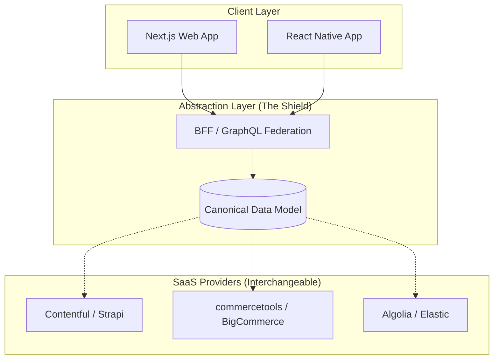

La promesa central de la arquitectura MACH (Microservices, API-first, Cloud-native, Headless) es la agilidad y la libertad de elegir el "Best-of-Breed" para cada capacidad de negocio. Sin embargo, en la práctica, muchas organizaciones están descubriendo una ironía costosa: han escapado del "monolito de software" solo para caer en el "monolito de contratos". 

El riesgo de **Vendor Lock-in** en un ecosistema Composable no desaparece; se fragmenta. Si no se gestiona proactivamente desde las capas de arquitectura y legal, la dependencia de un proveedor de búsqueda (e.g., Algolia), de comercio (e.g., commercetools) o de CMS (e.g., Contentful) puede volverse tan rígida y costosa como los antiguos ERPs on-premise. 

Este artículo analiza las estrategias de ingeniería y gobernanza necesarias para mantener la soberanía tecnológica en un mundo SaaS, garantizando que el "derecho a migrar" sea una realidad técnica y no solo una cláusula contractual vacía.

## El Paradox del Best-of-Breed: ¿Libertad o Fragmentación?

En el modelo tradicional, el lock-in era vertical (toda la suite pertenecía a un dueño). En MACH, el lock-in es horizontal y funcional. Los principales puntos de fricción que impiden la portabilidad son:

1.  **Data Gravity (Gravedad de Datos):** El costo y la complejidad de extraer años de historial de pedidos, configuraciones de productos o activos digitales de una plataforma SaaS.
2.  **Proprietary Logic (Lógica Propietaria):** El uso de funciones específicas del proveedor (e.g., extensiones de API personalizadas o "hooks" propietarios) que no tienen equivalente directo en competidores.
3.  **Egress Costs y API Rate Limits:** Barreras económicas impuestas por los proveedores de nube y SaaS para dificultar la extracción masiva de datos durante una migración.
4.  **Operational Knowledge:** El costo de re-entrenar a los equipos de ingeniería y operaciones en una nueva herramienta.

## Patrones Arquitectónicos para la Mitigación

Para mitigar estos riesgos, el Principal Architect debe implementar capas de aislamiento que protejan el core del negocio de las fluctuaciones del mercado SaaS.

### 1. Anti-Corruption Layer (ACL) y Capas de Abstracción

No permita que los modelos de datos de sus proveedores SaaS se filtren en su lógica de negocio o en su frontend. Si su aplicación React consume directamente el esquema JSON de Contentful, usted está "bloqueado" a nivel de código.

La solución es un **BFF (Backend for Frontend)** o un **API Gateway** que actúe como traductor entre el modelo canónico de la empresa y las APIs de los proveedores.



### 2. Implementación Técnica: El Patrón Adapter

A continuación, se muestra un ejemplo en TypeScript de cómo abstraer un proveedor de pagos. Si decidimos cambiar de Stripe a Adyen, la lógica de negocio que invoca `processPayment` permanece inalterada.

```typescript
/**
 * Definición del Modelo Canónico de Pago
 * Independiente de cualquier proveedor externo.
 */
interface PaymentResult {
  transactionId: string;
  status: 'SUCCESS' | 'FAILURE' | 'PENDING';
  rawResponse: any;
}

interface PaymentProvider {
  process(amount: number, currency: string, source: string): Promise<PaymentResult>;
}

/**
 * Adapter para Stripe
 */
class StripeAdapter implements PaymentProvider {
  async process(amount: number, currency: string, source: string): Promise<PaymentResult> {
    // Lógica específica de Stripe SDK
    const charge = await stripe.charges.create({ amount, currency, source });
    return {
      transactionId: charge.id,
      status: charge.paid ? 'SUCCESS' : 'FAILURE',
      rawResponse: charge
    };
  }
}

/**
 * Adapter para Adyen (Preparado para el futuro)
 */
class AdyenAdapter implements PaymentProvider {
  async process(amount: number, currency: string, source: string): Promise<PaymentResult> {
    // Lógica específica de Adyen API
    const response = await adyenClient.payments({ amount: { value: amount, currency }, reference: source });
    return {
      transactionId: response.pspReference,
      status: response.resultCode === 'Authorised' ? 'SUCCESS' : 'FAILURE',
      rawResponse: response
    };
  }
}

/**
 * Orquestador de Negocio: No conoce los detalles del proveedor
 */
class CheckoutService {
  constructor(private paymentProvider: PaymentProvider) {}

  async completeOrder(orderId: string, total: number) {
    const result = await this.paymentProvider.process(total, 'USD', 'tok_visa');
    if (result.status === 'SUCCESS') {
      // Actualizar base de datos interna
      console.log(`Order ${orderId} confirmed with ID: ${result.transactionId}`);
    }
  }
}
```

## Estrategias Contractuales y FinOps

La arquitectura técnica es solo la mitad de la batalla. La mitigación del lock-in debe estar escrita en el contrato (SLA/MSA).

### Cláusulas de "Derecho de Salida" (Exit Strategy)

Al negociar con proveedores SaaS de nivel Enterprise, se deben exigir los siguientes puntos:

1.  **Portabilidad de Datos Obligatoria:** El proveedor debe garantizar la entrega de todos los datos del cliente en un formato estándar (JSON, CSV, Parquet) en un plazo máximo de 30 días tras la terminación del contrato.
2.  **API de Exportación Masiva:** Acceso a endpoints de alta velocidad para exportación de datos sin cargos adicionales por "egress" excesivo durante el periodo de transición.
3.  **Periodo de Gracia de Transición:** El derecho a extender el servicio mes a mes (hasta 6 meses) después de la finalización del contrato principal para permitir una migración segura.
4.  **No-Proprietary Extensions:** Evitar el uso de lenguajes de scripting propietarios dentro de la plataforma que no puedan ser exportados (e.g., evitar lógica pesada en "Functions" propietarias del SaaS).

### Matriz de Trade-offs: Abstracción vs. Velocidad

No todo debe ser abstraído. La abstracción excesiva introduce latencia y costo de desarrollo.

| Estrategia | Ventajas | Desventajas | Cuándo Usar |
| :--- | :--- | :--- | :--- |
| **Integración Directa** | Máxima velocidad, uso de features nativas. | Lock-in total, difícil de testear. | MVPs, servicios no críticos. |
| **Capa de Abstracción (BFF)** | Desacoplamiento, seguridad, optimización de payloads. | Mayor latencia (hop extra), mantenimiento de código. | Core Commerce, Checkout, Identidad. |
| **iPaaS / Middleware** | Low-code, conectores pre-construidos. | Costo por licencia, otro vendor lock-in (al iPaaS). | Integraciones ERP/Legacy complejas. |
| **Multi-SaaS (Active-Active)** | Resiliencia extrema, cero lock-in. | Complejidad masiva, inconsistencia de datos. | Casi nunca (solo en casos de misión crítica extrema). |

## Modos de Fallo Comunes en la Mitigación

Incluso con las mejores intenciones, las estrategias de mitigación pueden fallar:

*   **The Leaky Abstraction (Abstracción con Fugas):** Cuando el modelo canónico termina pareciéndose demasiado al modelo de un proveedor específico porque "era más fácil". Esto rompe la neutralidad.
*   **The Lowest Common Denominator (El Mínimo Común Denominador):** Al intentar ser compatible con todos los proveedores, se dejan de usar las características innovadoras que justificaron la compra del SaaS en primer lugar.
    *   *Mitigación:* Use el patrón "Feature Toggling" y permita que la capa de abstracción exponga "extensiones" controladas para funcionalidades únicas.
*   **Data Inconsistency durante la Migración:** Durante un cambio de proveedor, mantener la paridad de datos entre el sistema A y el sistema B es el mayor riesgo operativo.
    *   *Mitigación:* Implemente una estrategia de **Dual Write** o **Change Data Capture (CDC)** para alimentar ambos sistemas durante la ventana de migración.

## Estrategia de Datos: El "Single Source of Truth" Externo

Una de las tácticas más efectivas para anular el lock-in es no permitir que el SaaS sea el dueño absoluto de la verdad. 

En lugar de que el CMS sea el único lugar donde residen los metadatos de los productos, mantenga un **Master Data Management (MDM)** o un **Data Lake** propio. El SaaS debe ser visto como un "motor de entrega" (Delivery Engine), no como el "sistema de registro" (System of Record) definitivo.

```sql
-- Ejemplo de auditoría de integridad: Comparando el MDM interno vs el Estado del SaaS
-- Esto asegura que podemos reconstruir el estado del SaaS en cualquier momento.

SELECT 
    p.product_sku,
    p.price AS internal_price,
    s.price AS saas_price,
    (p.price - s.price) AS discrepancy
FROM 
    internal_mdm.products p
LEFT JOIN 
    saas_export.catalog s ON p.product_sku = s.sku
WHERE 
    p.last_updated > NOW() - INTERVAL '24 hours'
    AND p.price <> s.price;
```

## Conclusión: El Checklist de Implementación para el Arquitecto

La soberanía tecnológica no se logra por accidente; se diseña. Para asegurar que su arquitectura MACH sea verdaderamente "composable" y no una trampa de suscripciones, siga este checklist:

- [ ] **Definición de Modelos Canónicos:** ¿Tiene su organización un esquema de datos propio para 'Producto', 'Orden' y 'Cliente' independiente de las APIs de los proveedores?
- [ ] **Evaluación de "Exit Readiness":** ¿Podría su equipo extraer todos los datos de su CMS/Commerce actual y cargarlos en un competidor en menos de 4 semanas?
- [ ] **Aislamiento de Lógica:** ¿Están las reglas de negocio críticas (precios, promociones, impuestos) en su propio microservicio o están "enterradas" en scripts propietarios del proveedor SaaS?
- [ ] **Análisis de Costos de Salida (FinOps):** ¿Ha calculado el costo de transferencia de datos (Egress) necesario para una migración total?
- [ ] **Contratos con Cláusulas de Cooperación:** ¿Obliga su contrato al proveedor a asistir técnicamente en una migración de salida?

La arquitectura MACH es sobre **opciones**. Si su arquitectura no le permite cambiar de opinión sobre un proveedor sin reescribir el 80% de su ecosistema, entonces no es Composable; es simplemente un monolito distribuido en la nube de otros.