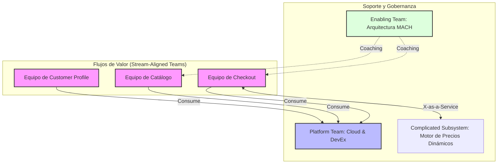

En la última década, la industria tecnológica ha presenciado una migración masiva hacia arquitecturas **MACH** (Microservicios, API-first, Cloud-native y Headless). Sin embargo, como Principal Solutions Architect, he observado un patrón crítico de fracaso en implementaciones de escala enterprise: organizaciones que adoptan tecnologías de vanguardia pero mantienen estructuras de equipos del siglo XX.

El resultado es el temido "Monolito Distribuido". La fricción operativa, los cuellos de botella en las aprobaciones y la falta de autonomía anulan por completo los beneficios de agilidad y escalabilidad que MACH promete. Para resolver esto, no necesitamos mejores balanceadores de carga; necesitamos aplicar la **Maniobra Inversa de Conway** y reestructurar la organización mediante **Equipos Stream-Aligned**.

## El Problema: La Ley de Conway y la Resistencia Estructural

En 1967, Melvin Conway postuló: *"Las organizaciones que diseñan sistemas están limitadas a producir diseños que son copias de las estructuras de comunicación de estas organizaciones"*.

En una empresa tradicional, los equipos están divididos por silos funcionales:
1.  **Equipo de Frontend:** Dueños de la UI.
2.  **Equipo de Backend:** Dueños de la lógica y APIs.
3.  **Equipo de DBA/Datos:** Dueños del esquema.
4.  **Equipo de QA:** Dueños de las pruebas.
5.  **Equipo de Infraestructura/Operaciones:** Dueños del despliegue.

Cuando esta organización intenta implementar una arquitectura Composable (MACH), cada cambio requiere una coordinación extenuante entre cinco departamentos. Un simple cambio en el proceso de *checkout* genera tickets de Jira que viajan de un silo a otro, aumentando el *Lead Time* y diluyendo la responsabilidad del producto.

## La Solución: La Maniobra Inversa de Conway

La **Maniobra Inversa de Conway** sugiere que debemos evolucionar nuestra estructura organizacional para que refleje la arquitectura de software deseada. Si queremos microservicios desacoplados y dominios de negocio independientes (Bounded Contexts), debemos crear equipos que sean igualmente independientes.

### Equipos Stream-Aligned: El Motor de MACH

Basándonos en el framework de *Team Topologies* (Skelton & Pais), el equipo fundamental en una arquitectura MACH es el **Stream-Aligned Team**.

Un equipo *Stream-Aligned* es un equipo multidisciplinar que tiene la propiedad total de un flujo de valor de principio a fin (por ejemplo, "Búsqueda y Descubrimiento", "Carrito y Pagos" o "Lealtad"). Este equipo posee:
-   Ingenieros de Frontend y Backend.
-   Especialistas en Cloud/DevOps.
-   Product Owner y QA.
-   Responsabilidad sobre el ciclo de vida completo: desde el diseño hasta la operación en producción (*You build it, you run it*).

### El Ecosistema de Soporte

Para que los equipos *Stream-Aligned* no colapsen bajo la carga cognitiva de gestionar toda la infraestructura, necesitamos otros tres tipos de equipos:

1.  **Platform Teams:** Crean una "Plataforma Interna de Desarrollador" (IDP) que abstrae la complejidad de Kubernetes, redes y seguridad.
2.  **Enabling Teams:** Consultores internos que ayudan a los equipos a cerrar brechas de conocimiento (ej. especialistas en accesibilidad o seguridad).
3.  **Complicated Subsystem Teams:** Equipos opcionales para partes del sistema que requieren matemáticas avanzadas o conocimientos muy específicos (ej. un motor de recomendaciones basado en ML).

## Arquitectura de Interacción de Equipos

El siguiente diagrama ilustra cómo fluye el valor y cómo interactúan los equipos en una organización MACH madura:



## Implementación Técnica: "Organization as Code"

Para habilitar la autonomía de los equipos *Stream-Aligned*, la infraestructura debe ser tratada como un producto de autoservicio. No podemos esperar a que un equipo de "Operaciones" cree un namespace en K8s o un bucket de S3.

A continuación, un ejemplo de cómo un **Platform Team** define una abstracción (usando Crossplane o Terraform) para que un equipo *Stream-Aligned* pueda instanciar su propio entorno de microservicio MACH sin tickets de por medio.

### Ejemplo: Definición de un "Team Workspace" (Terraform)

```hcl
# Módulo de abstracción para un equipo Stream-Aligned
module "stream_aligned_workspace" {
  source = "./modules/platform-team/workspace"

  team_name          = "checkout-team"
  environment        = "production"
  cloud_region       = "us-east-1"
  
  # Definición de Bounded Contexts (Microservicios)
  services = {
    payment-gateway = {
      cpu    = "500m"
      memory = "1Gi"
      public_api = true
    },
    tax-calculator = {
      cpu    = "250m"
      memory = "512Mi"
      public_api = false
    }
  }

  # Base de datos dedicada para asegurar el desacoplamiento (Database-per-service)
  database_type = "aurora-postgresql"
  
  # FinOps: Presupuesto máximo mensual para este equipo
  monthly_budget_usd = 1500
}

# Output para el equipo: URL del API Gateway y credenciales de despliegue
output "team_api_endpoint" {
  value = module.stream_aligned_workspace.gateway_url
}
```

Este enfoque reduce drásticamente la **Carga Cognitiva**. El equipo de Checkout no necesita saber cómo configurar el VPC Peering o las políticas de IAM complejas; solo consume la abstracción proporcionada por el Platform Team.

## Trade-offs Arquitectónicos y Organizacionales

No existe la "bala de plata". Moverse a equipos *Stream-Aligned* tiene costos que deben evaluarse:

| Factor | Silos Tradicionales | Equipos Stream-Aligned (MACH) | Decisión |
| :--- | :--- | :--- | :--- |
| **Velocidad de Entrega** | Lenta (dependencias externas). | Muy rápida (autonomía total). | Stream-Aligned gana. |
| **Eficiencia de Recursos** | Alta (especialistas optimizados). | Menor (duplicidad de roles). | Silos ganan en costo directo. |
| **Carga Cognitiva** | Baja (solo sabes de tu área). | Alta (debes entender todo el flujo). | Requiere Platform Engineering. |
| **Consistencia** | Alta (estándares forzados). | Variable (riesgo de fragmentación). | Requiere Enabling Teams. |
| **Escalabilidad Org.** | Difícil (cuellos de botella). | Lineal (añades más equipos). | Stream-Aligned gana. |

## FinOps y ROI: La Responsabilidad del Costo

En una arquitectura MACH, el costo de la nube puede dispararse si no hay control. Al movernos a equipos *Stream-Aligned*, transferimos la responsabilidad de **FinOps** al equipo.

Cada equipo debe ser capaz de ver su "Unit Economics". Por ejemplo: *"¿Cuánto nos cuesta en infraestructura procesar un pedido (Order)?"*. Si el equipo de Checkout tiene autonomía para desplegar recursos, también debe tener la responsabilidad de optimizarlos. Esto se logra mediante el etiquetado estricto de recursos y dashboards de costos por equipo.

### Ejemplo de Política de Gobernanza (OPA - Open Policy Agent)

Para evitar que la autonomía se convierta en caos financiero, el Platform Team implementa políticas automáticas:

```rego
package terraform.validation

# Regla: Todos los recursos deben tener el tag 'Team' y 'Environment'
deny[msg] {
    resource := input.resource_changes[_]
    action := resource.change.actions[_]
    action == "create"
    
    tags := resource.change.after.tags
    not tags["Team"]
    msg := sprintf("Error: El recurso %v no tiene el tag obligatorio 'Team'", [resource.address])
}

# Regla: Límite de tamaño de instancia para entornos de desarrollo
deny[msg] {
    resource := input.resource_changes[_]
    resource.type == "aws_instance"
    resource.change.after.instance_type == "m5.4xlarge"
    tags := resource.change.after.tags
    tags["Environment"] == "dev"
    msg := "Error: No se permiten instancias m5.4xlarge en entornos de desarrollo."
}
```

## Modos de Fallo Comunes y Mitigación

1.  **El "Platform Team" como Cuello de Botella:** Si el equipo de plataforma requiere tickets para cada cambio, se convierte en el nuevo silo de infraestructura.
    *   *Mitigación:* La plataforma debe ser **Self-Service**. Si no hay un API o CLI para el desarrollador, no es una plataforma, es un equipo de operaciones con otro nombre.
2.  **Carga Cognitiva Excesiva:** Un equipo *Stream-Aligned* intentando gestionar Kubernetes, Kafka, React, NestJS y Seguridad al mismo tiempo.
    *   *Mitigación:* Aplicar el concepto de "Thinnest Viable Platform" (TVP). Abstraer todo lo que no sea diferencial para el negocio.
3.  **Fragmentación Tecnológica (Shadow IT):** Cada equipo elige un lenguaje de programación diferente, haciendo imposible la movilidad de talento.
    *   *Mitigación:* El **Enabling Team** define "Paved Roads" (caminos pavimentados): stacks recomendados y soportados oficialmente, aunque se permita experimentación controlada.

## Conclusión: Checklist de Implementación para el CTO

La transición a una arquitectura MACH es un 20% tecnología y un 80% sociotecnología. Si no cambias la forma en que tus equipos se comunican, tu arquitectura de microservicios será un fracaso costoso.

### Checklist de Acción:
- [ ] **Identificar Bounded Contexts:** Antes de crear equipos, define los límites de tu dominio de negocio (DDD).
- [ ] **Formar el primer equipo Stream-Aligned:** Elige un flujo de valor crítico (ej. Checkout) y dales autonomía total.
- [ ] **Establecer el Platform Team:** Su métrica de éxito debe ser el *Developer Experience* (DevEx) y la reducción del *Lead Time*.
- [ ] **Implementar la Maniobra Inversa de Conway:** Asegúrate de que no haya un "Equipo de Backend" compartido. Cada equipo debe tener sus propios recursos de backend.
- [ ] **Medir la Carga Cognitiva:** Realiza encuestas periódicas a los desarrolladores. Si se sienten abrumados por la infraestructura, tu plataforma está fallando.
- [ ] **Automatizar la Gobernanza:** Usa políticas como código (OPA) para permitir la autonomía sin perder el control financiero y de seguridad.

La arquitectura MACH es la respuesta técnica a la necesidad de agilidad, pero los **Equipos Stream-Aligned** son la respuesta organizacional. Sin ambos, el éxito en el comercio composable es inalcanzable.