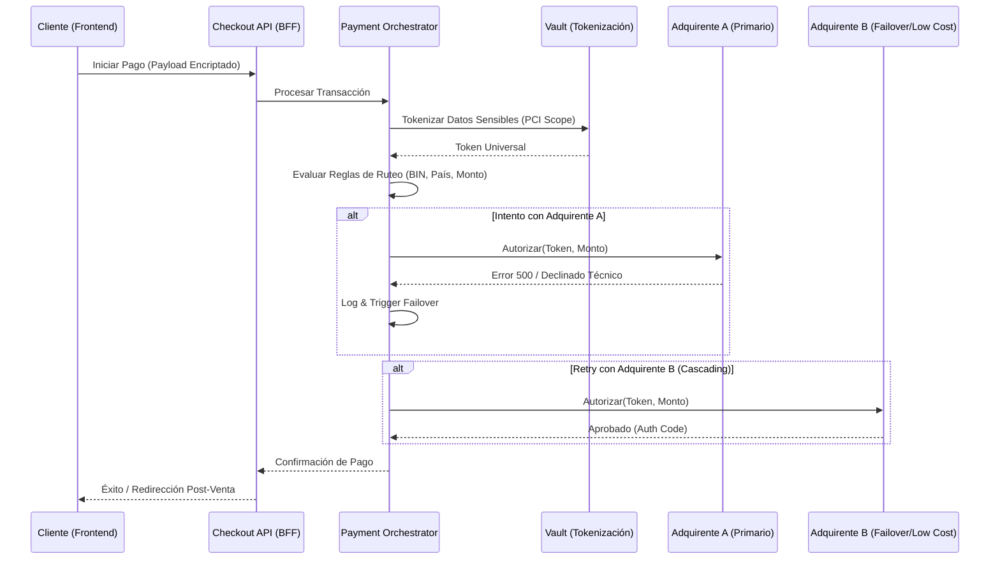

En el ecosistema del comercio digital moderno, el checkout ya no es simplemente el final de un embudo de conversión; es un componente crítico de infraestructura que define la rentabilidad y la resiliencia operativa de una empresa global. Las arquitecturas tradicionales "all-in-one" suelen amarrar a las organizaciones a un único proveedor de pagos (PSP), creando un punto único de fallo y eliminando cualquier capacidad de negociación de tasas o de optimización de rutas de transacciones.

Como Principal Enterprise Solutions Architect, he observado que la transición hacia **Composable Commerce** exige un cambio de paradigma: pasar de una integración de pago estática a una **Capa de Orquestación de Pagos (Payment Orchestration Layer - POL)**. Este artículo desglosa cómo diseñar y ejecutar una estrategia multi-adquirente que permita el *smart routing*, garantice el cumplimiento de PCI-DSS en entornos distribuidos y maximice el *authorization rate* mediante la conmutación por error (failover) dinámica.

## El Problema: La Rigidez del Checkout Monolítico

Las empresas enterprise enfrentan tres dolores principales cuando dependen de una sola pasarela de pago:

1.  **Vendor Lock-in y Costos de Oportunidad:** Las tasas de procesamiento (MDR) son estáticas. Sin una arquitectura multi-adquirente, es imposible mover volumen de transacciones hacia el proveedor que ofrezca la mejor tasa para una región o tipo de tarjeta específica en tiempo real.
2.  **Fragilidad Operativa:** Si el PSP principal sufre una caída (un escenario real incluso para gigantes como Stripe o Adyen), el flujo de ingresos se detiene por completo. En eventos de alto tráfico como Black Friday, esto es inaceptable.
3.  **Fricción en la Expansión Global:** Cada mercado tiene métodos de pago locales (LPMs) preferidos (Pix en Brasil, OXXO en México, iDEAL en Países Bajos). Integrar cada uno de forma aislada en un monolito crea una "deuda de integración" insostenible.

## Arquitectura de Orquestación de Pagos Composable

La arquitectura MACH nos permite desacoplar la interfaz de usuario (Headless Checkout) de la lógica de procesamiento. La pieza central es el **Payment Orchestrator**, un microservicio (o conjunto de ellos) que actúa como el cerebro de la transacción.

### Flujo de Orquestación Multi-Adquirente



## Implementación Técnica: El Motor de Ruteo Inteligente

Un orquestador robusto debe ser capaz de decidir, en milisegundos, qué gateway utilizar. A continuación, presento una implementación de referencia en **TypeScript** utilizando un patrón de estrategia para el ruteo dinámico.

### Definición del Router de Pagos

```typescript
/**
 * Payment Routing Engine - Core Logic
 * Este servicio decide el destino de la transacción basado en metadatos.
 */

interface PaymentContext {
  bin: string;
  currency: string;
  amount: number;
  country: string;
  isSubscription: boolean;
}

interface GatewayStrategy {
  name: string;
  priority: number;
  canHandle(context: PaymentContext): boolean;
  process(payload: any): Promise<PaymentResponse>;
}

class PaymentOrchestrator {
  private strategies: GatewayStrategy[] = [];

  registerStrategy(strategy: GatewayStrategy) {
    this.strategies.push(strategy);
    // Ordenar por prioridad para el cascading
    this.strategies.sort((a, b) => a.priority - b.priority);
  }

  async execute(context: PaymentContext, payload: any): Promise<PaymentResponse> {
    const eligibleGateways = this.strategies.filter(s => s.canHandle(context));

    for (const gateway of eligibleGateways) {
      try {
        console.log(`Intentando pago a través de: ${gateway.name}`);
        const response = await gateway.process(payload);
        
        if (response.status === 'APPROVED') {
          return response;
        }
        
        // Si es un error de negocio (fondos insuficientes), no reintentamos
        if (response.reason === 'INSUFFICIENT_FUNDS') {
          return response;
        }
      } catch (error) {
        console.error(`Fallo técnico en ${gateway.name}:`, error);
        // Continuar al siguiente gateway en la lista (Cascading)
        continue;
      }
    }

    throw new Error("Todos los adquirentes fallaron o no hay rutas disponibles.");
  }
}
```

### Gestión de Idempotencia con Redis

En sistemas distribuidos, los reintentos pueden causar cargos duplicados. Es imperativo implementar una capa de idempotencia estricta.

```typescript
import Redis from 'ioredis';

const redis = new Redis(process.env.REDIS_URL);

async function withIdempotency(key: string, ttlSeconds: number, fn: () => Promise<any>) {
  const lockKey = `idempotency:lock:${key}`;
  const resultKey = `idempotency:result:${key}`;

  // 1. Verificar si ya existe un resultado procesado
  const cachedResult = await redis.get(resultKey);
  if (cachedResult) return JSON.parse(cachedResult);

  // 2. Intentar adquirir un bloqueo atómico
  const acquired = await redis.set(lockKey, "processing", "EX", 30, "NX");
  if (!acquired) {
    throw new Error("Transacción en proceso. Por favor espere.");
  }

  try {
    const result = await fn();
    // 3. Almacenar el resultado permanentemente por el tiempo de TTL
    await redis.set(resultKey, JSON.stringify(result), "EX", ttlSeconds);
    return result;
  } finally {
    await redis.del(lockKey);
  }
}
```

## Trade-offs Arquitectónicos: ¿Construir o Comprar?

La decisión de implementar un orquestador propio frente a utilizar una plataforma SaaS (como Spreedly, ProcessOut o Primer.io) depende de la madurez técnica y el volumen transaccional.

| Característica | Orquestador In-House (Custom) | Orquestador SaaS (Third-party) | Integración Directa (Single PSP) |
| :--- | :--- | :--- | :--- |
| **Control de Datos** | Total (Requiere PCI DSS Nivel 1) | Compartido (Vaulting externo) | Limitado al proveedor |
| **Time-to-Market** | Lento (6-12 meses) | Rápido (Semanas) | Muy Rápido |
| **Costos Operativos** | Altos (Mantenimiento de APIs) | Medios (Fee por transacción) | Bajos (Solo comisión PSP) |
| **Agilidad de Ruteo** | Máxima (Lógica de negocio propia) | Alta (Configurable por UI) | Nula |
| **Resiliencia** | Depende de tu infraestructura | Muy Alta (Multi-cloud) | Baja (SPOF) |

**Recomendación:** Para empresas con un GMV superior a $500M USD anuales, el desarrollo de una capa de abstracción propia (In-House) suele justificarse por el ahorro en comisiones de red y la capacidad de optimizar el *routing* basado en datos propietarios de comportamiento de fraude.

## Modos de Fallo Comunes y Mitigación

### 1. El Problema del "Webhook Lag"
Muchos pagos son asíncronos (3DS 2.0, transferencias bancarias). Si el webhook del PSP llega antes de que el orquestador haya guardado el estado inicial, se producen inconsistencias.
*   **Mitigación:** Implementar una cola de mensajes (SQS/RabbitMQ) para procesar webhooks y usar una estrategia de *polling* optimista en el frontend para verificar el estado del `PaymentIntent`.

### 2. Deriva de Tokens (Token Drift)
Al usar múltiples adquirentes, el token de tarjeta generado en el PSP-A no sirve en el PSP-B.
*   **Mitigación:** Utilizar un **Vault Agnóstico** (como PCI Proxy o VGS). El orquestador almacena un "Token Universal" y, antes de enviar la transacción al adquirente, el Vault intercepta la petición y reemplaza el token universal por los datos reales de la tarjeta (o el token específico del adquirente) de forma transparente.

### 3. Falsos Positivos en Fraude
Un adquirente puede ser más agresivo que otro bloqueando transacciones legítimas.
*   **Mitigación:** Implementar un motor de reglas de fraude (ej. Forter o Riskified) *antes* de la orquestación. Si el motor de fraude aprueba la transacción, el orquestador puede forzar el reintento en un segundo adquirente si el primero la rechaza por "sospecha de fraude".

## Estrategia de Transición: Del Monolito al Orquestador

La migración no debe ser un "Big Bang". El patrón **Strangler Fig** es ideal aquí:

1.  **Fase 1: Proxy Pass-through.** Coloca tu nuevo microservicio de pagos frente al PSP actual. Todas las llamadas pasan por él sin lógica de ruteo.
2.  **Fase 2: Vaulting Externo.** Empieza a tokenizar las nuevas tarjetas en un Vault independiente en lugar de en el PSP.
3.  **Fase 3: Ruteo de A/B Testing.** Envía el 5% del tráfico a un segundo adquirente para comparar tasas de autorización y latencia.
4.  **Fase 4: Smart Routing Total.** Implementa reglas basadas en el costo de procesamiento y el rendimiento histórico.

## Conclusión y Checklist de Implementación

La orquestación de pagos es la culminación de una arquitectura de comercio verdaderamente composable. No se trata solo de tecnología, sino de soberanía financiera y resiliencia operativa.

### Checklist para el Arquitecto de Soluciones:
- [ ] **Cumplimiento:** ¿Está el entorno de microservicios fuera del alcance (out-of-scope) de PCI mediante el uso de iFrames o SDKs de campo seguro?
- [ ] **Observabilidad:** ¿Tengo dashboards que comparen el *Authorization Rate* entre adquirentes en tiempo real?
- [ ] **Idempotencia:** ¿Cada transacción tiene un `idempotency_key` único generado desde el origen (client-side)?
- [ ] **Reconciliación:** ¿Cómo voy a consolidar los reportes financieros de N proveedores en un solo flujo para el equipo de contabilidad?
- [ ] **Circuit Breaker:** ¿He implementado patrones de Circuit Breaker para desconectar automáticamente un adquirente si su tasa de error supera el 10% en un minuto?

Al dominar la orquestación de checkout, las organizaciones dejan de ser cautivas de sus proveedores y comienzan a tratar sus flujos de pago como un activo estratégico optimizable, reduciendo costos y, lo más importante, garantizando que el botón de "Comprar" siempre funcione.