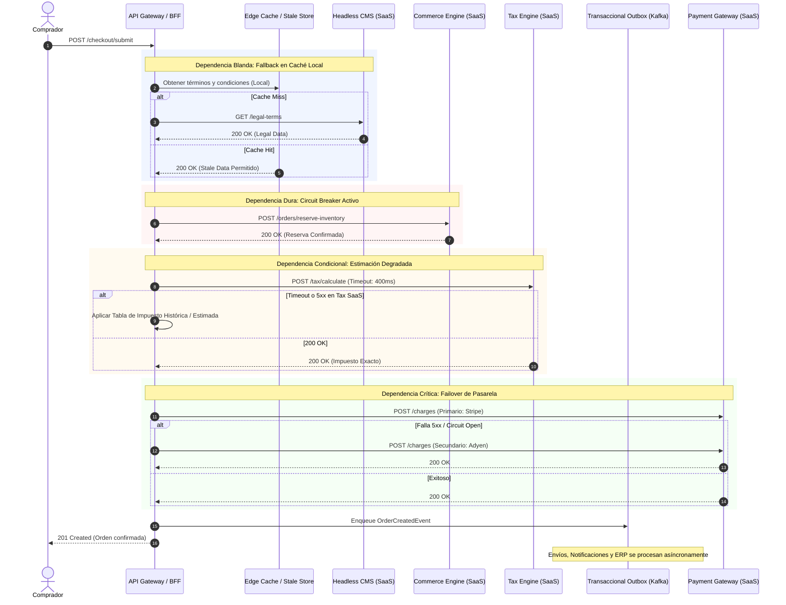

La transición desde monolitos heredados hacia ecosistemas Composable y arquitecturas MACH (Microservices, API-first, Cloud-native, Headless) promete agilidad, escalabilidad independiente y la adopción de las mejores soluciones de su clase (*best-of-breed*). Sin embargo, introduce un riesgo operativo y financiero crítico que con frecuencia pasa desapercibido en las fases de diseño: **la degradación compuesta de la disponibilidad en cadenas de dependencias distribuidas**.

En un entorno monolítico, la disponibilidad global dependía principalmente de la infraestructura subyacente (IaaS/PaaS) y de la calidad del código interno. En una arquitectura composable, una única transacción de negocio (por ejemplo, un flujo de checkout) puede depender síncronamente de un motor de comercio headless (commercetools), un CMS headless (Contentful), un motor de búsqueda/indexación (Algolia), una pasarela de pagos (Stripe), un proveedor de cálculo impositivo (Avalara) y una plataforma de envíos (Shippo).

Cuando cada proveedor contractualiza un SLA del 99.9%, la intuición de la gerencia asume que el sistema global opera al 99.9%. Matemáticamente, esta suposición es una falacia destructiva.

---

## La Ilusión del "Three-Nines": La Matemática de la Disponibilidad Compuesta

Para entender el riesgo inherente a una arquitectura desacoplada, debemos analizar la disponibilidad desde la teoría de confiabilidad de sistemas distribuidos.

### Dependencias en Serie Pura (Hard Dependencies)

Si un flujo transaccional requiere que $n$ componentes externos respondan de forma sincrónica y secuencial para completarse con éxito, cualquier falla individual provoca la falla del sistema completo. La disponibilidad global del sistema ($A_{sys}$) es el producto de las disponibilidades individuales ($A_i$):

$$A_{sys} = \prod_{i=1}^{n} A_i$$

Consideremos un flujo de compra compuesto por 6 servicios SaaS en serie, cada uno con un SLA contractual de $99.9\%$ (tres nueves):

$$A_{sys} = 0.999 \times 0.999 \times 0.999 \times 0.999 \times 0.999 \times 0.999 = (0.999)^6 \approx 0.994014 \ (99.4\%)$$

Una disponibilidad del $99.9\%$ permite un tiempo de inactividad (*downtime*) máximo de **43.8 minutos al mes**. Sin embargo, la disponibilidad compuesta del $99.4\%$ incrementa el tiempo de inactividad permitido a **4.38 horas al mes**. 

Si la organización ofrece a sus clientes un SLA de cara al público del $99.9\%$, la arquitectura está matemáticamente condenada a violar sus compromisos contractuales, consumiendo la totalidad de su presupuesto de error (*Error Budget*) exclusivamente por fallas acumuladas de terceros.

### Dependencias en Paralelo con Redundancia Activa

Cuando dos proveedores pueden cumplir la misma función mediante conmutación por error (*failover*) automática e instantánea (por ejemplo, pasarelas de pago redundantes), la disponibilidad se modela como:

$$A_{parallel} = 1 - \prod_{j=1}^{m} (1 - A_j)$$

Si disponemos de dos proveedores con un SLA de $99.9\%$:

$$A_{parallel} = 1 - (1 - 0.999)(1 - 0.999) = 1 - (0.001)^2 = 0.999999 \ (99.9999\%)$$

La redundancia transforma componentes de tres nueves en subsistemas de seis nueves, pero introduce retos de consistencia de datos, reconciliación y costos de doble licenciamiento.

---

## Topología de Dependencias: Devolviendo la Resiliencia al Checkout

La clave arquitectónica para mitigar la erosión del SLA radica en convertir dependencias **duras** (bloqueantes) en dependencias **blandas** (tolerantes a fallas, asíncronas o degradables).

El siguiente diagrama ilustra cómo un flujo de checkout interactúa con servicios SaaS de misión crítica mediante capas de aislamiento, patrones de diseño de resiliencia y procesamiento asíncrono.



---

## Implementación Técnica: Engine de Cálculo de SLA Compuesto y Orquestación Resiliente

Para gobernar cadenas multi-SaaS en producción, los equipos de arquitectura deben implementar motores que:
1. Calculen en tiempo real la salud compuesta del sistema.
2. Ejecuten llamadas mediante políticas de degradación dinámica basadas en la criticidad del servicio.

A continuación, se presenta una implementación en **TypeScript (Node.js)** utilizando contratos tipados, patrones de ejecución de degradación y evaluación de dependencias en tiempo de ejecución.

```typescript
// types/service-health.ts
export type DependencyType = 'HARD' | 'SOFT_CACHE' | 'SOFT_FALLBACK' | 'PARALLEL_FAILOVER';

export interface ServiceEndpoint {
  id: string;
  name: string;
  nominalSLA: number; // Ej: 0.999 para 99.9%
  timeoutMs: number;
  type: DependencyType;
  healthCheckUrl: string;
}

export interface ExecutionResult<T> {
  data: T | null;
  source: 'LIVE' | 'CACHE' | 'FALLBACK' | 'SECONDARY';
  latencyMs: number;
  error?: Error;
}

// engine/resilient-orchestrator.ts
import { performance } from 'perf_hooks';

export class ResilientServiceOrchestrator {
  private cache: Map<string, { value: any; expiresAt: number }> = new Map();

  /**
   * Ejecuta una llamada a un servicio SaaS aplicando la estrategia según el tipo de dependencia.
   */
  async executeWithSlaProtection<T>(
    endpoint: ServiceEndpoint,
    primaryCall: () => Promise<T>,
    fallbackAction?: () => Promise<T> | T
  ): Promise<ExecutionResult<T>> {
    const start = performance.now();

    // 1. Estrategia SOFT_CACHE: Comprobación preventiva si hay degradación previa
    if (endpoint.type === 'SOFT_CACHE') {
      const cached = this.cache.get(endpoint.id);
      if (cached && cached.expiresAt > Date.now()) {
        return {
          data: cached.value as T,
          source: 'CACHE',
          latencyMs: performance.now() - start
        };
      }
    }

    try {
      // 2. Ejecución con límite estricto de timeout (Fail-Fast)
      const data = await this.promiseWithTimeout(primaryCall(), endpoint.timeoutMs);
      
      // Actualizar caché si aplica
      if (endpoint.type === 'SOFT_CACHE') {
        this.cache.set(endpoint.id, {
          value: data,
          expiresAt: Date.now() + 300_000 // TTL de 5 minutos
        });
      }

      return {
        data,
        source: 'LIVE',
        latencyMs: performance.now() - start
      };
    } catch (error) {
      const elapsed = performance.now() - start;

      // 3. Manejo de fallos según criticidad
      switch (endpoint.type) {
        case 'HARD':
          // Una falla dura propaga la excepción inmediatamente; el error budget se impacta
          throw new Error(
            `[CRITICAL_SLA_VIOLATION] Dependencia dura falló: ${endpoint.name}. Latencia: ${elapsed}ms. Error: ${(error as Error).message}`
          );

        case 'SOFT_CACHE': {
          const stale = this.cache.get(endpoint.id);
          if (stale) {
            return {
              data: stale.value as T,
              source: 'CACHE',
              latencyMs: elapsed,
              error: error as Error
            };
          }
          throw error;
        }

        case 'SOFT_FALLBACK':
          if (!fallbackAction) {
            throw new Error(`Fallback no provisto para la dependencia blanda ${endpoint.name}`);
          }
          const fallbackData = await fallbackAction();
          return {
            data: fallbackData,
            source: 'FALLBACK',
            latencyMs: elapsed,
            error: error as Error
          };

        default:
          throw error;
      }
    }
  }

  private promiseWithTimeout<T>(promise: Promise<T>, timeoutMs: number): Promise<T> {
    return Promise.race([
      promise,
      new Promise<T>((_, reject) =>
        setTimeout(() => reject(new Error(`Operation timed out after ${timeoutMs}ms`)), timeoutMs)
      )
    ]);
  }
}
```

### Cálculo Analítico de Disponibilidad de Cadenas

Podemos modelar programmaticamente el SLA global de un flujo complejo para compararlo frente a los Acuerdos Operativos Internos (OLAs):

```typescript
// engine/sla-calculator.ts
export interface ChainNode {
  id: string;
  availability: number; // Porcentaje en formato decimal (ej: 0.9995)
  type: DependencyType;
  redundantNodes?: ChainNode[]; // Requerido si el tipo es PARALLEL_FAILOVER
}

export class SlaAggregator {
  /**
   * Calcula el SLA matemático teórico compuesto de una cadena heterogénea
   */
  public static calculateCompositeSla(nodes: ChainNode[]): number {
    let compositeAvailability = 1.0;

    for (const node of nodes) {
      switch (node.type) {
        case 'HARD':
          // La disponibilidad se multiplica directamente
          compositeAvailability *= node.availability;
          break;

        case 'PARALLEL_FAILOVER':
          if (!node.redundantNodes || node.redundantNodes.length === 0) {
            throw new Error(`Nodo redundante ${node.id} no posee instancias de failover`);
          }
          // Fórmula: 1 - Producto(1 - A_i)
          const allInstances = [node, ...node.redundantNodes];
          const unreliability = allInstances.reduce(
            (acc, curr) => acc * (1 - curr.availability), 
            1.0
          );
          compositeAvailability *= (1 - unreliability);
          break;

        case 'SOFT_CACHE':
        case 'SOFT_FALLBACK':
          // Al degradarse con éxito (fallback local), el impacto directo en la 
          // disponibilidad transaccional del cliente final se amortigua al 99.99%
          const virtualAvailability = 0.9999;
          compositeAvailability *= virtualAvailability;
          break;
      }
    }

    return compositeAvailability;
  }
}

// Ejemplo de Uso en Pipeline CI/CD o Arquitectura:
const checkoutPipeline: ChainNode[] = [
  { id: 'auth0', availability: 0.999, type: 'HARD' },
  { id: 'commercetools', availability: 0.999, type: 'HARD' },
  { 
    id: 'stripe-primary', 
    availability: 0.999, 
    type: 'PARALLEL_FAILOVER',
    redundantNodes: [{ id: 'adyen-secondary', availability: 0.999, type: 'HARD' }]
  },
  { id: 'contentful-cms', availability: 0.999, type: 'SOFT_CACHE' },
  { id: 'avalara-tax', availability: 0.995, type: 'SOFT_FALLBACK' }
];

const projectedUptime = SlaAggregator.calculateCompositeSla(checkoutPipeline);
console.log(`Disponibilidad Proyectada: ${(projectedUptime * 100).toFixed(4)}%`);
// Salida: Disponibilidad Proyectada: 99.7891% (Evita la caída al 99.4% gracias al desacoplamiento)
```

---

## Matriz de Decisión: Estrategias de Aislamiento de SLA

La mitigación de riesgos de disponibilidad en composable exige balancear complejidad de ingeniería contra costo y pérdida de precisión de negocio:

| Estrategia | Casos de Uso Ideales | Trade-Offs Técnicos | Impacto en FinOps | Cuándo Evitarlo |
| :--- | :--- | :--- | :--- | :--- |
| **Failover Activo-Activo (Paralelo)** | Pasarelas de Pago, Proveedores de Email Transaccional (Sendgrid/Postmark). | Complejidad en idempotencia, sincronización de estados y tokens de cliente (ej: PaymentMethods guardados). | Costo fijo duplicado de licencias SaaS o consumo mínimo garantizado. | Servicios con modelos de datos fuertemente acoplados (e.g. CMS con esquemas heterogéneos). |
| **Caché en Edge con Stale-While-Revalidate** | Catálogos (PIM), Localización, Reglas de visualización, Menús CMS. | Riesgo de servir datos obsoletos (precios desactualizados o inventario desfasado si no se invalida bien). | Muy bajo. Reduce costos de egreso y consumo de cuotas de API del proveedor SaaS. | Operaciones mutacionales de escritura o reservas de inventario estricto. |
| **Degradación Grácil (Soft Fallback)** | Algoritmos de recomendación, Cálculo de impuestos, Búsqueda facetada. | Se pierde fidelidad transaccional. Por ejemplo: uso de tablas de impuestos aproximadas requiere conciliación posterior. | Requiere procesos de ajuste financiero (*back-office balancing*) para liquidar diferencias de centavos. | Verificaciones de cumplimiento legal estricto o validaciones de fraude en tiempo real. |
| **Asincronía & Outbox Pattern** | Envíos a ERP, Notificaciones, Indexación en Search Engines, Creación de facturas. | Latencia eventual. El frontend debe operar mediante confirmación optimista o estados pendientes (*polling* / WebSockets). | Optimiza la infraestructura y amortigua los picos de tráfico en las APIs SaaS externas. | Flujos donde el usuario final requiere confirmación determinista e inmediata (ej. 3D Secure). |

---

## Modos de Fallo Comunes en Producción y Mitigaciones Reales

Al auditar plataformas MACH empresariales en entornos hiper-escalados, se identifican patrones de falla recurrentes relacionados con SLAs de terceros:

### 1. La Asimetría Penalización-Impacto (*The SLA Penalty Asymmetry*)
* **El Problema:** Un proveedor de SaaS crítico sufre una interrupción de 4 horas durante el *Black Friday*. El cliente pierde \$2,000,000 USD en ingresos directos. El contrato de SLA estipula un crédito del 10% sobre la tarifa mensual del servicio (\$1,500 USD de compensación).
* **Mitigación:** 
  1. No confiar en el resguardo legal como mecanismo de cobertura de disponibilidad.
  2. Implementar un interruptor a nivel de Gateway (*Feature Flag kill-switch*) que redirija el flujo transaccional a un modo "offline transaccional" (almacenamiento encolado seguro en DynamoDB/S3 para reprocesamiento posterior) en menos de 60 segundos.

### 2. Tormenta de Reintentos (*Retry Storms & Throttling Thundering Herd*)
* **El Problema:** El SaaS "A" sufre una degradación de latencia pasando de 80ms a 2500ms. Los servicios cliente agotan timeouts y ejecutan reintentos inmediatos no coordinados. El tráfico se triplica, saturando por completo las puertas de enlace del SaaS y convirtiendo una degradación parcial en una caída total del 100%.
* **Mitigación:** 
  Configurar en el cliente reintentos basados en **Exponential Backoff con Jitter Decorrelacionado**:

```typescript
function calculateJitteredBackoff(attempt: number, baseMs = 100, maxMs = 3000): number {
  const exponential = Math.min(maxMs, baseMs * Math.pow(2, attempt));
  // Full Jitter: aleatoriedad uniforme entre 0 y el valor exponencial
  return Math.floor(Math.random() * exponential);
}
```

### 3. Fuga de Errores Sintéticos por Health Checks Inadecuados
* **El Problema:** El balanceador de carga o API Gateway interroga el endpoint `/health` del proveedor SaaS cada 5 segundos. Un falso positivo marca el nodo como no disponible y desconecta el tráfico legítimo que todavía podía operar mediante cachés intermedias.
* **Mitigación:** Utilizar **Synthetic Transaction Probes** que midan transacciones de extremo a extremo simuladas en entornos aislados (*canary synthetic runs*) en lugar de simples pings HTTP. Basar las decisiones de apertura de circuit breakers en porcentajes de fallas de tráfico real (ej: tasa de error > 5% en una ventana deslizante de 30s), nunca en una sola sonda fallida.

---

## Checklist de Implementación y Gobernanza para Arquitectos y FinOps

Antes de certificar una arquitectura composable para producción crítica, el equipo de arquitectura y SRE debe validar los siguientes puntos:

- [ ] **Mapeo de Dependencias Estrictas:** Identificar cada API externa en el flujo transaccional y clasificarla sin ambigüedad como `HARD`, `SOFT` o `PARALLEL`.
- [ ] **Presupuesto de Latencia Global:** Asignar presupuestos de tiempo de respuesta máximos por salto. Si el SLA de respuesta total es 1000ms, la suma acumulativa de los timeouts de red de los microservicios no debe superar los 600ms (dejando 400ms para procesamiento interno y transporte).
- [ ] **Timeout Budgeting & Circuit Breaking:** Implementar Circuit Breakers (con librerías como Resilience4j, Polly o implementaciones nativas en el Service Mesh / Envoy) en todos los clientes HTTP que consuman SaaS de terceros.
- [ ] **Alineación de SLI/SLO en SRE:** Los Service Level Indicators (SLIs) deben medir la experiencia del usuario, no el uptime de los proveedores individuales. Una caída de Contentful que sirve contenido desde la caché del Edge Worker no debe contar como *downtime* del negocio.
- [ ] **Auditoría de Reclamación de Créditos (FinOps):** Implementar instrumentación automatizada en Datadog/Prometheus que correlacione caídas de terceros con logs y genere métricas de violación de SLA exportables directamente al departamento de compras para la ejecución automática de penalizaciones contractuales.
- [ ] **Simulacros de Resiliencia (Chaos Engineering):** Simular en ambientes de pre-producción cortes de red abruptos y degradaciones de latencia inyectadas artificialmente en cada proveedor SaaS para validar que los fallbacks de caché y outbox operen sin intervención humana.