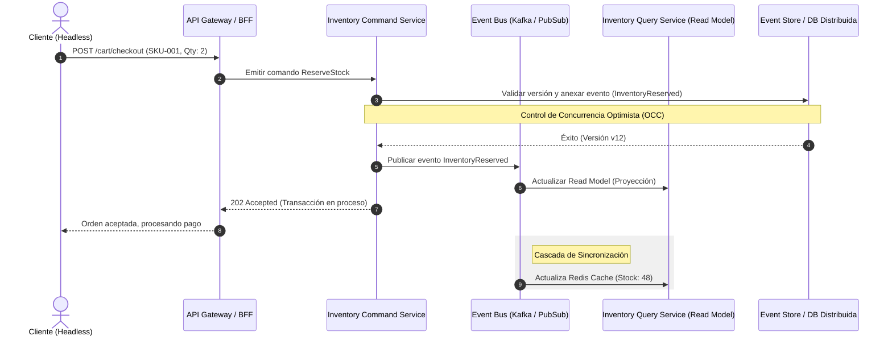

## Introducción: El Desafío del Stock en el Comercio Composable a Escala Enterprise

En una arquitectura monolítica tradicional, la gestión de inventario solía reducirse a una operación ACID (Atomic, Consistent, Isolated, Durable) contra una única instancia de base de datos relacional. Un bloqueo pesimista (`SELECT ... FOR UPDATE`) o una restricción de unicidad (`CHECK (stock >= 0)`) bastaba para evitar sobreventas durante un evento de alto tráfico. Sin embargo, en el paradigma del **Composable Commerce**, donde desacoplamos la experiencia de cliente (Headless), el motor de precios, el sistema de gestión de pedidos (OMS) y los microservicios de inventario de terceros, este enfoque monolítico colapsa catastróficamente.

Los síntomas de una arquitectura mal diseñada para flash sales o picos de demanda estacional incluyen:
*   **Inconsistencia de lectura/escritura:** Clientes que compran un artículo que ya se agotó porque el servicio de caché (Edge CDN o Redis) servía un estado de inventario desactualizado.
*   **Contención de bloqueos (Lock Contention):** El motor de base de datos colapsa por la alta concurrencia intentando actualizar la misma fila de un producto altamente codiciado.
*   **Pérdida de trazabilidad:** Fallas de red intermitentes entre el API Gateway, el microservicio de pagos y el motor de inventario que dejan transacciones en un estado indeterminado (ni confirmadas ni revertidas).

Resolver estos desafíos en un ecosistema distribuido requiere abandonar el dogma de la consistencia fuerte síncrona y adoptar modelos de **consistencia eventual basada en eventos**, respaldados por patrones avanzados como CQRS (Command Query Responsibility Segregation), Event Sourcing y control de concurrencia optimista.

---

## Arquitectura de Referencia: Flujo de Inventario Distribuido

Para mitigar los puntos de fallo en una infraestructura de microservicios, implementamos un patrón de escritura asíncrona respaldado por un bus de eventos y un motor de proyecciones optimizado para lecturas de alta velocidad en el Edge.



---

## Patrones de Diseño de Producción

### 1. Control de Concurrencia Optimista (OCC) con Event Sourcing

En lugar de bloquear registros en la base de datos, el microservicio de comandos utiliza control de concurrencia optimista basado en versiones. Cada mutación del stock incrementa un número de secuencia. Si dos procesos intentan modificar el inventario simultáneamente, el segundo fallará debido a una discrepancia en la versión, obligando a un reintento idempotente.

A continuación, se muestra una implementación en Node.js (TypeScript) que demuestra cómo aplicar OCC y emitir un evento de dominio transaccional:

```typescript
import { Pool } from 'pg';
import { EventEmitter } from 'node:events';

interface InventoryItem {
  sku: string;
  availableQuantity: number;
  version: number;
}

export class InventoryAggregate extends EventEmitter {
  constructor(private readonly dbPool: Pool) {
    super();
  }

  public async reserveStock(sku: string, quantityToReserve: number, expectedVersion: number): Promise<boolean> {
    const client = await this.dbPool.connect();
    try {
      await client.query('BEGIN');

      // 1. Obtener el estado actual y la versión
      const selectQuery = 'SELECT sku, available_quantity, version FROM inventory_aggregates WHERE sku = $1 FOR UPDATE';
      const result = await client.query(selectQuery, [sku]);

      if (result.rows.length === 0) {
        throw new Error(`SKU ${sku} no encontrado en el inventario.`);
      }

      const item: InventoryItem = {
        sku: result.rows[0].sku,
        availableQuantity: result.rows[0].available_quantity,
        version: result.rows[0].version
      };

      // 2. Validar versión (OCC)
      if (item.version !== expectedVersion) {
        throw new Error(`Conflicto de concurrencia: La versión esperada era ${expectedVersion}, pero la actual es ${item.version}`);
      }

      // 3. Validar disponibilidad de stock
      if (item.availableQuantity < quantityToReserve) {
        throw new Error(`Stock insuficiente para el SKU ${sku}. Disponible: ${item.availableQuantity}, Solicitado: ${quantityToReserve}`);
      }

      const newQuantity = item.availableQuantity - quantityToReserve;
      const newVersion = item.version + 1;

      // 4. Actualizar estado y registrar evento en el Event Store
      const updateQuery = `
        UPDATE inventory_aggregates 
        SET available_quantity = $1, version = $2, updated_at = NOW() 
        WHERE sku = $3 AND version = $4
      `;
      const updateResult = await client.query(updateQuery, [newQuantity, newVersion, sku, expectedVersion]);

      if (updateResult.rowCount === 0) {
        throw new Error('Fallo crítico: La actualización concurrente invalidó la transacción.');
      }

      const eventPayload = {
        eventId: crypto.randomUUID(),
        sku,
        quantityReserved: quantityToReserve,
        version: newVersion,
        timestamp: new Date().toISOString()
      };

      await client.query(
        'INSERT INTO event_store (event_id, aggregate_type, aggregate_id, event_type, payload, version) VALUES ($1, $2, $3, $4, $5, $6)',
        [eventPayload.eventId, 'Inventory', sku, 'InventoryReserved', JSON.stringify(eventPayload), newVersion]
      );

      await client.query('COMMIT');

      // 5. Emitir evento hacia el Bus (Kafka / PubSub) de forma desacoplada
      this.emit('InventoryReserved', eventPayload);
      return true;

    } catch (error) {
      await client.query('ROLLBACK');
      console.error(`[InventoryError] Error al reservar stock para ${sku}:`, error.message);
      throw error;
    } finally {
      client.release();
    }
  }
}
```

### 2. Separación de Modelos de Lectura y Escritura (CQRS)

Para proteger la base de datos transaccional (Write Model) de la saturación provocada por millones de consultas de disponibilidad en el storefront, desacoplamos completamente las lecturas. 

*   **Write Model (Comandos):** Optimizado para la integridad transaccional estricta (PostgreSQL con bloqueo a nivel de fila y Event Sourcing).
*   **Read Model (Consultas):** Proyecciones desnormalizadas almacenadas en bases de datos de ultra-baja latencia (como Redis Cluster o DynamoDB) que se actualizan asíncronamente al consumir los eventos publicados por el bus.

---

## Trade-offs Arquitectónicos

| Estrategia | Ventajas (Pros) | Desventajas (Contras) | Cuándo Usarla | Cuándo Evitarla |
| :--- | :--- | :--- | :--- | :--- |
| **Consistencia Fuerte (Síncrona/ACID)** | Cero sobreventas, simplicidad conceptual para flujos pequeños. | Baja disponibilidad, alta latencia bajo carga, propenso a cuellos de botella (deadlocks). | Catálogos pequeños, tráfico predecible, B2B con pocos pedidos concurrentes. | Flash sales masivas, arquitecturas multi-región global. |
| **Consistencia Eventual (CQRS + Event Sourcing)** | Escalabilidad horizontal masiva, resiliencia ante caídas de servicios downstream, baja latencia en lecturas. | Complejidad operacional, eventual desincronización transitoria ("overselling" menor manejable por compensación). | E-commerce masivo, catálogos complejos con múltiples almacenes regionales (3PL). | Sistemas críticos donde una sola sobreventa genera incumplimientos legales severos inmediatos. |
| **Bloqueo Pesimista Distribuido (Redlock)** | Previene condiciones de carrera a nivel de clúster distribuido (ej. Redis). | Latencia de red añadida, riesgo de fallas por partición de red (Split-Brain). | Carritos de compra temporales de alta prioridad durante un checkout activo. | Consultas masivas de inventario en el catálogo público. |

---

## Modos de Fallo Comunes y Estrategias de Mitigación

En entornos distribuidos de alta disponibilidad, los fallos no son una eventualidad, son una certeza estadística. A continuación, analizamos los fallos más críticos en la gestión de inventario y cómo mitigarlos:

### 1. Desincronización del Read Model por Pérdida de Mensajes en el Bus
*   **Síntoma:** El servicio de consulta (Redis/DynamoDB) muestra stock disponible para un SKU, pero el sistema transaccional ya lo ha agotado, provocando rechazos tardíos en el checkout.
*   **Mitigación:** Implementar el patrón **Outbox Pattern** en el servicio de comandos. Las mutaciones de base de datos y la inserción de eventos en la tabla `outbox` ocurren dentro de la misma transacción ACID. Un proceso independiente (`Debezium` o un worker dedicado) lee la tabla outbox con garantías *At-Least-Once* y publica los eventos al bus de mensajes de forma segura.

### 2. Condición de Carrera en Pagos Asíncronos (Saga Pattern Fallida)
*   **Síntoma:** Se reserva el inventario con éxito, pero la pasarela de pagos rechaza la tarjeta del cliente. Si el evento de compensación (`InventoryRelease`) falla o se retrasa, el stock queda retenido artificialmente ("Ghost Inventory").
*   **Mitigación:** Implementar una **Saga Orquestada con Tareas de Compensación Idempotentes** y un mecanismo de barrido (*Reconciliation Worker*). El worker ejecuta un cron job que identifica reservas con más de X minutos sin un pago confirmado y libera automáticamente el stock en el Event Store.

---

## Conclusión y Checklist de Implementación para Ingeniería

La gestión de inventario en el Composable Commerce moderno exige abandonar las ilusiones de consistencia instantánea en favor de arquitecturas orientadas a eventos altamente resilientes. Al desacoplar la intención de compra (comandos) de la consulta de disponibilidad (lecturas mediante proyecciones) y asegurar la resiliencia mediante el patrón Outbox y control de concurrencia optimista, los equipos de ingeniería pueden escalar sistemas para soportar eventos de tráfico masivo sin comprometer la integridad financiera.

### Checklist de Implementación para Equipos de Ingeniería

1.  **[ ] Desacoplamiento de Modelos:** ¿Están separadas las bases de datos de lectura (Read Model) y escritura (Write Model) para evitar la contención en el catálogo?
2.  **[ ] Concurrencia Optimista (OCC):** ¿Utilizan versiones numéricas o hashes en las mutaciones de stock en lugar de bloqueos pesimistas bloqueantes?
3.  **[ ] Garantía de Publicación (Outbox Pattern):** ¿Se utiliza una tabla *outbox* transaccional para garantizar que ningún evento de inventario se pierda ante caídas del broker de mensajes?
4.  **[ ] Idempotencia en Consumidores:** ¿Los servicios que procesan eventos de inventario (OMS, Pasarelas, Proyecciones) implementan claves de idempotencia para prevenir duplicados ante reintentos de red?
5.  **[ ] Automatización de Compensaciones (Saga Pattern):** ¿Existe un mecanismo automatizado de compensación (*Reconciliation Job*) para liberar inventario retenido por carritos abandonados o fallos de pago?
6.  **[ ] Observabilidad Distribuida:** ¿Se propagan cabeceras de rastreo (`traceparent` W3C) en cada comando y evento de inventario para depurar cuellos de botella en la cadena de microservicios?