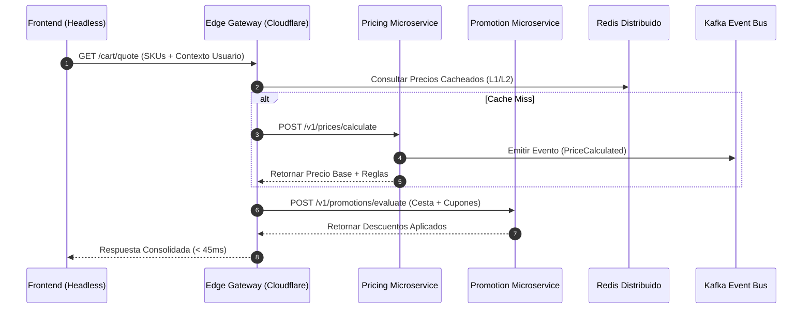

## Introducción: El Talón de Aquiles del Comercio Monolítico

En las plataformas de comercio electrónico tradicionales (monolíticas), la lógica de precios y promociones suele residir en una base de código fuertemente acoplada al motor del carrito de compras y al catálogo. Cuando una empresa *enterprise* experimenta picos masivos de tráfico —como en el *Black Friday* o campañas relámpago (*flash sales*)—, el cálculo en tiempo real de precios dinámicos basados en inventario, comportamiento del usuario, ubicación geográfica y reglas de descuento complejas colapsa la base de datos transaccional. El resultado es latencia inaceptable, carritos abandonados y, en el peor de los casos, pérdida de consistencia financiera.

En una arquitectura MACH (*Microservices, API-first, Cloud-native, Headless*), el pricing y las promociones deben evolucionar hacia dominios desacoplados, autónomos y de alta disponibilidad. Este artículo detalla cómo diseñar e implementar un motor de precios dinámicos y un sistema de promociones basado en eventos, capaz de procesar miles de solicitudes por segundo con latencias inferiores a los 50 milisegundos, manteniendo la integridad transaccional y la flexibilidad comercial.

---

## Arquitectura de Referencia: Desacoplando Precios y Promociones

Para lograr un sistema verdaderamente desacoplado, se separan dos conceptos que históricamente han estado unidos:
1. **Pricing Engine (Microservicio de Precios):** Calcula el precio base y ajustado de un SKU utilizando variables contextuales (costos, márgenes, elasticidad de la demanda, ubicación).
2. **Promotion Engine (Microservicio de Promociones):** Evalúa reglas de negocio complejas, cupones, descuentos por volumen y ofertas cruzadas sobre una cesta de compras ya cotizada.

A continuación, se muestra el flujo de resolución de precios y aplicación de promociones mediante un diagrama de arquitectura en el borde y microservicios:



---

## Implementación Técnica del Motor de Precios (TypeScript / Node.js)

El siguiente fragmento muestra un servicio de cálculo de precios desarrollado en TypeScript utilizando principios de *Domain-Driven Design (DDD)*. Este componente se ejecuta en contenedores nativos de la nube y utiliza estrategias de evaluación de reglas asíncronas.

```typescript
import { Request, Response } from 'express';
import { Redis } from 'ioredis';

interface PriceContext {
  sku: string;
  currency: string;
  region: string;
  customerSegment: string;
  inventoryLevel: number;
}

interface PriceResponse {
  sku: string;
  basePrice: number;
  dynamicPrice: number;
  currency: string;
  appliedModifiers: string[];
  calculatedAt: string;
}

export class DynamicPricingEngine {
  private redisClient: Redis;

  constructor(redis: Redis) {
    this.redisClient = redis;
  }

  public async calculatePrice(req: Request, res: Response): Promise<void> {
    try {
      const context: PriceContext = req.body;
      const cacheKey = `price:${context.sku}:${context.region}:${context.customerSegment}`;

      // 1. Intentar recuperación desde la caché L2 (Redis)
      const cachedPrice = await this.redisClient.get(cacheKey);
      if (cachedPrice) {
        res.setHeader('X-Cache', 'HIT');
        res.status(200).json(JSON.parse(cachedPrice));
        return;
      }

      // 2. Obtener precio base de la fuente de verdad (ej. base de datos de catálogo)
      const basePrice = await this.fetchBasePriceFromDB(context.sku, context.currency);

      // 3. Aplicar algoritmos de pricing dinámico basados en inventario y demanda
      let adjustedPrice = basePrice;
      const modifiers: string[] = [];

      if (context.inventoryLevel < 10) {
        adjustedPrice *= 1.15; // Incremento por escasez del 15%
        modifiers.push('SCARCITY_SURCHARGE_15');
      } else if (context.inventoryLevel > 500) {
        adjustedPrice *= 0.90; // Descuento por sobrestock del 10%
        modifiers.push('OVERSTOCK_DISCOUNT_10');
      }

      if (context.customerSegment === 'VIP') {
        adjustedPrice *= 0.95; // Descuento adicional del 5% para VIP
        modifiers.push('VIP_SEGMENT_DISCOUNT');
      }

      const responsePayload: PriceResponse = {
        sku: context.sku,
        basePrice,
        dynamicPrice: parseFloat(adjustedPrice.toFixed(2)),
        currency: context.currency,
        appliedModifiers: modifiers,
        calculatedAt: new Date().toISOString(),
      };

      // 4. Almacenar en caché con TTL corto (ej. 60 segundos) para mitigar carga
      await this.redisClient.setex(cacheKey, 60, JSON.stringify(responsePayload));

      res.setHeader('X-Cache', 'MISS');
      res.status(200).json(responsePayload);
    } catch (error) {
      console.error('Error calculando pricing dinámico:', error);
      res.status(500).json({ error: 'Internal Server Error during price calculation' });
    }
  }

  private async fetchBasePriceFromDB(sku: string, currency: string): Promise<number> {
    // Simulación de consulta a base de datos distribuida
    return 100.00;
  }
}
```

---

## Motor de Promociones Basado en Reglas Desacopladas

El motor de promociones evalúa condiciones complejas (por ejemplo: "Compra 2 artículos de la categoría X, obtén 50% de descuento en el artículo de menor valor de la categoría Y") sin impactar el rendimiento del catálogo. Para lograr esto, las reglas se compultan y cargan en memoria utilizando estructuras de datos optimizadas (como árboles de decisión o motores de reglas basados en AST).

### Estructura de Reglas de Promoción (YAML)

```yaml
version: "2.1"
promotion_id: "promo-summer-2026-bogo"
name: "Verano 2026: 2x1 en Calzado Seleccionado"
priority: 10
status: "ACTIVE"
conditions:
  all:
    - fact: "cart.items"
      operator: "contains_category"
      value: "footwear"
    - fact: "cart.total_quantity"
      operator: "greater_than_inclusive"
      value: 2
actions:
  - type: "PERCENTAGE_DISCOUNT_CHEAPEST_ITEM"
    value: 100.0
    target_category: "footwear"
max_redemptions_per_user: 1
```

---

## Trade-offs Arquitectónicos: Monolito vs. Microservicios Desacoplados

La siguiente tabla compara las ventajas y desventajas de mantener la lógica de precios y promociones en un monolito frente a un enfoque MACH desacoplado.

| Dimensión | Enfoque Monolítico Tradicional | Enfoque MACH Desacoplado |
| :--- | :--- | :--- |
| **Latencia P99** | Alta (> 500ms en picos de tráfico por contención de bloqueos en BD). | Baja (< 50ms gracias a caché en borde y microservicios independientes). |
| **Escalabilidad** | Escalado vertical u horizontal de todo el ERP/Monolito (ineficiente en costos). | Escalado independiente de Pricing y Promociones mediante Kubernetes HPA. |
| **Consistencia Financiera** | Consistencia ACID estricta a nivel de base de datos relacional. | Consistencia eventual mediante eventos (Event Sourcing / CQRS). |
| **Complejidade Operativa** | Baja (un solo despliegue, menor complejidad de red). | Alta (gestión de mallas de servicios, contratos API estrictos, trazabilidad distribuida). |
| **Agilidad de Negocio** | Ciclos de despliegue lentos (semanas/meses para cambiar una regla de promoción). | Despliegue continuo de reglas de negocio en caliente sin afectar el core transaccional. |

---

## Modos de Fallo Comunes y Estrategias de Mitigación

En sistemas distribuidos orientados a microservicios, los fallos en cascada son el riesgo principal. A continuación, se detallan los escenarios críticos y sus mitigaciones de producción:

### 1. Caída del Microservicio de Pricing durante un Pico de Tráfico
* **Modo de Fallo:** El servicio de precios no responde, bloqueando el proceso de checkout en el frontend.
* **Mitigación:** Implementar un patrón *Circuit Breaker* (usando herramientas como Resilience4j o Envoy) junto con una estrategia *Fallback-to-Cache*. Si el microservicio falla, el sistema devuelve el último precio conocido almacenado en la caché distribuida (Redis) o, en última instancia, el precio base estático del catálogo.

### 2. Inconsistencia de Precios entre el Carrito y la Pasarela de Pagos
* **Modo de Fallo:** Un cliente añade un producto con precio dinámico de $100, pero al momento de pagar, el microservicio recalcula un precio de $110 debido a un cambio de inventario.
* **Mitigación:** Utilizar un token de cotización firmado criptográficamente (*JSON Web Token - JWT*) generado en el momento de la adición al carrito. Este token incluye el precio, los modificadores aplicados y un tiempo de vida (TTL) estricto de 15 minutos. La pasarela de pagos valida este token en lugar de recalcular el precio en tiempo real.

---

## Conclusión y Checklist de Implementación

Desacoplar el pricing dinámico y las promociones en una arquitectura MACH es un paso fundamental para escalar operaciones de comercio electrónico *enterprise* hacia modelos de alta disponibilidad y agilidad comercial. La separación de responsabilidades permite que los equipos de marketing lancen campañas complejas sin comprometer la estabilidad del catálogo o el rendimiento del sitio web.

### Checklist de Ingeniería para la Implementación:
- [ ] **Diseño API-First:** Definir contratos OpenAPI v3.1 estrictos para los servicios de precios y promociones antes de escribir código.
- [ ] **Caché en Múltiples Capas (L1/L2):** Implementar estrategias de caché en el borde (Cloudflare/Fastly) y Redis distribuido con invalidación basada en eventos de Kafka.
- [ ] **Firmas Criptográficas (Tokens de Cotización):** Proteger las cotizaciones de carritos mediante JWT para evitar discrepancias de precios durante el checkout.
- [ ] **Resiliencia y Circuit Breakers:** Configurar políticas de reintentos con *jitter* y disyuntores en las llamadas inter-servicio para evitar fallos en cascada.
- [ ] **Observabilidad End-to-End:** Instrumentar trazas distribuidas con OpenTelemetry para medir la latencia P99 en cada nodo del cálculo de precios.