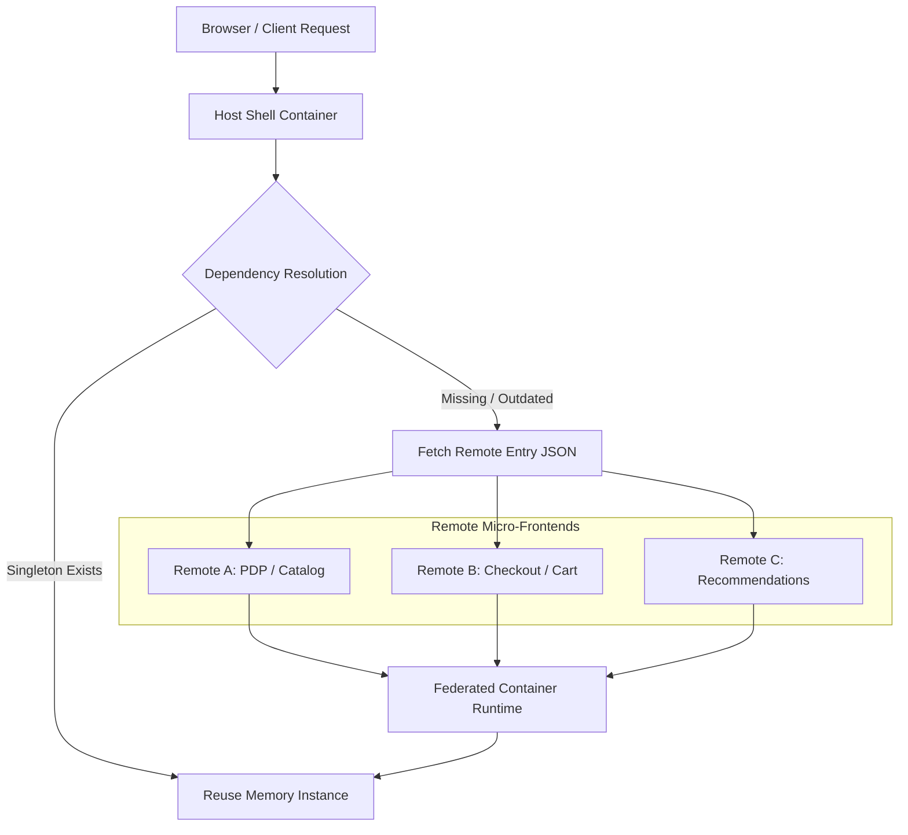

Durante el pico de tráfico del último *Black Friday*, la plataforma de comercio electrónico de un minorista global experimentó una degradación catastrófica en su *Largest Contentful Paint* (LCP), pasando de unos saludables 1.8 segundos a más de 6.4 segundos en dispositivos móviles de gama media. El análisis de perfiles de rendimiento (*Heap Snapshots* y *Long Tasks*) reveló el culpable: un monolito frontend fragmentado en doce micro-frontends independientes mediante Webpack Module Federation, donde cada equipo había empaquetado su propia versión optimizada de React, librerías de estados globales y componentes de diseño UI. El resultado fue la carga redundante de 3.2 MB de JavaScript parseado y ejecutado en el hilo principal (*main thread*), causando un bloqueo de renderizado de 900 milisegundos y un colapso en la conversión del embudo de pago.

Implementar arquitecturas desacopladas en el cliente sin un gobierno estricto de dependencias y una estrategia de inicialización asíncrona destruye los Core Web Vitals. La promesa de la federación de módulos —despliegues independientes, equipos autónomos y reutilización de código en tiempo de ejecución— se convierte rápidamente en una pesadilla de Operaciones de Día 2 si se ignora el impacto de la red y la contención de memoria en el navegador.

---

### Topología de Carga Dinámica y Resolución de Dependencias en Runtime

Para evitar que los micro-frontends compitan por los recursos del navegador, es imperativo establecer un plano de control de dependencias singleton. La arquitectura debe garantizar que las librerías compartidas (como `react`, `react-dom` o design systems corporativos) se resuelvan desde un contenedor host centralizado o un proveedor optimizado en el borde (*Edge*), evitando múltiples instancias del framework en memoria.



Este flujo de resolución evita la duplicación de código mediante el uso de directivas estrictas en la configuración de Webpack o Rspack, asegurando que si la versión remota difiere semánticamente de la esperada por el host, se active una estrategia de degradación elegante (*graceful degradation*) en lugar de un fallo en cascada.

---

### Configuración de Producción: Webpack 5 Module Federation con Singletons Forzados

Una configuración enterprise requiere la parametrización estricta de la propiedad `shared`. Configurar `eager: true` en librerías críticas dentro del host y `singleton: true` con validación de versiones semánticas (`requiredVersion`) previene errores de hooks de React y duplicación de contextos.

```javascript
// host/webpack.config.js
const { ModuleFederationPlugin } = require("webpack").container;
const deps = require("./package.json").dependencies;

module.exports = {
  // ... configuraciones base de output, mode, etc.
  plugins: [
    new ModuleFederationPlugin({
      name: "shell_host",
      filename: "remoteEntry.js",
      remotes: {
        pdp_remote: "pdp_remote@https://pdp.enterprise.com/remoteEntry.js",
        checkout_remote: "checkout_remote@https://checkout.enterprise.com/remoteEntry.js",
      },
      shared: {
        ...deps,
        react: {
          singleton: true,
          strictVersion: true,
          requiredVersion: deps.react,
          eager: true, // Carga síncrona obligatoria para el framework core en el shell
        },
        "react-dom": {
          singleton: true,
          strictVersion: true,
          requiredVersion: deps["react-dom"],
          eager: true,
        },
        "@enterprise/design-system": {
          singleton: true,
          requiredVersion: "^2.4.0",
        }
      },
    }),
  ],
};
```

Por el lado del micro-frontend remoto, la configuración debe omitir `eager: true` para las dependencias compartidas, permitiendo que el contenedor descargue y consuma el singleton provisto por el host en tiempo de ejecución.

```javascript
// remote-pdp/webpack.config.js
const { ModuleFederationPlugin } = require("webpack").container;
const deps = require("./package.json").dependencies;

module.exports = {
  plugins: [
    new ModuleFederationPlugin({
      name: "pdp_remote",
      filename: "remoteEntry.js",
      exposes: {
        "./ProductDetails": "./src/components/ProductDetails",
      },
      shared: {
        ...deps,
        react: {
          singleton: true,
          strictVersion: true,
          requiredVersion: deps.react,
        },
        "react-dom": {
          singleton: true,
          strictVersion: true,
          requiredVersion: deps["react-dom"],
        },
        "@enterprise/design-system": {
          singleton: true,
          requiredVersion: "^2.4.0",
        }
      },
    }),
  ],
};
```

---

### Aislamiento de Errores y Límites de Carga en React

Un fallo en la red o un error de ejecución en un micro-frontend no debe comprometer la experiencia completa del usuario (*Blast Radius Control*). La integración debe realizarse envolviendo los componentes federados en *Error Boundaries* robustos y cargadores dinámicos asíncronos (`React.lazy`).

```tsx
// host/src/containers/SafeFederatedModule.tsx
import React, { Suspense, lazy } from 'react';
import { ErrorBoundary } from 'react-error-boundary';

interface FederatedComponentProps {
  remoteScope: string;
  remoteModule: string;
  fallbackComponent?: React.ReactNode;
  [key: string]: any;
}

// Función auxiliar para importar dinámicamente módulos federados
const loadComponent = (scope: string, module: string) => {
  return async () => {
    // @ts-ignore
    await __webpack_init_sharing__("default");
    // @ts-ignore
    const container = window[scope];
    // @ts-ignore
    await container.init(__webpack_share_scopes__.default);
    // @ts-ignore
    const factory = await container.get(module);
    return factory();
  };
};

export const SafeFederatedModule: React.FC<FederatedComponentProps> = ({
  remoteScope,
  remoteModule,
  fallbackComponent,
  ...props
}) => {
  const Component = lazy(loadComponent(remoteScope, remoteModule));

  return (
    <ErrorBoundary
      fallback={
        fallbackComponent || (
          <div className="p-4 border border-red-300 bg-red-50 text-red-700 rounded-md">
            <p className="font-semibold">Módulo temporalmente no disponible.</p>
            <p className="text-sm">Nuestros equipos ya están trabajando en la recuperación.</p>
          </div>
        )
      }
    >
      <Suspense fallback={<div className="animate-pulse h-48 bg-gray-100 rounded-md" />}>
        <Component {...props} />
      </Suspense>
    </ErrorBoundary>
  );
};
```

---

### Trade-Offs Arquitectónicos: Monolito Frontend vs. Module Federation vs. Iframe Integration

| Dimensión | Monolito Frontend Tradicional | Module Federation (Micro-Frontends) | Integración por Iframes |
| :--- | :--- | :--- | :--- |
| **Aislamiento de Estado y CSS** | Global; alto riesgo de colisiones de selectores y contaminación de DOM. | Moderado; requiere convenciones estrictas (Shadow DOM o CSS Modules). | Absoluto; aislamiento nativo de procesos, memoria y estilos. |
| **Impacto en Rendimiento (Core Web Vitals)** | Excelente velocidad de carga inicial (un solo bundle optimizado). | Variable; excelente si se gestionan bien los singletons, desastroso si hay duplicación. | Pobre; múltiples cargas de frameworks, alto consumo de memoria y layout shifts. |
| **Independencia de Despliegues** | Nula; despliegue monolítico completo requerido para cualquier cambio menor. | Alta; despliegues atómicos por cada micro-frontend remoto. | Máxima; despliegues totalmente desacoplados a nivel de origen. |
| **Complejidad Operativa (Día 2)** | Baja en runtime, alta en coordinación de equipos grandes (Git conflicts masivos). | Alta; requiere gobierno estricto de versiones, control de red y monitoreo distribuido. | Baja en código, alta en experiencia de usuario y comunicación entre contextos (postMessage). |
| **Experiencia de Usuario (UX)** | Fluida, transiciones nativas y sin parpadeos de carga. | Fluida mediante lazy loading y Suspense; requiere manejo de estados de carga. | Fragmentada; problemas de scroll, modales bloqueados y redirecciones complejas. |

---

### Modos de Fallo Comunes y Estrategias de Mitigación

1. **Incompatibilidad de Versiones de Dependencias Compartidas (Runtime Version Mismatch)**
   * *Síntoma:* Excepciones de tipo `Invalid Hook Call` o fallos en la resolución de contextos globales en producción.
   * *Mitigación:* Configurar `strictVersion: true` y establecer pruebas de contrato automatizadas (*Consumer-Driven Contracts*) para los payloads y versiones expuestas en el archivo `remoteEntry.js`. Implementar políticas estrictas en el registro de artefactos.
2. **Fugas de Memoria por Desmontaje Incorrecto de Componentes Remotos**
   * *Síntoma:* Incremento progresivo en el consumo de memoria del navegador al navegar repetidamente entre vistas renderizadas por diferentes remotos.
   * *Mitigación:* Asegurar la limpieza de event listeners, timers y suscripciones a stores globales en la función de retorno (`useEffect` cleanup) del ciclo de vida del componente expuesto.
3. **Cascadas de Latencia por Red en la Carga de Remotes**
   * *Síntoma:* Tiempos de espera prolongados antes de iniciar el renderizado debido a múltiples peticiones secuenciales de archivos `remoteEntry.js`.
   * *Mitigación:* Alojar los entry points en CDNs perimetrales optimizadas con HTTP/3, aplicar preloading explícito (`<link rel="preload" as="fetch" crossorigin>`) para los remotes críticos de la ruta de conversión principal (ej. checkout).

---

### Conclusión y Checklist de Implementación para Ingeniería

La adopción de Module Federation en arquitecturas MACH y Composable Commerce no debe abordarse como un mero experimento de empaquetado, sino como una iniciativa de plataforma de ingeniería que exige estrictas políticas de gobernanza. Para garantizar que la modularización no degrade el rendimiento, los equipos de desarrollo deben certificar los siguientes puntos antes de liberar a producción:

- [ ] **Auditoría de Shared Dependencies:** Verificar que todas las librerías críticas de UI y estado estén declaradas como `singleton: true` y que no existan duplicaciones de versiones en el análisis de Webpack/Rspack Bundle Analyzer.
- [ ] **Presupuestos de Rendimiento (Performance Budgets):** Establecer límites estrictos de tamaño para los archivos `remoteEntry.js` (máximo 15 KB comprimidos) utilizando CI/CD assertions.
- [ ] **Estrategia de Fallback y Resiliencia:** Envolver todos los puntos de integración remota con `ErrorBoundary` y componentes de carga no bloqueantes.
- [ ] **Monopolio del Shell y Versionado Semántico:** Garantizar que el contenedor Host controle la versión base del framework y que los remotos respeten rigurosamente el versionado semántico para evitar rupturas en runtime.
- [ ] **Monitoreo de Core Web Vitals por Dominio:** Implementar Real User Monitoring (RUM) segmentado para identificar qué micro-frontend específico está afectando métricas críticas como INP (*Interaction to Next Paint*) o LCP.