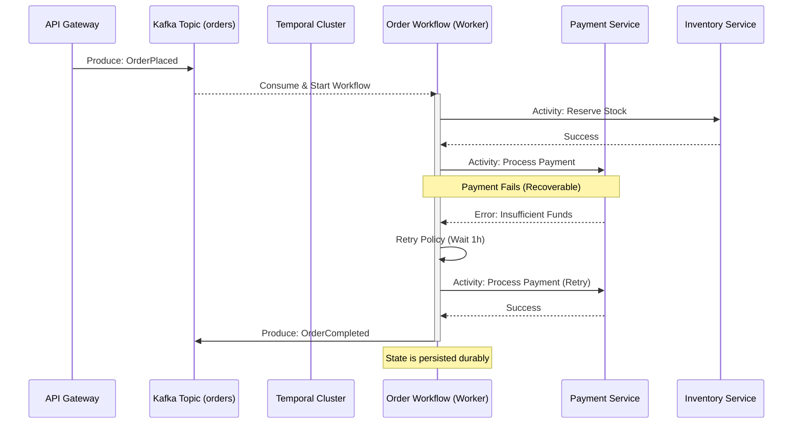

Son las 3:15 AM durante el "Cyber Monday". El dashboard de Grafana muestra un pico inusual en órdenes marcadas como `PENDING_PAYMENT` que nunca transicionan a `COMPLETED` o `CANCELLED`. El sistema de inventario ha bloqueado miles de SKUs, pero el servicio de pagos reporta que las transacciones fallaron hace horas. Intentas rastrear el flujo en Jaeger, pero te encuentras con un "spaghetti" de eventos de Kafka: `OrderCreated` dispara `ReserveInventory`, que dispara `PaymentInitiated`, pero el evento `PaymentFailed` se perdió debido a un rebalanceo de consumidores o un *race condition* en el servicio de notificaciones. Te enfrentas al peor enemigo de la arquitectura de microservicios: el estado inconsistente en una saga coreografiada donde nadie tiene la "verdad absoluta" del proceso de negocio.

Este escenario es el resultado directo de confiar exclusivamente en la coreografía de eventos para transacciones distribuidas complejas. Si bien la coreografía ofrece un bajo acoplamiento, carece de visibilidad centralizada y dificulta enormemente la implementación de lógica de compensación (rollback) confiable. La solución enterprise para este dilema no es volver a los monolitos, sino evolucionar hacia una **Orquestación de Sagas Duradera** utilizando Temporal.io como motor de estado y Apache Kafka como el bus de eventos de alta disponibilidad.

## El Problema de la Coreografía Pura: Por qué Kafka no es suficiente

En una arquitectura MACH, tendemos a sobrecargar a Kafka con responsabilidades de orquestación. Kafka es excelente para el transporte de datos y el desacoplamiento de servicios, pero es "agnóstico al estado del proceso". Cuando una saga requiere reintentos exponenciales, esperas de tiempo (timers) de días o semanas, y decisiones lógicas basadas en el resultado de múltiples servicios, la lógica de la saga se dispersa entre múltiples repositorios.

El resultado es una "máquina de estado distribuida implícita" que nadie puede visualizar. Si un paso falla y la lógica de compensación también falla (por ejemplo, el servicio de inventario está caído cuando intentas liberar el stock tras un fallo de pago), el sistema queda en un limbo. Aquí es donde la **Orquestación Basada en Flujos de Trabajo (Workflows)** de Temporal.io transforma el caos en determinismo.

## Arquitectura de Referencia: Temporal como Cerebro, Kafka como Sistema Nervioso

En este patrón, Kafka actúa como el disparador de entrada (Ingress) y el canal de salida para eventos de dominio (Egress), mientras que Temporal gestiona el ciclo de vida, los reintentos y la consistencia de la transacción distribuida.



### Implementación Técnica: Definición de la Saga en Temporal (TypeScript)

A diferencia de las herramientas de BPMN tradicionales, Temporal permite definir la orquestación como código puro, lo que facilita el testing unitario y el control de versiones. A continuación, un ejemplo de un Workflow de orden que maneja compensaciones automáticas.

```typescript
import { proxyActivities, sleep } from '@temporalio/workflow';
import type * as activities from './activities';

// Definición de reintentos para actividades críticas
const { reserveInventory, processPayment, releaseInventory, notifyCustomer } = proxyActivities<typeof activities>({
  startToCloseTimeout: '1 minute',
  retry: {
    initialInterval: '1s',
    backoffCoefficient: 2,
    maximumAttempts: 5,
  },
});

export async function orderSagaWorkflow(orderId: string, amount: number): Promise<void> {
  let inventoryReserved = false;

  try {
    // Paso 1: Reserva de Inventario
    await reserveInventory(orderId);
    inventoryReserved = true;

    // Paso 2: Procesamiento de Pago
    // Si falla después de los reintentos, lanzará una excepción
    await processPayment(orderId, amount);

    // Paso 3: Notificación de éxito vía Kafka (dentro de una actividad)
    await notifyCustomer(orderId, 'SUCCESS');

  } catch (err) {
    // LÓGICA DE COMPENSACIÓN (SAGA)
    // Si el inventario fue reservado pero el pago falló, liberamos
    if (inventoryReserved) {
      await releaseInventory(orderId);
    }
    
    await notifyCustomer(orderId, 'FAILED');
    throw err; // Propagar para visibilidad en el panel de Temporal
  }
}
```

### Integración con Kafka: El Patrón "Outbox" y Consumidores Confiables

Para evitar que el inicio del Workflow falle tras publicar en Kafka, utilizamos un consumidor de Kafka que actúa como "Workflow Starter". Este componente debe ser idempotente.

```python
# Ejemplo de Consumidor en Python usando aiokafka y Temporal SDK
from temporalio.client import Client
from aiokafka import AIOKafkaConsumer

async def start_kafka_consumer():
    consumer = AIOKafkaConsumer(
        "orders.placed",
        bootstrap_servers='kafka:9092',
        group_id="temporal-starter-group"
    )
    await consumer.start()
    client = await Client.connect("temporal-cluster:7233")

    try:
        async for msg in consumer:
            order_data = json.loads(msg.value)
            # Usamos order_id como Workflow ID para garantizar idempotencia
            await client.start_workflow(
                "orderSagaWorkflow",
                order_data['amount'],
                id=f"order-{order_data['id']}",
                task_queue="order-tasks"
            )
            # Commit manual solo tras asegurar que Temporal recibió el comando
            await consumer.commit()
    finally:
        await consumer.stop()
```

## Trade-offs Arquitectónicos: Orquestación vs. Coreografía

No existe una "bala de plata". La elección entre estos modelos depende de la complejidad del dominio y los requisitos de observabilidad.

| Característica | Coreografía (Solo Kafka) | Orquestación (Temporal + Kafka) |
| :--- | :--- | :--- |
| **Visibilidad** | Baja. Requiere tracing distribuido complejo. | Alta. UI nativa para ver el estado de cada paso. |
| **Acoplamiento** | Muy bajo. Los servicios no se conocen. | Moderado. El orquestador conoce los servicios. |
| **Manejo de Errores** | Difícil. Lógica de compensación dispersa. | Nativo. Reintentos y compensaciones centralizadas. |
| **Escalabilidad** | Extrema (limitada por Kafka). | Alta (limitada por la persistencia de Temporal). |
| **Curva de Aprendizaje** | Moderada (conceptos de Pub/Sub). | Alta (Event Sourcing, Determinismo). |
| **Uso Ideal** | Notificaciones, analítica, flujos simples. | Checkouts, aprovisionamiento, flujos críticos. |

## Modos de Fallo en Producción y Mitigación

### 1. El Problema del Determinismo
Temporal funciona mediante la "reproducción" (replay) del historial de eventos para reconstruir el estado del workflow. Si modificas el código de un workflow activo (ej: cambias el orden de dos actividades) sin usar las APIs de versionamiento, el worker fallará con un `Non-Deterministic Error`.
*   **Mitigación:** Utilizar siempre `workflow.patch` o `GetVersion` para introducir cambios en flujos de larga duración.

### 2. Envenenamiento de la Cola (Poison Pills) en Kafka
Un mensaje mal formado en Kafka puede hacer que el consumidor que inicia los workflows entre en un bucle de error infinito.
*   **Mitigación:** Implementar un patrón de **Dead Letter Queue (DLQ)** en el consumidor de Kafka. Si un mensaje falla 3 veces al intentar iniciar un workflow, se mueve a un tópico de inspección manual.

### 3. Latencia de Actividades
Si el servicio de pagos tarda 30 segundos en responder, el worker de Temporal mantiene una conexión abierta.
*   **Mitigación:** Configurar `ScheduleToStartTimeout` y `StartToCloseTimeout` de forma agresiva. Usar "Heartbeats" para actividades que se sabe que son de larga duración (ej: procesamiento de archivos pesados).

## Operaciones de Día 2: Observabilidad y Recuperación

Una de las mayores ventajas de Temporal sobre Kafka puro es la capacidad de **inyectar señales (Signals)** en procesos vivos. Imagine que una orden está bloqueada esperando un pago que nunca llegó. Con Temporal, puedes enviar una señal `PaymentReminderSent` o incluso forzar un salto en la máquina de estados desde el CLI o la UI, algo prácticamente imposible en un flujo de Kafka coreografiado sin producir eventos "mentirosos" que ensucien el log.

### Monitoreo de Métricas Críticas
Para mantener la salud del sistema, el equipo de SRE debe vigilar:
*   **Temporal Schedule-To-Start Latency:** Indica si hay suficientes workers disponibles para procesar las tareas.
*   **Workflow Execution Timeout Rate:** Porcentaje de sagas que no terminaron en el tiempo esperado.
*   **Kafka Consumer Lag:** Si el lag crece, las órdenes tardarán en "aparecer" en Temporal.

## Checklist de Implementación para Equipos de Ingeniería

Para migrar con éxito de una coreografía caótica a una orquestación robusta, siga estos pasos:

1.  **Identificar Contextos Acotados (Bounded Contexts):** No orqueste todo. Use Temporal solo para procesos que crucen múltiples microservicios y requieran consistencia.
2.  **Garantizar Idempotencia:** Todas las actividades de Temporal (ej: `processPayment`) **deben** ser idempotentes. Temporal puede ejecutar una actividad más de una vez en escenarios de fallo de red.
3.  **Definir Políticas de Reintento por Actividad:** No todos los fallos son iguales. Un error `400 Bad Request` no debe reintentarse, pero un `503 Service Unavailable` sí.
4.  **Separar Workers por Dominio:** No ejecute todos los workflows en el mismo pool de workers. Separe los flujos de "Pagos" de los de "Notificaciones" para evitar que un cuello de botella en uno afecte al otro.
5.  **Externalizar Secretos y Configuración:** Nunca guarde claves de API o URLs en el código del workflow. Use los mecanismos de inyección de dependencias de su lenguaje para pasar clientes configurados a las actividades.

La combinación de Temporal.io y Apache Kafka representa el estado del arte en la gestión de procesos de negocio distribuidos. Al delegar la durabilidad del estado a Temporal y la distribución de eventos a Kafka, los arquitectos pueden construir sistemas que no solo escalan, sino que son inherentemente resistentes a los fallos parciales que definen la computación en la nube. La próxima vez que ocurra un fallo a las 3 AM, no estarás buscando eventos perdidos en Kafka; simplemente abrirás la UI de Temporal y verás exactamente en qué línea de código se detuvo tu proceso y por qué.