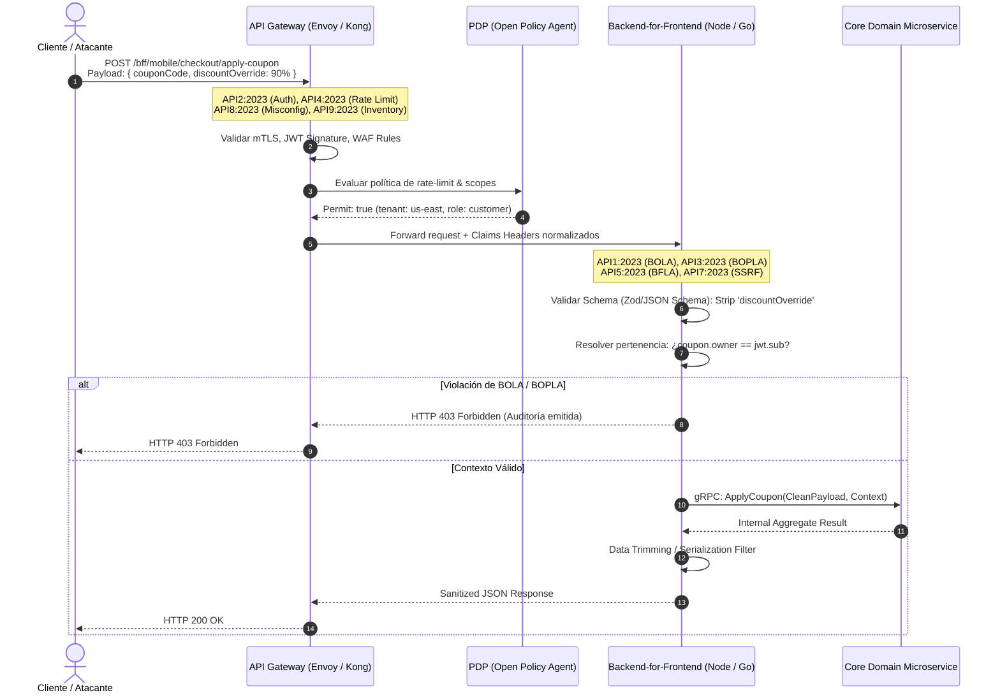

Durante un evento de alta concurrencia en una plataforma de Composable Commerce, los sistemas de telemetría registraron una anomalía silenciosa: la tasa de errores HTTP 5xx se mantenía por debajo del 0.05%, la latencia del API Gateway promediaba 18 ms, pero la base de datos de órdenes experimentaba una degradación severa por lecturas secuenciales anómalas. Un actor malicioso había descubierto que el endpoint `/api/v1/orders/{orderId}/status` validaba la firma del JSON Web Token (JWT) en el Edge Gateway, pero ni el gateway ni el Backends-for-Frontends (BFF) comprobaban si el `customerId` embebido en el token coincidía con el propietario de la orden en la base de datos. Modificando iterativamente el parámetro `orderId`, el atacante exfiltró más de 450,000 registros transaccionales con direcciones y métodos de pago tokenizados en menos de 12 minutos. 

Este incidente ilustra el vector más destructivo en ecosistemas de microservicios: **BOLA (Broken Object Level Authorization - API1:2023)**. La creencia ingenua de que un API Gateway perimetral con inspección de tokens resuelve la seguridad de las APIs deja al descubierto vulnerabilidades estructurales en la capa de agregación y composición (BFF). En arquitecturas MACH (Microservices, API-first, Cloud-native, Headless), la seguridad debe diseñarse como una defensa en profundidad coordinada, desacoplando la autenticación e inspección perimetral en el API Gateway, de la autorización contextual y la desinfección de modelos en el BFF.

---

## Anatomía de la Responsabilidad: Gateway vs. BFF vs. Dominio

El error más común en implementaciones enterprise consiste en sobrecargar el API Gateway con lógica de negocio o, en el extremo opuesto, tratar al BFF como un simple proxy ciego de agregación sin validación de seguridad. Cada capa tiene un radio de impacto y un contexto de ejecución radicalmente diferente.



### 1. El API Gateway como Primer Anillo Perimetral (North-South)
El Gateway opera a nivel de transporte, infraestructura y sesión. Su misión no es comprender la estructura semántica de una entidad transaccional, sino aplicar políticas deterministas de alto rendimiento:
* **API2:2023 - Broken Authentication:** Verificación criptográfica de firmas JWT/PASETO, introspección de tokens de corta duración (RFC 7662), terminación TLS 1.3 con rotación de certificados y validación de Claims globales (`iss`, `aud`, `exp`).
* **API4:2023 - Unrestricted Resource Consumption:** Control de concurrencia distribuido respaldado por clústeres Redis (Token Bucket / Leaky Bucket), cuotas por cliente/tenant y limitación de tamaño de payloads.
* **API8:2023 - Security Misconfiguration:** Normalización estricta de rutas (prevención de Path Traversal y URL canonicalization attacks), cabeceras CORS restrictivas y eliminación de cabeceras de depuración (`X-Powered-By`, trazas de stack).
* **API9:2023 - Improper Inventory Management:** Enrutamiento estricto basado en contratos OpenAPI declarativos; bloqueo sistemático de endpoints no versionados o de staging (`/v2/`, `/beta/`).

### 2. La Capa BFF como Guardián Contextual (Semantic Edge)
El BFF reside inmediatamente detrás del Gateway y antes de la malla de servicios (Service Mesh). A diferencia del Gateway, el BFF entiende la semántica de la pantalla o canal (móvil, web, POS) y tiene visibilidad del grafo de objetos:
* **API1:2023 - Broken Object Level Authorization (BOLA):** Comprobación de que el sujeto (`sub`) o la organización (`tenant_id`) tiene derechos legítimos sobre el identificador de recurso enviado en el path o body.
* **API3:2023 - Broken Object Property Level Authorization (BOPLA):** Bloqueo de Mass Assignment y fugas de datos. El BFF actúa como filtro bidireccional: valida y sanitiza los campos de entrada entrantes (evitando que el cliente inyecte propiedades reservadas como `is_admin: true`) y limita la respuesta saliente únicamente a los atributos requeridos por ese canal.
* **API5:2023 - Broken Function Level Authorization (BFLA):** Validación jerárquica de roles y permisos específicos para acciones sensibles (ej. un usuario regular invocando un endpoint de reordenamiento que internamente ejecuta funciones de aprobación de crédito).
* **API7:2023 - Server-Side Request Forgery (SSRF):** En arquitecturas Headless que admiten callbacks o webhooks configurados por el cliente, el BFF debe desinfectar y validar contra una lista blanca las URLs de destino, impidiendo peticiones a metadatos de la nube (`169.254.169.254`) o a endpoints internos de la red local.

---

## Implementación Técnica: Mitigando BOLA y BOPLA en el BFF

La vulnerabilidad más costosa y prevalente según OWASP es BOLA (API1:2023), frecuentemente combinada con BOPLA (API3:2023). A continuación, se presenta un middleware de producción desarrollado para un BFF en Node.js/TypeScript (Fastify) que implementa validación estricta de esquemas, sanitización de entrada y control de acceso basado en atributos (ABAC).

### Middleware de Validación de Pertenencia y Desinfección de Payload

```typescript
import { FastifyRequest, FastifyReply, HookHandlerDoneFunction } from 'fastify';
import { z } from 'zod';
import { createAuditLog } from './telemetry/audit';

// 1. Esquema estricto de entrada (BOPLA: Evita Mass Assignment)
export const UpdateCartItemSchema = z.object({
  quantity: z.number().int().min(1).max(50),
  sku: z.string().regex(/^[A-Z0-9-]{8,16}$/),
  // discountOverride: z.number() -> AL NO DEFINIRSE, ZOD LO ELIMINA O FALLA
}).strict(); // Rechaza propiedades no explícitas

export type UpdateCartItemInput = z.infer<typeof UpdateCartItemSchema>;

// Repositorio de resolución ligera de contexto para BOLA
interface OwnershipVerifier {
  verifyCartOwnership(cartId: string, customerId: string, tenantId: string): Promise<boolean>;
}

export function enforceBOLAandBOPLA(ownershipService: OwnershipVerifier) {
  return async (request: FastifyRequest<{ Params: { cartId: string } }>, reply: FastifyReply) => {
    const { cartId } = request.params;
    
    // Extracción de claims previamente validados e inyectados por el API Gateway
    const customerId = request.headers['x-authenticated-customer-id'] as string;
    const tenantId = request.headers['x-authenticated-tenant-id'] as string;

    if (!customerId || !tenantId) {
      return reply.status(401).send({
        code: 'UNAUTHENTICATED_PERIMETER',
        message: 'Missing authenticated identity injection from gateway'
      });
    }

    // 2. Mitigación BOLA (API1:2023): Verificar propiedad del recurso
    const isOwner = await ownershipService.verifyCartOwnership(cartId, customerId, tenantId);
    
    if (!isOwner) {
      // Auditoría forense de seguridad: Intentos de BOLA son indicadores de compromiso (IoC)
      createAuditLog({
        event: 'SECURITY_BOLA_VIOLATION',
        actor: customerId,
        tenant: tenantId,
        resourceId: cartId,
        ip: request.ip,
        timestamp: new Date().toISOString()
      });

      // Retornar 404 en lugar de 403 para evitar la enumeración de identificadores de recursos
      return reply.status(404).send({
        code: 'RESOURCE_NOT_FOUND',
        message: 'The requested resource was not found'
      });
    }

    // 3. Mitigación BOPLA (API3:2023): Parseo estricto del cuerpo
    if (request.body) {
      const parseResult = UpdateCartItemSchema.safeParse(request.body);
      
      if (!parseResult.success) {
        return reply.status(422).send({
          code: 'SCHEMA_VALIDATION_FAILED',
          errors: parseResult.error.flatten()
        });
      }
      
      // Sobrescribir body con la estructura saneada (sin inyecciones de atributos adicionales)
      request.body = parseResult.data;
    }
  };
}
```

---

## Implementación Técnica: Reglas Perimetrales en el API Gateway

Para detener el consumo no regulado de recursos (API4:2023) y la autenticación rota (API2:2023), delegar estas verificaciones al BFF introduce una sobrecarga inadmisible de I/O. El gateway debe aplicar políticas de seguridad antes de enrutar el tráfico al clúster interno.

A continuación, una política declarativa para **Open Policy Agent (OPA)** integrada mediante filtros externos (`Envoy ext_authz`), validando tokens de forma determinista y bloqueando accesos no autorizados a nivel perimetral.

### Política OPA (Rego) para Envoy API Gateway

```rego
package envoy.authz

import future.keywords.in

default allow = false

# Definición de límites y configuraciones
valid_issuers := ["https://auth.enterprise-mach.io/oauth2/v1"]
allowed_audiences := ["api://composable-bff"]

# Extraer JWT del header Authorization: Bearer <token>
bearer_token := t {
    auth_header := input.attributes.request.http.headers.authorization
    startswith(auth_header, "Bearer ")
    t := substring(auth_header, count("Bearer "), -1)
}

# Validación criptográfica y de reclamos del token
token_claims := claims {
    [valid, _, claims] := io.jwt.decode_verify(
        bearer_token,
        {
            "cert": data.security.jwt_public_keys,
            "iss": valid_issuers[0],
            "aud": allowed_audiences[0]
        }
    )
    valid == true
    claims.exp > time.now_ns() / 1000000000
}

# 1. Mitigación API2:2023 (Broken Authentication)
is_authenticated {
    token_claims.sub != ""
    token_claims.tenant_id != ""
}

# 2. Mitigación API5:2023 (Broken Function Level Authorization en Gateway)
# Impide que clientes regulares alcancen endpoints operacionales o de auditoría
is_authorized_operation {
    path := input.attributes.request.http.path
    method := input.attributes.request.http.method
    
    # Rutas administrativas requieren claim específico
    not startswith(path, "/bff/v1/ops/")
}

is_authorized_operation {
    path := input.attributes.request.http.path
    startswith(path, "/bff/v1/ops/")
    "admin:ops" in token_claims.permissions
}

# Regla de decisión final para Envoy
allow {
    is_authenticated
    is_authorized_operation
}

# Inyección de headers limpios hacia el BFF (Previene header spoofing desde el cliente)
headers := {
    "x-authenticated-customer-id": token_claims.sub,
    "x-authenticated-tenant-id": token_claims.tenant_id,
    "x-authenticated-roles": concat(",", token_claims.roles),
    "x-gateway-forwarded": "true"
} {
    allow
}
```

---

## Matriz de Cobertura y Trade-offs Arquitectónicos

Distribuir las mitigaciones del OWASP API Security Top 10 exige analizar los trade-offs de rendimiento, acoplamiento y postura de seguridad.

| Riesgo OWASP API Security (2023) | Capa Principal de Mitigación | Técnica / Patrón de Diseño | Latencia Adicional | Trade-off / Limitación |
| :--- | :--- | :--- | :--- | :--- |
| **API1: BOLA** | BFF / Microservicio | Validación de pertenencia via ABAC / Context Query Cache | 5 - 15 ms | Requiere consultas de baja latencia (Redis/Caché L2) para verificar pertenencia sin degradar base de datos relacional. |
| **API2: Broken Authentication** | API Gateway | Validación de firmas criptográficas, JWKS locales, mTLS | < 1 ms | Imposibilidad de invalidación instantánea de JWTs sin una lista de revocación centralizada en memoria. |
| **API3: BOPLA** | BFF | Validación de esquemas estrictos (`strictSchema`) y DTOs de salida | 1 - 3 ms | Mayor mantenimiento de código; requiere sincronización continua de tipos entre BFF y contratos OpenAPI. |
| **API4: Unrestricted Resource Consumption** | API Gateway | Rate Limiting distribuido por identidad (Redis Token Bucket), body limit | < 2 ms | Falsos positivos en tráfico masivo legítimo (flash sales) si las cuotas no son adaptativas según el comportamiento histórico. |
| **API5: BFLA** | API Gateway & BFF | RBAC perimetral (Gateway) y validación de granularidad fina (BFF) | 1 - 2 ms | Sobrecarga de claims en el token si los roles son demasiado complejos (Token Bloat). |
| **API6: Server-Side Request Forgery (SSRF)** | BFF / Egress Proxy | DNS Pinning, listas blancas de CIDR y Proxies Egress dedicados | 2 - 5 ms | Dificultad para admitir webhooks de clientes arbitrarios sin un entorno de red aislado (sandbox). |
| **API7: Security Misconfiguration** | API Gateway | Hardening de headers, eliminación de cabeceras de depuración y strict CORS | < 0.5 ms | Puede romper integraciones legadas o frontends que dependan de cabeceras no estándares. |
| **API8: Lack of Protection from Automated Threats** | API Gateway | Análisis de comportamiento, Proof-of-Work criptográfico y WAF bot detection | 5 - 20 ms | Puede bloquear scrapers benévolos (motores de búsqueda) o APIs de socios B2B sin excepciones bien gobernadas. |
| **API9: Improper Inventory Management** | API Gateway | Routing declarativo basado en OpenAPI/Swagger Spec, bloqueo 404 por defecto | < 0.5 ms | Requiere pipelines de CI/CD estrictos que actualicen el Gateway simultáneamente con el despliegue del BFF. |
| **API10: Unsafe Consumption of APIs** | BFF / Microservicio | Timeouts agresivos, Circuit Breakers (Envoy/Resilience4j), sanitización de respuesta SaaS | 0 - 2 ms | Requiere gestión de estados degradados cuando proveedores externos fallan o devuelven payloads corruptos. |

---

## Modos de Fallo Críticos en Producción y Mitigaciones Día 2

### 1. El Dilema de la Revocación de Tokens y el Desacople Gateway-BFF
**Modo de Fallo:** Un usuario corporativo es revocado o sus roles cambian de administrador a visualizador. El API Gateway continúa validando el JWT basándose únicamente en su firma criptográfica hasta su expiración (`exp`), permitiendo que el BFF siga procesando operaciones no autorizadas durante 15 o 30 minutos.
* **Mitigación:** Implementar tokens de acceso de muy corta duración (ej. 5 minutos) combinados con rotación de Refresh Tokens vía HTTP-only secure cookies en el BFF. Para revocaciones instantáneas, el Gateway debe consultar un Bloom Filter distribuido en Redis, alimentado por eventos asíncronos (Apache Kafka/AWS EventBridge) ante eventos de cierre de sesión o cambio de permisos.

### 2. Header Spoofing y Confianza Ciega en el Tráfico Interno
**Modo de Fallo:** Los desarrolladores asumen que el tráfico que llega al BFF es "seguro" porque proviene de la red interna. Si un atacante logra inyectar tráfico saltándose el Gateway o explotando un SSRF en otro servicio, puede falsificar la cabecera `X-Authenticated-Customer-ID: 0001` y obtener privilegios de superusuario.
* **Mitigación:** Cero Confianza en la red interna. El API Gateway debe firmar criptográficamente los headers que reenvía hacia el BFF mediante un JSON Web Signature (JWS) efímero interno o utilizar autenticación mutua TLS (mTLS) con tokens SPIFFE/SPIRE, donde la identidad del remitente sea formalmente validada por el BFF antes de procesar cualquier cabecera.

### 3. Fuga de Memoria por Validación Descontrolada de Esquemas
**Modo de Fallo:** Validadores de esquema como AJV o Zod instanciados dinámicamente dentro del ciclo de vida de la petición HTTP bajo alta concurrencia. Esto provoca recolección de basura destructiva y agotamiento de la memoria del proceso BFF.
* **Mitigación:** Precompilar todos los esquemas durante la fase de inicio (`bootstrap`) de la aplicación. Utilizar compiladores JIT de esquemas JSON optimizados para runtime que ejecuten validaciones en microsegundos sin instanciar nuevos objetos en el heap por cada ciclo de ejecución.

---

## Checklist de Hardening para Equipos de Ingeniería

Para certificar que una arquitectura MACH cumple con los estándares más rigurosos de seguridad de APIs, el equipo de ingeniería debe auditar los siguientes puntos antes de promover código a producción:

- [ ] **Aislamiento Perimetral (Gateway):** El API Gateway rechaza cualquier petición cuyo `Host` o path no coincida de forma exacta con la especificación de rutas declarada en el repositorio de contratos.
- [ ] **Sanitización de Cabeceras Entrantes:** El Gateway elimina cualquier encabezado del tipo `X-Authenticated-*` enviado por el cliente externo antes de inyectar sus propios valores resueltos.
- [ ] **Normalización de Identificadores (BOLA):** Ningún BFF ni microservicio acepta identificadores de cliente (`userId`, `accountId`) provenientes del cuerpo (`body`) o de los parámetros de ruta (`path params`) si estos difieren del identificador autenticado presente en el contexto validado.
- [ ] **Tipado Estricto de Entrada y Salida (BOPLA):** Los controladores del BFF utilizan tipos inmutables y schemas que rechazan explícitamente (`additionalProperties: false`) campos no definidos en la especificación pública.
- [ ] **Control de Egress (SSRF):** Todo componente de backend que realice peticiones salientes basadas en URLs dinámicas debe hacerlo a través de un proxy forward de red con reglas de cortafuegos que bloqueen el acceso a direcciones RFC 1918 y servicios de metadatos cloud.
- [ ] **Rate Limiting Contextual:** Las políticas de limitación de tasa en el gateway se aplican concurrentemente en dos niveles: por dirección IP de origen (protección de infraestructura) y por par `tenant_id`/`sub` (protección de lógica de negocio y prevención de abuso de APIs).
- [ ] **Pruebas de Seguridad Automatizadas en CI/CD:** El pipeline de integración ejecuta pruebas DAST especializadas en APIs (ej. OWASP ZAP, RESTler o 42Crunch) bloqueando merges si se detectan divergencias con el contrato OpenAPI o respuestas sin tipado validado.